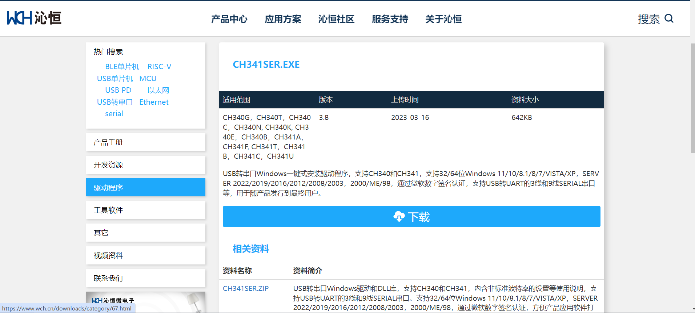

# CH340驱动安装说明

## 支持的主板

本驱动适用于 Maker-Uno、、Rf-Nano、Maker-Esp32、ESP32-IOT、Arduino原版的UNO、NANO系列等常见的开源主板。

## 安装示例

1.接上主板，右键点击“我的电脑-->属性-->设备管理器-->端口（COM和LTP）”，如果看到下图所示，则说明驱动已安装。

2.如果没有显示端口或者显示以下状态时，说明驱动没有安装成功。

## 安装驱动

### 2.1、Windows安装CH340G（改进版）驱动

1）驱动未安装成功，下载CH340G驱动程序。可以从官方网站下载，也可以从第三方网站或CD中获取。建议从官方网站下载以避免下载恶意软件或病毒。[CH340G官方下载地址](https://www.wch.cn/downloads/CH341SER_EXE.html)

2）打开下载的驱动程序，根据安装向导的提示完成安装。在安装过程中，可能需要选择操作系统类型和设备类型。如下图（如果动图不显示，请点击此**[gif动图](./pictures/drive.gif)**）：

3）如果出现“Windows受限制”错误提示，可以通过以下步骤解决：

- 右键单击桌面上的“此电脑”，选择“管理”。
- 在左窗格中，选择“本地用户和组”，然后选择“用户”。
- 右键单击“Administrators”组，选择“属性”。
- 在“属性”对话框中，取消选中“账户已禁用”选项，然后点击“确定”按钮。
- 关闭“计算机管理”窗口，然后重新启动电脑。

4）安装完成后，重新连接CH340G设备，然后查看设备管理器中是否已经正确识别设备并启用驱动程序。

### 2.2、Mac系统驱动

请参考以下链接:

[https://www.wch.cn/downloads/CH341SER_EXE.html](https://www.wch.cn/downloads/CH341SER_EXE.html)

#### 	

