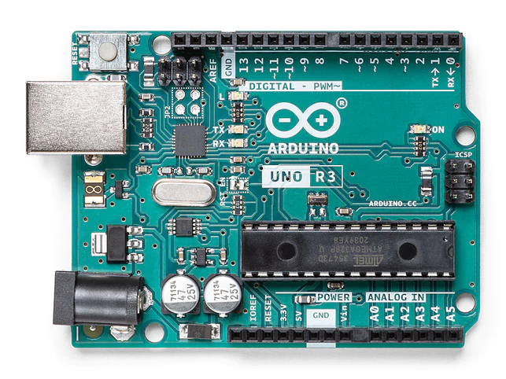

# **Arduino Uno R3数据手册**

## 概述

​       

 Arduino UNO是一款基于ATmega328P微控制器的开发板。它是一个开源的跨平台电子原型开发平台，广泛应用于各种DIY电子设计、机器人、智能家居以及教育用途。

​       它有14个数字输入/输出引脚（其中6个可用于PWM输出）、6个模拟输入引脚，一个16 MHz的晶体振荡器，一个USB接口，一个DC接口，一个ICSP接口，一个复位按钮。它包含了微控制器所需的一切，你只用简单地把它连接到计算机的USB接口，或者使用AC-DC适配器，再或者用电池，就可以驱动它。

 Arduino UNO的引脚布局如下图所示： 

# 技术参数

| 型号                | Arduino UNO                     |
| ------------------- | ------------------------------- |
| 微控制器            | ATmega328P                      |
| 工作电压            | 5 V                             |
| 输入电压（推荐）    | 7-12 V                          |
| 输入电压（极限）    | 6-20 V                          |
| 数字I/O引脚         | 14                              |
| PWM通道             | 6                               |
| 模拟输入通道（ADC） | 6                               |
| 每个I/O直流输出能力 | 20 mA                           |
| 3.3V端口输出能力    | 50 mA                           |
| Flash               | 32 KB（其中引导程序使用0.5 KB） |
| SRAM                | 2 KB                            |
| EEPROM              | 1 KB                            |
| 时钟速度            | 16 MHz                          |
| 板载LED引脚         | 13                              |
| 长度                | 68.6 mm                         |
| 宽度                | 53.4 mm                         |
| 重量                | 25 g                            |

​        Arduino UNO R3支持多种编程语言，包括C、C++、Arduino语言。Arduino IDE是开发Arduino UNO的主要工具，可以通过USB接口连接电脑，利用简单的代码实现各种控制和交互功能。

​        除了Arduino UNO，Arduino公司还推出了多种型号的开发板，如Arduino Nano、Arduino Mega等。这些板子通常具有相似的架构和接口，但在具体的规格参数和尺寸上有所不同，可以根据项目需求选择合适的型号。

# 安装驱动

​        在连接 Arduino UNO R3 开发板时，电脑需要正确识别和安装驱动程序，否则无法使用该设备。下面是 Arduino UNO R3 驱动安装的方法： 

1. 下载Arduino IDE软件

​       点击[Arduino官网]( https://www.arduino.cc/en/software)下载并安装Arduino IDE软件 。

2. 连接Arduino UNO R3开发板

​       将Arduino UNO R3开发板通过USB线缆连接到电脑。在电脑的设备管理器中的"端口(COM和LPT)"，可以看到 Arduino Uno 的串行端口。注意，如果设备没有被识别或驱动程序没有正确安装，电脑可能会提示“未知设备”或“驱动程序无法安装”的错误信息。 

3. 安装Arduino UNO驱动

- 如果您使用Windows系统，可以从Arduino IDE软件自带的驱动目录或Arduino官网下载驱动程序。找到Arduino安装目录下的\drivers文件夹，在该文件夹中找到“arduino.inf”文件并右键单击，然后选择“安装”。

  如下图:

  

- 如果您使用macOS或Linux系统，则不需要手动安装驱动程序，因为这些系统已经预装了相应的驱动程序。