# Hummer-bot4.0 使用概述 

## 产品简介

“Hummer-Bot”是基于BLE-UNO作为核心主控，MX1616L作为电机驱动的一款多功能小车，与传统小车相比，“Hummer-Bot”还搭载无线控制（蓝牙、红外等）；超声波等。可自动循迹，可自动避障，当然，Hummer-Bot也可通过无线自行控制。充分利用每一个模块，将各类相关传感器进行整合，让小车更加智能；更加具有开发意义；更加具有挑战性。“Hummer-Bot”配套各类资料，技术手册，例程等，手把手教你从入门到精通。每位电子爱好者都可轻松上手，实现自己想要的功能。

## 产品参数

- 三路红外黑线循迹模块
- 2组红外避障与追光模块
- 1个舵机转向的超声波避障
- 4路直流电机驱动
- 2节2000mA,3.7v可充电锂电池，续航更久
- 支持电池电量实时检测
- 支持红外遥控器控制
- 支持蓝牙app控制
- 支持PS2手柄控制（选配）
- 支持nRF24L01+无线控制（选配）
- 支持wifi控制（选配）

# 准备篇

## 关于Arduino BLE-UNO主控板与扩展板

### Arduino BLE-UNO主控板

在“Hummer-Bot”，我们使用了BLE-UNO作为主控板，它有14个数字输入/输出引脚（其中6个可用作PWM输出）、6个模拟输入、1个16 MHz陶瓷谐振器、1个USB连接、1个电源插座、1个ICSP头和1个复位按钮。它包含了支持微控制器所需的一切；只需通过USB电缆将其连至计算机或者通过AC-DC适配器或电池为其供电即可开始。除此之外，还板载了CC2540蓝牙模块，可实现蓝牙通信。

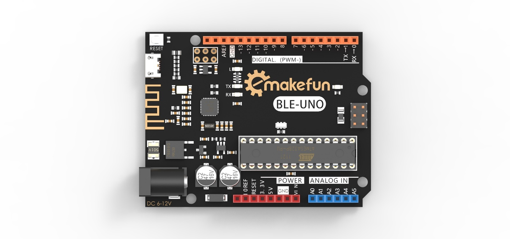


### 技术规格

- 工作电压：5V
- BLE芯片:TI CC2540
- BLE工作频道 2.4G
- 蓝牙传输距离：空旷距离50m
- 支持AT指令配置BLE
- 支持USB虚拟串口，硬件串口,BLE三向透传 
- 蓝牙支持主从机切换
- 主机模式下支持蓝牙自动连接从机
- 支持超过20 bytes发送。
- 支持iBeacons
- 接口:Micro-USB
- 输入电压：USB供电或外部7V~12V DC输入
- 输出电压：5V DC输出和3.3V DC输出 和外部电源输入
- 微处理器：ATmega328（配套资料中有芯片数据手册）
- Bootloader：Arduino Uno
- 时钟频率：16 MHz
- 支持USB接口协议及供电(不需外接电源)
- 支持ISP下载功能
- 数字I/O端口：14（4个PWM输出口）
- 模拟输入端口：6
- 直流电流 I/O端口： 40mA
- 直流电流 3.3V端口： 50mA
- Flash 内存：32 KB (ATmega328) (0.5 KB用于引导程序）
- SRAM ：2 KB (ATmega328)
- EEPROM： 1 KB (ATmega328)
- Bootloader：最新Arduino1.8.8
- 尺寸：75x55x15mm

### 扩展板接口示意图


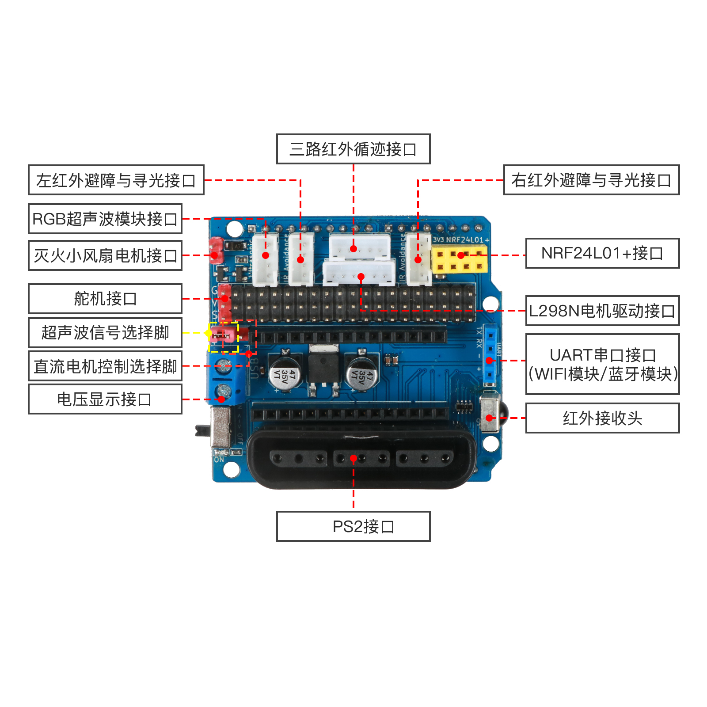


（补充说明：开发板扩展板的上面丝印：G—代表地线；V—代表5V电源正极；S—代表信号控制引脚）。

## Ble-Uno驱动安装

驱动安装请参考Ble-Uno板的驱动安装说明。

## 组装请看组装视频

视频位置： Hummer-Bot-4.0中文版\视频\安装视频3D动画.mp4


安装舵机的时候注意舵机请先看舵机校正部分描述。


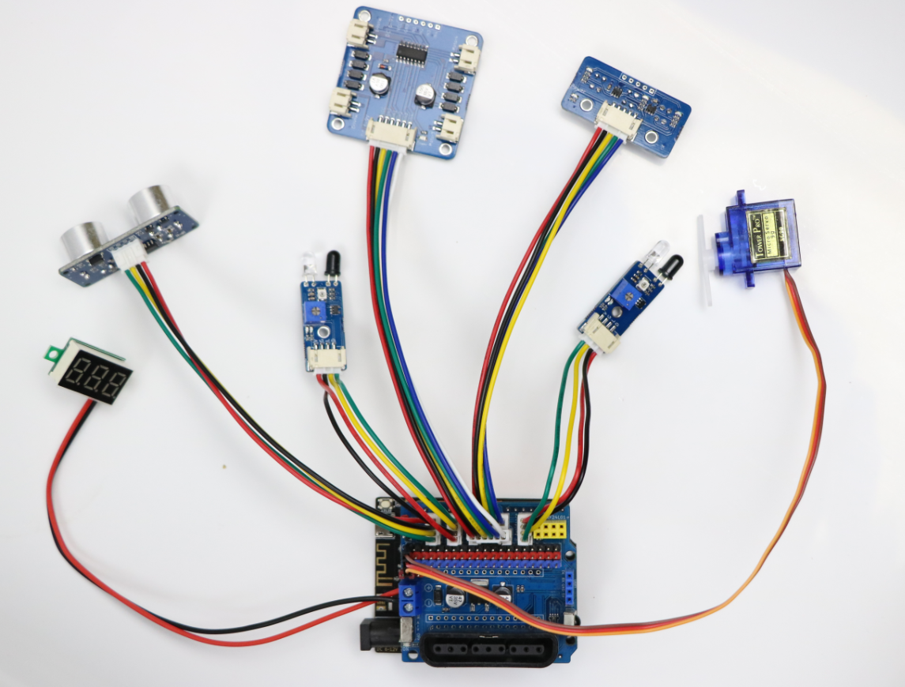


# Hummer Bot模块实验

## 电机驱动原理

在“Hummer-Bot”小车中，我们选用了4个直流减速电机作为动力，选用了MX1616L作为电机驱动芯片。

MX1616L采用H桥电路结构设计，采用高可靠性功率管工艺特别适合驱动线圈、马达等感性负载。电路内部集成N沟道和P沟道功率MOSFET，工作电压范围覆盖2-10V，27°C，VDD=6.5V，两个通道同时工作的条件下，1通道最大持续输出电流达到1.2A，最大峰值输出电流达到2.5A；2通道最大持续输出电流达到1.2A，最大峰值输出电流达到2.5A。

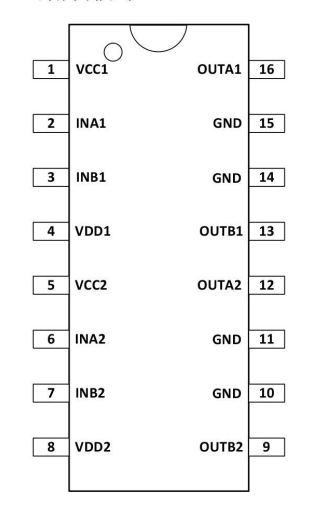

MX1616L可驱动2个电机，OUTA1、OUTB1和OUTA2、OUB2之间分别接2个电机。2、3、6、7脚接输入控制电平，控制电机的正反转和停转。其特点有：

- 低待机电流（小于0.1uA）

- 低导通内阻MOSFET功率开关管

- 内部集成续流二极管

- 较小的输入电流

- 可控制两台直流电机

- 可单独控制一台步进电机

- 可实现正反转
  详细MX1616L芯片资料请参考“主要器件数据手册\  MX1616L_datasheet.pdf”

  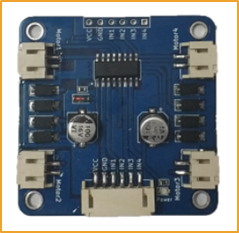

  电机驱动板原理图

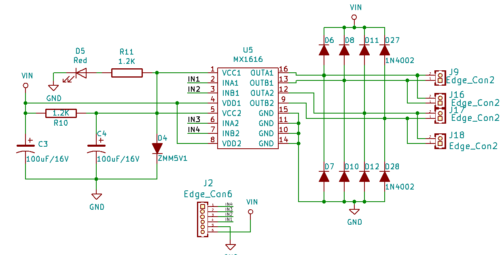


## 电机驱动板导线连接

通过查看芯片资料，我们知道，BLE-UNO有6个PWM 接口，分别是数字接口3、5、6、9、10、11。在这里，我们选用5、6、9、10作为电机控制IO，其连接如图所示。
电机驱动板和arduino扩展板接线方法如下：

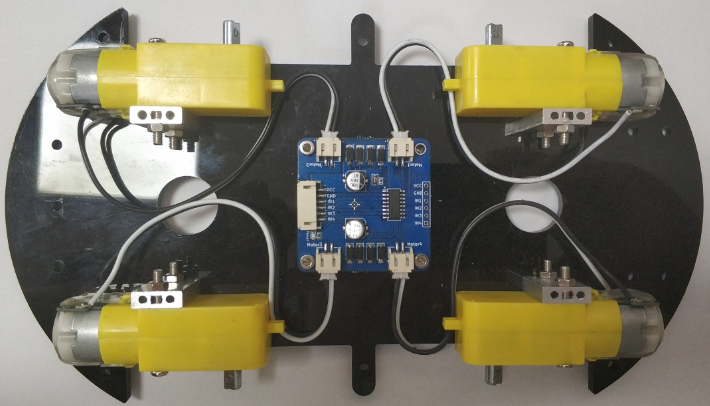


## 红外避障与寻光模块介绍

红外避障与寻光模块将红外避障功能和寻光功能集成在了一个模块上，其中红外避障功能是通过模块上的红外发射管发射红外信号，当红外信号遇到障碍物被发射回来，红外接收管接收到反射回来的红外信号，从而判断有障碍物，达到避障的目的。寻光功能是利用模块上的光敏电阻实现，当光敏电阻被强光照射，其电阻值迅速下降，通过的电流增大，光敏电阻在黑暗的环境中电阻值又迅速升高，通过的电流减小，主控板以此判断是否有光源。

## 红外避障工作原理

红外避障与寻光模块上具有一对红外线发射与接收管，发射管发射出一定频率的红外线，当检测方向遇到障碍物（反射面）时，红外线反射回来被接收管接收，经过比较器电路处理之后，绿色指示灯会亮起，同时信号输出接口输出数字信号（一个低电平信号），其检测有效距离范围2～30cm，工作电压为3.3V-5V。该传感器的探测距离可以通过电位器调节，由于使用的是红外线，所以抗干扰能力很强，在距离适中的时候测量精度很高。除此之外，该模块便于装配、使用方便，可以广泛应用于机器人避障、避障小车、流水线计数及黑白线循迹等众多场合。

## 寻光工作原理

红外避障与寻光模块的寻光功能是通过光敏二极管判端周边环境的光线强弱，输出模拟信号。当光敏电阻被强光照射，其电阻值迅速下降，通过的电流增大，光敏电阻在黑暗的环境中电阻值又迅速升高，通过的电流减小，主控板以此判断是否有光源。工作电压：0.3-10V。由于使用的是SG-PT3528光敏二极管，所以可以模拟人眼感光，峰值感光波长590nm，可抗红外线干扰，响应速度快、性能稳定。除此之外，该模块便于装配使用方便，可以广泛用于小夜灯、草坪灯、太阳灯等。

## 红外避障与寻光模块参数

- 工作电压：5V
- 红外线检测有效距离范围：2～30cm
- 峰值感光波长：590nm
- 输出红外避障信号：数字信号
- 输出感光信号：模拟信号

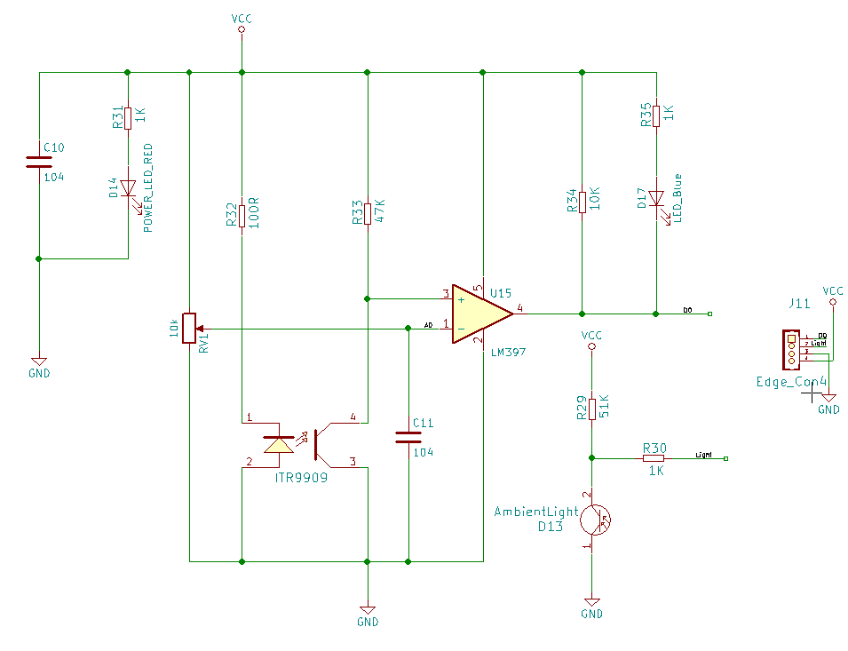

该模块可以通过电位器调节红外避障检测距离，检测距离2～30cm，大家在使用过程中如果发现测距不是很灵敏，可以使用微调电位器来达到理想结果（顺时针调电位器，检测距离增加；逆时针调电位器，检测距离减少），左右两边的红外避障检测距离需要调节的一致，这样小车在避障过程中才会更加流畅。

手动调节如图所示：

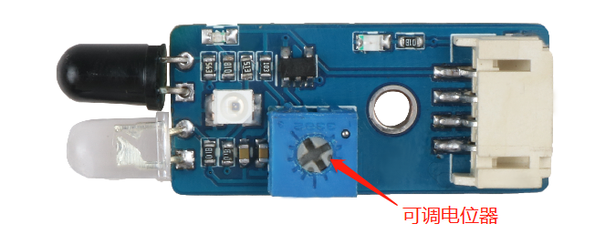


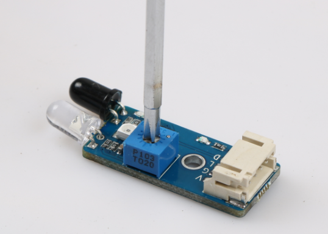

## 红外避障与寻光模块导线连接

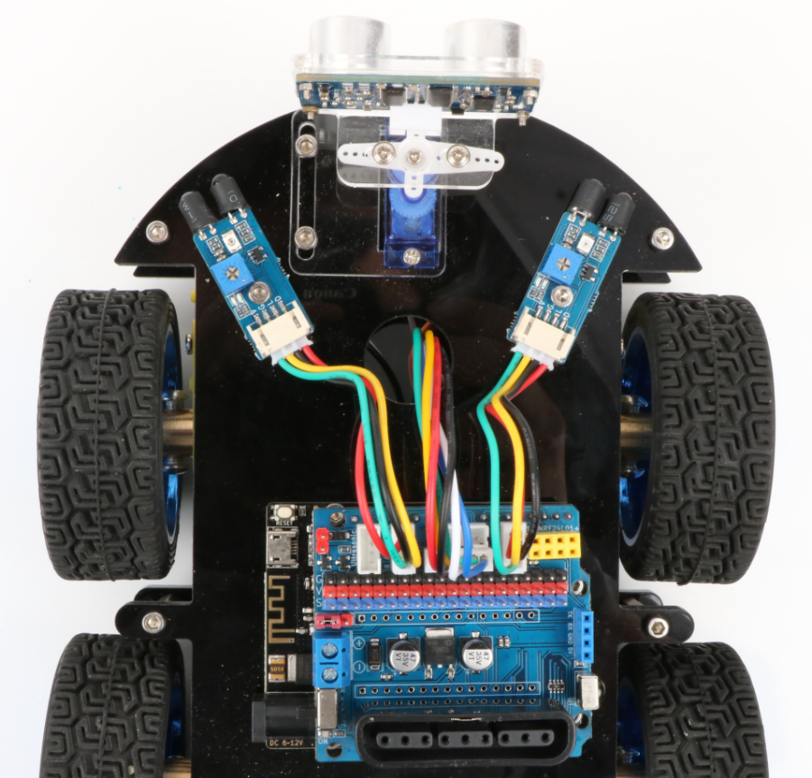


## 红外避障与寻光模块测试

将红外避障与寻光模块测试程序烧录到BLE-UNO中；打开串口监视器；打开电池盒上的开关，此时模块上的电源指示灯点亮，放置障碍物于红外发射管与接收管前10cm处，微调电位器，直到输出指示灯点亮为止，此时观察到串口监视器上的红外避障信号输出为0，当拿开障碍物串口监视器上的红外避障信号输出为1，此时证明红外避障功能正常；用一块遮挡物挡住光敏电阻附近的光线，然后观察到串口监视器上寻光信号输出值比较大，然后拿开遮挡物后。发现串口监视器上寻光信号输出值变小，也可以用手机手电筒照射光敏电阻，观察串口监视器上寻光信号输出值变化，此时证明寻光功能正常。

测试程序代码
```
const int LeftAvoidancePin = 12;
const int RightAvoidancePin = A5;
const int LeftLightPin = A3;
const int RightLightPin = A4;

int dl, dr, LL, LR;
void setup() {
  Serial.begin(9600);
  pinMode(LeftAvoidancePin, INPUT);
  pinMode(RightAvoidancePin, INPUT);
  pinMode(LeftLightPin, INPUT);
  pinMode(RightLightPin, INPUT);
  delay(1000);
}

void loop() {
  dl = digitalRead(LeftAvoidancePin);
  dr = digitalRead(RightAvoidancePin);
  LL = analogRead(LeftLightPin);
  LR = analogRead(RightLightPin);
  Serial.print("LeftAvoidance:");
  Serial.print(dl);
  Serial.print("   ");
  Serial.print("RightAvoidance:");
  Serial.println(dr);
  Serial.print("LeftLight:");
  Serial.print(LL);
  Serial.print("   ");
  Serial.print("RightLight:");
  Serial.println(LR);
  delay(1000);
}

```
无障碍物、环境光线较暗时数据示意图

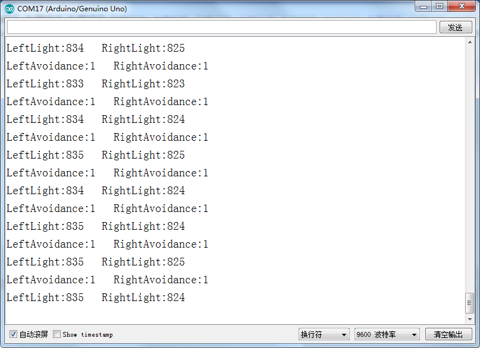

有障碍物、环境光线较强时数据示意图

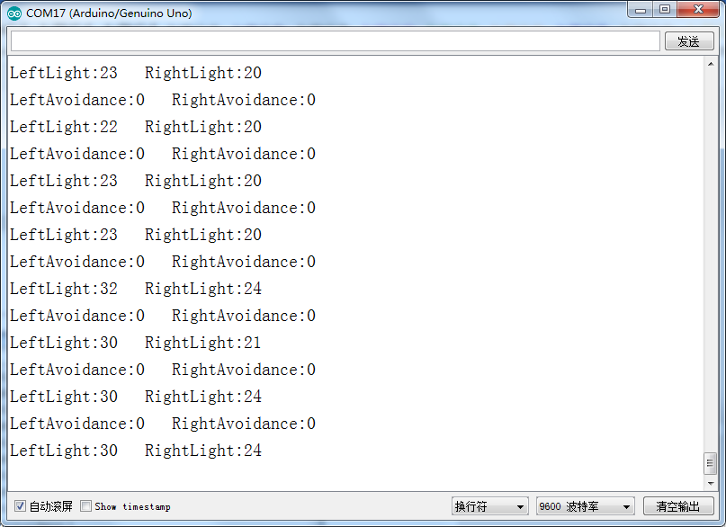


## 红外避障实验接线图

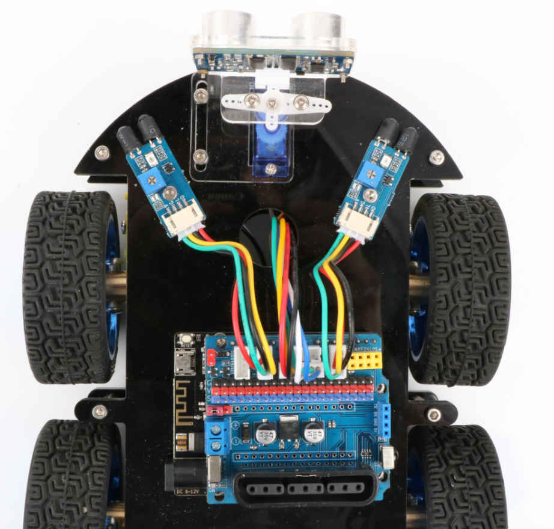


## 红外循迹模块介绍

Hummer-Bot上使用的是3路红外循迹模块，该循迹模块既可以循黑线，也可以循白线。如果你实验的环境地板是黑色，那么就应该循白线（即在地板上贴白色赛道）；如果你实验的环境地板是偏白色，那么就应该循黑线（即在地板上贴黑色赛道）；总之就是要让赛道与其他环境形成鲜明的色差。我们网盘资料里面的程序，默认循黑线。

黑线循迹是指小车在白色地板上沿黑线行走，由于黑线和白色地板对红外线的反射系数不同，可以根据接收到的反射红外线信号的强弱来判断“道路”。

白线线循迹是指小车在黑色地板上沿白线行走，由于白线和黑色地板对红外线的反射系数不同，可以根据接收到的反射红外线信号的强弱来判断“道路”。

在“Hummer-Bot”小车中，每一路循迹模块使用了ITR9909传感器， ITR9909红外反射传感器，一种集发射与接收于一体的光电传感器，它由一个红外发光二极管和一个NPN红外光电三极管组成。检测反射距离1mm-25mm适用，传感器特设M3固定安装孔，调节方向与固定方便易用，使用74HC14施密特触发反相器，信号干净，波形好，驱动能力强。可以应用于机器人避障、机器人进行白线或者黑线的跟踪，可以检测白底中的黑线，也可以检测黑底中的白线，是循迹机器人的必备传感器。流水线计件、电度表脉冲数据采样、传真机碎纸机纸张检测等众多场合。

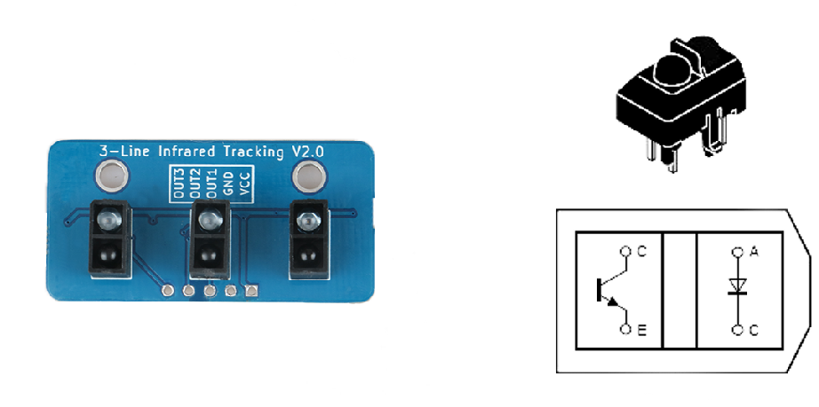

## 红外循迹模块工作原理

红外循迹模块不管是循黑线还是白线，我们通常采取的方法是红外探测法。
红外探测法，即利用红外线在不同颜色的物体表面具有不同的反射性质的特点，在小车行驶过程中不断地向地面发射红外光，当发射出的红外线没有被反射回来或被反射回来但强度不够大时，红外接收管一直处于关断状态，此时模块的输出端为低电平，指示发光二极管一直处于熄灭状态；当红外光遇到白色纸质地板时发生漫反射，反射光被装在小车上的接收管接收；并且红外线被反射回来且强度足够大，光敏三极管饱和，此时模块的输出端为高电平，指示发光二极管被点亮。Hummer-Bot就是靠反射回来的红外光为依据来确定黑线的位置和小车的行走路线。

在“Hummer-Bot”小车中，我们使用一个三路循迹模块，一个模块上有三个传感器，左右两边各一个，中间一个，循迹传感器全部在一条直线上。

小车前进时，始终保持在左右这两个第一级传感器之间，当小车偏离黑线时：如果左边的传感器检测到黑线时，右边和中间的传感器都不会检测到黑线，说明小车向右偏移，这时小车就会向左稍微偏转，保持中间传感器一直检测黑线，并沿黑线一直行走；如果右边传感器检测到黑线，左边和中间的传感器都不会检测到黑线，说明小车已经向左偏移，这时小车就会向右稍微偏转，保持中间传感器一直检测黑线，并沿黑线一直行走。

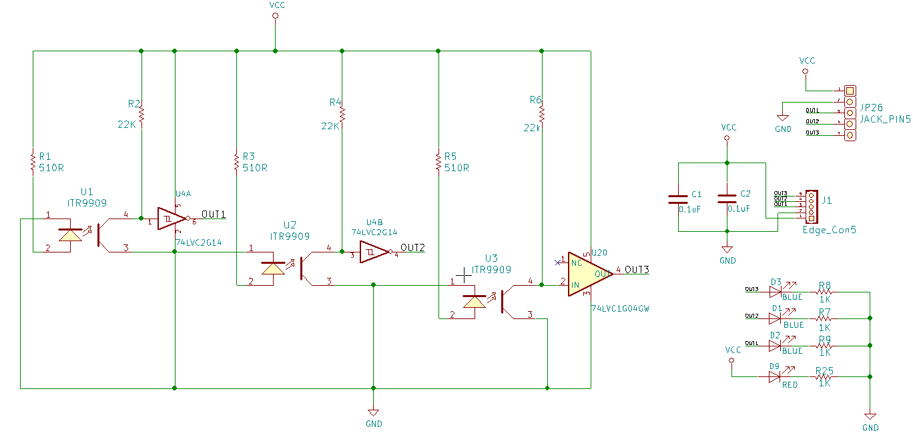


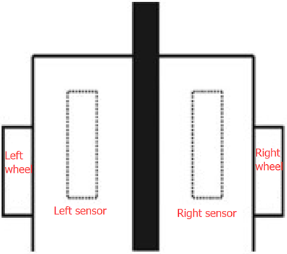

## 红外循迹模块参数

- 采用ITR9909红外反射传感器
- 检测距离：1mm~25mm适用，焦点距离为2.5mm
- 比较器输出，信号干净，波形好，驱动能力强，超过15mA。
- 工作电压3.3V-5V
- 使用宽电压74LVC1G04与74LVC1G4反相器，数字开关量输出（0和1）
- 设有固定螺栓孔，方便安装
详细的参数请查看“ITR9909.pdf”

## 红外循迹模块导线连接

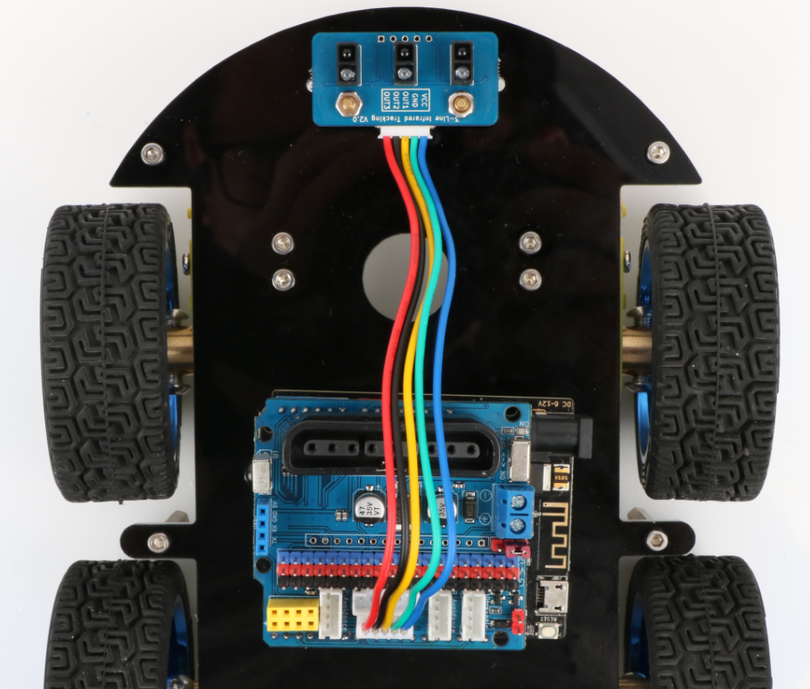


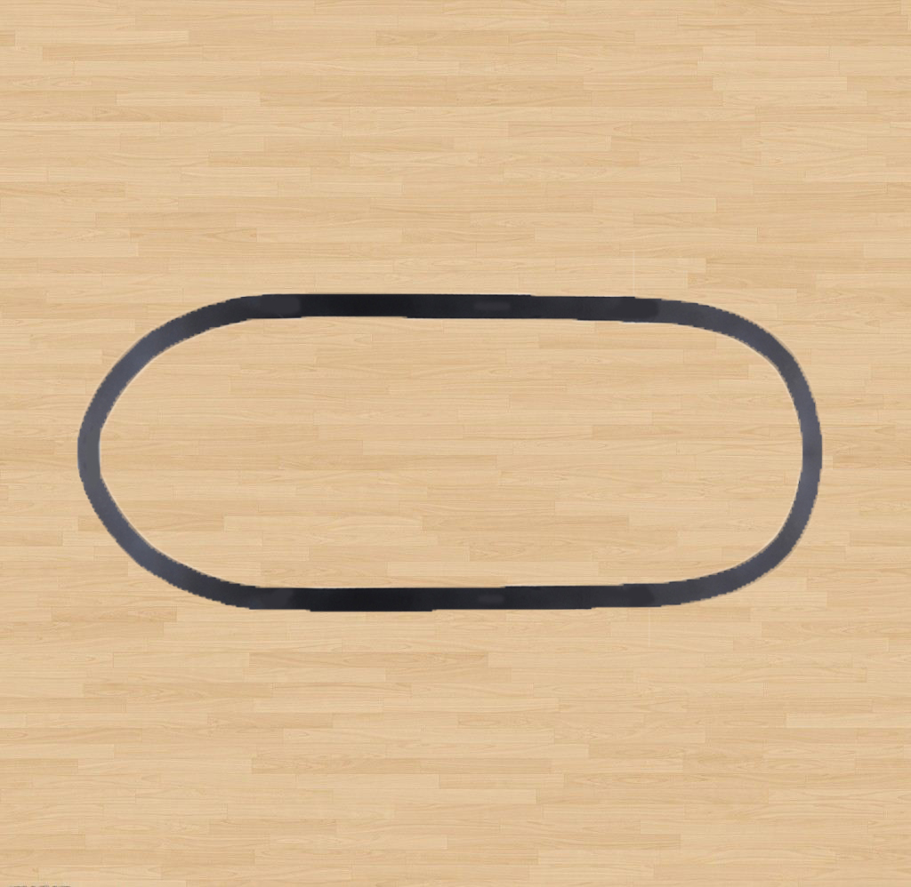

## 舵机介绍

舵机也叫伺服电机，最早用于船舶上实现其转向功能，由于可以通过程序连续控制其转角，因而被广泛应用智能小车以实现转向以及机器人各类关节运动中，舵机是小车转向的控制机构，具有体积小、力矩大、外部机械设计简单、稳定性高等特点，无论是在硬件设计还是软件设计，舵机设计是小车控制部分重要的组成部分，一般来讲，舵机主要由以下几个部分组成，舵盘、减速齿轮组、位置反馈电位计、直流电机、控制电路等。


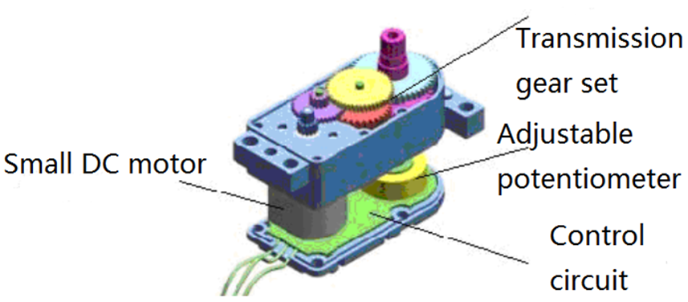


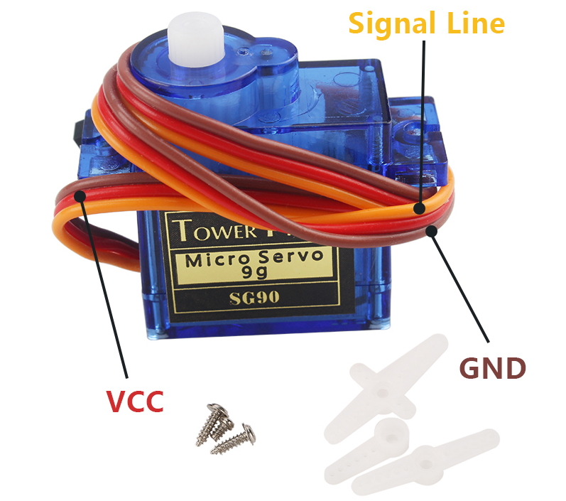

## SG90舵机参数

SG90舵机的输入线共有三条，如图3.7.2所示，红色中间，是电源线，一边粽色的是地线，这根线给舵机提供最基本的能源保证，主要是电机的转动消耗,橙色的为信号线。电源有两种规格，一是4.8V，一是6.0V，分别对应不同的转矩标准，即输出力矩不同，6.0V对应的要大一些，具体看应用条件。


## 舵机工作原理

控制信号由接收端的通道进入信号调制芯片，获得直流偏置电压。它内部有一个基准电路，产生周期为20ms，宽度为1.5ms的基准信号，将获得的直流偏置电压与电位器的电压比较，获得电压差输出。最后，电压差的正负输出到电机驱动芯片决定电机的正反转。当电机转速一定时，通过级联减速齿轮带动电位器旋转，使得电压差为0，电机停止转动。

当控制电路板收到来自信号线的控制信号，控制电机转动，电机带动一系列齿轮组减速后传动至输出舵盘。舵机的输出轴和位置反馈电位计是相连的，舵盘转动的同时，带动位置反馈电位计，电位计将输出一个电压信号到控制电路板，进行反馈，然后控制电路板根据所在位置决定电机转动的方向和速度，从而达到目标停止。其工作流程为：控制信号→控制电路板→电机转动→齿轮组减速→舵盘转动→位置反馈电位计→控制电路板反馈。

舵机的控制信号周期为20MS的脉宽调制（PWM）信号，其中脉冲宽度从0.5-2.5MS,相对应的舵盘位置为0－180度，呈线性变化。也就是说，给他提供一定的脉宽，它的输出轴就会保持一定对应角度上，无论外界转矩怎么改变，直到给它提供一个另外宽度的脉冲信号，它才会改变输出角度到新的对应位置上如图3.7.3所示。舵机内部有一个基准电路，产生周期为20MS，宽度1.5MS的基准信号，有一个比出较器，将外加信号与基准信号相比较，判断出方向和大小，从而生产电机的转动信号。

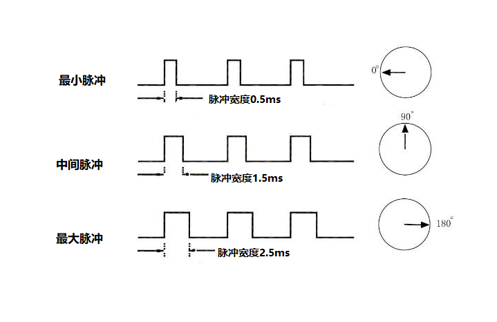


## 舵机角度校正

为了减少后期舵机的角度调整，我们需要将舵机测试程序 ServoTest.ino 下载到控制板中，舵机的三根线依次为信号线（橙色），电源线（红色），地线（棕色），然后将舵机信号线（橙色）接到Arduino 的13号IO口，将舵桨安装上去先不要固定螺丝。打开Arduino IED的串口监视器，如图所示

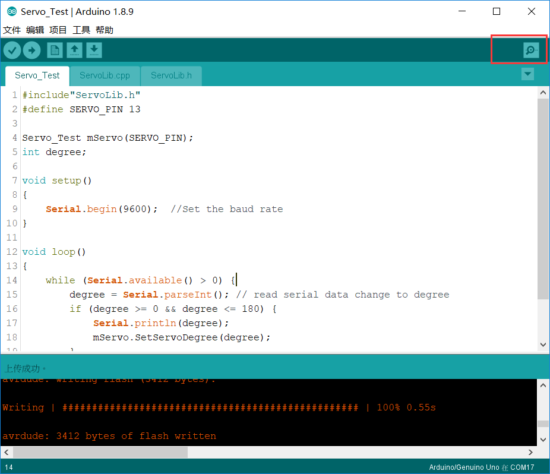

打开串口监视器之后，在串口监视器依次收入0，90，180，90，这样的舵机角度值。

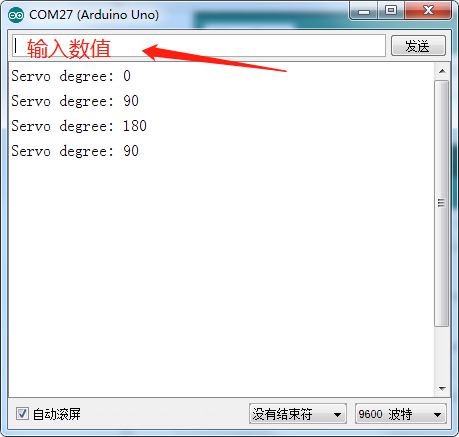

在串口监视器分别输入以上舵机角度值之后，会发现舵机会转动，如果在输入90之后，舵机的舵盘如果没有呈图90的角度，这时需要保持舵机不转动并将将舵盘拆下，然后重新安装成图90度的样子，这样舵机校准完成，可以用螺丝固定好舵机，进行下一步的操作。


## RGB超声波避障模块

RGB超声波避障模块将RGB LED灯和超声波测距模块集成在了一起，RGB LED灯可以呈现多种色彩。

超声波避障模块是一种将其他形式的能转变为所需频率的超声能或是把超声能转变为同频率的其他形式的能的器件。目前常用的超声波传感器有两大类，即电声型与流体动力型。电声型主要有：压电传感器，磁致伸缩传感器，静电传感器。流体动力型中包括有气体与液体两种类型的哨笛。现阶段大部分超声波传感器都是使用压电传感器进行工作。其测距是超声波的一大热点。

在“Hummer-Bot”小车中，我们使用超声波模块来测量小车和障碍物的距离，该模块可提供2cm-400cm的非接触式距离感测功能，测距精度可达高到3mm；自带温度补偿对测距结果进行校正，并使用GPIO通信方式，内带看门狗，工作稳定可靠。模块包括超声波发射器、接收器与控制电路。像智能小车的测距以及转向，或是一些项目中，常常会用到。智能小车测距可以及时发现前方的障碍物，使智能小车可以及时转向，避开障碍物。


## 超声波避障模块参数

- 工作电压：3.5V~5.5V。特别说明，绝对不允许超过5.5V
- 功耗电流：不开灯珠15mA，开灯珠65mA
- 谐振频率：40KHz；
- 探测距离范围：2cm～4米,误差：0.1cm+1%。
- 输入触发信号：只需要一个IO口发送10usTTL脉冲触发
- 工作温度范围：-40℃~100℃
- 感应角度：小于15度
- 外形尺寸：46mm*21mm*20mm（H）固定孔尺寸 4*Φ1.8mm
- 接口：支持PH2.0mm-4pin和2.54mm排针两种接线方式

## RGB超声波避障模块工作原理

RUS-04模块我们经过优化，只需要3pin(VCC, GND, IO)即可完成测距，IO先设置成输出模式触发超声波发送信号，然后再将IO设置成输入模式，等待回波信号。

不管上面是哪种方式触发，超声波测距的方法都是回声探测法，即超声波发射器向某一方向发射超声波，在发射时刻的同时计时器开始计时，超声波在空气中传播，途中碰到障碍物面阻挡就立即反射回来，超声波接收器收到反射回的超声波就立即停止计时。超声波在空气中的传播速度为340m/s，根据计时器记录的时间t，就可以计算出发射点距障碍物面的距离s，即：s=340t/2。


**工作过程**
1、IO口设置成输出模式，给至少10us的高电平信号。
2、RUS-04模块超声波自动发送8个40khz的方波。
3、IO口设置成输入模式，等待有信号返回，当检测到一个高电平，高电平持续的时间就是超声波从发射到返回的时间，测试距离=(高电平时间*声速(340M/S))/2。


我们来分析一下这个时序图，先由触发信号启动超声波测距模块，也就是说，主机要先发送至少10us的高电平，触发超声波模块,模块内部发出信号是传感器自动回应的，我们不用去管它。输出回响信号是我们需要关注的。信号输出的高电平就是超声波发出到重新返回接收所用的时间。用定时器，可以把这段时间记录下来，算出距离，别忘了结果要除于2，因为总时间是发送和接收的时间总和。

由于超声波也是一种声波，其声速V与温度有关。在使用时，如果传播介质温度变化不大，则可近似认为超声波速度在传播的过程中是基本不变的。如果对测距精度要求很高，则应通过温度补偿的方法对测量结果加以数值校正。声速确定后，只要测得超声波往返的时间，即可求得距离。这就是超声波测距的基本原理。


## RGB LED灯介绍 

WS2812B是三通道LED驱动控制专用电路，芯片内部包含了智能数字接口，数据锁存信号，整形放大驱动电路，还包含有高精度的内部振荡器和15V高压可编程定电流输出驱动器。同时，为了降低电源纹波，3个通道有一定的延时导通功能，这样在帧刷新时，可降低电路纹波安装更加简便.

WS2812B与传统RGB不同，WS2812B内部集成了WS2812B LED驱动控制专用芯片，只需一条信号线即可控制一颗LED灯珠或多个LED模组。

其主要特点如下：

- 输出端口耐压15V
- 芯片内置稳压管，24V以下电源端只需串电阻到IC VDD脚，无需外加稳压管
- 灰度调节电路（256 级灰度可调）
- 内置信号整形电路；
- 波形整形再输出，保证线路波形畸变不会累加
- 内置上电复位和掉电复位电路
- PWM 控制端能够实现256 级调节，扫描频率不低于400Hz/s
- 串行接口，能通过一根信号线完成数据的接收与解码
- 任意两点传输距离超过10米而无需增加任何电路
- 当刷新速率30 帧/秒时，低速模式级联数不小于512 点，高速模式不小于1024 点
- 数据发送速度为800Kbps模式

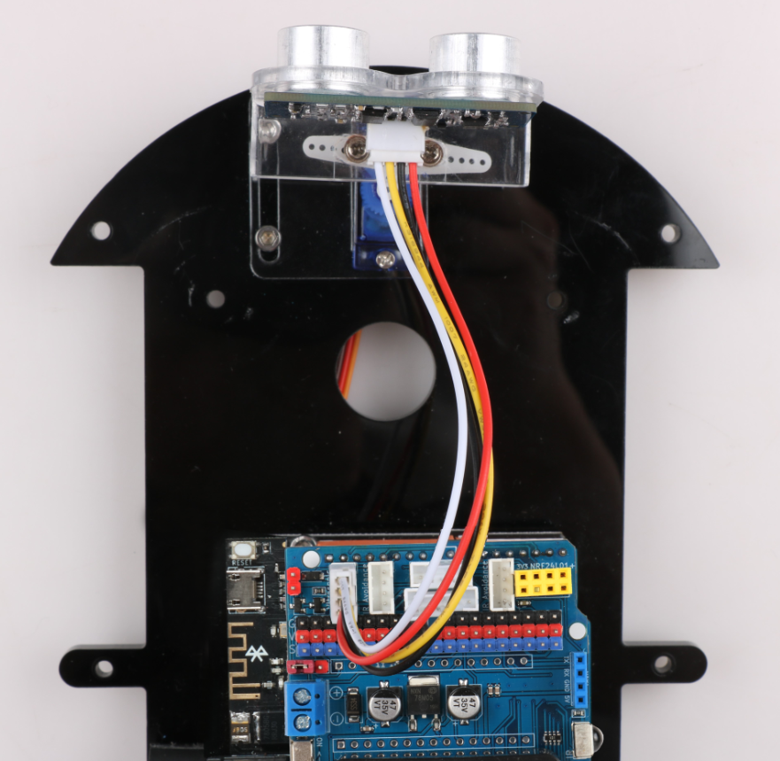


## 舵机导线连接

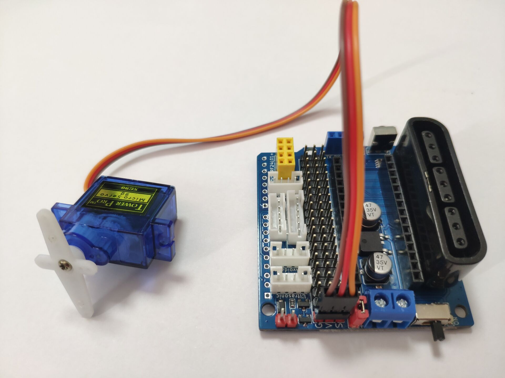


## RGB超声波跟随

要让小车跟着实现跟随着手运动，需要通过判断超声波模块测出的距离值大小来决定小车的运动方式。超声波模块的距离值变小表示手靠近，小道一定值时小车需要后退；当超声波模块的距离值变大表示手远离，大到一定时小车需要前进。当超声波模块的距离在一个范围内我们可以使小车停止不动。

## 红外遥控介绍

红外无线遥控套件由Mini超薄红外遥控器和38KHz红外接收头组成，Mini超薄红外遥控器具有17个功能键，发射距离可达8米，非常适合在室内要遥控操控各种设备。红外接收模块可接收标准38KHz调制的遥控器信号，通过对BLE-UNO R3进行编程，即可实现对遥控器信号的解码操作，从而可制作各种遥控机器人以及互动作品。

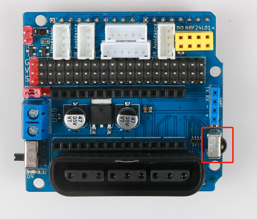

常见的红外遥控系统主要分为调制、发射和接收三部分。红外遥控发射部分主要由键盘矩阵、遥控专用集成电路、激励器和红外发光二极管组成。遥控专用集成电路是发射系统的核心部分，其内部由振 荡电路、定时电路、扫描信号发生器、键输入编码器、指令译码器、用户码转换器、数码调制电路及缓冲放大器等组成。它能产生键位扫描脉冲信号，并能译出按键的键码，再经遥控指令编码器得到某键位的遥控指令(遥控编码脉冲)，由38KHZ的载波进行脉冲幅度调制，载有遥控指令的调制信号激励红外二极管发出红外遥控信号。

在红外接收器中，光电转换器件（一般是光电二极管或光电三极管，我们这里 用的是 PIN 光电二极管）将接收到的红外光指令信号转换成相应的电信号。由于接收到的信号非常微弱而且干扰特别大，为了实现对信号准确的检测和转换，除了高性能的红外光电转换器件，还应合理地选择并设计性能良好的电路形式。最常用的光电转换器件是光电二极管，当光电二极管 PN 结的光敏面受到光照射后，PN 结的半导体材料吸收光能，并将光能转换为电能。当光电二极管上加有反向 电压时，二极管中的反向电流将随入射光照强度的变化而变化，光的辐照强度越大，其反向电流越大。也就是说，光电二级管的反向电流随入射的光脉冲作同频率的变化。

在Hummer-Bot小车中，一体化红外接收头，有三个引脚，包括供电脚，接地和信号输出脚。电路中的瓷片电容104为去耦电容，滤除输出信号的干扰。1端是解调信号的输出端，直接与Arduino相连。有红外编码信号发射时，经红外接头处理后，输出为检波整形后的方波信号，并直接提供给单片机，执行相应的操作来达到控制电机的目的。


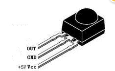

## 红外遥控工作原理

遥控系统一般由遥控器（发射器）、接收器组成，当你按下遥控器上的任意按键时，遥控器就会产生相应的编码脉冲，输出各种以红外线为媒介的控制脉冲信号，这些脉冲是计算机指令代码，红外监测二极管监测到红外信号，然后把信号送到放大器和限幅器，限幅器把脉冲幅度控制在一定的水平，而不论红外发射器和接收器的距离远近。交流信号进入带通滤波器，带通滤波器可以通过30KHZ到60KHZ的负载波，通过解调电路和积分电路进入比较器，比较器输出高低电平，还原出发射端的信号波形。

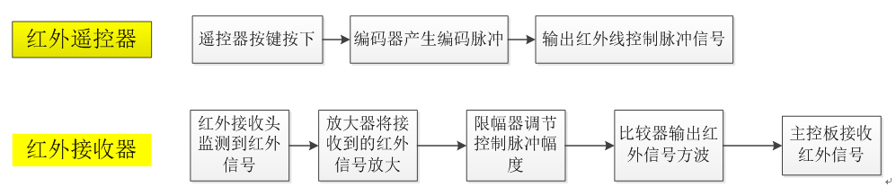


** 遥控器上定义的功能按键**


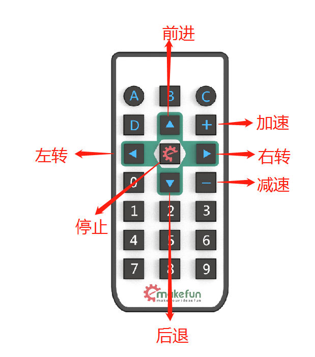


## 蓝牙模块介绍

Ble-UNO是基于蓝牙4.0协议完美结合Arduino UNO由emakefun针对创客研发的一款革命性产品，功能和引脚完全兼容传统Arduino UNO R3主板，工作频段为 2.4GHZ 范围，调制方式为 GFSK，最大发射功率为 0db，最大发射距离50米，采用进口原装TI CC2540芯片设计，支持用户通过AT命令修改查看设备名、服务UUID、发射功率、配对密码等指令，方便快捷使用灵活。
产品身材却非常小，适合于很多对于体积有苛刻限制的应用。我们提供Android和IOS手机demo，
你可以快速开发出一款与手机通信的硬件设备。正如现在非常火爆的可穿戴式手机周边设备，都可以用Ble-Nano这款平台开发，你可以使用Ble-UNO与蓝牙4.0设备连接，在两个蓝牙设备之间实现无线传输，主从机设置.甚至与PC建立蓝牙HID连接。同时我们为开发者提供了极大的自由度和支持准备，用户不仅可以通过AT指令调试Ble-UNO，你还可以在Ble-UNO控制器上添加Arduino兼容的扩展板、传感器、电机和舵机驱动等，emakefun独家研发蓝牙主机模式自动连接从机功能，并支持超过20个字节发送，使用更加方便。详情请参考Ble-Uno使用说明书。

## ESP-M2 Wifi模块

Hummer-Bot支持手机APP Wifi遥控功能使用的Wifi模块是ESP-M2。

ESP-M2 Wifi透传模块是基于TCP/IP 协议标准，工作频段为 2.4GHZ 范围，最大发射功率为 20dBm，采用进口原装芯片设计, 支持标准的 IEEE802.11 b/g/n 协议，完整的 TCP/IP 协议栈。用户可以使用该模块为现有的设备添加联网功能，也可以构建独立的网络控制器。

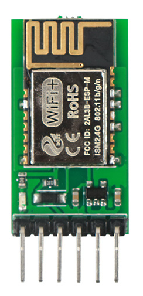


## Wifi模块特点

- 内置Tensilica L106超低功耗32位微处理器，主频支持80MHz和160MHz，支持RTOS
- 内置TCP/IP协议栈
- 内置10 bit高精度ADC
- 内置TR开关、balun、LNA、功率放大器和匹配网络
- 内置PLL、稳压器和电源管理组件，802.11b模式下+20dBm的输出功率
- A-MODU\A-MSDU的聚合和0.4s的保护间隔
- Wifi@2.4GHz,zhichi WPA/WPA2安全模式
- 支持Smart Config功能（包括Android和ios设备）
- HSPI、UART、I2C、I2S、IR Remote Control、PWM 、GPIO
- 深度睡眠保持电流为10uA，关断电流小于5uA
- 2 ms之内唤醒、连接并传递数据包
- 待机状态消耗功率小于1.0mW(DTIM3)
- 工作温度范围：-20°C-85°C

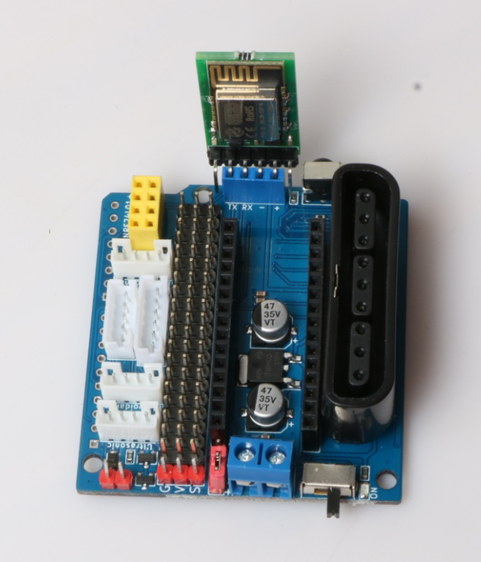


## Wifi模块测试方法

1)	打开电源，测试Wifi模块上的红色指示灯亮；
2)	手机先连接上Wifi模块的Wifi名字类似与“Doit_WIFI_C4D02B”
3)	打开测试APP,点击连接,点击连接后，在地址栏输入“192.168.4.1”再到端口栏输入“9000”再点连接即可。

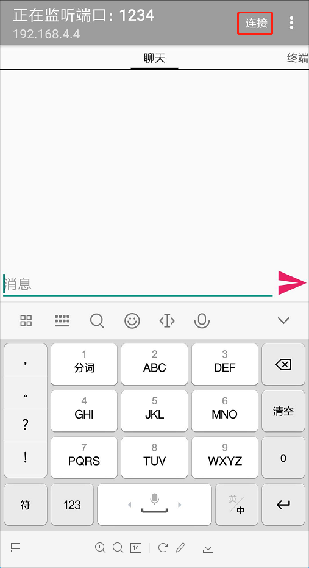


4)	我们只测试Wifi模块是否可以正常收发数据，我们点击“红色框”即可输入想发送的数据，输入完成后点击“蓝色框”即可将数据发出去

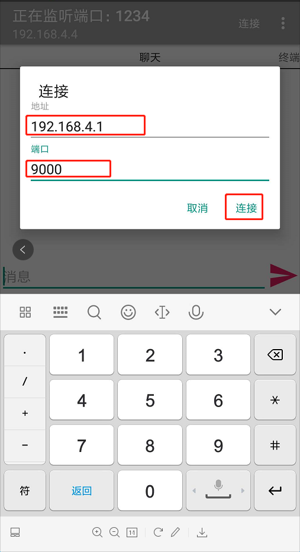

5）、点击发送后，我们可以看到串口监视器上打印出了手机端发送的内容，说明蓝牙模块是可以正常发送数据的，当然，为了测试准确度更高，可以多测试几次，并尝试在不同的环境中测试。你也可以从串口监视器上发送数据给手机端，手机端也会显示串口端发送的数据。


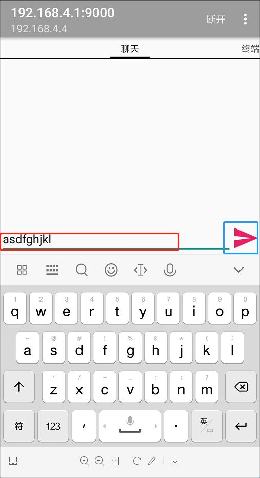


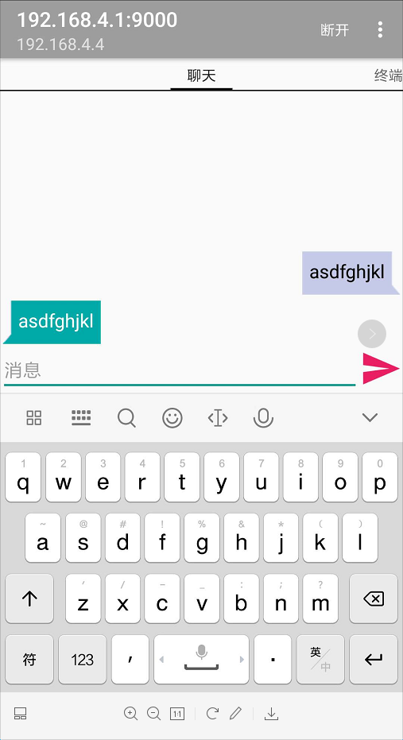

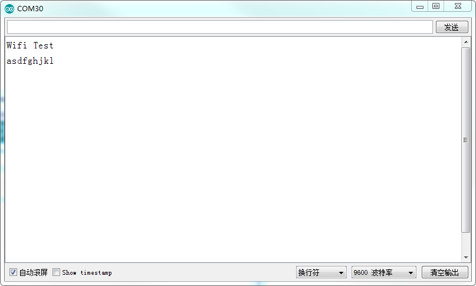


## 手机APP遥控功能


使用蓝牙或者Wifi遥控小车，其实是使用Android App通过蓝牙或者Wifi向Arduino UNO串口发送指令，控制电机的正转、反转、速度等。既然涉及到无线通信，其中一个必不可少的问题就是这两端设备之间的通信问题。但是它们两者之间并没有共同的“语言”，所以就需要设计通信协议，保证Android APP和Arduino UNO之间实现数据的交互。
主要流程是：Android APP端发送控制命令后并将命令打包成对应的数据包，然后发送给蓝牙模块（CC2540）或者Wifi模块,蓝牙模块（Wifi模块）接收到数据后通过串口传输给Arduino UNO 主控板，接着Arduino UNO主控板对数据进行解析，然后执行相应的动作。其中上位机端（Android APP）发送的数据格式如下，主要包含8个字段：

| 协议首部 | 数据长度 | 设备类型 | 设备地址 | 功能码 | 控制数据 |校验值 | 协议尾部 |

- “协议首部”代表一帧有效数据开始的标记，固定为0xAA。
- “数据长度”--除数据起始和结束码的有效数据长度。
- “设备类型”--表示被控制的智能车的型号。
- “设备地址”--被控制智能车的地址编号(某些场景控制多台智能车，默认为0x01)。
- “功能码”----数据控制功能类型(具体见功能码介绍)
- “数据”------功能控制的数值，比如速度，角度(长度不固定)
- “校验和”----是数据包除去头和尾所有数值的和，只保留最后16个bit,发送时高位在前
- “协议尾部”--就是数据包发送结束标记,固定为0x55。

在上面8个字段，在程序中我们用一个结构体来表示

```
typedef struct
{
    unsigned char start_code;      // 8bit 0xAA
unsigned char len;
unsigned char type;
    unsigned char addr;
    unsigned char function;   // 16 bit
    unsigned char *data;            // n bit
    unsigned short int sum;         // check sum
    unsigned char end_code;         // 8bit 0x55
}ST_protocol;


```
功能码定义如下：


```
typedef enum
{
    E_BATTERY = 1,
    E_LED = 2,
    E_BUZZER = 3,
    E_INFO = 4,
    E_ROBOT_CONTROL_DIRECTION = 5,
    E_ROBOT_CONTROL_SPEED = 6,
    E_TEMPERATURE = 7,
    E_INFRARED_TRACKING = 8,
    E_ULTRASONIC = 9,
    E_INFRARED_REMOTE = 10,
    E_INFRARED_AVOIDANCE = 11,
    E_CONTROL_MODE = 12,
    E_BUTTON = 13,
    E_LED_MAXTRIX = 14,
    E_CMD_LINE = 15,
    E_VERSION = 16,
    E_UPGRADE = 17,
    E_PHOTORESISTOR = 18,
    E_CONTOROL_CODE_MAX,
} E_CONTOROL_FUNC;

```

例如：一个完整的数据包可以是这样的“AA 07 01 01 06 50 00 5F 55”，其中：

- “AA”------------数据包头
-  “07” -------------------传输的数据长度位 7 个字节
- “06”------------是传输功能码，通过上面枚举我们知道06是指传输“速度”。
- “50（或0050）”--是控制数据，其中0x50是十六进制，转换为二进制为80，功能码传输的06，那么这里的数据就是速度值，即速度为80。
- “005F”----------是校验和，即0x07+0x01+0x01+0x06+0x50=0x5F。
- “55”------------为协议尾部，表示数据传输结束。

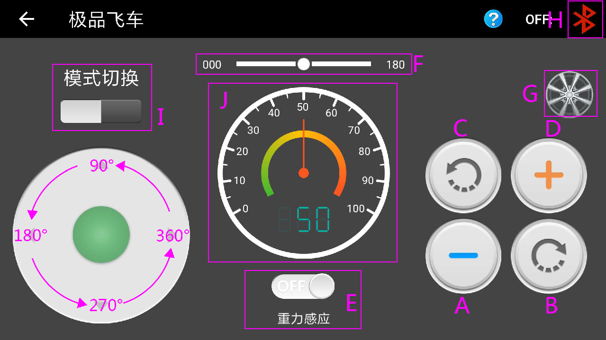

在上图中：

- “A、D”部分为加减速按钮。
- “B”部分为右自旋。
- “C”部分为左自旋。
- “E”部分为重力遥感开关，可切换到重力遥感模式
- “F”部分为舵机旋转的角度。
- “G”部分为灭火风扇开关。
- “H” 部分为连接方式，如蓝牙连接时会显示蓝牙图标，则Wifi连接时会显示Wifi图标。
- “I” 部分为遥控手柄切换。
- “J” 部分为当前速度显示。

## PS2手柄控制

PS2手柄是索尼游戏机的遥控手柄，索尼的系列游戏主机在全球很是畅销。不知什么时候便有人打起PS2手柄的主意，破解了通讯协议，使得手柄可以接在其他器件上做遥控使用，比如遥控我们熟悉的四轮车与机器人。突出的特点是现在这款手柄性价比极高。按键丰富，方便扩展到其它应用中。

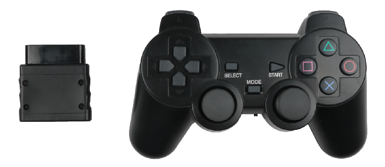


PS2手柄由手柄和接收器两个部分组成，手柄需要两节7号1.5V供电，接收器的电源和Arduino UNO使用同一电源，电源范围为3~5V,不能接反，不能超电压，过压和反接，都会使接收器烧坏。手柄上有个电源开关，ON开/OFF关，将手柄开关打到ON上，在未搜索到接收器的状况下，手柄上的灯会不停的闪，在一定时间内，还未搜索到接收器，手柄将进入待机模式，手柄上的灯将灭掉，这时，按下“START”键，唤醒手柄。

接收器连接Arduino，并由Arduino供电，在未配对的状况在，绿灯闪。手柄打开，接收器供电，手柄和接收器会自动配对，这时灯常亮，手柄配对成功。按键“MODE”(手柄批次不同，上面的标识有可能是"ANALOG"，但不会影响使用)，可以选择“红灯模式”、“绿灯模式”。

有些用户反映，手柄和接收器不能正常配对！多数问题是，接收器的接线不正确，或程序有问题。
解决方法：接收器只接电源（电源线一定要连接正确），不接任何数据线和时钟线，一般情况下手柄是能够配对成功。配对成功后灯常亮，说明手柄是好的。这时再检查接线是否正确，程序移植是否有问题。


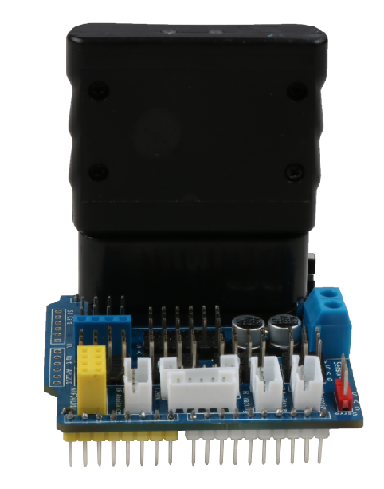

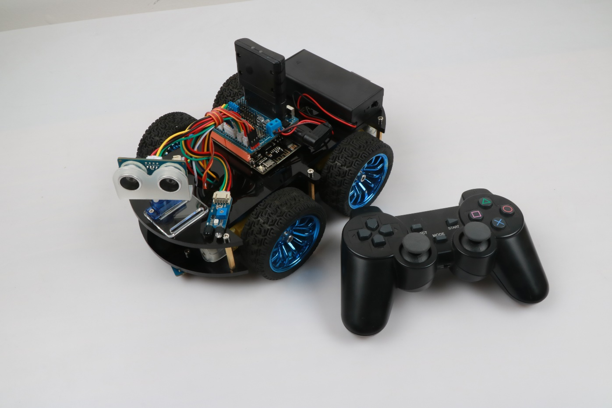


- 标识 UP：前进
- 标识DOWN：后退
- 标识LEFT：左转
- 标识RIGHT：右转
- 标识 A：加速
- 标识 B：左自旋
- 标识 C：减速
- 标识D：右自旋
- 标识3：右边摇杆（标识5）控制键，即必须在R1按下时，右边摇杆才会工作。
- 标识4：左边摇杆（标识6）控制键，即必须在L1按下时，左边摇杆才会工作。
- Joystick left：摇杆遥控方向
- Joystick Right：摇杆遥控速度


## 全部功能综合控制

要实现小车的所有功能我们必须要基于蓝牙控制。利用蓝牙APP去切换各个控制模式。
具体步骤如下：
1)	手机设置里打开蓝牙，并启动APP,选择Hummer-Bot连接成功后可以看到蓝牙模块指示灯由闪烁变长亮;
2)	进入APP选择界面；可以选择自己想要的控制方式；


注意：

- 在语音模式的时候，可以对这手机话筒说前进，左转，右转，后退，停止；小车就会按语音控制动作。
- 当使用综合实验中的红外遥控功能时，刚开始操作需要先按几下遥控器上的“+”按键，将车速加上去，就类似于开车起步踩油门一样，使得车子到达一定的速度，然后再按方向键，小车才会动起来。
- 当需要上传代码时，一定要先将蓝牙和手机连接断开；如果不小心没有断开蓝牙，导致烧录程序不能正常操作，需要给小车完全断电，然后重新上电操作。

## 灭火功能

小车除了使用RGB超声波避障外，还可以在舵机上加装电机风扇。

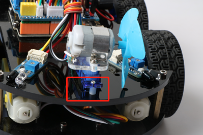

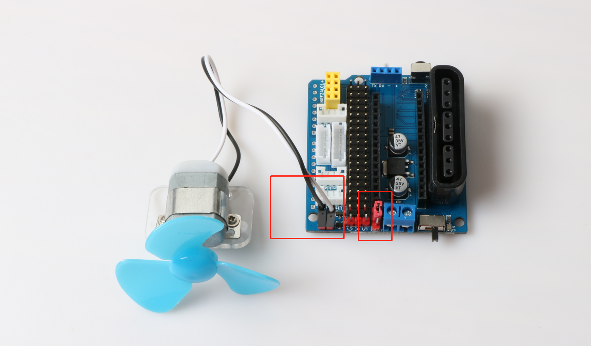


## 灭火风扇接线方法

灭火风扇接线的时候有两点需要注意：
1.	当使用灭火风扇的时候，需要将扩展板的跳线帽插到右边两个引脚。
2.	电机接线的时候，要注意分清电机的正反转线序。


1)	打开Emakefun APP ,连接小车，连接方法前面章节已经介绍，这里不做赘述。
2)	打开APP的极品飞车，其中标识1 是操作舵机角度的按钮；标识2是风扇开关。

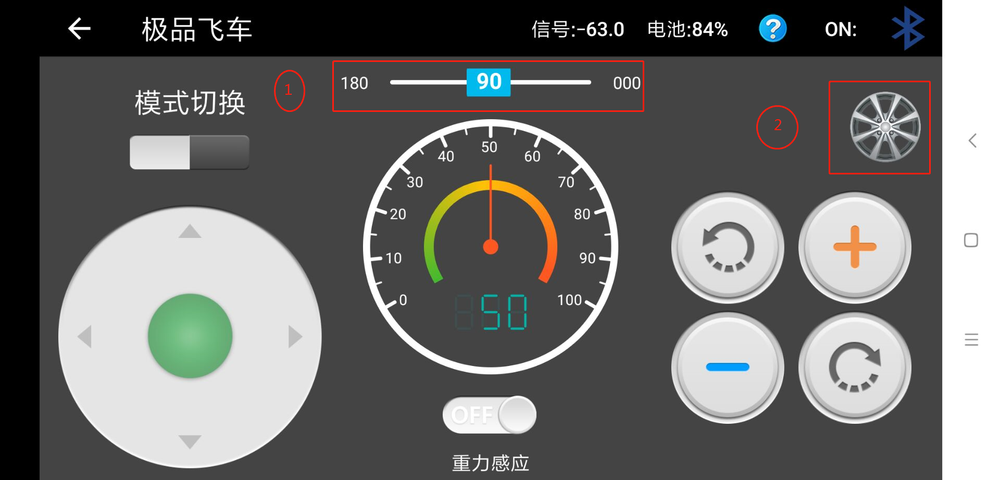


