# PantherTank5.0的图形化编程 
## PantherTank5.0简介
&ensp;&ensp;&ensp;&ensp;PantherTank5.0以ATMEGA328P-PU为主控芯片，H450作为电机驱动芯片的一款多功能履带式车。与传统小车相比，PantherTank5.0搭载无线控制（蓝牙、红外遥控）等，能够自动避障。当然，Maker也可通过自己的idea进行增减其他功能，如添加自动循迹、PS2游戏手柄、添加wifi控制，机械臂等。

### 产品特点
- 大功率全金属减速电机
- 一体充压成型套件，易安装，更紧密
- 2000mA/7.4V可充电锂电池，续航更久，动力更足
- 2颗RGB方向灯
- 具备蜂鸣器
- 支持红外遥控器控制
- 支持手机app控制

### 主控板BLE-UNO
&ensp;&ensp;&ensp;&ensp;在PantherTank5.0，我们使用了BLE-UNO作为主控板。它有14个数字输入/输出引脚（其中6个可用作PWM输出）、6个模拟输入、1个16MHz陶瓷谐振器、1个USB连接、1个电源插座、1个ICSP头和1个复位按钮。它包含了支持微控制器所需的一切。只需通过USB电缆将其连至计算机或者通过AC-DC适配器或电池为其供电即可开始。除此之外，还板载了CC2540蓝牙模块，可实现蓝牙通信等。

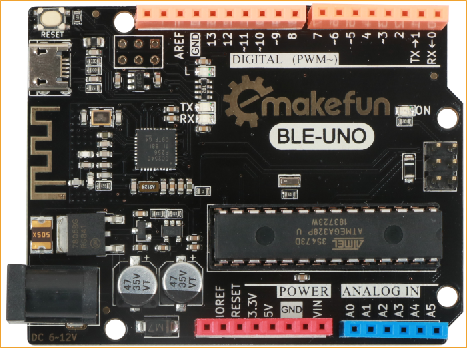

### 扩展板MotorDriverBoard 

扩展板示例图：

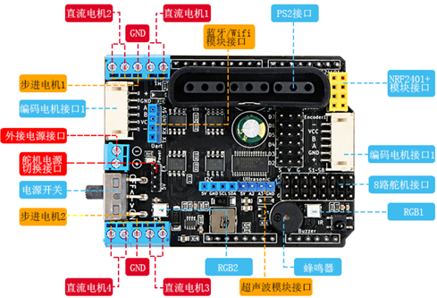

## 使用MagicBlock为PantherTank编写上传程序 [进入MagicBlock使用教程](https://emakefun-docs.readthedocs.io/zh_CN/latest/open_source_software/magicblock)

### 使用PantherTank扩展

&ensp;&ensp;&ensp;&ensp;首先在MagicBlock界面点击右上角的Arduino进入Arduino模式

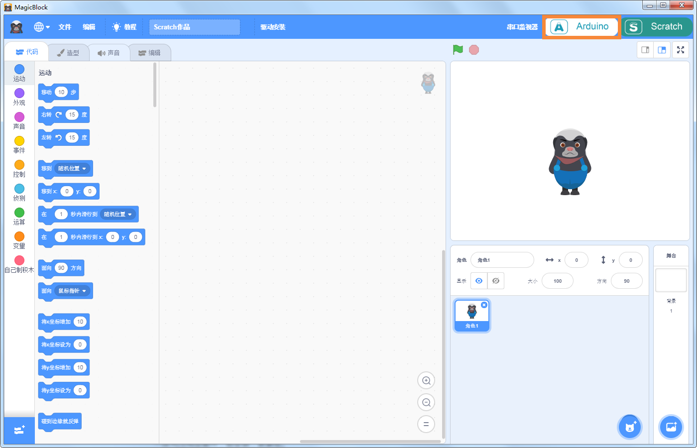

&ensp;&ensp;&ensp;&ensp;然后点击右下角选择扩展，再点击PantherTank扩展

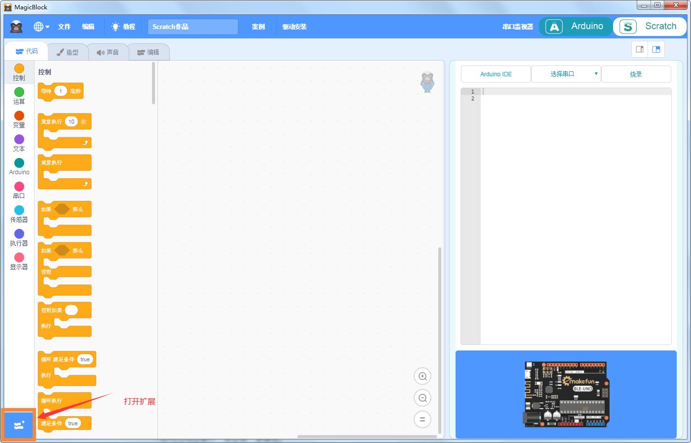

### 如何使用PantherTank图形块

&ensp;&ensp;&ensp;&ensp;选好PantherTank的扩展后就可以在左侧看到所有的PantherTank图形块了，我们就用这些图形块来为PantherTank编程

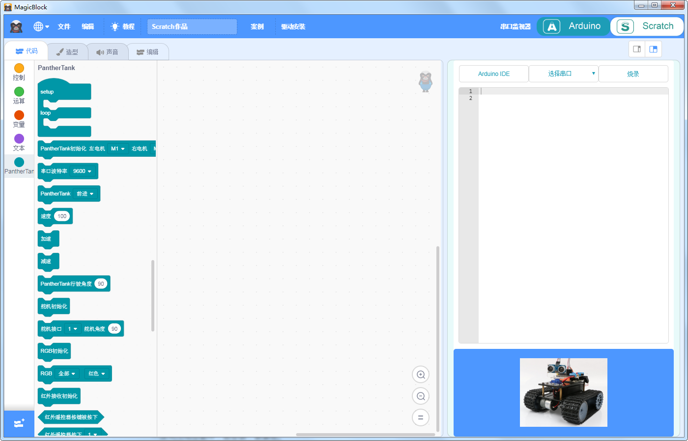

### 为PantherTank上传第一个程序：前进！PantherTank！

&ensp;&ensp;&ensp;&ensp;我们编写一个让PantherTank前进的程序，首先我们需要把主程序图形块“setup/loop”拖拽到代码区，“setup/loop”图形块是任何程序的必须的也是第一个要用到的图形块“setup”里面放PantherTank初始化图形块如RGB初始化等，“loop”里面放PantherTank的动作或功能程序图形块如前进，后退等。然后我们把PantherTank初始化图形块拖拽到setup中，这个图形块主要初始化PantherTank的电机并引入一些头文件，由于电机有4个接口，所以我们可以随意选择左右两个电机的接口，需要注意的是图形块里选择的电机接口必须要和实际接线一致，最后，我们拖拽出PantherTank的速度和动作图形块分别设置PantherTank的速度为50并让它前进，好了，PantherTank前进的程序就写好了.

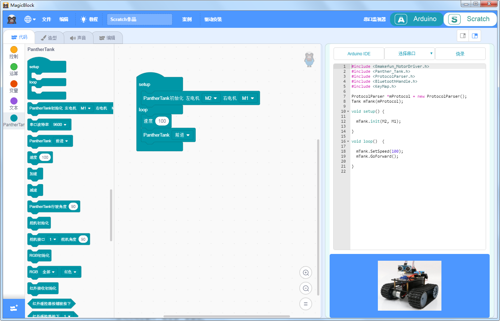

&ensp;&ensp;&ensp;&ensp;现在我们把程序上传到PantherTank上，让它跑起来，首先用usb线将PantherTank和电脑连接，点击“选择串口”选择PantherTank的串口，然后点击“烧录”，等待程序烧录进PantherTank中，拔掉usb线，打开电源就能看到PantherTank向前跑起来了

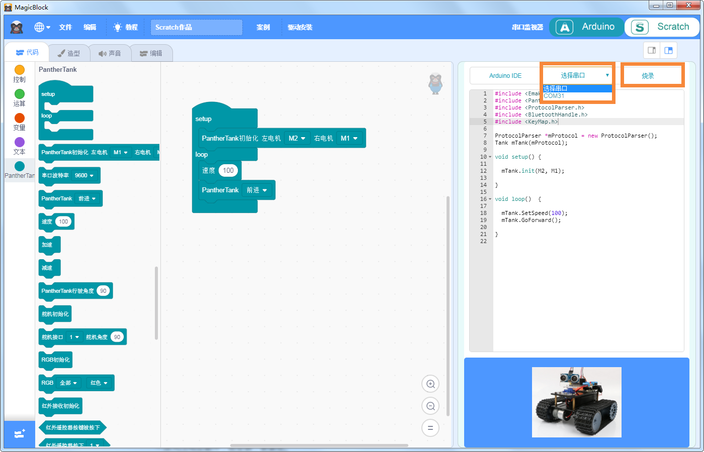

## PantherTank各模块功能与MagicBlock示例程序

### 电机
#### 电机介绍

&ensp;&ensp;&ensp;&ensp;PantherTank有4个直流电机接口，分别是直流电机接口M1，直流电机接口M2，以及直流电机接口M3，直流电机接口M4，可通过端子直接将直流电机连接到驱动器上，PantherTank使用到了M2和M1两个电机，我们连接M2和M1就可以了

#### 示例程序

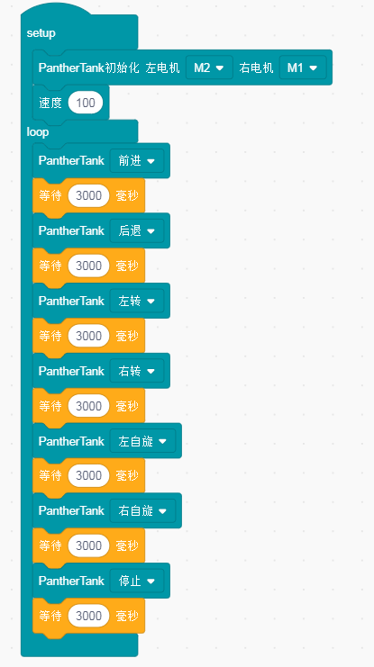

### RGB
#### RGB介绍

&ensp;&ensp;&ensp;&ensp;WS2812 RGB LED灯是三通道带驱动控制，其内部包含了智能数字接口数据锁存信号整形放大驱动电路，还包含有高精度的内部振荡器和15V高压可编程定电流输出驱动器。同时，为了降低电源纹波， 3个通道有一定的延时导通功能，这样在帧刷新时，可降低电路纹波安装更加简便。WS2812 RGB LED灯与传统灯不同，灯内部集成了驱动控制专用芯片，只需一条信号线即可控制一颗灯珠或多个模组。

#### 示例程序

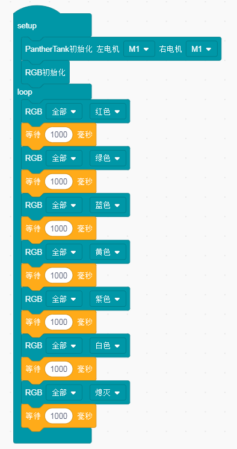

### 蜂鸣器
#### 蜂鸣器介绍

&ensp;&ensp;&ensp;&ensp;PantherTank上面有一个无源蜂鸣器，可以通过编写程序控制蜂鸣器播放提示音或者播放音乐。

#### 示例程序

### 舵机
#### 舵机介绍

&ensp;&ensp;&ensp;&ensp;PantherTank可以驱动8路舵机，驱动板上的舵机引脚位置（红外接收头上方排针），设地线引脚（G）,电源引脚（V）和信号引脚（S），三个引脚分别与舵机的相应引脚,也可以通过I2C通讯控制舵机，PantherTank只用到了1号接口的舵机，所以我们直接1号舵机就可以了。

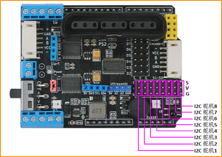

#### 示例程序

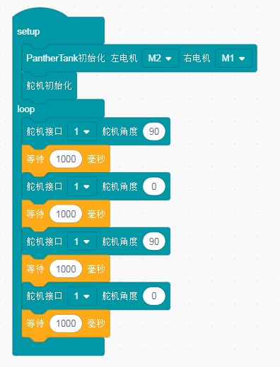

### 超声波
#### 超声波介绍

&ensp;&ensp;&ensp;&ensp;PantherTank上留有四线超声波模块接口，四个引脚分别是电源引脚（vcc）,超声波信号发射引脚（A2），超声波信号接收引脚（A3），地线（GND）, 四个引脚分别和超声波模块的相应引脚连接，我们可以结合PantherTank的超声波和舵机为PantherTank编写一个超声波避障程序。

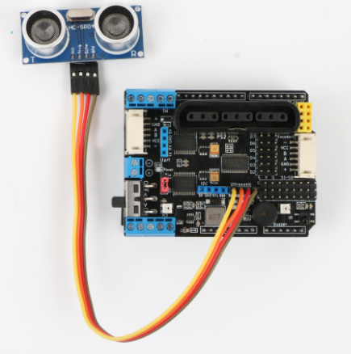

#### 示例程序
超声波测试程序

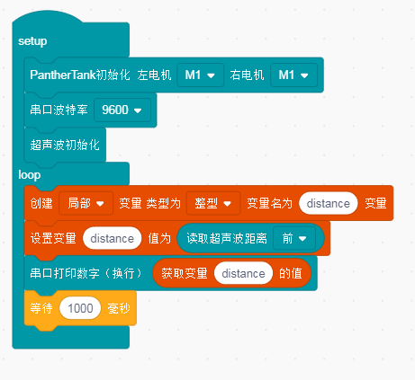

超声波避障程序

### 红外遥控
#### 红外遥控介绍
&ensp;&ensp;&ensp;&ensp;PantherTank上有一个红外遥控接收探头，使用时只需将扩展板插到Arduino上，有红外编码信号发射时，经红外接头处理后，输出为检波整形后的方波信号，并直接提供给单片机，执行相应的操作来达到控制电机的目的。

#### 示例程序
红外遥控器测试程序

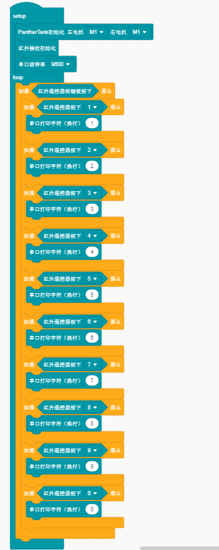

红外遥控操控程序

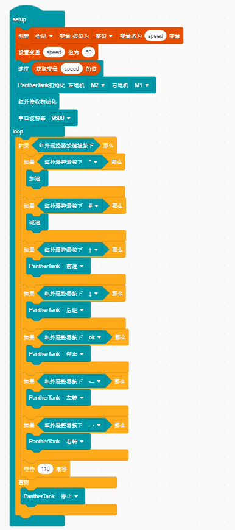

### PS2
#### PS2介绍
&ensp;&ensp;&ensp;&ensp;PantherTank上有一个PS2端口，可将PS2红外接收头直接插到PS2端口，PS2手柄由手柄和接收器两个部分组成，手柄需要两节7号1.5V供电，接收器的电源和arduino使用同一电源，电源范围为3~5V,不能接反，不能超电压，过压和反接，都会使接收器烧坏。手柄上有个电源开关，ON开/OFF关，将手柄开关打到ON上，在未搜索到接收器的状况下，手柄上的灯会不停的闪，在一定时间内，还未搜索到接收器，手柄将进入待机模式，手柄上的灯将灭掉，这时，按下“START”键，唤醒手柄。

#### 示例程序

PS2测试程序

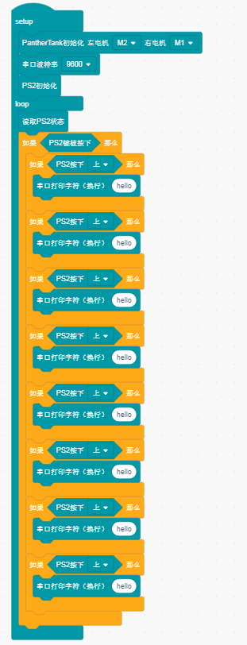

PS2操控程序

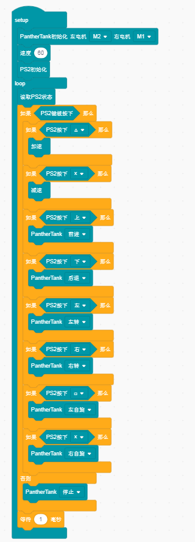

### 蓝牙

#### 蓝牙介绍

&ensp;&ensp;&ensp;&ensp;PantherTank主板上搭载了蓝牙，用手机的蓝牙连接，首先我们先下载emakefun 手机APP，打开APP后，选择一辆PantherTank进行蓝牙连接，我们需要编写一个蓝牙操控程序后，就可以进入APP蓝牙操控界面控制PantherTank。

#### 示例程序

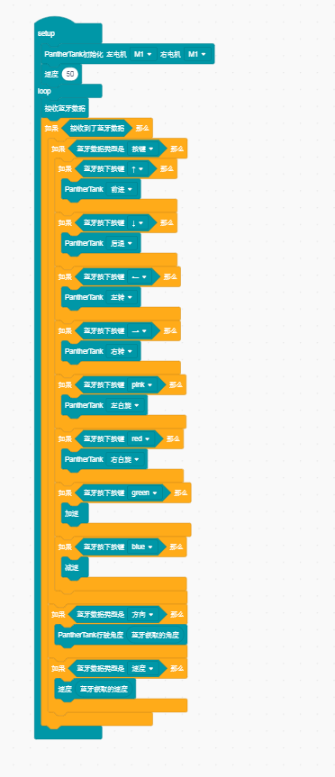

### Nrf24L01

#### Nrf24L01介绍

&ensp;&ensp;&ensp;&ensp;nRF24L01+模块是Nordic公司基于nRF24L01芯片开发成的2.4G无线通讯模块。采用 FSK 调制，内部集成Nordic自己的 Enhanced Short Burst 协议。可以实现点对点或是 1 对 6 的无线通信。无线通信速度最高可达2M（bps），NRF24L01有收发模式，配置模式，空闲模式，关机模式四个工作模式，PantherTank上有一个Nrf24L01接口。

#### 示例程序

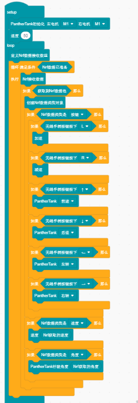

