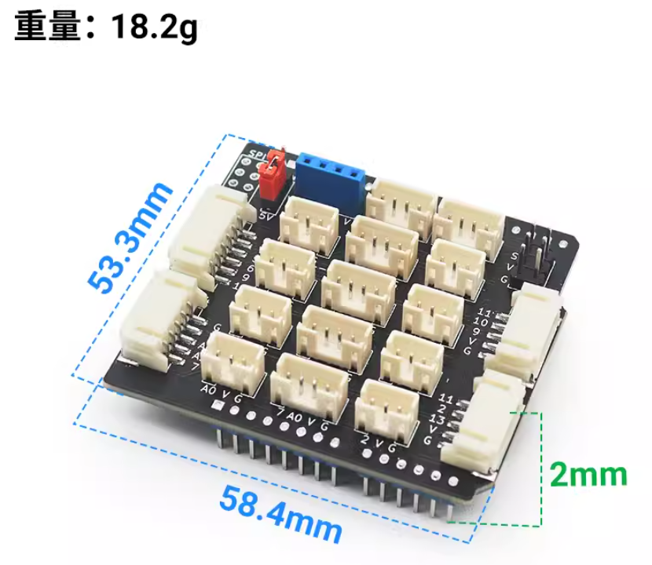
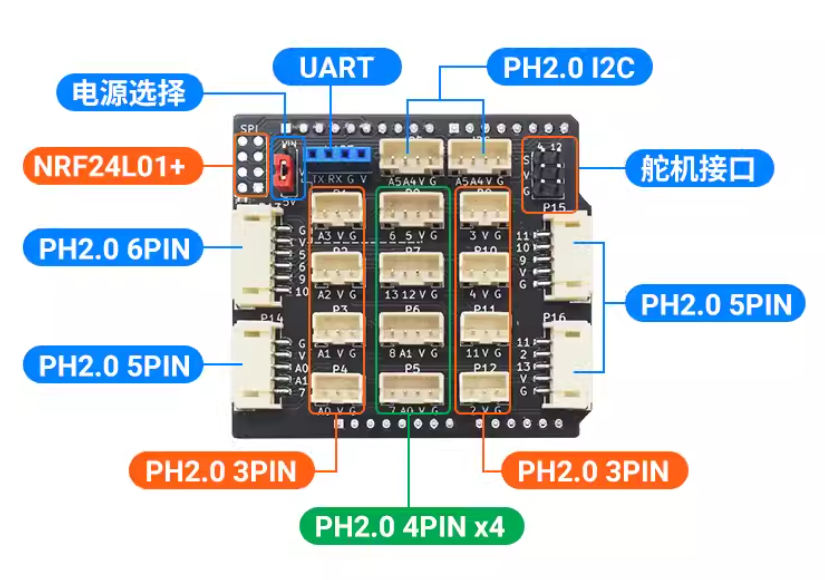
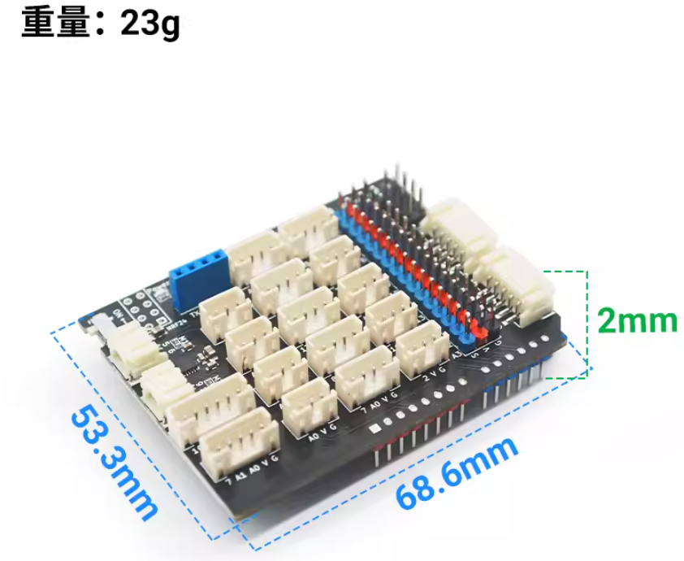
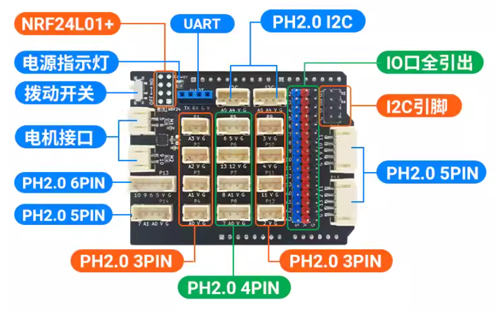
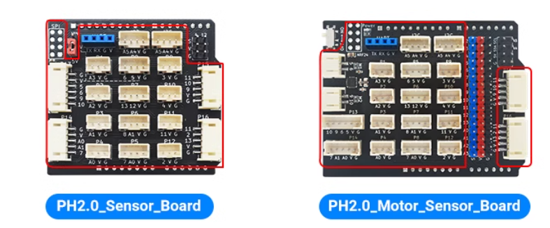
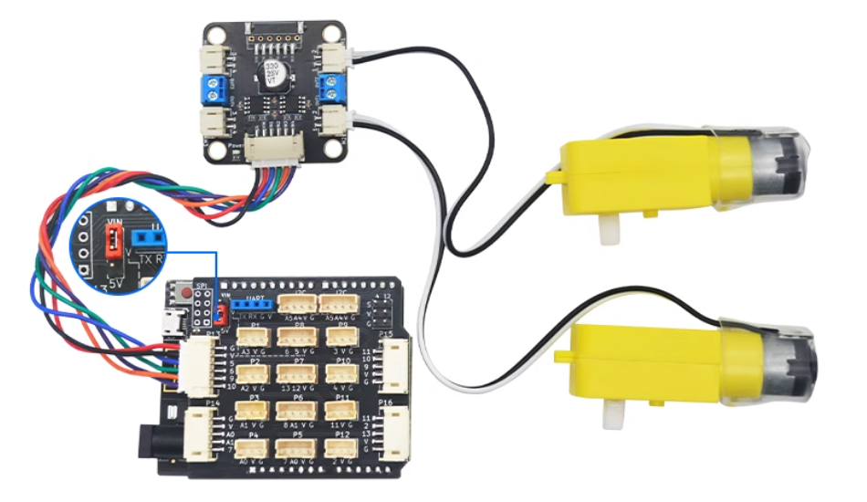
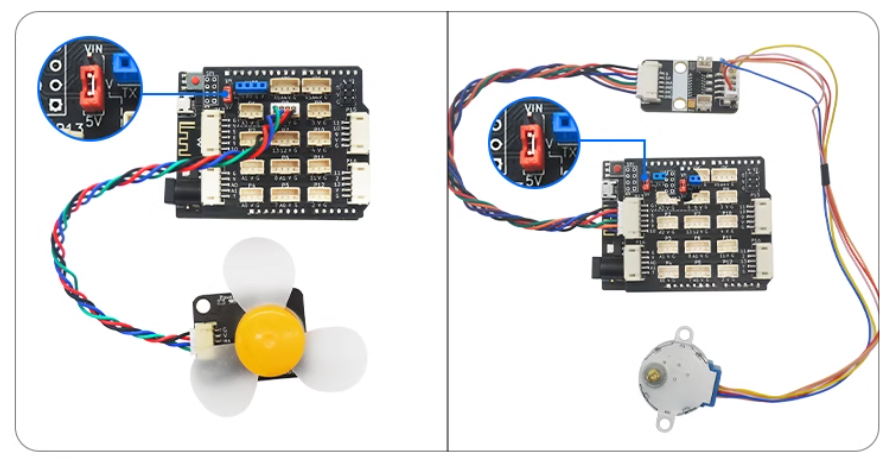
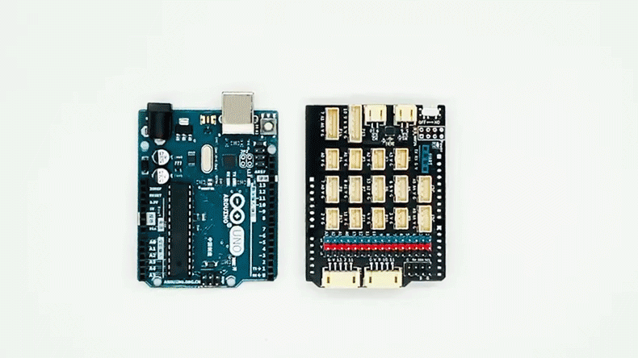

# PH2.0 拓展板和驱动板 简介

## 一：PH2.0 Sensor Board拓展板

### 1.参数介绍

PH2.0 Sensor Board V3.0 是一套为 Arduino Uno R3主板设计的全部PH2.0防反接扩展板，旨在为您的项目提供可靠防反接传感器接口。

- PCB厚度：2mm

- 产品尺寸：58.4 * 53.3mm（裸板长宽）

- 净        重：18.2g

- 输出电压：5V

- 引脚口类型：PH2.0 接口 

  

### 2. 引脚介绍

该扩展板包含八个 3pin 接口、四个 4pin 接口、三个 5pin 接口、一个 6pin 接口，两个舵机接口，一个UART接口，一个NRF24L01+接口，二个I2C接口。

- 8个3pin 接口, P1、P2、P3、P4、P9、P10、P11、P12。 分别为对应Arduino的A3、A2、A1、A0、3、4、11、2。
- 4个4pin 接口, P5, P6, P7, P8。 分别为7和A0, 8和A1, 13和12, 6和5。
- 3个5pin 接口, P14, P15, P16。 分别为7、A1和A0,   11、10和9，  11、2和3。
- 1个6pin 接口, P13。 分别为10、9、6和5。
- 2个舵机接口。 对应Arduino的4、12。
- 2个4pin I2C接口。对应A5、A4。
- 1个UART接口。
- 1个SPI接口。

## 二：PH2.0 Motor Sensor Board驱动板

### 1.参数介绍

PH2.0 Motor Sensor Board是在兼容PH2.0 Sensor Board扩展板的基础上增加了2路电机驱动，和2.54mm排针接口的驱动扩展板。

- PCB厚度：2mm
- 产品尺寸：68.6 * 53.3mm（裸板长宽）
- 净        重：23g
- 输出电压：5V
- 引脚口类型：PH2.0 接口 

### 2.引脚介绍

该驱动板包含八个 3pin 接口、四个 4pin 接口、三个 5pin 接口、一个 6pin 接口，二个电机接口，四个I2C接口，一个UART接口，一个NRF24L01+接口，16个IO口插针引脚。

- 8个3pin 接口, P1、P2、P3、P4、P9、P10、P11、P12。 分别为对应Arduino的A3、A2、A1、A0、3、4、11、2。
- 4个4pin 接口, P5, P6, P7, P8。 分别为6和5, 13和12,8和A1, 7和A0。
- 3个5pin 接口, P14, P15, P16。 分别为7、A1和A0,   11、10和9，  11、2和3。
- 1个6pin 接口, P13。 分别为10、9、6和5。
- 2个直流电机接口。 M1对应5和6，M2对应9和10。
- 2个4pin I2C接口，2个插针I2C接口。 对应A5、A4。
- 1个UART接口。
- 1个SPI接口。
- 16个IO口插针引脚。

## 三：参数对比

| **产品名称**   | PH2.0 Sensor Board                    | PH2.0 Motor Sensor Board              |
| -------------- | ------------------------------------- | ------------------------------------- |
| **尺寸**       | 58.4 x 53.3mm                         | 68.6 x 53.3mm                         |
| **重量**       | 18.2g                                 | 23g                                   |
| **高度**       | 2mm                                   | 2mm                                   |
| **电压**       | 5V                                    | 5V                                    |
| **PH2.0接口**  | 3PIN x8 / 4PIN x4 / 5PIN x3 / 6PIN x1 | 3PIN x8 / 4PIN x4 / 5PIN x3 / 6PIN x1 |
| **电机接口**   | 无                                    | 2个，电流分别可达1A                   |
| **IO排针引出** | 无                                    | 16个                                  |
| **工艺**       | 焊接贴片                              | 焊接贴片                              |

### 1.相同之处

### 2.不同之处

1. PH2.0 Sensor Board为简单款，既能适用于买家简单的玩法也能节约成本。

2. PH2.0 Motor Sensor Board为多功能款，在PH2.0 Sensor Board上增加：IO口排针引脚，I2C引脚，拨动开关，电源指示灯，两个单路1A电流电机接口。适用于连接更多不同传感器需求，同时需要电机驱动的场景。

## 四：场景应用

### 1.PH2.0 Sensor Board经典使用场景 / PH2.0 Motor Sensor Board小车使用场景

### 2.PH2.0 Sensor Board 跳线帽使用

####  1.当使用大于5V的电机时，跳线帽短接VIN

#### 2.当使用电机5V时，跳线帽短接5V

#### 3.驱动扩展板与Arduino uno R3主板安装动态图

