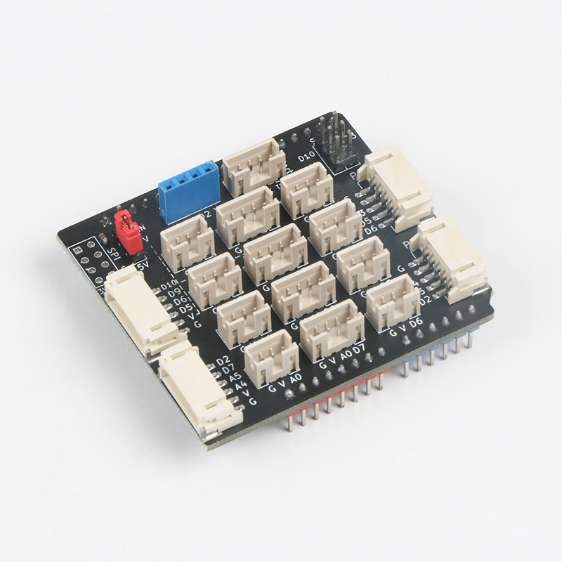
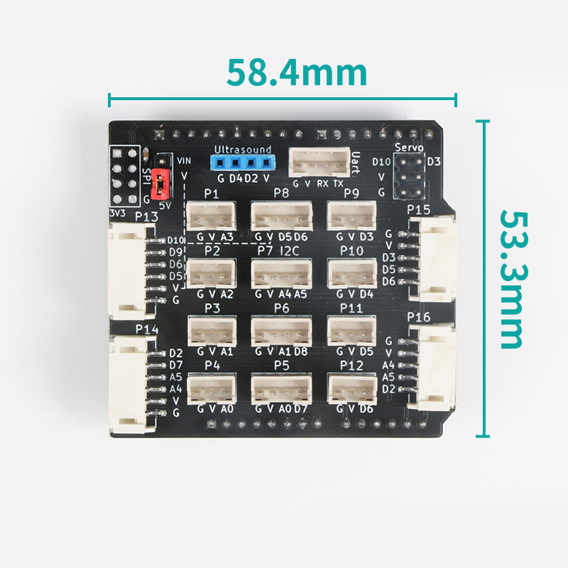

# PH2.0 Sensor Board V3.0 简介

PH2.0 Sensor Board V3.0 是一套为 Arduino 量身打造基于 PH2.0 接口的扩展板，该扩展板包含八个 3pin 接口、四个 4pin 接口、两个 5pin 接口、两个 6pin 接口，两个舵机接口，一个UART接口，一个超声波接口，一个SPI通信接口。

## PH2.0 Sensor Board V3.0 参数介绍

- PCB厚度：1.6mm
- 产品尺寸：58.4 * 53.3mm（裸板长宽）
- 净        重：20g
- 输出电压：5V
- 引脚口类型：PH2.0 接口 

## PH2.0 Sensor Board V3.0 引脚介绍

- 8个3pin 接口, P1、P1、P2、P3、P4、P9、P10、P11、P12; 分别为对应Arduino的A3、A2、A1、A0、D3、D4、D5、D6。
- 4个4pin 接口, P5, P6, P7, P8; 分别为D7和A0, D8和A1, D5和A4, D6和D5, 其中P7(A5、A4)为IIC通信接口。
- 2个5pin 接口, P15, P16。分别为D6、D5和D3, D2、A5和A4
- 2个6pin 接口, P13, P14。分别为D5、D6、D9和D10, A4、A5、D7和D2。
- 1个超声波接口, 对应Arduino的D4、D2。
- 1个UART接口。
- 1个SPI接口。

