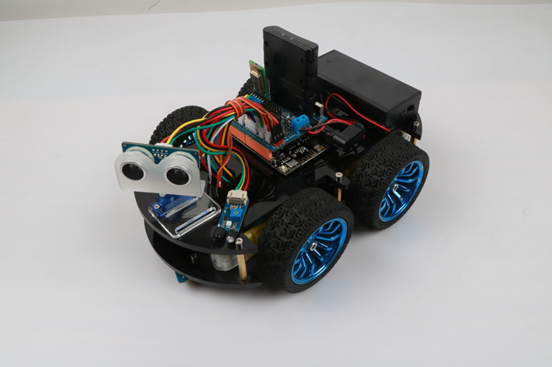

# 使用MagicBlock在Arduino模式下为Hummerbot上传程序

## 认识Hummerbot

### Hummerbot简介

**Hummerbot是一款多功能、可编程的Arduino智能小车**

### Hummerbot的功能

 **1.超声波避障功能**

**2.超声波+红外避障功能**

**3.自动循迹功能**

**4.红外遥控功能**

**5.蓝牙遥控功能**

**6.PS2遥控功能**

**7.蓝牙远程模式切换功能**

**8.追光功能**

**9.RGB灯**

### Hummerbot的主控板与扩展板介绍

.jpg)

.jpg)

## MagicBlock的Arduino模式

**在前面已经介绍过MagicBlock分为两种模式：Arduino模式和Scratch模式（在MagicBlock界面右上角切换），Arduino模式为上传模式，Scratch为实时模式，Arduino模式是我们用图形块写好程序后，图形块自动转换成Arduino C++代码，然后需要我们用usb线连接电脑和Hummerbot，通过MagicBlock把代码上传给Hummerbot，Scratch模式需要在Hummerbot里面安装固件，而且要一直与电脑通过usb线或蓝牙等连接，通过点击图形块的方式，实时地给Hummerbot发送命令来操控Hummerbot，此篇文档只介绍在MagicBlock的Arduino模式下为Hummerbot编程的流程**

.jpg)

## 用MagicBlock为Hummerbot上传程序

### 在MagicBlock上打开Hummerbot扩展

**首先，我们需要把模式切换为Arduino模式，因为打开MagicBlock时默认为Scratch模式，我们点击右上角的Arduino按钮就可以了，然后点击界面左下角的蓝色按钮添加扩展**

.jpg)

**出现选择扩展界面，鼠标左键选择Hummerbot扩展**

.jpg)

**选择好Hummerbot扩展后，我们的图形块区域就会出现Hummerbot这个扩展了，它包含了Hummerbot所有的用来编程的图形块**

.jpg)

### 如何使用Hummerbot图形块

.jpg)

**Hummerbot的第一个图形块是setup/loop图形块，这个图形块是主图形块，Hummerbot的每个程序都要用到它，而且Hummerbot的其他图形块都需要放进这个图形块的setup或loop里面，setup里面都是放初始化的程序图形块如电机初始化，红外初始化，超声波初始化等，loop里面放的都是可能多次执行的程序图形块如Hummerbot的前进、后退、加速、减速等**

### 为Hummerbot编写第一个程序：Hummerbot动起来！

**了解了Hummerbot的图形块，我们试着开始用MagicBlock为Hummerbot编写第一个程序：Hummerbot，前进！**

**第一步：拖拽出setup/loop图形块到编程区**

.jpg)

**第二步：初始化Hummerbot，将“悍马小车初始化”图形块拖拽进setup中，这个图形块用来初始化Hummerbot的电机，设置初始速度为0**

.jpg)

**第三步：初始化电机引脚，将“电机初始化”图形块拖拽进setup中的“悍马小车初始化”的下面，这个图形块用来初始化Hummerbot的4个电机的引脚，默认为6,10,5,9，我们可以点击下拉框修改4个引脚，这需要我们修改4个电机的实际接线做到与程序保持一致**

.jpg)

**第四步：拖拽出控制Hummerbot行进的图形块到loop中，一般不要拖拽进setup中，因为setup是初始化图形块，里面所有的程序只执行一次，假如把Hummerbot前进的图形块直接拖入setup中，上传完程序后，Hummerbot是不会动的，因为Hummerbot前进的程序在程序运行的时候瞬间就结束了，所以我们要把有关Hummerbot动作的程序图形块拖拽进循环程序loop中，下图程序的效果就是Hummerbot会不停地前进**

.jpg)

### 认识代码区域

**通过之前的介绍，我们已经可以为Hummerbot编写一个让它前进的程序了，现在，让我们来通过图形块的真正含义—代码，来研究Hummerbot是如何动起来的，让我们把注意力放到MagicBlock界面的右边：代码区，我们用图形块为Hummerbot编程的同时，会发现每拖拽一个图形块，在代码区就会生成一段或几段代码，没错，这就是我们实际上传到Hummerbot上的程序，也就是能够让Hummerbot动起来的根本原因，还是以Hummerbot前进的程序为例，当拖拽出setup/loop图形块时，代码区出现两个函数分别是setup()和loop()函数**

.jpg)

**然后拖拽出“悍马小车初始化”图形块到setup里面，观察代码发现，这个图形块引入了一些头文件，然后在setup函数中调用了Hummerbot的init()初始化函数和SetSpeed()设置速度函数**

.jpg)

**接着我们拖拽出电机初始化图形块到setup里面，可以发现setup中最下面出现一行代码：hbot.SetMotorPin(6,10,5,9);没错，这就是这个图形块代表的Arduino代码**

.jpg)

**我们拖拽出最后一个图形块“悍马小车前进，速度60”到loop里面，右边代码区的loop中就多出两行代码，它们分别是设置Hummerbot前进和设置Hummerbot速度的代码，到了这一步，代码区里面的代码就是一段Hummerbot前进程序的完整代码了，接下来我们需要把这段代码上传到Hummerbot上，就可以让Hummerbot按照我们写的程序动起来了**

.jpg)

### 上传程序

**代码区的顶部有三个按钮分别是“打开Arduino IDE”、“请选择串口”和“烧录”，点击“打开Arduino IDE”后，会弹出一个叫做Arduini IDE的编辑器，可以用它来修改代码，编译和上传（上传前先选择端口）**

.jpg)

**当然，我们一般不需要打开Arduino IDE，我们直接点击“烧录按钮就可以上传程序了，但前提是我们要先选择串口连接，否则无法上传，当我们用usb线将电脑和Hummerbot连接好后，点击“请选择串口”，会出现串口号，我们点击串口号就连接上了**

.jpg)

**现在，点击“烧录”开始为Hummerbot上传程序，上传成功后会弹出finish提示框，点击“确定”后就成功上传完程序了，现在，拔掉usb线，打开Hummerbot电源，看看Hummerbot是如何执行我们为它编写的程序的吧！**

.jpg)

## Hummerbot各个模块与MagicBlock示例程序

### 电机

#### 电机介绍

**Hummerbot有四个直流电机，我们使用直流电机控制积木让直流电机转动起来，从而带动Hummerbot机器人动起来**

#### 电机测试程序

**我们用图形块写一个简单的电机测试程序：前进2秒，后退两秒，左转两秒，右转两秒，然后停止2秒**

.jpg)

### 舵机

#### 舵机介绍

**舵机主要有以下几个部分组成，舵盘、减速齿轮组、位置反馈电位计、直流电机、控制电路等，当舵机控制电路板接收到来自信号线的控制信号，控制电机转动，电机带动一系列齿轮组，减速后传动至输出舵盘**

.jpg)

#### 舵机测试程序

**先初始化舵机引脚并调整好校准角度，可能你们会问校准角度是什么，其实，校准角度是我们调整的超声波正对Hummerbot前方的角度，Hummerbot的超声波是安装在舵机上端的，但是安装的时候可能有一点点偏差，导致舵机在90度的时候不是正对Hummerbot前方的，这时我们就需要调整校准角度了可以在80-100度范围内调整，直到超声波正对Hummerbot的前方，所以校准角度这个值一般不会刚刚好是90度，很可能是八十几度或九十几度，当调整好舵机角度后，这时使用“舵机角度这个图形块时，舵机就能转到正确的角度”**

.jpg)

### RGB灯

#### RGB灯介绍

**Hummerbot有两个彩灯，他们安装在超声波模块上，这两个LED灯可以发出五颜六色的光，那么为什么一个灯就可以发出五颜六色的光呢，这就跟我们物理上学习的光的三原色有关，光的三原色是红、绿、蓝，这三种颜色混合在一起可以呈现不同颜色，这就是Hummerbot的RGB灯的原理**

#### RGB测试程序

**先初始化RGB超声波模块，然后再用RGB图形块设置灯的颜色**

.jpg)

### 超声波模块

#### 超声波模块介绍

**超声波传感器是通过发射超声波侦测距离的设备，超声波是一种听不见的声波，具有碰到物体会返回的特性，超声波传感器有两个“眼睛”，其中一只“眼睛”发射超声波，而另外一只“眼睛”接收遇到障碍物发射回来的超声波，当一只“眼睛”发射超声波后，开始计时，等另一只“眼睛“接收到返回来的超声波时停止计时，超声波测得距离=超声波的速度×（计时时间÷2）**

.jpg)

#### 读取超声波距离程序

**我们给Hummerbot上传这样的一个程序，打开串口监视器，就可以看到串口每秒钟打印一次超声波测到的距离**

.jpg)

#### 超声波避障程序

**测试完超声波模块后，我们可以结合超声波和舵机来为Hummerbot编写一个超声波避障程序，程序的思路就是当超声波测到前方距离大于20就一直前进，当小于20就让超声波测左距离和右距离，哪边大于12就向哪边转弯然后继续不停的测前方距离并且做判断然后让Hummerbot做出相应的动作**

.jpg)

### 红外避障

#### 红外避障模块介绍

**红外避障模块和超声波模块的原理类似，区别是超声波模块是通过发射超声波测距离，红外避障模块是通过发射红外线测距离，红外避障模块是具有一对红外发射与接收管，发射管射出红外线，当发射出的红外线遇到障碍物时，红外线反射回来被接收管接收，绿色指示灯会亮起，接收到的红外信号经过机器人的控制主板处理之后，进而计算出检测距离**

.jpg)

#### 红外避障程序

**红外避障程序的设计思路非常清晰，就是让红外避障模块不停地检测左右障碍物，如果左右都没有障碍物就让Hummerbot前进，如果左右都有障碍物Hummerbot就后退，如果左边有障碍物就右转，反之左转**

.jpg)

#### 超声波+红外避障程序

**学会了超声波避障和红外避障程序的设计，我们可以把这两个功能结合起来，设计一个超声波红外避障程序**

.jpg)

.jpg)

### 红外遥控

#### 红外遥控原理

**遥控系统一般由遥控器（发射器）和接收器组成，当你按下遥控器上的任意按键时，遥控器就会发出一个指令，接收器接收到遥控器发出的指令后，会将指令传送给机器人的大脑，机器人根据遥控指令思考做什么样的动作，然后控制自己的四肢做出相应的动作**

.jpg)

#### 红外遥控程序

**我们利用遥控器上面的”↑“，”↓“，”←“，”→“，”+“，”-“这六个按键编写一个简单的遥控器器操控Hummerbot的程序**

.jpg)

.jpg)

### 蓝牙

#### 蓝牙模块介绍

**蓝牙是一种远程通信方式，我们把要发的指令从手机APP端通过手机蓝牙发送给机器人上面的蓝牙模块，然后又机器人上面的蓝牙模块将该指令再发给机器人的大脑（主控板），机器人就控制自己的四肢做出相应的动作，同时，机器人还会通过自身安装的蓝牙模块将正在做的动作发送给手机APP，这样，手机APP就可以通过蓝牙遥控机器人了，Hummerbot的蓝牙模块搭载在主控板上**

#### 蓝牙操控程序

**蓝牙操控程序主要通过读取APP上面的按键让HUmmerbot做出反应，上传好程序后，打开APP通过蓝牙将手机和Hummerbot连接，连接成功后，主控板上的蓝色灯常亮，连接成功后选择遥控界面，然后就可以操控Hummerbot了**

.jpg)

.jpg)

.jpg)

### PS2

#### PS2遥控手柄原理

**PS2遥控手柄由手柄和接收器两个部分组成，手柄需要两节7号电池供电，将手柄开关打到ON上，在未搜索到接收器的情况下，手柄上的灯会不停地闪，在一定时间内还未搜素到接收器手柄将进入待机模式，手柄上的灯将灭掉，这时，按下”START“键，唤醒手柄，接收器的工作电源为3~5V，不能接反，不能超电压，否则会使接收器烧坏，正常上电之后，手柄与接收器自动配对连接，在未配对成功的状态下，接收器绿灯闪烁，手柄上的灯也会闪烁，配对成功后，接收器绿灯常亮，手柄上灯也常亮，当手柄和接收器连接后，我们就可以用手柄发送按键命令，接收器接收到这些按键命令的时候，机器人的大脑（主控板）会按照收到的命令让他的四肢做相应的动作**

.jpg)

#### PS2遥控程序

.jpg)

.jpg)

### 追光模块

#### 追光模块介绍

**追光模块的追光功能使通过光敏二极管判断周边环境的光线强弱，输出模拟信号，当光敏电阻被强光照射，其电阻值迅速下降，通过的电流增大，光敏电阻在黑暗的环境中电阻又迅速升高，通过的电流减小，主控板以此判断是否有光源**

.jpg)

#### 追光程序

.jpg)

### 红外循迹

#### 红外循迹模块介绍

**红外循迹模块是利用红外线在不同颜色的物体表面具有不同反射性质的特点来工作的，在机器人运动的过程中不断地向地面发射红外光，当发射出的红外线没有被反射回来或反射回来但强度不够大时，机器人认为该区域是它要走的路线，当红外光被反射回来被机器人识别到，机器人认为该区域不是它走的路线，Hummerbot上装有三个循迹模块，分别在左中右各一个**

.jpg)

#### 红外循迹程序

.jpg)

.jpg)

.jpg)