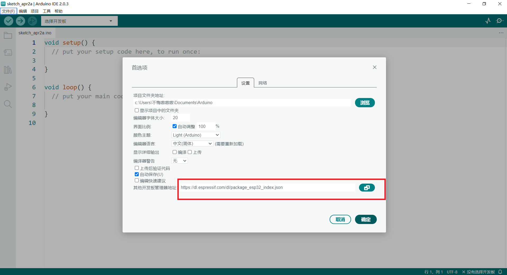
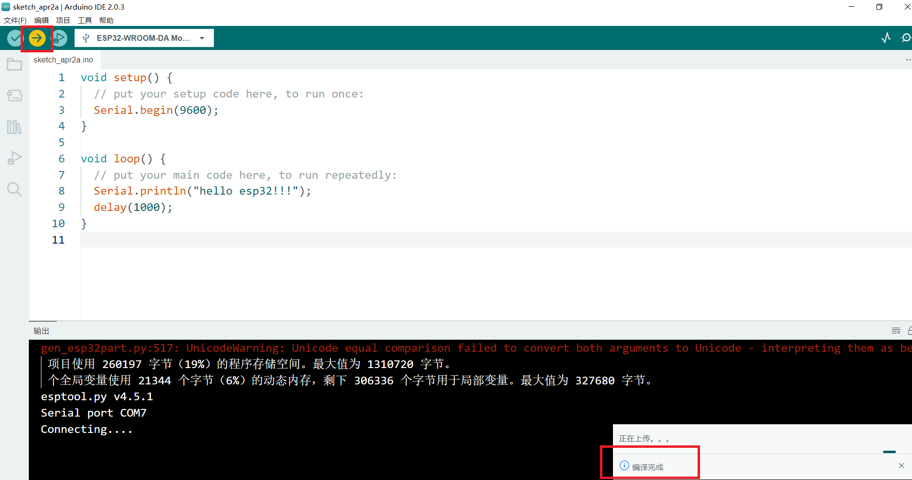
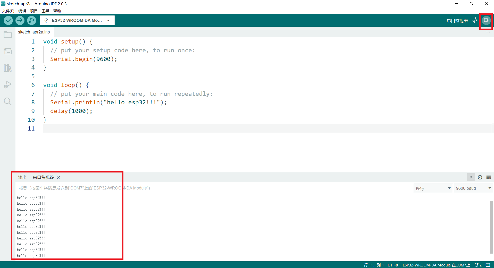

## ESP32 IOT 使用说明

### [淘宝购买链接](https://item.taobao.com/item.htm?ali_refid=a3_430582_1006:1209150026:N:bHry0KBYQUueXMqvQBLQ7A==:ae7ad87b821c162939f1053fd9a53067&ali_trackid=162_ae7ad87b821c162939f1053fd9a53067&id=778630577370&skuId=5318380828567&spm=a21n57.1.0.0)

### 产品介绍

ESP32 IOT是基于乐鑫科技的 [ESP32-WROOM-32](https://www.espressif.com/sites/default/files/documentation/esp32-wroom-32_datasheet_cn.pdf) 模组基础上开发的一款适用于创客教育的标志性产品，Flash大小4MB，集成 2.4 GHz、Wi-Fi 和蓝牙双模的单芯片方案。采用东芝的电机驱动芯片，电流最大可达1.2A。

### ESP32 IOT模组参数

- 448 KB ROM,520 KB SRAM,16 KB RTC SRAM
- QSPI 支持多个 flash/SRAM
- 内置 8 MHz 振荡器
- 支持自校准
- 内置 RC 振荡器，支持自校准
- 支持外置 2 MHz 至 60 MHz 的主晶振（如果使用 Wi-Fi/蓝牙功能，则目前仅支持 40 MHz 晶振）
- 支持外置 32 kHz 晶振，用于 RTC，支持自校准
- 2 个定时器群组，每组包括 2 个 64-bit 通用定时器和 1 个主系统看门狗
- 1 个 RTC 定时器
- RTC 看门狗
- 34 个 GPIO 口 • 12-bit SAR ADC，多达 18 个通道
- 带有专用 DMA 的以太网 MAC 接口，支持 IEEE 1588
- 双线汽车接口（TWAI®，兼容 ISO11898-1） • IR (TX/RX)

### 产品参数

- 采用乐鑫原装V3版本模组ESP32-WROOM-32E
- 采用PH2.0端口，防止反接，导致元器件短路烧坏
- 烧录端口使用Type-C接口
- 2个直流电机端口(14和15,16和17)；1个步进电机端口（P15）；电流最大达到1.2A
- 2个I2C插针接口(SCL SDA 5V G)
- 2个舵机接口(25,0)
- 输入电压： 6-12V
- 产品尺寸：80mm×56mm；PCB厚度：1.6mm；净重：25.3g
- M4定位孔直径：4.7mm，兼容乐高
- 软件支持Mixly、Arduino IDE、MicroPython

### 引脚说明

**注:** 1. Motor and IO Switch: 当拨码开关打到IO口端时，M1、M2电机端口不工作，不能驱动电机，引脚为普通端口；当拨码开关打到M1A/M1B/M2A/M2B时，M1、M2为电机端口，可以驱动电机。

​      2.电源指示灯P

​      3.板载LED灯L（IO4）可作为下载检测使用。

​      4.复位键能够复位主板

​      5.因为ESP32芯片特性，主板的34、35、36、39引脚不能作为输出；并且34、35、36、39引脚作为输入时，不能设置上拉或下拉模式。

### ESP32 IOT驱动安装

#### 安装驱动

1、Windows安装CH340G（改进版）驱动

1）驱动未安装成功，下载CH340G驱动程序。可以从官方网站下载。建议从官方网站下载以避免下载恶意软件或病毒。[CH340G官方下载地址](https://www.wch.cn/downloads/CH341SER_EXE.html)

2）打开下载的驱动程序，根据安装向导的提示完成安装。在安装过程中，可能需要选择操作系统类型和设备类型。如下图：

3）如果出现“Windows受限制”错误提示，可以通过以下步骤解决：

- 右键单击桌面上的“此电脑”，选择“管理”。
- 在左窗格中，选择“本地用户和组”，然后选择“用户”。
- 右键单击“Administrators”组，选择“属性”。
- 在“属性”对话框中，取消选中“账户已禁用”选项，然后点击“确定”按钮。
- 关闭“计算机管理”窗口，然后重新启动电脑。

4）安装完成后，重新连接CH340G设备，然后查看设备管理器中是否已经正确识别设备并启用驱动程序。

### ESP32 IOT通过Arduino IDE下载程序

请前往 [Arduino官网](https://www.arduino.cc/en/Main/Software) 下载最新IDE

1. 打开Arduino IDE;
2. 安装ESP32库；

1) 点击Arduino IDE菜单栏：【文件】-->【首选项】

*将     https://dl.espressif.com/dl/package_esp32_index.json   这个网址复制到附加管理器地址*

2) 菜单栏点击 【工具】->【开发板】->【开发板管理器】搜索esp32，然后安装，如下图：

#### **注：**

下载第一个工具的时候可能会出现错误的情况，这种情况直接重新点击下载就可以了，下载的比较慢，不要着急。

下载第二个工具的时候可能会出现下载错误，不要慌，再试几次如果不行的话，使用手机（不使用流量也可以）开个热点，电脑连手机的热点就可以下载了。虽然下载的较慢，但是步骤极为简单。

如果实在下载不下来，可以下载[***ESP32离线包***](链接：https://pan.baidu.com/s/19OUSYsmnxuPUzoS27aucDA 提取码：yr72 ) 提取码 **yr72**，将下载的**所有离线包**复制到

 *C:\Users\这里是用户名\AppData\Local\Arduino15\staging\packages*  文件夹里，然后重新启动IDE，搜索ESP，这次就可以快速安装了。

### 通过Arduino IDE上传程序

和Arduino上传程序一样，先选择主板，然后选择端口，如下图

将写好程序点击上传按钮，等待程序上传成功，如下图。

点击串口工具就可以看到串口的打印。如下图

### Mixly使用(以Mixly2.0为例)

#### **注：**Mixly的版本必须选择2.0 RC4版本，米思齐的安装包的路径不要有中文、空格等非法字符，安装路径不要太长，最好放在某个盘符的第一层下面。比如：D：/mixly

#### 	1.板卡选择

#### 	2.**主板选择**

​	在第一次使用mixly下载Python ESP32程序时，请先初始化固件！！！能有效避免arduino固件模式下切换到Python时下载出错。

#### 	3.导入案例

#### 	4.下载

### Mind+示例程序

#### 	1.主板选择

点击选择FireBeetle ESP32-E主板，如下图

### FAQ

**Q**: Mixly下载程序不成功？

**A**：1. Mixly的安装路径不要包含中文、空格等特殊字符；放在电脑的根目录下，层级目录不要太深；比如 D:\mixly2.0-win32-x64就是根目录安装；

1. 查看串口是否选择正确，如果没有串口，请先安装CH340G驱动；串口不要被其他应用占用；
2. 检查程序是否有错误；

**Q**: 电机程序上传成功，但是电机不转？

**A**: 1. 电机需要DC头供电，6-12V，建议使用两节3.7V锂电池，电源开关是否打到ON；

1. 第一步已经完成的话，还出现问题，请检查Motor and IO Switch开关是否拨到电机方向(即 标有ON的方 向)；
2. 检测程序设置的电机引脚是否和电机实际引脚一一对应；

### 联系我们

**技术 + 合作：TEL: 18898442841(WX同号)**

