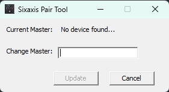
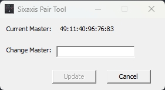
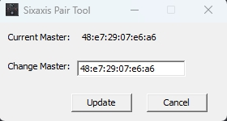

# ESP32系列连接和使用PS3蓝牙无线手柄

## 前言

该文档介绍了ESP32如何连接和使用PS3蓝牙无线手柄

PS3手柄与ESP32是通过`蓝牙`连接的，每个PS3手柄作为从机都会存储主机的蓝牙MAC地址，这是PS3唯一可以连接的设备，那么要想让PS3与ESP32连接，需要把PS3内部存储的主机蓝牙MAC地址改为对应的ESP32的蓝牙MAC地址，这样就可以自动连接了。

开始前需要准备:

- 带蓝牙的ESP32开发板

- Windows 7/10/11电脑，安装好Arduino IDE，该文档默认读者会使用Arduino IDE对ESP32进行编写和烧录程序，以及Arduino库的安装使用等基本的操作

- 一个PS3手柄和对应的数据线（不是普通的充电线），确保PS3手柄有电，可以先充电几分钟，避免测试过程中出现因供电不足而导致的各种异常现象

## 开始

### Arduino安装库: PS3 Controller Host

- `PS3 Controller Host`是Arduino官方库，使用Arduino IDE搜索并安装`PS3 Controller Host`，该库的相关介绍可以参考官网：<https://www.arduino.cc/reference/en/libraries/ps3-controller-host/>

### 获取ESP32的蓝牙MAC地址

运行`PS3 Controller Host`示例代码进行获取：**Arduino IDE -> 文件 -> 示例 -> PS3 Controller Host -> Ps3Address**

代码运行在ESP32上成功运行后，串口会打印如下信息：

```text
The ESP32's Bluetooth MAC address is: 48:e7:29:07:e6:a6
```

其中`48:e7:29:07:e6:a6`就是EPS32的蓝牙MAC地址，这个地址每个ESP32都不一样，请获取需要连接的ESP32的地址

### 修改PS3的主机蓝牙MAC地址

- 下载SixaxisPairTool：这里需要使用到`windows`上的`SixaxisPairTool`工具，百度云下载链接: <https://pan.baidu.com/s/1MNYyiMgxkkbVIvxGv445Cg> 提取码: `ihyh`

- 安装SixaxisPairTool：双击点开`SixaxisPairToolSetup-0.3.1.exe` -> 点击Next -> 选择安装位置：默认为`C:\Program Files (x86)\SixaxisPairTool` -> 点击Next -> 点击Install，等待安装完成，点击finish

- 运行SixaxisPairTool：进入到SixaxisPairTool的安装位置，默认为`C:\Program Files (x86)\SixaxisPairTool`，找到`SixaxisPairTool.exe`双击运行，会显示如下`No device found...`界面

  

- 将PS3使用数据线（不是普通的充电线）连接到电脑，最好不要经扩展坞等其他设备，而是用数据线直连电脑USB口，以免电脑无法识别，连接后SixaxisPairTool会显示当前PS3存储的主机蓝牙MAC地址，如下图所示：
  
  

- 修改主机蓝牙MAC地址

  将之前读取的主机蓝牙MAC地址`48:e7:29:07:e6:a6`复制到`SixaxisPairTool`的`Change Master`输入框，然后点击`Update`，修改成功后`Current Master`会显示你设置的地址，如下图所示：

  

### 连接测试

#### 运行ESP32示例代码

Arduino IDE打开`PS3 Controller Host`的**连接**示例代码：**Arduino IDE -> 文件 -> 示例 -> PS3 Controller Host -> Ps3Connect**

**注意**，这里需要修改测试代码，把`setup`函数中`Ps3.begin("01:02:03:04:05:06");`修改为`Ps3.begin();`，如下：

```c++
Ps3.begin("01:02:03:04:05:06");
```

改为

```c++
Ps3.begin();
```

保存后编译烧录，烧录完成按下板子复位键进行复位，运行成功后串口（示例代码中设置的串口波特率为115200）会有如下打印：

```text
Ready.
```

#### 连接

- 将PS3手柄与电脑断开连接，不要插数据线

- 长按手柄中间`PS3`按键，直至手柄的**4个指示灯**同时**闪烁**，然后放开`PS3`按键

- 等待手柄自行搜索ESP32主机并连接，连接成功后，1号指示灯会常亮。

- ESP32串口会循环打印Connected，这样就代表连接成功，如下所示：

```text
Connected
```

### 按键测试

PS3的按键摇杆等测试，请自行运行和学习`PS3 Controller Host`的测试代码

- 测试手柄右边4个按键的测试代码：**Arduino IDE -> 文件 -> 示例 -> PS3 Controller Host -> Ps3Data**

- 测试手柄所有按键的测试代码：**Arduino IDE -> 文件 -> 示例 -> PS3 Controller Host -> Ps3Demo**

  **注意**，运行这些测试代码，都需要将`setup`函数中`Ps3.begin("01:02:03:04:05:06");`修改为`Ps3.begin();`，如下所示：

```c++
Ps3.begin("01:02:03:04:05:06");
```

  改为

```c++
Ps3.begin();
```

- `PS3 Controller Host`是Arduino官方库，其他`PS3 Controller Host`的相关知识请自行搜索学习

## FAQ

**Q** 连接成功后手柄有时候会自动断开

**A** 请先将手柄插上数据线和电源进行充电，充电几分钟后再进行测试，有时候手柄没电了会有这种现象
