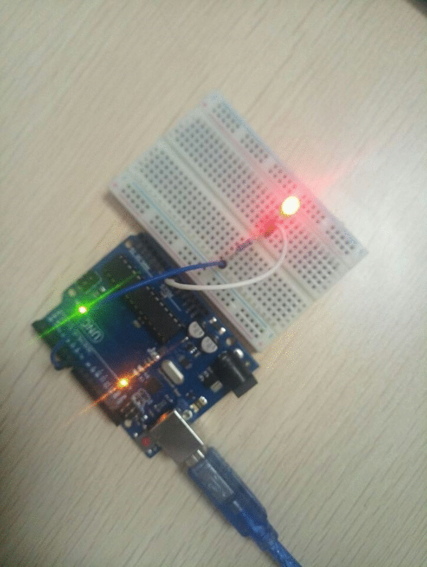
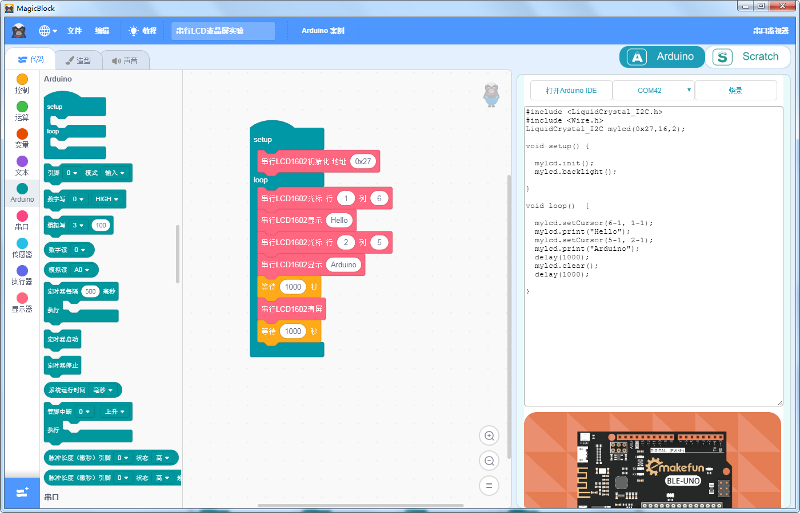

- # MagicBlock教程

  
## 走近MagicBlock

  
### 什么是MagicBlock？ 

**MagicBlock是深圳市易创空间科技有限公司出品的一款基于Scratch3.0的图形化编程软件，它在Scratch3.0的基础上增加了各种开源硬件的图形化编程方法，通过图形块的搭建为电子硬件编写程序，展现创意，是一款可以让青少年学习编程，快速入门编程的软件。**

  
### MagicBlock的优势有哪些？

**MagicBlock是在麻省理工大学2019年发布的Scratch3.0基础上扩展开发出的图形化编程软件，它和Scratch2.0相比，UI上面优化了很多，色彩种类增加，各区域划分整洁，操作上更加方便快捷，用户体验更好，和源生Scratch3.0相比，MagicBlock又增加了电子模块的图形扩展，并且在为电子硬件编程时可以在代码区实时看到代码的生成，这对青少年的学习编程思想和入门编程有很大的帮助。**

  
### 使用MagicBlock进行图形化编程好处

  - 快速入门编程，提高编程思想，为编程学习奠定坚实基础

**在这个互联网的时代里，编程的重要性已经成为越来越多的国际意识的主题，编程初学者在使用MagicBlock时几乎不需要懂得如何用复杂的代码去实现程序，只需要通过拖动积木块就可以自己编写出一个程序，可以很块地入门编程，而且通过一次次的尝试，可以培养编程的逻辑思维能力，再通过图形块与代码之间的联系，学会编程的思想，即使编程语言多种多样，只要学会了编程的思想，无论学习什么编程语言，都能够融会贯通。**

  - 激发创造力，展现多彩人生

**在MagicBlock图形化编程的世界里，编程初学者可以自由发挥想象力，在一点一滴学习编程的过程中获得编程乐趣，创客们通过自己动手为心爱的机器人编写各种各样天马行空，创意无限的程序，在获取编程知识的同时也获得了成就感和满足感，让生活更加多姿多彩。**

  
## MagicBlock安装

### 下载地址
**浏览器输入www.emakefun.com 进入易创空间科技有限公司官网，在图形化编程区域找到MagicBlock，点击“立即下载”即可。**

  .jpg)

### 安装MgicBlock
**下载后双击图标进行安装**

  .jpg)

**点击“下一步”**

  .jpg)

**选择目录，默认为C盘，继续点击“下一步”**

  .jpg)

### 安装完成

**双击图标打开界面**

  .jpg)

## MagicBlock界面介绍

  .jpg)

### 标签1：菜单栏

  - 语言选择
  - 导入文件，保存文件
  - 教程学习
  - 作品命名
  - 查看例子

### 标签2：积木区

  - 所有的图形块
  - 用于切换工作区栏目
  - 添加扩展

### 标签3 ：编程区

  - 将积木区的图形块拖拽到这里
  - 编程区的图形可以生成对应的Arduino C++代码到代码区

### 标签4：舞台区（Scratch模式下）/代码区（Arduino模式下）

  - Scratch模式下通过编程区的图形块控制卡通人物
  - 可以通过Annie添加卡通人物和背景图
  - Arduino模式下编程区的图形生成对应的Arduino C++代码到这里面

### 标签5：控制区

  - 控制卡通人物一些动作

## 在Arduino模式下为开发板上传第一个程序：点亮LED灯

### 选择模式

  **首先，我们点击右上角的Arduino按钮，将模式切换为Arduino模式，在Arduino模式下，我们就可以通过usb线连接电脑和Arduino开发板，然后用MagicBlock的图形块写一个点亮LED灯的程序上传到板子上**

  .jpg)

### 图形块说明

  - 控制类图形块

    控制类里面是一些用来控制程序的执行顺序的图形块，如“等待”图形块，用来让程序延时执行，比如我们想让LED灯亮1秒钟，就需要这个图形块，“重复执行”图形块是用来让程序循环执行的，可以规定让程序循环执行的次数，“如果，否则”图形块是用来判断一个表达式的正确与否来让程序是否执行

  .jpg)

  .jpg)

  .jpg)

  - 运算类图形块

    运算类里面是一些用来数学的加、减、乘、除和大小判断以及与、或、真、假的逻辑判断的图形块

  .jpg)

  - 变量类图形块

    变量类里面是一些用来创建全局或局部变量和设置变量值，取变量值，数字的最大值，最小值，余数，随机数，四舍五入的图形块

    .jpg)

    .jpg)

  - 文本类图形块

    文本类里面是一些有关类型转换和操作字符串的图形块

    .jpg)

  - Arduino类、串口类、传感器类、执行器类、显示器类图形块：这五类图形块都属于Arduino图形块，是我们为Arduino板写程序用到的主要图形块

    .jpg)

    .jpg)

    .jpg)
    
    .jpg)
    
    .jpg)
	
    .jpg)
	
    .jpg)
    
    setup和loop图形块是Arduino程序最主要的程序，每个Arduino程序都需要用到这个图形块，其中setup里面执行的是初始化程序，这些程序在整个Arduino程序里只执行一次，而loop里面的程序是无限循环执行的程序，比如我们要写一个LED一直亮的程序，我们就需要先拖拽出setup/loop图形块，然后给LED灯的引脚（假设为7引脚）初始化，那么初始化程序pinMode(7,OUTPUT);（设置7号引脚的模式为输出）就需要放进setup里面，而让LED亮的程序digitalWrite(7,HIGH);（给7号引脚高电平）就要放在loop里面，也就是让它无限循环执行从而达到一直亮着的状态
    
    .jpg)
    
    
       Arduino程序常用的程序有设置引脚模式 pinMode(0,INPUT);.jpg)

       给引脚设置高电平或低电平 digitalWrite(0,HIGH);.jpg)

       将一个模拟数值写入PWM引脚 analogWrite(3,100);.jpg)

       读取引脚的电平状态是高还是低 digitalRead(0);.jpg)

       读取引脚的模拟量电压值 analogRead(A0); .jpg)

       串口常用的程序有设置串口波特率 Serial.begin(9600);.jpg)

       串口打印 Serial.print(); .jpg)

       判断串口是否有数据 Serial.available>0 .jpg)

       串口读取数据 Serial.read(); .jpg)

  
### 用MagicBlock编写点亮LED灯程序

**了解了Arduino图形块的用法，我们现在可以编写一个让LED灯亮的程序了，我们让7号引脚的LED灯每隔1秒亮2秒，程序可以这么写**

  .jpg)

**在代码区，我们可以看到图形块程序对应的Arduino代码**

  .jpg)

### 上传程序

**编写好程序后，我们需要用usb线将电脑和Arduino板连接，然后在代码区点击“请选择串口”，这里会出现一个COM串口号，点击连接，然后点击右边的烧录按钮，程序就开始往板子里烧录了，大概需要十几秒的时间**

  .jpg)

**烧录成功界面会弹出提示框“finish”，点击“确定”即可**

  .jpg)

### 实验效果

**我们上传完程序，接好LED线后，给Arduino板通上电，就可以看到LED灯的实验效果了，可以看到LED灯会按照我们用MagicBlock编写上传的程序那样，每隔一秒钟就点亮两秒钟，一直循环**

  
  
## 串口监视器，打开示例与导入导出功能

### 串口监视器功能
  **MagicBlock配备有串口监视器功能，通过观察串口监视器的输入输出来获取程序的实时反馈，这对Arduino的程序编写非常有意义，比如我们编写一个串口打印字符串的程序，我们上传好程序后就可以直接打开串口监视器通过观察串口的打印情况得到程序的反馈，现在，我们来编写这个程序**

  .jpg)

  **我们在初始化里面需要设置串口波特率，常用的波特率有9600，8400，15200等，然后在loop（循环函数）里面让串口每隔一秒换行打印一段“Hello Arduino ！” 写好程序后上传到Arduino板子上，然后点击MagicBlock软件界面右上角的“串口监视器”，就能看到串口监视器在一秒一秒地打印“Hello Arduino ！”了**

  .jpg)

****

### 打开示例程序

**MagicBlock中有很多与Arduino相关的图形化程序供我们学习参考，在Arduino模式下，菜单栏有一个“Arduino案例”按钮，点击它就会出现这些示例程序**

  .jpg)

**这些实验分为了四类，分别是基础实验，传感器实验，综合实验和扩展实验**

  .jpg)

**比如我们想学习串行LCD1602液晶显示屏的程序就可以点击打开这个示例程序做参考**

  

**接着我们还是按照Arduino模式的上传流程，把这个程序上传到Arduino板子上，再按照产品说明书接好线，当然，你也可以先接线再写程序上传，下面是实验效果**
  
  
  
### 保存程序

**当你自己完成一个实验程序后，你可以给它起一个名字，在菜单栏中间的空格内输入你的实验名字，比如“我的第一个LED灯实验”**

  .jpg)

**你可以把这个MagicBlock程序导出到本地保存，点击菜单栏的“文件”，点击“保存到电脑”，然后选择一个路径保存，它是一个.sb3格式的文件**
 
  .jpg)
 
### 导入MagicBlock程序文件

**当我们想随时打开之前做的MagicBlock实验程序或想要参考其他人做好的程序时，我们可以用MagicBlock打开这个.sb3文件，点击菜单栏的“文件”，点击“从电脑中上传”，然后从电脑中找到这个.sb文件，打开，就能看到这个程序了**