# Magic:bit四合一战车

## Magic:car简介
Macgic:car积木小车是一款针对microbit图形化编程设计的，主控是microbit主板，扩展板采用的是功能丰富的Magicbit扩展板，拥有强大的扩展性。扩展板设计有8个PIN引脚接口、8个PWM舵机引脚接口、四个直流电机接口，两个步进电机接口、一个RGB超声波接口、一个I2C接口，并且含有一个无源蜂鸣器和红外接收模块。在编程方面，配备有相应的软件包，采用micro bit拖拽式图形化编程，积木式操作，入门更加简单。
Magic:car积木小车具有四种拼装形态，可以拼装成铁爪车、重锤车、叉车、铲斗车。

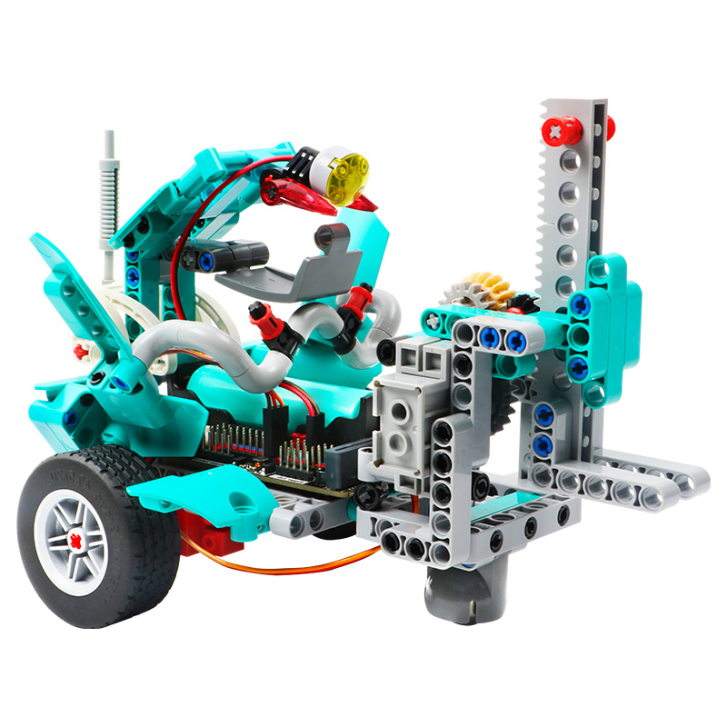
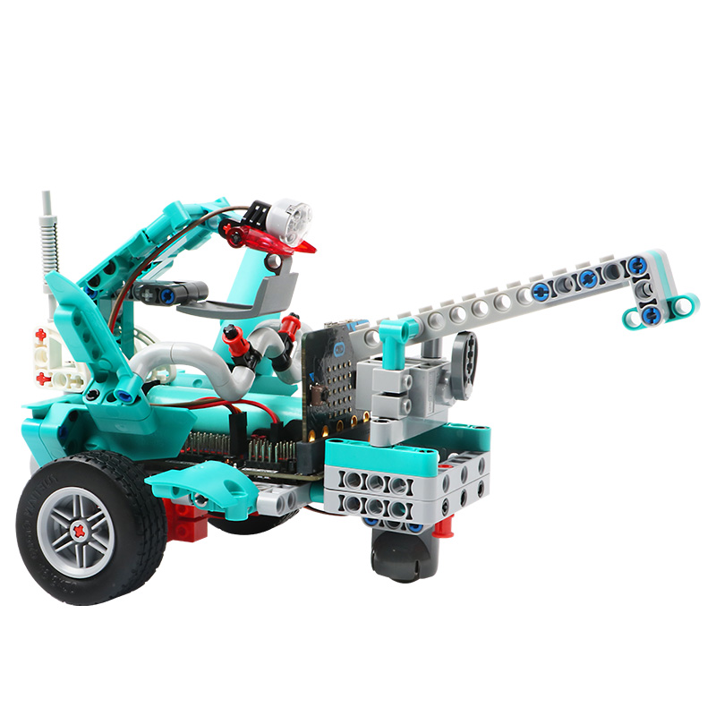
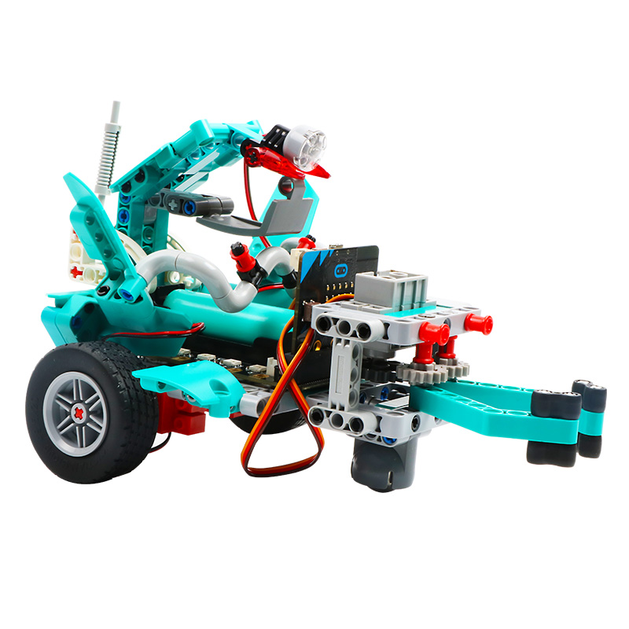
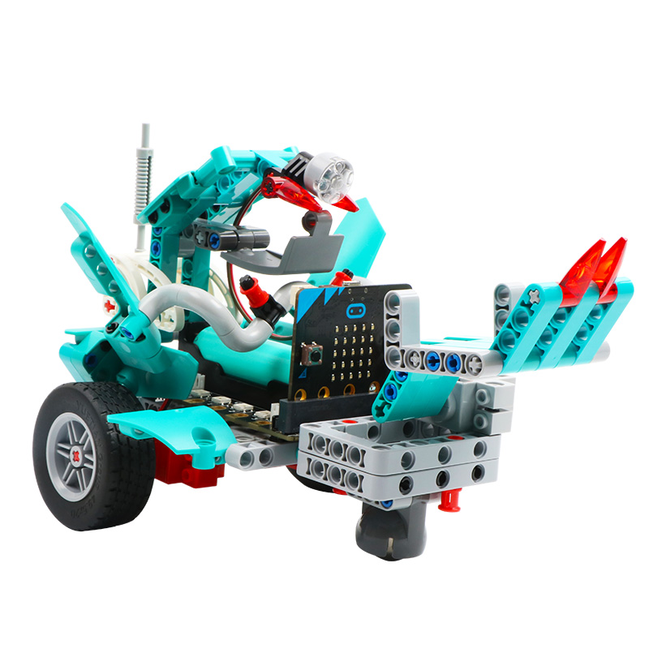

小车含有两个兼容乐高孔的直流电机、一个兼容乐高孔的PWM舵机、一个可编程车大灯，小车整体结构设计稳固，拼装教程详细丰富、造型百变，玩法多样，充分锻炼孩子的动手能力和创新思维。

## Magic:car参数

主控：microbit
扩展板：Magic:bit
编程软件：Makecode
输入方式：按键、蓝牙、红外、广播
通讯方式：usb数据线、蓝牙传输
编程语言：Microbit图形化编程
组装后重量：292g（带电池）
供电方式：18650锂电池供电或USB数据线供电
充电方式：USB数据线充电
轮子直径：50mm
长/宽/高：21cm/15cm/13.5cm
底盘：兼容乐高孔的高质量积木

## Magic:car组装

Magic:car 积木小车配套有详细丰富的图文组装教程，在组装使用过程中、可以在老师指导或者家长的陪同下进行组装。
叉车部分组装图

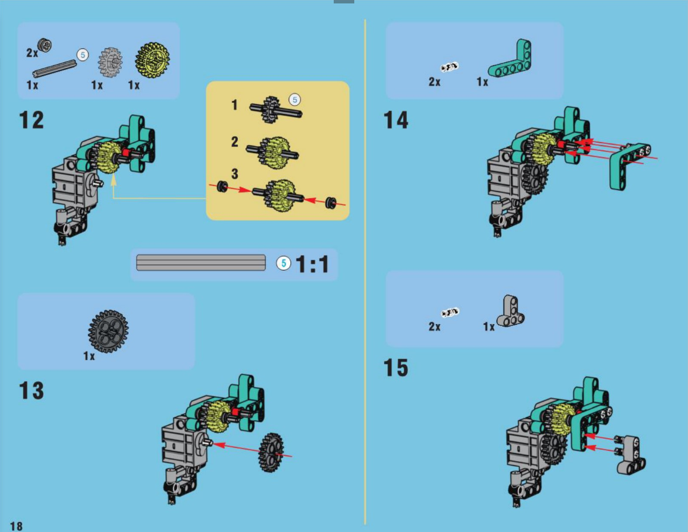

重锤车部分组装图

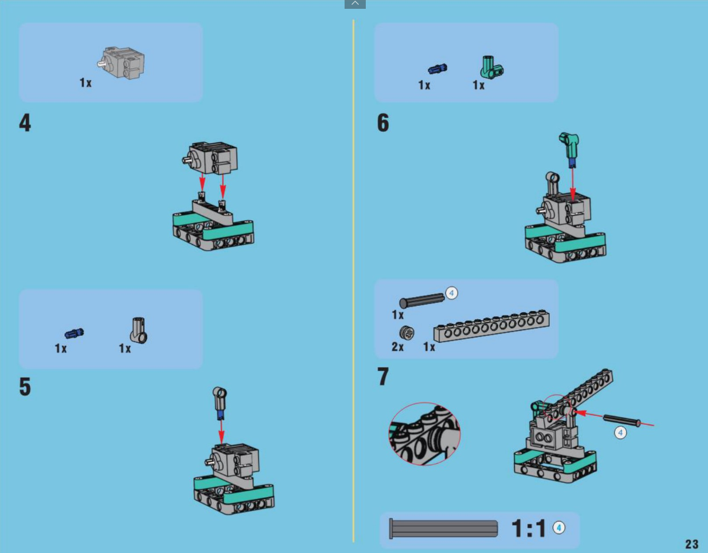

铁爪车部分组装图

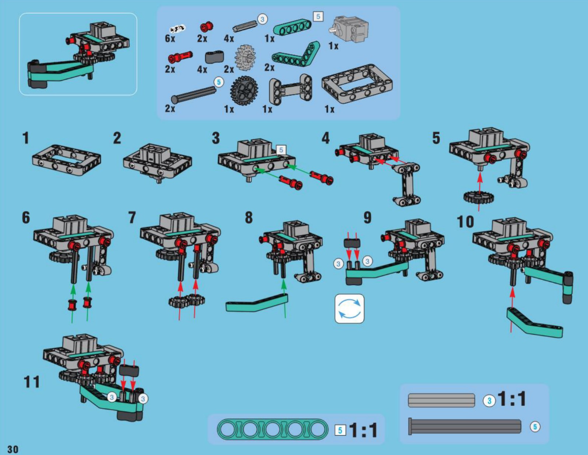

铲斗车部分组装图

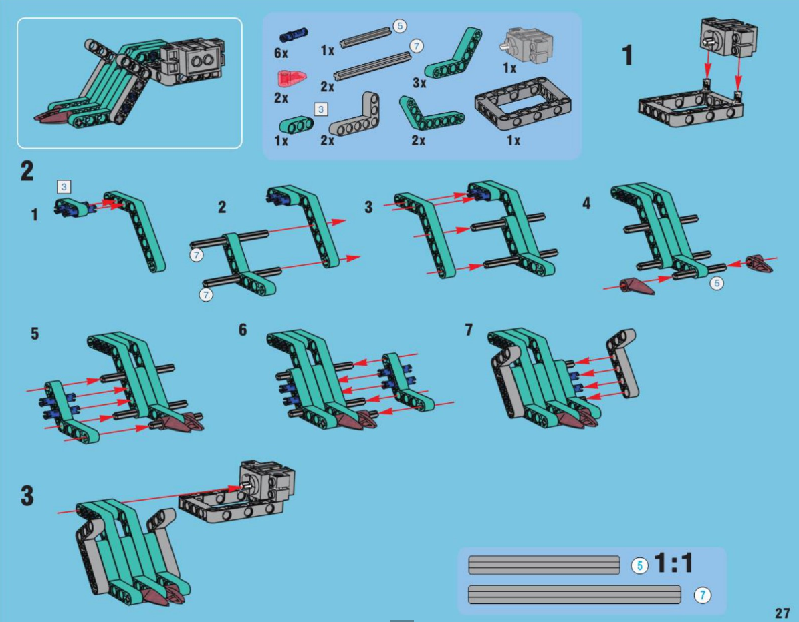

## Magic:car接线

Magic:car 积木小车接线简单方便，车载的电机、舵机、车大灯都有相应配套接线口。

Magic:car 积木小车含有两个直流电机，电机接口采用防反插设计，在安装过程中需要注意电机的方向，小车左边的电机连接在扩展板的M4接口；小车右边的电机连接在扩展板的M1接口
Magic:car 积木小车含有一个PWM舵机，舵机的黄色线接在扩展板S1的蓝色引脚；舵机的红色线接在扩展板S1的红色引脚；舵机的棕色线接在扩展板S1的黑色引脚，在具体的使用过程中，可以根据程序设定，连接在扩展板相应的S引脚
Magic:car 积木小车含有一个可编程车大灯，在使用过程中，车大灯的黑色线接在扩展板蓝色IO引脚P8，红色线接在扩展板的红色3V3引脚

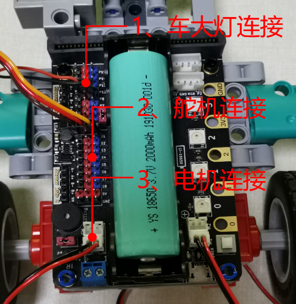

## Magic:car编程

Magic:car编程类似与scratch，采用积木式的图形化编程方式，拖拽相应的编程积木块即可进行相应的编程

编程完毕后，点击下载，直接把程序下载到小车microbit主板里，即可实现手动遥控小车或者小车自动控制功能，非常方便。

## Magic:car遥控

### 遥控器遥控
Magic:car扩展板设计有红外接收头，无需外接红外接收即可实现红外遥控的功能，并且Magic:car软件包对红外遥控设计有专用的红外编程积木，在使用红外遥控功能时，直接调用相应的程序积木
即可实现红外遥控功能

### 主板遥控
microbit主板之间可以通过无线广播的方式来进行通信，编写相应的程序积木组合或者使用例程实验程序积木组合，可以使用一个通电的主板来控制Magic:car做出相应的动作

主板发送例程程序

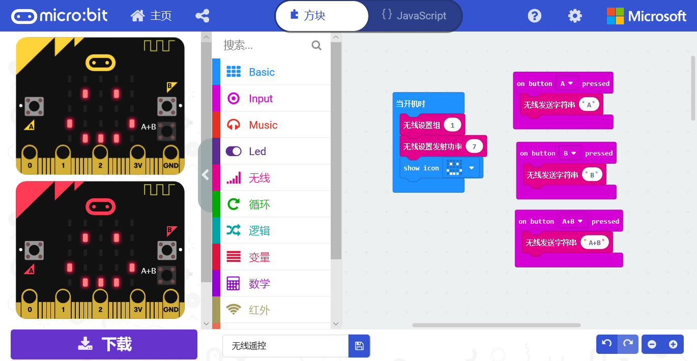

主板接收例程程序

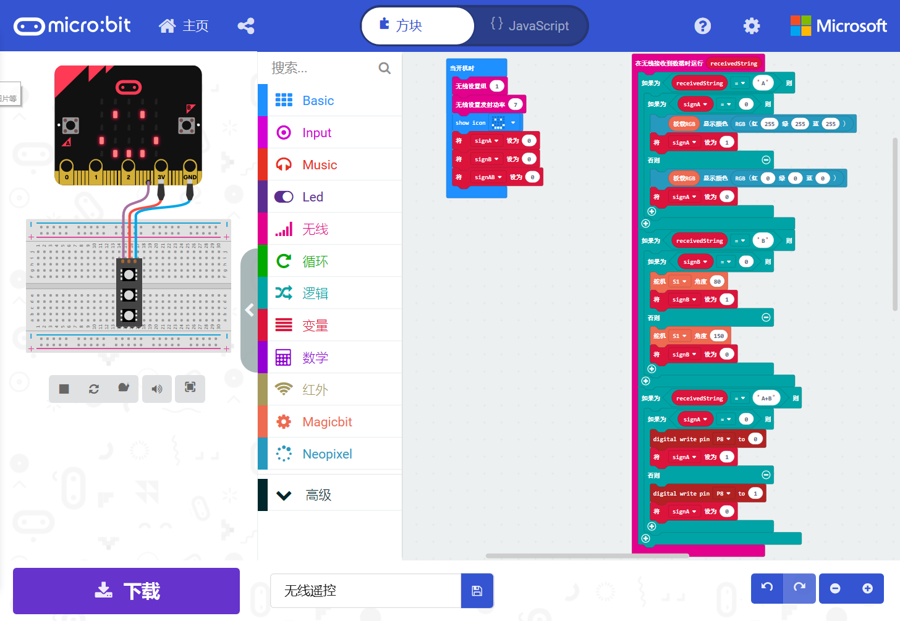

### APP遥控
Magic:car有配套的IOS和安卓APP，APP与Magic:car之间通过蓝牙进行通信，把例程实验的APP遥控程序下载到microbit，打开APP进行蓝牙连接，即可控制Magic:car实现遥控

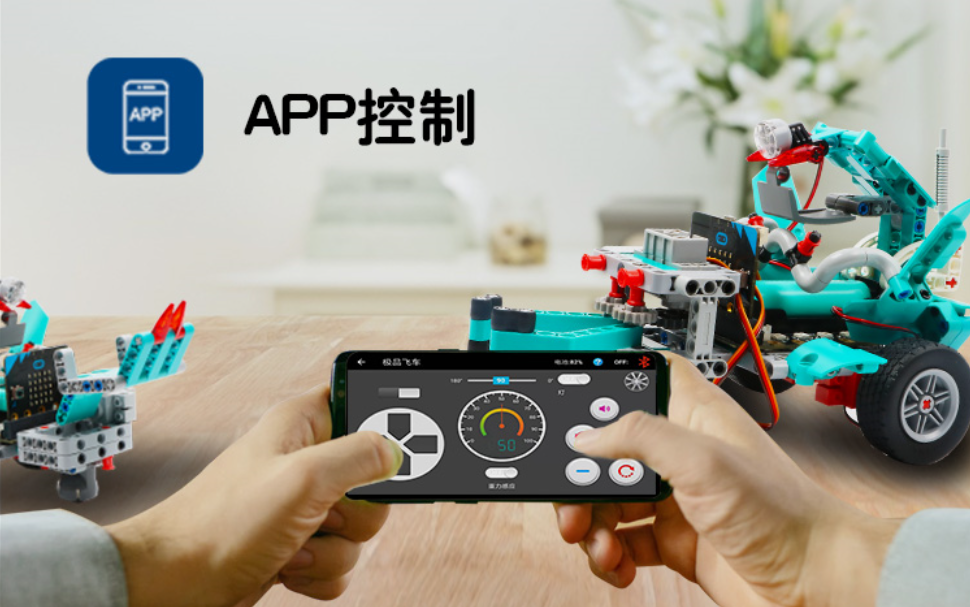

## 购买链接
点击链接进入淘宝购买——>>[MagicCar](https://item.taobao.com/item.htm?spm=a1z10.1-c-s.w5003-21606389903.3.1e592f14lQBdHt&id=606910654375&scene=taobao_shop)

