# Magic:bit小麦战车

## 战车简介

Magic:bit小麦小车是一款基于microbit的全向移动积木类小车，使用功能强大的Magicbit扩展板通过microbit来控制。与传统小车相比，Magic:bit小麦战车可以左右平移运动、斜向45°运动、漂移运动等。Magic:bit小麦战车车载两个可编程多彩车大灯，可以通过程序积木来控制车大灯。并且Magic:bit 小麦战车板载有4个RGB彩灯，也可以外接RGB彩灯，然后通过程序控制显示任意色彩；一个红外接收头，可以通过红外遥控器实验无线红外遥控功能，并且对于红外遥控设计有专用的程序积木包，让红外遥控更加方便；一个板载无源蜂鸣器，可以使用音乐程序积木播放歌曲，也可以编写属于自己的音乐。

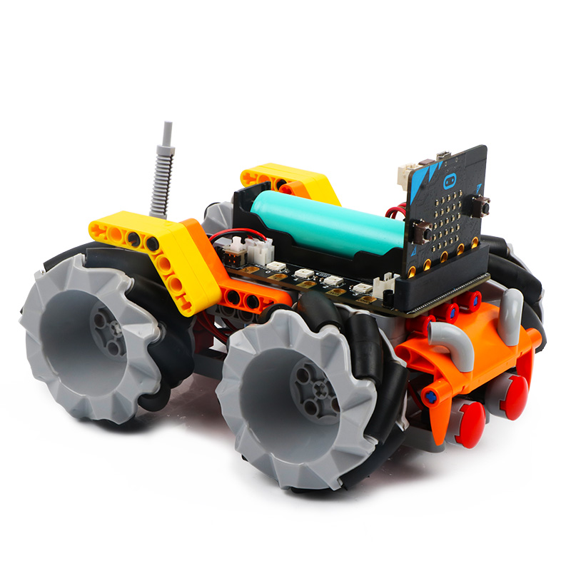

## 战车参数

- 主控：microbit
- 扩展板：magicbit
- 编程软件：Makecode
- 输入方式：按键，蓝牙，红外
- 编程语言：Microbit图形化编程
- 电机：兼容乐高孔塑料外壳直流电机
- 舵机：兼容乐高孔塑料外壳PWM舵机
- 车大灯：兼容乐高孔LED灯积木模块
- 遥控方式：红外遥控，APP蓝牙遥控，主板无线遥控
- 组装后重量：410g（带电池）
- 轮子直径：65mm
- 长/宽/高：16.5cm/12.5cm/11cm
- 小车底盘：高质量兼容乐高孔积木
- 供电方式：18650锂电池或USB数据线供电
- 充电方式：USB数据线充电

## 战车组装

Magic:bit小麦战车组装简单，并且小麦战车配套有详细的组装视频教程，孩子可以在老师或者家长的陪同下实现组装，是一项提高孩子动手能力和结构思维的亲子互动过程。
因麦克纳姆轮的特殊性，在组装过程中，需要特别麦克纳姆轮的安装方向，从而实现全向移动。同时，如果使用例程实验，也需要注意电机的安装方向。

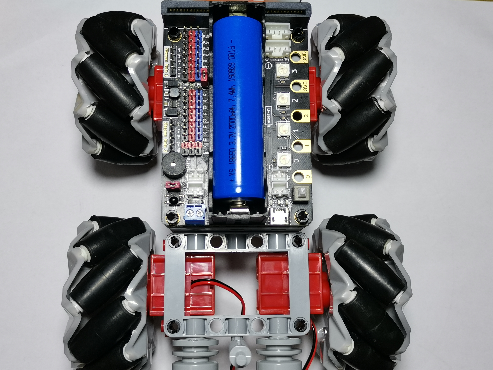

## 战车接线

### 电机接线
Magic:bit扩展板含有4个防反插直流电机接口，分别是M1、M2、M3、M4，在实际连线的过程中，左前轮的电机连接在扩展板M3接口；左后轮的电机连接在扩展板M4接口；右前轮的电机连接在扩展板M2接口；右后轮电机连接在扩展板M1接口。实物接线如下图所示：

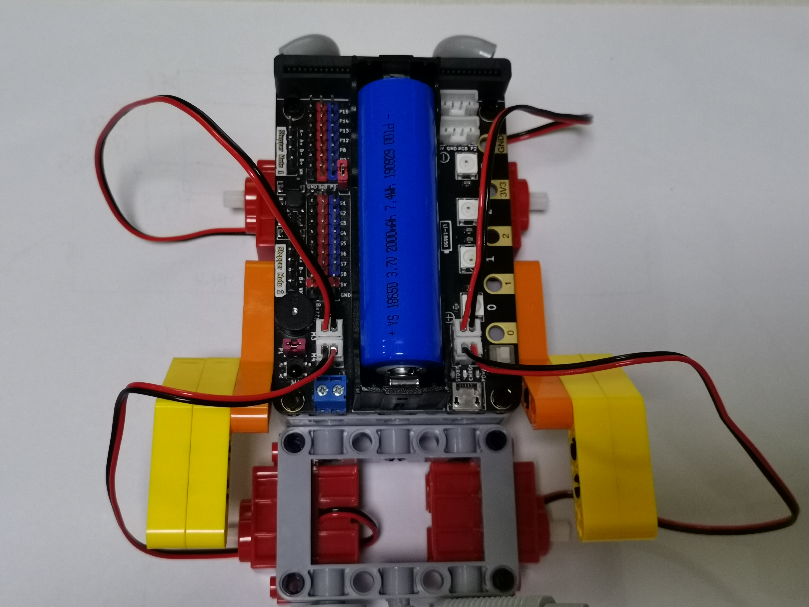

### 车大灯接线
Magic:bit扩展板含有8个IO引脚接口，分别是P0、P1、P2、P8、P12、P13、P14、P15。在实际连接车大灯的过程中，程序中选中的引脚号应与实际连接的引脚号保持一致。车大灯的红色线连接在扩展板的3v3红色引脚；车大灯的黑色线连接在扩展板的蓝色IO引脚。特别需要注意，车大灯的红色线代表LED灯的正极线；黑色线代表LED灯负极线，正负线不能连接错误，否则将造成LED灯损坏。实物接线如下图所示：

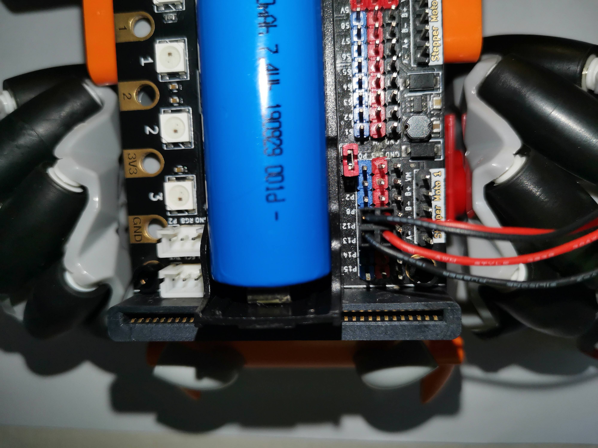

## 编程方式

Magic:car编程类似与scratch，采用积木式的图形化编程方式，拖拽相应的编程积木块即可进行相应的编程

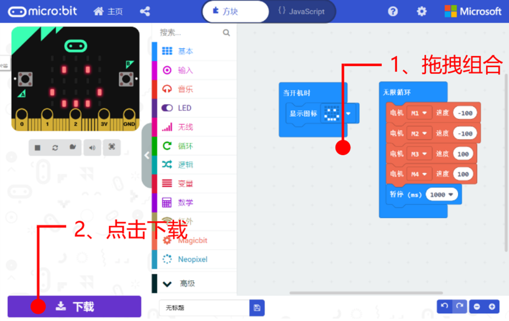

编程完毕后，点击下载，直接把程序下载到小车microbit主板里，即可实现手动遥控小车或者小车自动控制功能，非常方便。

## 战车全向移动

### 麦轮前后移动
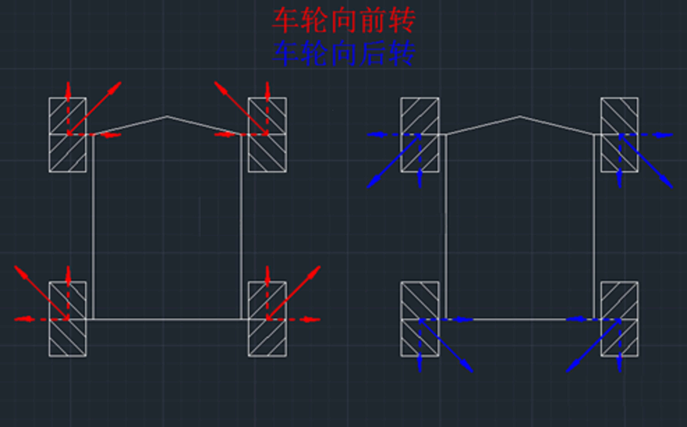
图中红色实线箭头是车轮向前转产生的摩擦力、蓝色箭头是车轮向后转产生的摩擦力、虚线是分力、通过虚线力的相互抵消和增强，于是左边的小车就会向前跑，右边的小车会向后跑

### 麦轮左右移动

图中红色实线箭头是车轮向前转产生的摩擦力、蓝色实线箭头是车轮向后转产生的摩擦力、虚线是分力、通过虚线力的相互抵消和增强，于是左边的小车就会向左移，右边的小车会向右移

### 麦轮斜向45°移动

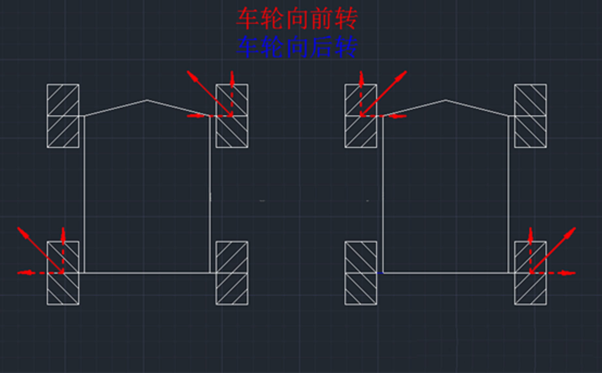
图中红色实线箭头是车轮向前转产生的摩擦力、虚线是分力、通过虚线力的相互抵消和增强，于是左边的小车就会向左上45°移动，右边的小车会向右上45°移动

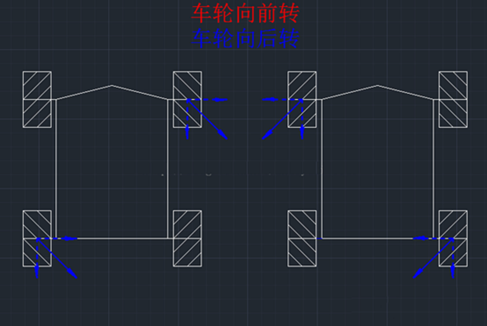
蓝色实线箭头是车轮向后转产生的摩擦力、虚线是分力、通过虚线力的相互抵消和增强，于是左边的小车就会向右下45°移动，右边的小车会向左下45°移动

### 麦轮原地旋转

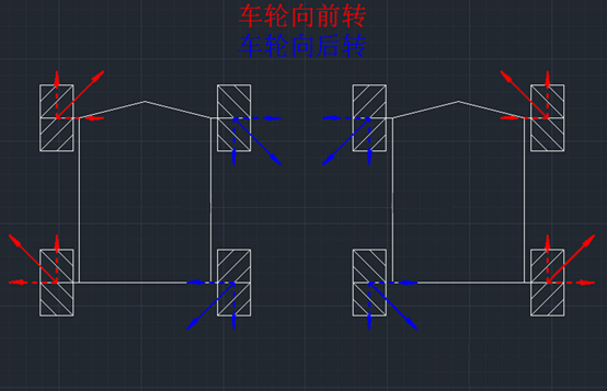
图中红色实线箭头是车轮向前转产生的摩擦力、蓝色实线箭头是车轮向后转产生的摩擦力、虚线是分力、通过虚线力的相互抵消和增强，于是左边的小车就会向右旋移动，右边的小车会向左旋移动

### 麦轮漂移运动

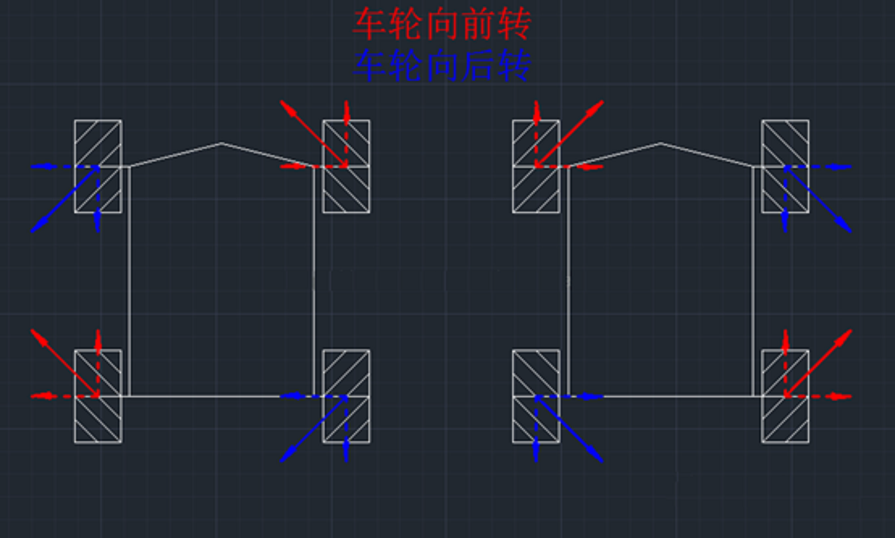
图中红色实线箭头是车轮向前转产生的摩擦力、蓝色实线箭头是车轮向后转产生的摩擦力、虚线是分力、上下方向的虚线代表的力相互抵消，左右方向的虚线代表的力相互增强，当两个前轮在左右方向的合力小于或大于两个后轮在左右方向的合力时，小车就会前漂移或者后漂移，前后轮的合力差别不同，漂移的程度不同。

## 战车控制方式

### 红外遥控器控制

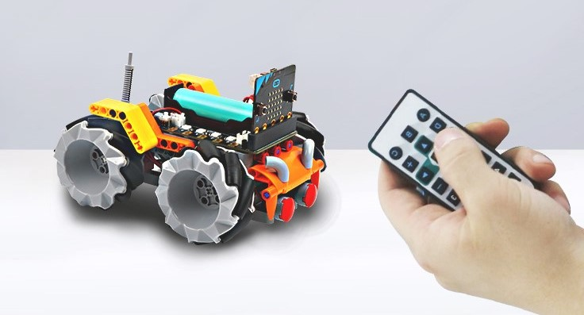
Magic:bit小麦战车的扩展板设计有红外接收头，无需外接红外接收即可实现红外遥控的功能，并且Magic:bit小麦战车软件包对红外遥控设计有专用的红外编程积木，在使用红外遥控功能时，直接调用相应的程序积木 即可实现红外遥控功能

### APP遥控

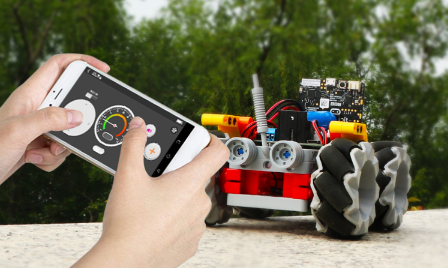
Magic:bit小麦战车有配套的IOS和安卓APP，APP与Magic:bit小麦战车之间通过蓝牙进行通信，把例程实验的APP遥控程序下载到microbit，打开APP进行蓝牙连接，即可控制Magic:bit小麦战车实现遥控

## 购买链接

点击链接进入淘宝购买——>>[Magicbit小麦战车](https://emakefun-steam.taobao.com/index.htm?spm=2013.1.w5002-22376313165.2.3ad211214BSqqg)
