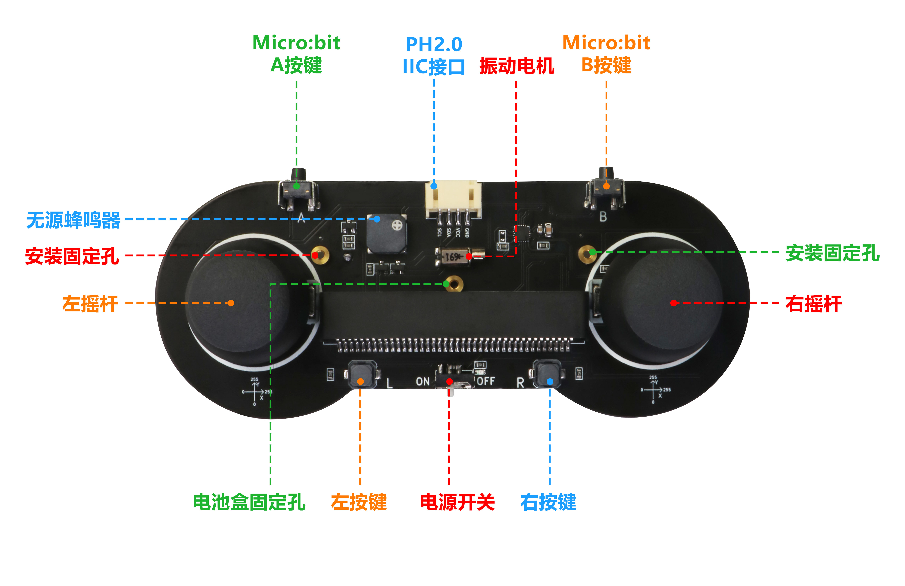
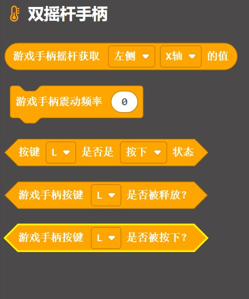
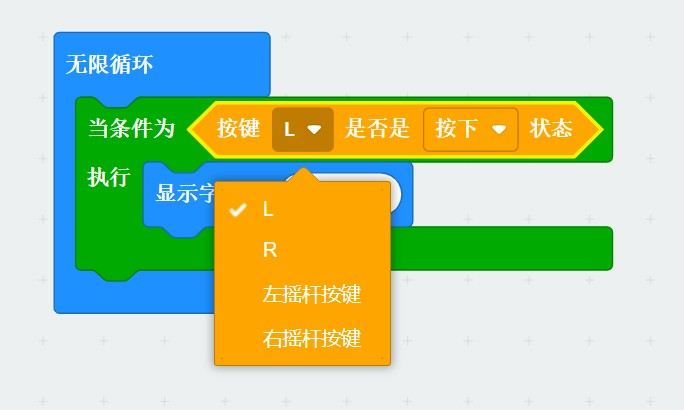
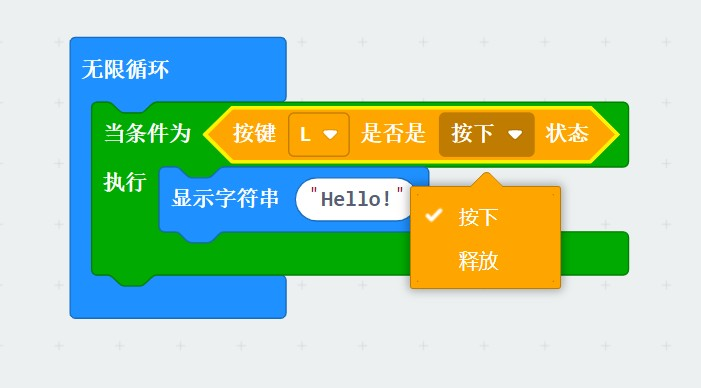
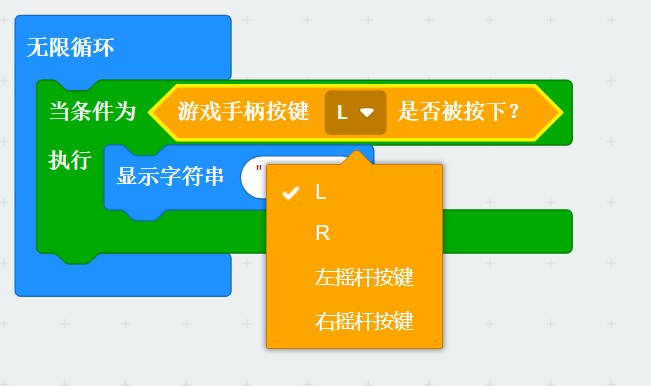
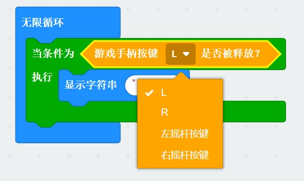
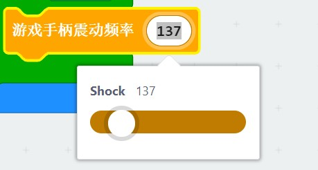
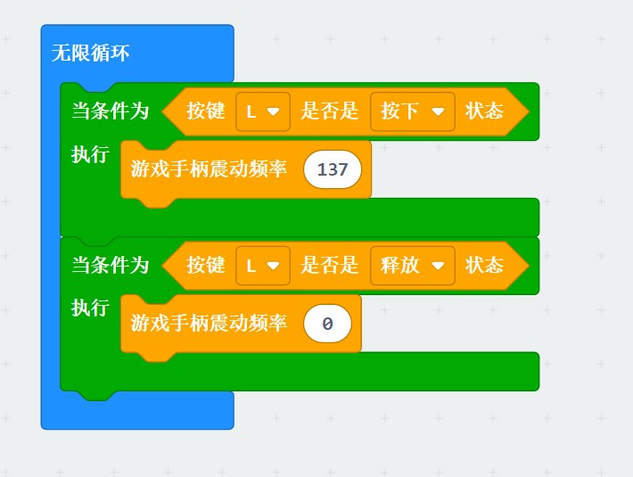
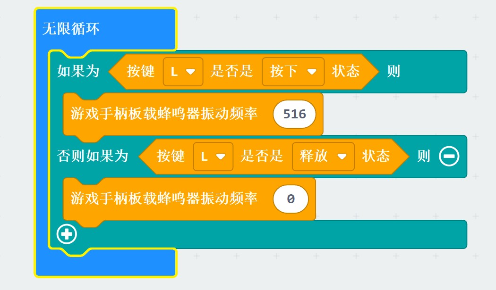

# Joystick:Bit
[English](README.md) 中文版

Joystick:Bit为   [深圳市易创空间科技有限公司](www.emakefun.com)出品的针对micro:bit开发的无线可编程手柄，支持micro:Bit V1、 V2; **MakeCode导入链接为**: **https://github.com/emakefun/pxt-joystickbit**

## 特点

- 左右双摇杆

- 手柄扩展Micro:Bit A，B按键

- 左右可独立编程按键

- 板子蜂鸣器和震动电机

- 2节7号电池供电

- 1个PH2.0-4Pin i2c接口 

  

## 图像化编程块说明
   - 《游戏手柄摇杆获取 左/右侧 x/y轴 的值》:该模块用于获取手柄左或者右摇杆x轴或者y轴方向的坐标值，其获取的值为数值类型，其值可以通过‘显示数字’模块显示在Micro:Bit板上
   - 《游戏手柄震动频率 （）》 :该模块用于调试游戏手柄上震动电机的震动频率，其值为0时震动电机停止震动。
   - 《按键 L/R/左摇杆按键/右摇杆按键 是否是 按下/释放 状态》 :该模块用于判断游戏手柄左右按键和摇杆中心按键是否按下或者释放，是返回ture,否返回false，作用于判断模块（如果...则执行...）
   - 《游戏手柄按键 L/R/左摇杆按键/右摇杆按键 是否被按下》 :该模块用于判断手柄上按钮是否按下，是返回ture,否返回false。
   - 《游戏手柄按键 L/R/左摇杆按键/右摇杆按键 是否被释放》 :该模块用于判断手柄按键是否未按住，是返回ture,否返回false。

   

   - 下面的组合模块的含义:
     - 模块代码成功下载到Micro:Bit上后，Micro:Bit的LED显示屏显示数字爱心，之后持续获取并显示左侧摇杆的x轴坐标。当按下L键时，振动电机以500HZ的频率开始震动，当释放按钮L时，振动电机停止震动。当按下R键时，板载蜂鸣器以500HZ的频率开始工作，当释放按钮R时，板载蜂鸣器停止工作。

   

### 摇杆图形化块

- 获取游戏手柄摇杆x/y轴值（获取左/右侧x/y轴的值并将其数值通过LED显示屏显示出来）

   

   

### 独立按键编程图形块

- 按键 L/R/左摇杆按键/右摇杆按键 是否是 按下/释放 状态
- 下面模块是对按键状态进行一个判断：当你按了按键L，则显示字符串"Hello!"

   

   

- 同理，下面两个模块也是对按键的按下或者未按进行一个判断，为真则显示字符串"Hello!"

   

   

### 震动电机编程图形块

- 游戏手柄震动频率模块可以调试震动电机的震动频率

   

- 配合按键使用: 当你按下L键时，震动电机开始工作，频率为137HZ。当你释放按键L时，震动电机停止工作。

   

### 板载蜂鸣器编程图形块

- 游戏手柄板载蜂鸣器振动频率模块可以调试板载蜂鸣器的振动频率

   

- 配合按键使用: 当你按下L键时，板载蜂鸣器开始工作，频率为516HZ，当你释放按键L时，板载蜂鸣器频率为0停止工作。

  

### python支持

(敬请期待.....)

## 开源许可
MIT
