# Microbit简介

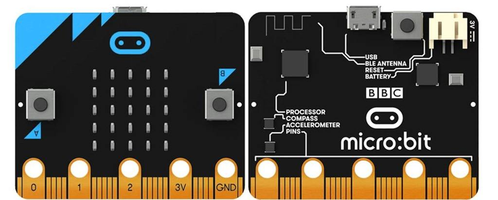

# 产品简介

Microbit 是由英国BBC公司推出的面向青少年编程教育的微型计算机，板子尺寸只有信用卡的一半大小，却集成了加速度传感器、磁力传感器、两个可编程按钮、25个单色LED、蓝牙等常用的传感器设备。Microbit使用micro usb接口供电、可外接电池盒，在主板的底部还有多个金手指引脚、方便外接控制设备。无论是机器人还是乐器，Microbit可以实现任何炫酷的小发明，你可以使用Microbit编写电子游戏、实现声光互动、做科学实验，控制小机器人，计算数学题等。
Microbit 提供了在线的编程网站，可以通过图形化或者python或者JavaScript编程语言进行在线编程，支持几乎所有的PC和移动设备。

# 适合人群

Microbit可以进行图形化编程，没有编程基础的用户也可以轻松入手。另一方面，Microbit还可以进行JavaScript和python代码编程，充分锻炼中小学生的编程思维、提高中小学生的编程能力。

# 结构介绍

长 / 宽：5x4cm
净   重：9.0g
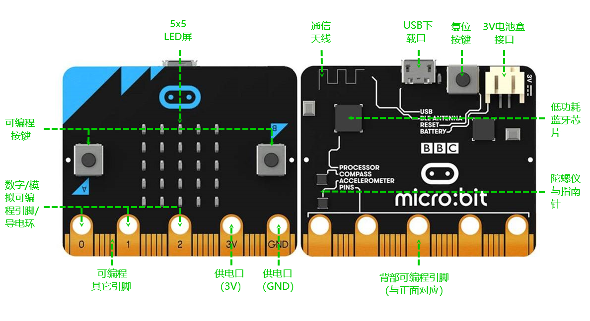

# 技术参数

- 工作电压：3V
- 输出电流：40ma
- 供电方式：micro usb 接口供电，或者使用Microbit的3V电池盒接口供电
- 程序下载：使用micro usb数据线进行程序的下载
- 引脚引出：控制引脚通过底部的金手指引出，包含一个I2C、一个SPI、串口通过IO口实现。(I2C功能引脚为19、20，这两个引脚不能作为普通IO读写，只能进行I2C通信)
- 板载器件：三轴加速度计，磁力计，3个物理按键（A/B/复位），5x5点阵屏（25个LED灯），蓝牙/2.4G通信，温度检测（蓝牙芯片内部），光线强度检测（反向二极管电流）

# 功能模块

## 可编程LED屏幕

25个红色LED灯组成5x5的点阵，可以显示各种图形，在对LED屏幕进行编程的时候，可以使用选择使用官方内置的图形库、比如各种表情包，也可以自己设计图形在屏幕上显示

## 可编程按键

Microbit 的正面有A、B两个可编程按键，在Microbit支持的编程语言中，都含有对这两个按键的控制积木或命令，可以通过程序进行三种按键状态的检测。

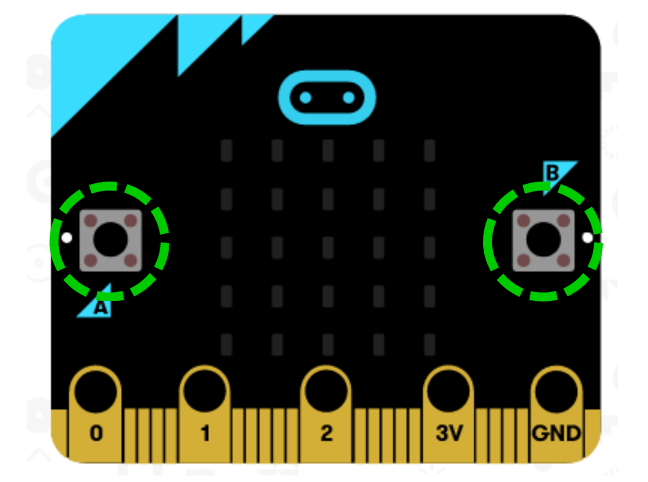

## 金手指引脚

- Microbit 主板底部的金手指，引出了Microbit支持的所有引脚，并且设计有金属环孔，可以通过鳄鱼夹或4mm香蕉插头与外部设备进行连接，从而控制舵机、电机等。
- Microbit 金手指引脚包含19个可设置GPIO、分别为：P3、P0、P4-P7、P1、P8-P12、P2、P13-P16、3V（3个）、P19-P20、GND（3个）。
- 可设置出：3个PWM输出，1对UART串行收发、1路SPI总线（P13-P15）、1路I2C总线（P19-P20）。P3、P4、P6、P7、P9、P10使用在主板的LED屏幕控制，P5、P11用来控制主板的A、B按键。

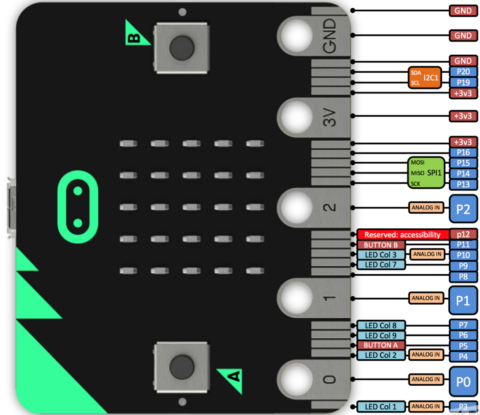

## 复位按键

Microbit 背面有一个复位按键，当需要程序重新开始运行时，按一下复位按键，下载的程序就会从头开始运行。

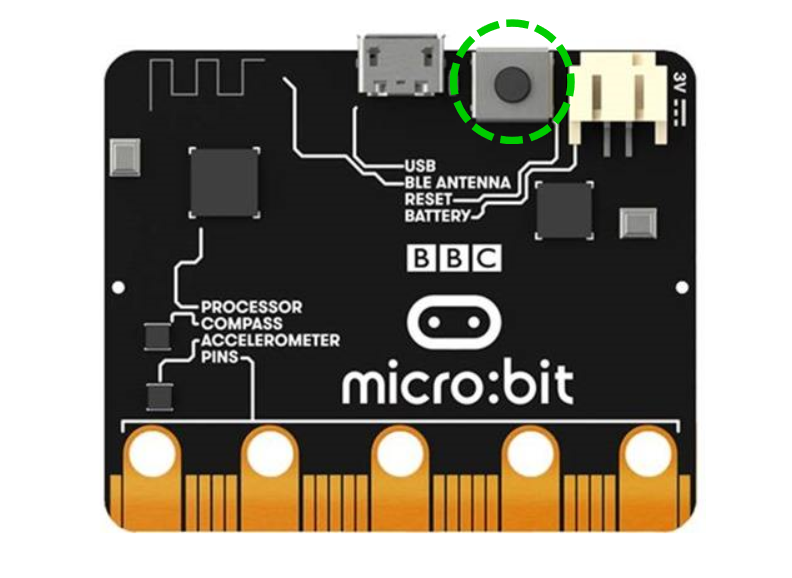

## USB接口

Microbit 背部有一个micro usb接口，主要用来下载控制程序和为主板供电。当下载程序时，micro usb接口的数据线一端连接在电脑的USB接口、另一端连接在Microbit 的usb接口。

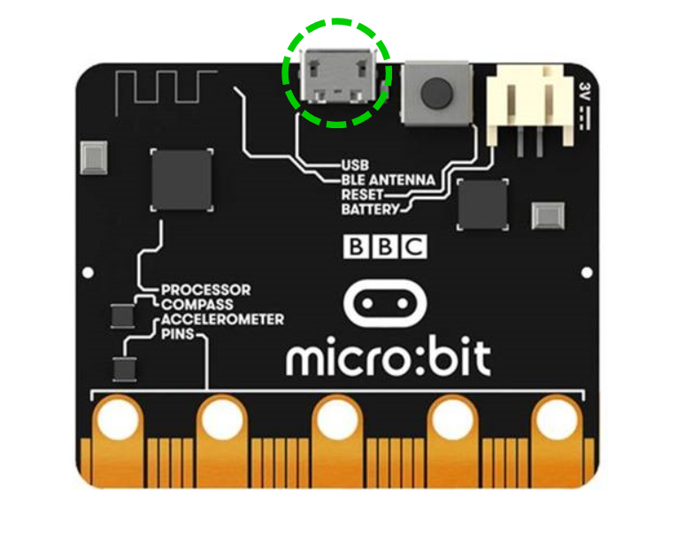

## 电池盒接口

Microbit 设计有一个电池盒接口，可以通过该接口，为Microbit 主板供电。需要注意，Microbit 主板的供电电压为3V，所以在使用电池盒接口为Microbit 供电时，电压应为3V，过高则会导致主板的损坏，过低无法驱动。

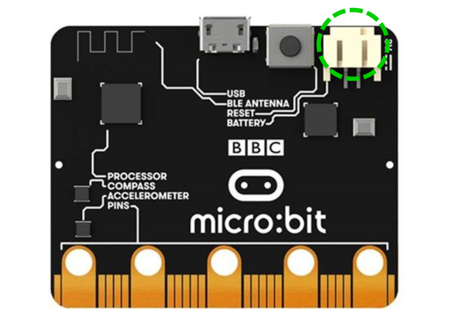

## 蓝牙通信

Microbit 设计有蓝牙通信功能，可以通过蓝牙控制Microbit，比如通过手机蓝牙信号控制Microbit 屏幕显示图案。

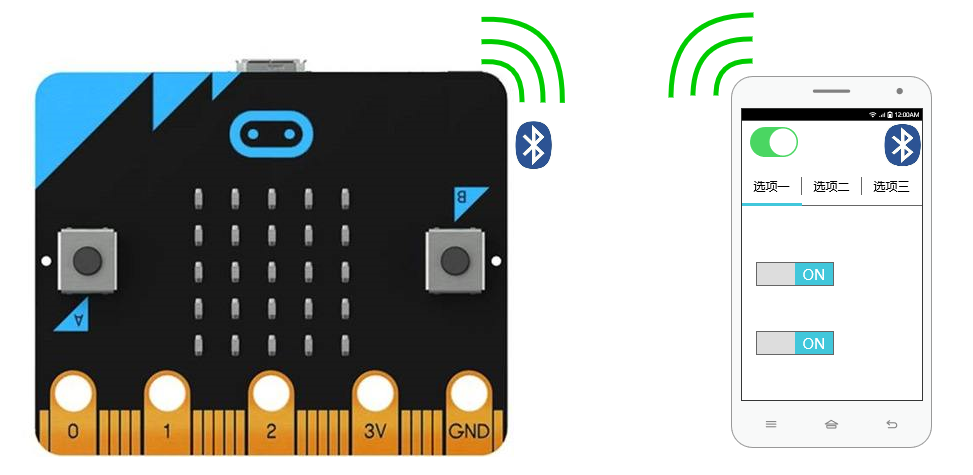

## 2.4G无线

Microbit 主板之间也可以通过2.4G无线功能进行无线通信，并且官方提供有相应的无线通信积木和命令，操作方便。

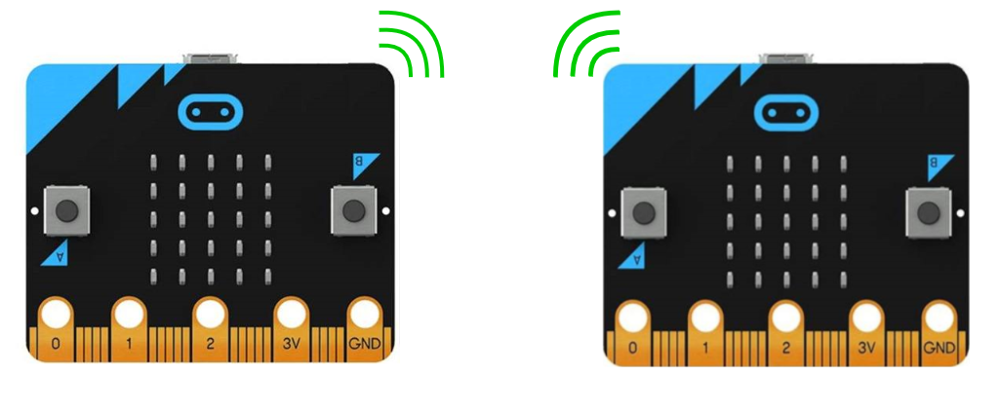

## 温度检测

Microbit 主板没有设计温度传感器，进行温度检测使用的是蓝牙芯片内部的温度检测计，通过对芯片内部温度的检测，达到温度检测的功能。

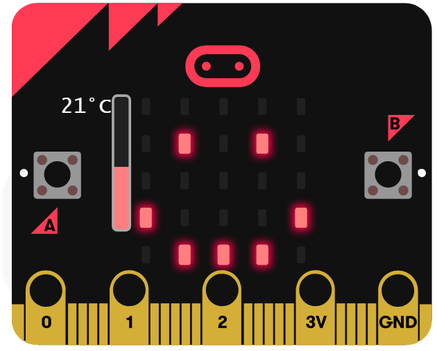

## 光线强度检测

Microbit 主板是如何进行光线强度的检测呢？主要是通过LED屏幕下的反向二极管电流的作用，转换成一个光敏传感器来进行光线强度检测的。

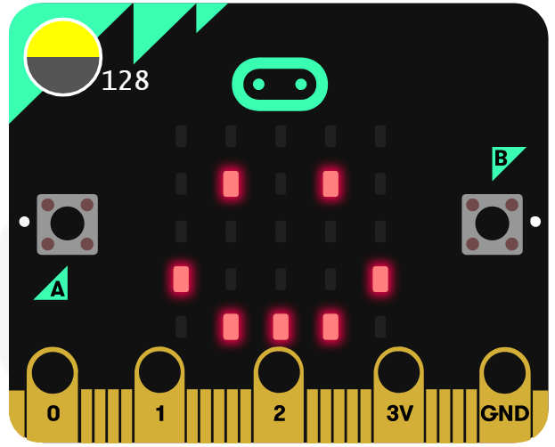

## 3轴加速度

Microbit 主板含有一个3轴加速度传感器，可以检测三维状态的角度和加速度变化。并且官方对不同的状态数据进行了封装，在使用的过程中可以直接选择相应状态积木或命令，减少了对数据处理的问题，提高了可操作性。

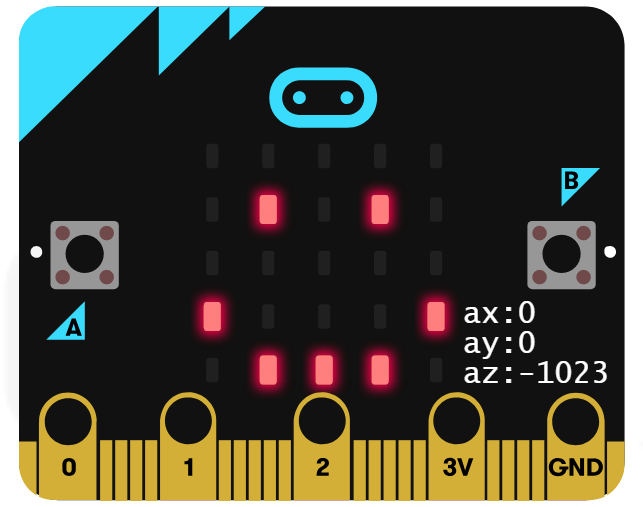

## 磁力计

Microbit 主板含有一个磁力传感器，在使用的过程中，不仅可以对周围磁场强度变化进行检测，也可以用来作为指南针，不同方向显示不同角度，从而指示方位。

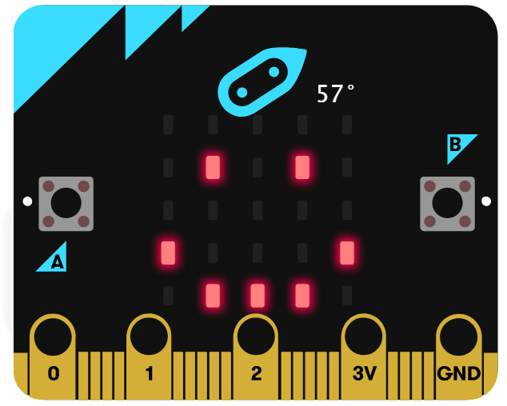

# 购买链接

点击进入[购买](https://item.taobao.com/item.htm?spm=a1z10.5-c-s.w4002-21556097795.20.46d523d3dWteX0&id=613499028717)

# 编程方式

## makecode /JavaScript编程
点击进入[编程官网链接](https://makecode.microbit.org/)
## Micropython 编程
点击进入[编程官网链接](https://python.microbit.org/)