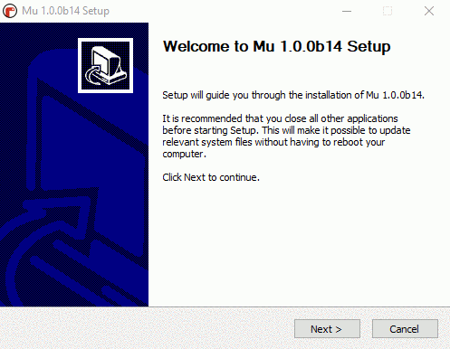
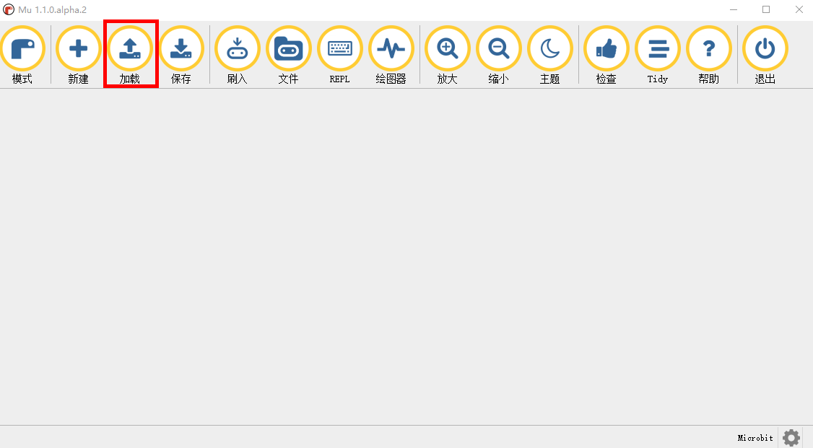
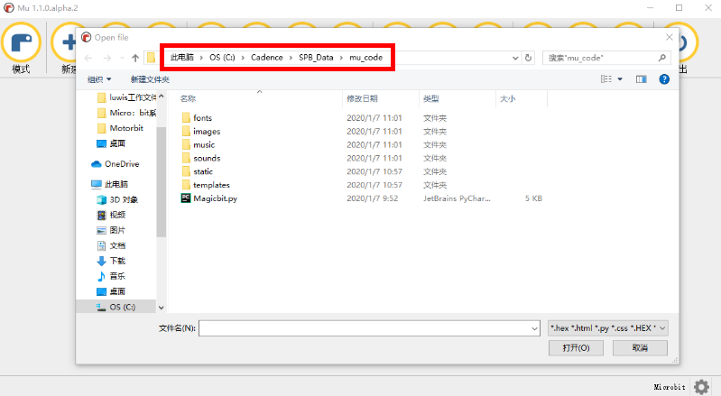
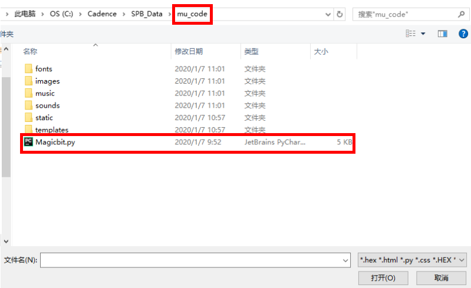

# Microbit 编程

Microbit 支持三种编程语言：makecode，micropython，JavaScript。编程方式分为：在线编程、离线编程。其中在线编程中、 makecode为积木编程、与JavaScript源代码编程在同一页面，可以点击按钮选择其中一种编程；micropython源代码编程在另一个编程页面。
- 如果想要在线编程，可以把Microbit 主板通过usb接口的数据线与电脑进行连接，这时在我的电脑查看就会发现多了一个**`MICROBIT`**内存盘，说明Microbit 与电脑连接正常，双击打开这个内存盘，在电脑能够连接网络的情况下双击 **`MICROBIT.HTM`** ，在打开的网页的右上通过**`Language`** 选择大陆简体或其它语言。页面自动更新后点击**`让我们开始编程吧`**/**`Let‘s Code`**；页面更新后，下拉会发现有**`MakeCode编辑器`**和**`Python编辑器`**，点击相应编辑器的**`让我们开始编程吧`**/**`Let’s Code`**。这样就进入了编程页面。

# makecode 积木编程

makecode 有离线编程软件，使用方法和在线编程方法相同。需要离线编程软件，可以在微软商店搜索  **`MakeCode for micro:bit`**，点击`安装`即可。

## makecode 编程步骤

- 除了上面介绍的进入在线编程页面的方法以外，也可以直接在电脑浏览器内输入编程页面的网址**`https://makecode.microbit.org/`**点击搜索或回车进入编程页面。
- 进入makecode 编程页面后，点击**`新建项目`**/**`New Project`**。这样就进入了makecode 的代码编程界面，在界面左边的积木栏拖拉相应的积木放到右边的程序界面，通过不同的组合，一个程序就编写完成。
- makecode 有两种下载方式，一种是直接把程序文件下载到**`Microbit`**主板；另一种是把程序文件下载到电脑相应位置，然后再把该文件复制粘贴到**`MICROBIT`**内存盘内。程序编写完成后，点击界面左下角的**`下载`**/**`Download`**，选择保存位置为**`MICROBIT`**内存盘。当主板的指示灯开始闪烁的时候，表示程序正在下载，闪烁结束表示下载完毕（然后出现错误，Microbit屏幕会显示相应的错误信息）。

## makecode 编程添加积木

- makecode 编程如何添加扩展积木包呢？当我们需要其它积木包时，点击界面积木栏的**`高级`**/**`Advanced`**，再点击**`扩展`**/**`Extensions`**。这样就进入了添加扩展包的界面，此界面有一些分享的扩展包，如何需要添加特定的扩展包，需要在搜索栏输入项目包的网址，比如：输入**`https://github.com/emakefun/pxt-magicbit.git`**，再点击搜索或回车，就会打开相应的积木包，点击积木包，那么这个积木包的内容就成功的添加到积木栏内。

## makecode 编程下载注意事项

- 在进行程序下载时，需要注意程序文件的下载位置，如果采用直接下载方式，文件下载路径要选择**MICROBIT**内存盘（如果我的电脑显示的不是**MICROBIT**内存盘，而是**MAIMAINTENANCE**，说明主板固件损坏，可以[重新烧录固件]()）

# micropython 代码编程

Microbit 官方提供了micropython的在线编辑器，如果需要使用离线编辑器可以使用**`mu`**这款编辑器。

## micropython 在线编辑器

- Microbit 使用micropython编写程序时，可以使用官方提供的在线编辑器，在浏览器网址搜索栏输入**`https://python.microbit.org/`**点击搜索或回车，进入micropython编程页面。
- 当microbit通过usb数据线与电脑连接后，点击在线micropython编辑器的**`Disconnect`**，选择相应的 Microbit 主板，点击 **连接** ，这样 Microbit 主板就与在线编辑器连接在一起。程序编写完成后、点击 **`Flash`** 按键，程序就可以直接下载到 Microbit 主板，省去了选择下载文件路径的步骤。（打开时默认有一个例程程序，可以直接点击下载）
- Microbit 在线编辑器，还提供了命令行控制模式，当按照上面步骤把 Microbit 与在线编辑器连接后，点击**`Open Serial`**，再点击左边的 **`Send CTRL-C for REPL`** ，就进入了命令行编辑模式。在命令行模式、输入**`import microbit`** 敲击回车、再输入 **`microbit.display.show(1)`** 敲击回车。此时 Microbit 屏幕就显示一个数字**1**。

## mu 离线编辑器

### 什么是mu ？

mu 是一款简单的python集成开发环境，可以帮助用户编译一些控制器和处理器，该软件功能界面简单，打开软件以后可以选择四个模式编辑，支持 PYTHON 3、Pygame Zero、 BBC MICRO: BT、 ADAFRUIT CIRCUITPYTHON，选择一个模式就可以进入到编辑界面，可以直接在软件上编辑代码，也可以通过加载.PY或者是.hex文件到软件上调试，功能非常实用！并且软件提供了一个图形调试器工具。适合中小学生Python学习者。

### Mu 下载安装

Mu下载安装方便，用户可以直接通过   [Mu官网](https://codewith.mu/en/download)  下载适合自己电脑的Mu版本，具体安装过程如图所示                                                                        											

如果需要了解详细的安装说明，可以登录  [Mu安装](https://codewith.mu/en/howto/) 学习

### Mu 的 BBC micro:bit 模式介绍

1. ’‘模式“按钮可以选择相应的编辑模式，在为micro:bit主板编程时，应选择BBC microbit 。

2. ”新建“按钮可以新建编程文件，用来为micro:bit编写python控制程序

3. ”加载“按钮是用来加载电脑中已经保存好的 .py 文件。注意：在安装好Mu后，点击加载，记下加载的文件路径，这个路径就是microbit库文件在电脑的存放路径，在往后的学习中，会多次micro:bit添加库，需要用到该路径把库 放到电脑的这个固定位置

4. ”保存“按钮是用来保存修改过或新建的文件

5. “刷入”按钮将Python代码下载到连接的micro:bit上(microbit主板的指示灯“闪烁”表示正在下载python程序到micro:bit上)。当micro:bit主板指示灯闪烁时，主板也在删除之前下载的程序。如果下载的代码包含一个错误，micro:bit屏幕会滚动显示错误信息。闪烁的过程大约需要10秒，如下所示：

6. “文件”按钮可以方便地访问、放置、获取和删除设备上的文件。如下图所示，单击“文件”会在文本编辑器和Mu的页脚之间打开两个窗格。左边的窗格列出micro:bit上的所有文件，右边的窗格列出mu_code你电脑上的文件。在每个文件之间拖动文件以复制它们。若要删除micro：bit上的文件，请右击它并选择“Delete”。 注意：如果点击文件，提示错误，可以重新插拔microbit主板以及重新打开Mu，或者 在代码区输入”import microbit“，然后点击刷入，再次打开文件。 

7. “REPL”按钮在文本编辑器和Mu的页脚之间创建一个新窗格，连接到MicroPythonREPL关于micro:bit装置。“REPL”这个词是一个缩略语，代表“Read，Value，print，循环”，它简洁地描述了面板为您做了什么。它读取您键入的Python的交互式行，计算这些代码的含义，输出它为您提供的任何结果，然后循环返回以等待您的下一个Python指令。

8. “绘图仪”按钮打开了Mu的绘图仪。如果您的micro：bit是通过串行连接输出数字元组，绘图仪将显示它们为一个图形。这对于可视化您可能通过微：位测量的任何数据是非常有用的。有关更多信息，请阅读 [穆氏绘图仪教程](https://codewith.mu/en/tutorials/1.0/plotter).

9. ”放大“和”缩小“按钮的作用是用来放大和缩小代码的大小，可以根据需要来调整代码字体的大小

10. ”主题“按钮是用来调整Mu的编程主题风格，可以点击切换不同的背景主题

11. "检查"按钮是用来检测代码的错误的，在编程程序的过程中，可以通过该按钮检查常规错误，也可以通过刷入后micro:bit屏幕有无提示以及提示信息来更详细的检查代码

12. ”Tidy“按钮是用来调整整个程序的美观性的

13. ”帮助“按钮可以进入Mu官方网站，寻找更详细的软件资料

14. ”退出“按钮是用来退出Mu软件

### mu 使用步骤

1. 点击”模式“按钮，选择BBC microbit 模式（如果打开软件的时候已经选择BBC microbit模式，此步骤可以忽略)
2. 点击"新建"按钮，新建编写文件，编写相应的micro:bit程序
3. 点击“保存”按钮，把编写的micro:bit程序保存到相应位置（如果仅仅是临时测试程序可以不用保存）
4. 点击”检查“按钮，检查程序有无常规错误。当程序下载完成，如果程序是错误的，micro:bit屏幕也会出现相应错误信息。
5. 点击”刷入“按钮，把编写好的micro:bit程序下载到micro:bit主板，micro:bit主板指示灯闪烁表示程序正在下载，当闪烁结束的时候，如果micro:bit屏幕没有错误信息，表示程序下载成功。

### mu 添加程序库

1. 我的程序文件呢？人们有时很容易丢失他们的代码，所以Mu的默认文件位置始终为mu_code，mu_code的路径怎么找呢？当安装好Mu，点击”加载“按钮，加载出来的就是mu_code的文件路径，记住此路径，在以后的学习中需要添加库，就放到电脑的该路径的位置（每个电脑的路径会稍有不同）。点击”加载“按钮

记下mu_code路径

2. 把Magic:bit库文件复制粘贴到mu_code文件内，结果如图

3. 打开Mu软件，点击”文件“按钮，通过拖拽，把电脑中的文件拖拽到BBC micro:bit中，当micro:bit主板的指示灯闪烁结束的时候，表示Magic:bit库文件已经添加到micro:bit主板，可以通过from Magicbit import * 来使用Magicbit库了，需要注意的是，在调用库的时候要确保Magicbit库在microbit主板内，因为microbit库文件不是一次下载就永远存在的。

### mu 设置默认固件

mu下载程序的同时会调用 mu 的相关固件，那么如何设置 mu 的默认固件呢？以 motorbit 固件为例，分为以下几个步骤：

1. 把 motorbit.hex 拷贝到 mu 的工作目录，C:\Users\你的用户名\mu_code
2. 编辑 mu 的配置文件 C:\Users\你的用户名\AppData\Local\python\mu\setting.json ，在这个文件中插入以下内容 **`“microbit_runtime_hex“: "motorbit.hex"`**。注意：前一行的最后要加一个逗号。
- 编辑完后完整文件内容如下：
``` C++
	{
		"paths": [],
		"theme": "day",
		"workspace": "C:\\Users\\Administrator\\mu_code",
		"microbit_runtime_hex": "motorbit.hex"
	}
```
需要注意的是，”workspace“ 表示的是固件的路径，在编辑的时候需要特别注意，”microbit_runtime_hex“ 表示的是固件的名称。
3. 保存文件，重新打开mu，新建项目输入 ”import motorbit“，刷入后没有提示错误，说明固件设置成功。
[motorbit扩展API](https:)

### mu 命令行模式

当Microbit 通过usb数据线与电脑连接一起时，点击 **`REPL`**按钮 ，mu 进入命令行模式。在命令行模式下，每次输入代码的同时，代码已经下载到 Microbit 主板中，使用mu的 REPL 就像开发者在使用 microPython 与 Microbit 进行对话一样，比如在 `>>>` 后输入`print(2)`， 回车后就会打印出 `2` ; 输入 `1 + 2`，回车后就会打印出 `3`。在常规Python脚本中可以做的任何事情，都可以在REPL中完成。这是一种有趣的方法，可以有趣地探索MicroPython在 Microbit 上的功能。去吧，玩玩吧！(提示：microPython中内置了大量的复活节彩蛋：bit…。你能找到他们吗？)

# python 基础语法

## Python 简介
​		Python 是一个高层次的结合了解释性、编译性、互动性和面向对象的脚本语言。Python 的设计具有很强的可读性，相比其他语言经常使用英文关键字，其他语言的一些标点符号，它具有比其他语言更有特色语法结构。
> **解释性**：这意味着Python的开发过程中没有了编译这个环节。
> **互动性**：这意味着您可以在一个 Python 提示符 `>>>` 后直接执行代码。
>
>```shell
>	>>> print ("Hello World!")  #在shell中打印"Hello World!"
> 	Hello World!
> ```
> **面向对象**：这意味着Python支持面向对象的风格或代码封装在对象的编程技术。

## Python注释

​		正如前面我们看到的，Python的注释可以使用`# 要注释的内容`来进行。使用这种方式也可以进行多行注释，例如：

```python
# -*- coding: UTF-8 -*-
#要注释的第一行
#要注释的第二行
#……
```
当然我们也可以采用`'''这里是注释内容'''`或者`"""这里是注释内容"""`的方式来进行多行注释。

**注意，使用中文进行注释时，一定要在第一行加入`# -*- coding: UTF-8 -*-`。**

```python
# -*- coding: UTF-8 -*-
'''
要注释的第一行
要注释的第二行
……
'''
#或者如下：
"""
要注释的第一行
要注释的第二行
……
"""
```

## 基本数据类型

​		Python的数据类型主要有以下几种：
>数字	
>字符串
>列表
>元组
>字典

### 1.数字

Python支持四种不同的数字类型：`int`,`long`,`float`,`complex`。其中`int`为整型，`long`为长整型，`float`为浮点型，`complex`为复数。
**注意，在`Python 3. x`版本中`int`,`long`合并为`int`！**

### 2.字符串

字符串是由数字、字母、下划线组成的一串字符。Python的字串列表有2种取值顺序：
- 从左到右索引默认0开始的，最大范围是字符串长度少1。
- 从右到左索引默认-1开始的，最大范围是字符串开头。

如果你要实现从字符串中获取一段子字符串的话，可以使用`[头下标:尾下标]` 来截取相应的字符串，其中下标是从 0 开始算起，可以是正数或负数，下标可以为空表示取到头或尾。

```shell
>>> str='hello'
>>> str[0:2]
'he'			#左边第一位为0，故截取0到1两个字符并打印出来
>>> str[-4:-1]
'ell'			#右边第一位为-1，故截取-4到-2三个字符并打印出来。
```

另外Python的字符串还可以进行相加，相乘等操作。

```shell
>>> str='hello'
>>> s='world'
>>> print(str+s)
helloworld
>>> str*2
'hellohello'
```

### 3.列表

列表用 `[ ] `标识，是 Python 最通用的复合数据类型。列表中值的切割也可以用到变量 [头下标:尾下标] ，就可以截取相应的列表，从左到右索引默认 0 开始，从右到左索引默认 -1 开始，下标可以为空表示取到头或尾。

```shell
>>> list1=['h','e','l','l','o']
>>> list2=[',','world','!']
>>> print(list1)				#打印列表list1中全部内容
['h', 'e', 'l', 'l', 'o']
>>> print(list1[1:4])			#打印列表中从1到3的内容
['e', 'l', 'l']
>>> print(list1[1:])			#打印列表中从1开始的所有内容
['e', 'l', 'l', 'o']
>>> print(list1+list2)			#将列表list1和list2的内容相加并打印出来
['h', 'e', 'l', 'l', 'o', ',', 'world', '!']
```

### 4.元组

元组是另一个数据类型，类似于列表。元组用` () `标识。内部元素用逗号隔开。**但是元组不能二次赋值，相当于只读列表**。

```shell
>>> tuple=('h','e','l','l','o')
```

### 5.字典

字典由键值对组成，以`{}`标识。字典与列表的区别就是，**列表是有序的对象集合，字典是无序的对象集合**。

```shell
>>> dict={'name': 'python','code':'hello', 'method': 'print'}	
>>> print(dict.keys())
dict_keys(['name', 'code', 'method'])		#打印出所有的键
>>> print(dict.values())
dict_values(['python', 'hello', 'print'])	#打印出所有的值
```

## 条件语句

Python的条件语句主要有两种类型：

```python
# -*- coding: UTF-8 -*-
if （条件1）:	
	语句块1			#条件1满足时执行执行语句块1，否则执行语句块2
else:
	语句块2
```

```python
# -*- coding: UTF-8 -*-
if	(条件1)：
	语句块1			#条件1满足时执行执行语句块1
elif:(条件2)
	语句块2			#条件2满足时执行执行语句块2
elif:(条3)
	语句块3			#条件3满足时执行执行语句块3
elif:(条件4)
	语句块4			#条件4满足时执行执行语句块4
else:
	语句块5			#以上条件均不满足时执行语句块5
```

## 循环语句

Python中的循环语句主要有两种：`while`和`for`。

### while循环

```python
# -*- coding: UTF-8 -*-
i=0
while i<10:
	i+=1
	print ('i=',i)
```

以上程序就是使用`while`循环依次打印出`i`的值，由于每一次循环`i`的值都加1，所以该程序的运行结果为：

```python
i= 1
i= 2
i= 3
i= 4
i= 5
i= 6
i= 7
i= 8
i= 9
i= 10
```

### for循环

当然，我们也可以使用for循环实现以上结果。

```python
# -*- coding: UTF-8 -*-
for i in range(1,11):
        print ("i=",i)
```

## 函数

Python中定义函数的方法需要遵循以下规则：

1. 函数代码块以 `def `关键词开头，后接函数标识符名称和圆括号`()`。
2. 任何传入参数和自变量必须放在圆括号中间。圆括号之间可以用于定义参数。
3. 函数内容以冒号`:`起始，并且缩进。
4. `return [表达式]`结束函数，选择性地返回一个值给调用方。不带表达式的return相当于返回 `None`。


例如：

```python
# -*- coding: UTF-8 -*-
def func():
	i=2
	j=3
	return i+j						#返回i+j的值，即返回5给调用方。

print(func())					#print调用func函数，并打印出func的返回值。
```

以上程序的运行结果为：
```pytohn
5
```

# micropython 常用API

`display.scroll("Hello, microbit_python!")`

在micro:bit点阵上滚动显示Hello, microbit_python!，其中Hello, microbit_python!可以替换成任意字符。

`display.show(Image.HAPPY)`

在micro:bit点阵上显示笑脸的图形，BBC Microbit_Python还有很多内置的图片可以显示在显示屏上,[图片列表](http://www.qingchuangzhiyi.com/doc/image.html)就是一个内置图像的列表。

`display.get_pixel(x, y)`    

得到像素的亮度（x，y），亮度可以是0（熄灭）到9（像素处于最大亮度）。

`display.set_pixel(x, y, val)`   

设置像素（x，y）的亮度为val（在0到9之间）

`display.clear()` 

清除显示

`display.scroll(string, delay=400)`   

在显示屏上滚动一个字符串，每个字符之间间隔为400毫秒。

`image = Image('90009:09090:00900:09090:90009:')`

自定义microbit显示图像，数值表示亮度。0表示熄灭。9最亮的水平，冒号“:”表示一条LED线的末端。

`image = Image(width, height) `  

创建一个空图像并给出尺寸

`image = Image(width, height, buffer)`    

用指定的宽度和高度初始化一个图像，缓冲是长度和宽度的数组

`image.width()`     

返回图像的宽度(通常是5)

`image.height()`      

返回图像的高度(通常是5)

`image.set_pixel(x, y, value)`   

将像素设置为指定位置，value像素值在0到9之间

`image.get_pixel(x, y)`     

获取指定位置的像素，像素值在0到9之间

`image.shift_left(n)`     

通过将图片向左移动n次，返回一个新图像

`image.shift_right(n)`    

通过将图片向右移动n次，返回一个新图像

`image.shift_up(n)`   

 通过将图片向上移动n次，返回一个新图像

`image.shift_down(n)`  

通过将图片向下移动n次，返回一个新图像

`repr(image)`    

获得图像的字符串表示 

`accelerometer.get_x()` 

测量X轴的重力值，以重力g为单位

`accelerometer.get_y()`   

#测量Y轴的重力值，以重力g为单位

`accelerometer.get_z()`   

测量Z轴的重力值，以重力g为单位

`accelerometer.get_values()` 

获取X、Y和Z轴的重力数值（按此顺序列出）

`accelerometer.current_gesture()`

获取当前的手势值，BBC Microbit_Python能够识别下列手势：上、下、左、右、面朝下、面朝下，自由落体，3 g，6 g，8 g，摇。手势值的在程序中的表示依次是up, down, left, right, face up, face down,freefall, 3g, 6g, 8g, shake。

`accelerometer.is_gesture(name)`  

返回真或假，以指示当前活动是否为指定的手势。

`accelerometer.was_gesture(name) `  

返回真或假，以指示最后一次活动是否为指定的手势。

`accelerometer.get_gestures()`  

返回手势历史的元组，最近的一次活动是最后一次。

`compass.calibrate()`   

校准指南针

`compass.heading()`   

返回一个数字，表示“北方”的程度偏移量。

`compass.get_field_strength()`    

返回一个关于磁场强度的数值指示

`compass.is_calibrated()`    

若电子罗盘被成功校准，返回 True ，否则返回 False 。

`compass.clear_calibration()`    

取消校准，初始化至未校准状态。

`microbit.compass.get_x()`   

根据磁力的方向，将 x 轴上的磁力读取为正整数或负整数

`microbit.compass.get_y() `   

根据磁力的方向，将 y 轴上的磁力读取为正整数或负整数。

`microbit.compass.get_z()`    

根据磁力的方向，将 z 轴上的磁力读取为正整数或负整数

`button_a.is_pressed()`   

表示按钮正被按下，返回真或假

`button_a.was_pressed()`   

表示按钮是否被按下，返回真或假，再开始或最后调用这个函数。

`button_a.get_presses()`  

这个函数返回之前A按下的次数。调用这个函数后，计数会清零，重新开始计数。

`while True: `   

无限循环

`for num in range(1,10):`   

如果num的值在1~10之间，就循环

```
if ...:    #如果...事件是正确的或者发生了,执行这条命令
elif ...:     #否则如果...事件是正确的或者发生了,执行这条命令
else:  	#否则,执行这条命令
```
`pin.write_digital(value)`   

向引脚写入数字值，可以是0，1，False，True

`pin.read_digital()`    

读取引脚的数字值，返回0或1

`pin.write_analog(value)`  

向引脚写入模拟值，可以是1-1023范围内的值

`pin.read_analog()`   

读取引脚的模拟值，返回1-1023范围内的值

`pin.set_analog_period(int)`    

以毫秒为单位设置PWM输出的周期

`pin.set_analog_period_microseconds(int)`   

将引脚的PWM输出的周期设置为微秒

`pin.is_touched()`    

如果引脚被触摸，返回一个布尔值

`music.play(music.NYAN)`	

播放一个旋律
内置的旋律完整的列表:
>DADADADUM - 贝多芬-C小调第五交响曲开场。
>ENTERTAINER - Scott Joplin的Ragtime经典“The Entertainer”的开场片段。
>PRELUDE - 巴赫的48首C大调前奏曲和赋格曲的前奏曲开场。
>ODE - 贝多芬D小调第九交响曲《欢乐颂》主题
>NYAN- Nyan Cat主题
>RINGTONE - 听起来像是手机铃声。用于指示传入消息。
>BLUES - Boogie-woogie 12小节蓝调低音群持续复奏
>BIRTHDAY - “祝你生日快乐…”
>WEDDING -来自瓦格纳的歌剧《罗恩格林》中的《婚礼合唱》。
>FUNERAL -“葬礼进行曲”即肖邦的《降b小调第二钢琴奏鸣曲》（Op. 35)第三乐章。
>PUNCHLINE - 一个表示笑话的有趣片段已经制作完成。
>PYTHON - 约翰·菲利普·苏萨的进行曲又名“自由钟”，巨蟒剧团的主题曲（之后Python 编程语言被命名）
>BADDY - 无声电影时代的入口的一个坏人。
>CHASE - 无声电影时代的追逐现场。
>BA_DING - 表示发生了一些事情的短信号。
>WAWAWAWAA - 一个非常悲伤的长号
>JUMP_UP - 用于游戏中，指示向上移动。
>JUMP_DOWN - 用于游戏中，指示向下移动。
>POWER_UP - 一场宣传，表示一项成就解锁。
>POWER_DOWN - 一场悲伤的宣传，表示一项成就的丧失。 

```
import random

display.show(str(random.randint(1, 6))) 
```
获取一个1~6之间得随机数字，并且转化为字符通过屏幕显示

```
emakefunnames = ["Mary", "Yolanda", "Damien", "Alia", "Kushal", "Mei Xiu", "Zoltan" ]

display.scroll(random.choice(emakefunnames))
```


在列表emakefunnames中随机获取一个名字，并且通过microbit屏幕显示出来

`sleep(ms)`   

睡眠（延时）时间为给定的毫秒数。

`running_time()`  

返回micro:bit最后一次启动的时间，返回值是微秒

`reset()` 

复位micro:bit

# micropython 扩展函数

Microbit 除了一些常用的 API函数之外，对于其它的一些microbit扩展板，比如：motorbit、magicbit和sensorbit传感器套件等、 micropython 内部的固件都做了相应的设计，使得用户在使用这些外设的时候，不用再被复杂的数据计算和代码所困扰，提高了外设的可操作性。

## RGB特效灯

RGB灯可以通过调节红、绿、蓝 三基色的比例从而显示不同的颜色。当很多RGB灯连接在一起时，可以做一些特效，比如流水灯，呼吸灯等。
- 在使用RGB特效扩展函数时：需要在程序开始编写**`import neopixel`**，从而调用neopixel扩展函数
- [基本API(英文版)](https://microbit-micropython.readthedocs.io/en/latest/neopixel.html)[基本API(中文版)](http://www.qingchuangzhiyi.com/doc/neopixel.html)
- 扩展API：
1. 调节RGB灯亮度：**`brightness(pin_start, pin_end, brightness)`**
				pin_start: 0~pin_end (控制亮度开始的坐标) , pin_end: pin_start~RGB_number (控制亮度结束的坐标) , brightness:1~100 (亮度值)
```
# 控制连接在microbit p16引脚的2颗RGB灯, 位置为0~1的RGB灯亮度设置为90
from microbit import *
import neopixel
np = neopixel.NeoPixel(pin16, 2)   #设置RGB连接在microbit 16引脚，数量为2个
np[0] = (100, 100, 100)    #设置第一个灯红、绿、蓝三种颜色的值
np[1] = (100, 100, 100)    #设置第二个灯红、绿、蓝三种颜色的值
np.brightness(0, 1, 90)
```
2. 呼吸灯特效：**`breathing(pin_start, pin_end)`**
			pin_start: 0~pin_end (呼吸灯特效开始的坐标) , pin_end: pin_start~RGB_number (呼吸灯特效结束的坐标)
```
# 控制连接在microbit p16引脚的2颗RGB灯, 位置为0~1的RGB灯呼吸特效
from microbit import *
import neopixel
np = neopixel.NeoPixel(pin16, 2)
np[0] = (100, 100, 100)
np[1] = (100, 100, 100)
np.breathing(0, 1)
```
3. 旋转流星特效：**`rotate(pin_start, pin_end)`**
			pin_start: 0~pin_end (旋转流星特效开始的坐标) , pin_end: pin_start~RGB_number (旋转流星特效结束的坐标)
```
# 控制连接在microbit p16引脚的2颗RGB灯, 位置为0~1的RGB灯旋转流星特效
from microbit import *
import neopixel
np = neopixel.NeoPixel(pin16, 2)
np[0] = (100, 100, 100)
np[1] = (100, 100, 100)
np.rotate(0, 1)
```
4. 闪烁特效：**`flicker(pin_start, pin_end)`**
			pin_start: 0~pin_end (闪烁特效开始的坐标) , pin_end: pin_start~RGB_number (闪烁特效结束的坐标)
```
# 控制连接在microbit p16引脚的2颗RGB灯, 位置为0~1的RGB灯闪烁特效
from microbit import *
import neopixel
np = neopixel.NeoPixel(pin16, 2)
np[0] = (100, 100, 100)
np[1] = (100, 100, 100)
np.flicker(0, 1)
```

## Magic:bit 扩展函数

Magicbit 是一款多功能的 Microbit 驱动板（ [Magicbit产品介绍](https://emakefun-docs.readthedocs.io/zh_CN/latest/micro_bit/magicbit/)），同时支持 8 路舵机和 4 路直流电机、支持2路4线步进电机、并且板载4个RGB全彩灯、无源蜂鸣器、红外接收头等。对于 Magicbit 的一些外设，micropython 内部的固件也做了一些设计，在使用 python 编程的过程中，可以直接使用这些micropython 扩展函数。
- 在使用这些函数时：**`import motor`** 需要首先编写这个语句，来调用扩展函数
- 扩展API ：
1. 直流电机控制： **`motor.dcmotor_run(index, speed)`**  
				index: 1/2/3/4（电机序号）, speed: -255~255 (电机速度)
```
#1号电机以150的速度正转
import motor
motor.dcmotor_run(1, 150)
```
2. 直流电机停止：**`motor.dcmotor_stop(index)`**
				index: 1/2/3/4 (电机序号)
```
# 1号电机以150速度运行2秒后，停止1号电机转动
from microbit import *
import motor
motor.dcmotor_run(1, 150)
sleep(2000)
motor.dcmotor_stop(1)
```
3. 步进电机运动：**`motor.stepper(index, degree)`**
				index: 1/2 (步进电机序号) , degree: -360~360 (转动角度)
```
# 控制1号步进电机转动150度
import motor
motor.stepper(1, 150)
```
4. PWM舵机控制：**`motor.servo(index, degree, speed=10)`**
				inedx: 1/2/3/4/5/6/7/8 (舵机序号，分别对应Magicbit:s1/s2/s3/s4/s5/s6/s7/s8) , degree: 0~180 (角度方位) , speed: 1~10（舵机转动速度, 可以不输入）
```
# 控制连接在S1引脚的舵机转动到90°位置
import motor
motor.servo(1, 90)
```
```
#控制连接在S1引脚的舵机以 5 速度转动到90°位置
import motor
motor.servo(1, 90, speed=5)
```

## Motor:bit 扩展函数

Motor:bit 是易创空间专门针对 micro:bit 而开发的一款驱动大电流电机（[Motorbit产品介绍](https://emakefun-docs.readthedocs.io/zh_CN/latest/micro_bit/motorbit/)）、舵机、步进电机的一款多功能电机驱动扩展板。采用DC-DC电源方案，支持DC(6~36V)宽电压输入，最大输出3A电流。Motor:bit 扩展函数可以参考Magic:bit

## sensor 扩展函数

sensorbit 指的是一套传感器，对于该套传感器，每一个器件都设计有对应的函数，[查看sensor 扩展函数]()
