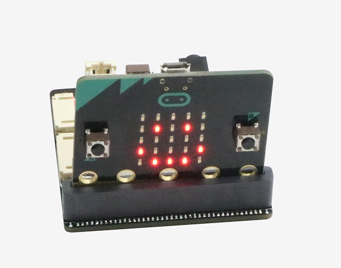
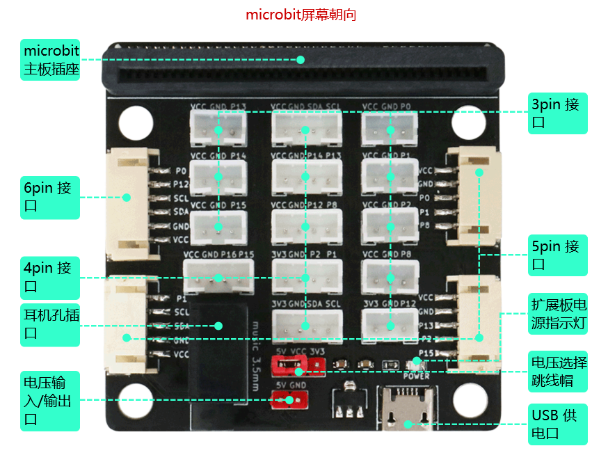

# Sensor:bit 简介

什么是 Sensor:bit ？Sensor:bit 是一套为 Micro:bit 量身打造基于 PH2.0 接口的扩展板，Sensor:bit 扩展功能多样，包含八个 3pin 接口、六个 4pin 接口、三个 5pin 接口、一个 6pin 接口，对Micro:bit 可扩展接口进行了优化设计，使得 Sensor:bit 在 PH2.0 接口情况下可以连接更多的传感器。Sensor:bit 设计有一个  3.5mm 耳机插座，当把耳机插头插入、可以通过对音乐模块的编程收听歌曲。在电源设计方面，Sensor:bit 设计有两种供电方式：第一种是通过 micro usb 接口供电；另一种是通过连接在电源的杜邦线供电。Sensor:bit 设计有两种可选电压：5V 和 3V3，可以通过跳线帽选择不同的电压给扩展板接口供电。



## Sensor:bit 参数介绍

- PCB厚度：1.6mm
- 圆孔直径：4.6mm（与乐高孔兼容）
- 产品尺寸：56 / 56 / 12mm（裸板长宽高）
- 净        重：23.1g
- 输入电压：5V
- 输出电压：5V / 3.3V
- 插接方式：立插
- 耳机孔尺寸：3.5mm
- 引脚口类型：PH2.0 接口 

## Sensor:bit 引脚介绍



- Sensor:bit 有8个3pin 接口、引出的 Micro:bit IO口分别为：P0、P1、P2、P8、P12、P13、P14、P15。其中只有 P0、P1、P2 引脚可以读取传感器模拟值。
- Sensor:bit 设计有6个4pin 接口、引出的 Micro:bit IO口分别为：P1 和 P2、P8 和 P12、P13 和 P14、P15 和 P16、以及5V I2C 接口和3V3 I2C 接口（可以同时提供两种电压）。
- Sensor:bit 有3个5pin 接口、引出的 Micro:bit IO口分别为：P1、SCL和SDA；P2、P13 和 P15；P0、P1 和 P8。
- Sensor:bit 有1个6pin 接口、引出的 Micro:bit IO口为：P0、P12、SCL 和 SDA。
- 电压选择接口：当跳线帽连接 5V 与 VCC 引脚时、扩展板的引脚(VCC)输出电压为 5V；当跳线帽连接 3V3 与 VCC 引脚时、扩展板的引脚(VCC)输出电压为 3.3V。
- 电压输出/输入接口：Sensor:bit 设计有一个多功能电压引脚，当采用 micro usb 接口供电时、该引脚可以输出 5V 为其它扩展板供电；另一方面、该引脚也可以通过杜邦线连接电源(5V)，为Sensor:bit 扩展板供电。<font color=red>**注意: 不能同时使用该接口与 micro usb 接口供电，以免造成损坏！**</font>
- Micro:bit 主板设计有音乐类积木包和程序库，可以通过对 P0 引脚的编程播放音乐。Sensor:bit 的耳机孔连接在 Micro:bit 主板的 P0 引脚、当使用官方音乐积木库或音乐函数库时，把耳机插到 Sensor:bit 耳机孔，就可以在耳机内听到程序中设计的音乐。

# Sensor:bit 与 PH2.0接口传感器

Sensor:bit 是专为 Micro:bit 与各种传感器连接所设计的，对与 PH2.0 接口的 Sensor:bit 、设计有一套量身定做的 PH2.0接口传感器套件。传感器种类多样，按照其作用类型可分为四大类：控制类传感器、检测类传感器、执行类传感器、显示类传感器。

## 控制类传感器

控制类传感器的作用主要是用来接收人为输入的数据，并且参与到程序的执行过程，影响程序的发展方向和结果。

### 按键模块

按键模块是最常用的器件，它的原理非常简单，按键按下，回落导通；松开则断开回路。[按键模块规格书]()
- makecode 编程

- micropython 编程
	- 功能语句: `Button.read(pin)`    # pin:引脚序号
   	- 使用例程: `Button.read(1)`    # 读取连接在引脚 1的按键模块值
    ```
    # 按键模块控制 Micro:bit屏幕显示不同表情
    from microbit import *
    from sensor import Button
    while True:
    	if Button.read(1):
        	display.show(Image.HAPPY)
        	sleep(1000)
    	else:
        	display.show(Image.ANGRY)
    ```
### 触摸模块

触摸模块是一个基于触摸检测 IC (TTP223B) 的电容式点动型触摸开关模块，常态下输出低电平，触碰时输出高电平。[触摸模块规格书]()
- makecode 编程

- micropython 编程
	- 功能语句: `Touch.read(pin)`    # pin:引脚序号
	- 使用例程: `Touch.read(1)`    # 读取连接在引脚 1的按键模块值
	```
	# 触摸模块控制 Micro:bit屏幕显示不同图案 
	from microbit import *
	from sensor import Touch
	while True:
    	if Touch.read(1):
        	display.show(Image.HAPPY)
        	sleep(1000)
    	else:
        	display.show(Image.ANGRY)
	```
### 触碰开关模块

触碰开关模块实质为一个微型快动开关，即广为人知的微型开关，是一种由很小的物理力启动的电子开关。[触碰开关模块规格书]()
- makecode 编程

- micropython 编程
	- 功能语句: `Collision.read(pin)`  # pin:引脚序号 
	- 使用例程: `Collision.read(1)`  # 返回连接在 1号引脚的触碰开关引脚值
	```
	# 触碰开关模块控制 Micro:bit屏幕显示不同图案
	from microbit import *
    from sensor import Collision
    while True:
    	if Collision.read(1):
        	display.show(Image.HAPPY)
        	sleep(1000)
    	else:
        	display.show(Image.ANGRY)
	```

### 旋转电位器模块

旋转电位器模块实际上就是可变电阻器，由于它在电路中的作用是获得与输入电压(外加电压)成一定关系的输出电压，因此称为电位器。[旋转电位器模块规格书]()
- makecode 编程

- micropython 编程
	- 功能语句:`Rotarypotentiometer.read(pin)`  # pin:0/1/2(引脚序号)
	- 使用例程:`Rotarypotentiometer.read(1)`  #读取连接在1号引脚的旋转电位器值 
	```
	# Micro:bit 屏幕显示电位器值
	from mcirobit import *
	from sensor import Rotarypotentiometer
	while True:
		display.scroll(Rotarypotentiometer.read(1))
		sleep(1000)
	```

### 旋转编码器模块

旋转编码器是一种将旋转位移转换为一连串数字脉冲信号的旋转式传感器，旋转编码器通过旋转可以统计正方向和反方向转动过程中输出脉冲的次数，旋转计数不像电位器，这种转动计数是没有限制的。[旋转编码器模块规格书]()
- makecode 编程

- micropython 编程
	- 功能语句: 
	- 使用例程: 
	```
	# Micro:bit 屏幕显示旋转编码器值
	```

### 触摸钢琴模块

触摸钢琴模块原理是通过分布在芯片端口的电容因为手指的接触，使电容发生了改变，经芯片处理后能将微小的电容变化转化成电压信号的变化，再通过软件AD采集端口电压，根据电压的变化实现触摸的识别。[触摸钢琴模块规格书]()
- makecode 编程

- micropython 编程
	- 功能语句:`TouchPiano.read(CLK_pin, DIO_pin)`#CLK_pin/DIO_pin:引脚序号
	- 使用例程:`TouchPiano.read(8, 12)` #读取连接在8、12引脚的触摸钢琴模块返回值
	```
	# Micro:bit 屏幕显示触摸钢琴模块返回值
	from microbit import *
	from microbit import TouchPiano
	while True:
		if TouchPiano.read(8, 12) == 1:
			display.show(1)
		elif TouchPiano.read(8, 12) == 2:
			display.show(2)
	```

### 4x4 矩阵键盘模块

触摸矩阵键盘是通过 TTP229芯片驱动、共16个触摸键。TTP229 芯片是一款使用电容感应式原理设计的触摸芯片。[4x4 矩阵键盘模块规格书]()
- makecode 编程

- micropython 编程
	- 功能语句: 
	- 使用例程: 
	```
	# Micro:bit 显示矩阵键盘被按下的键
	```

### 滑动电阻器模块

滑动变阻器是电路中的一个重要元件，它可以通过移动滑片的位置来改变自身的电阻，从而起到控制电路的作用。[滑动电阻器模块规格书]()
- makecode 编程

- micropython 编程
	- 功能语句: `SlidePotentiometer.read(pin)`  # pin:0/1/2(引脚序号)
	- 使用例程: `SlidePotentiometer.read(1)`  #读取连接在 1号引脚的滑动电阻器值
	```
	# Micro:bit 屏幕显示连接在滑动电阻器的值
	from microbit import *
	from sensor import SlidePotentiometer
	while True:
		display.scroll(SlidePotentiometer.read(1))
	```

### PS2 遥杆模块

PS2 摇杆模块结构非常简单，它包含一个触摸按钮（Z轴）和两个电位器（X轴和Y轴）。 操纵杆根据两个触点位置判断运动方向，其中一个触点向左和向右，另一个向上和向下，操纵杆移动决定了触点的位置，就像地球的纬度和经度一样，不同的位置对应不同的电压，然后控制器可以通过AD传感器读取不同的电压值，从而识别特定的远程位置。[PS2 遥感模块规格书]()
- makecode 编程

- micropython 编程
	- 功能语句:  `Rocker.read_digital(pin)` #pin:引脚序号
				`Rocker.read_analog(pin)`  #pin:0/1/2 (引脚序号)
				`Rocker.read_all(pin_X, pin_Y, pin_B)`  								#pin_X/pin_Y:0/1/2(引脚序号)    pin_B:引脚序号
	- 使用例程:  `Rocker.read_digital(0)` #读取摇杆按键值，按键引脚连接在0引脚
				`Rocker.read_analog(1)`  #读取摇杆模拟值，摇杆X/Y连接在1引脚
				`Rocker.read_all(0, 1, 8)`  											#读取摇杆所有返回值，摇杆X连接在0引脚、Y连接在1引脚、B连接在8引脚
	```
	# Micro:bit 屏幕显示摇杆值
	from microbit import *
	from sensor import Rocker
	data = [0, 0, 0]
	while True:
    	data = Rocker.read_all(0, 1, 8)
    	display.scroll(data[0])
    	display.scroll(data[1])
    	display.scroll(data[2])
    	sleep(1000)
	```

## 检测类传感器

检测类传感器是用来检测传感器周围数据，并且把数据经过简单的处理，从而发送给处理芯片，参与到程序的运行过程，检测到不同的数据会影响程序的发展方向和结果。

### 声音传感器

声音传感器模块的作用相当于一个话筒(麦克风)。它用来接收声波，显示声音的振动图象，但不能对噪声的强度进行测量。[声音传感器规格书](）
- makecode 编程

- micropython 编程
	- 功能语句:  `Sound.read_digital(pin)`  #pin:引脚序号(5V电压引脚)
	 			`Sound.read_analog(pin)` #pin:0/1/2(引脚序号)
	- 使用例程: `Sound.read_analog(1)` #读取连接在1号引脚的值
	```
	# Micro:bit 检测周围是否有声音
	from microbit import *
	from sensor import Sound
	while True:
		display.scroll(Sound.read_digital(8))
		sleep(1000)
	```

### 热敏传感器

热敏电阻器是敏感元件的一类，按照温度系数不同分为正温度系数热敏电阻器(PTC)和负温度系数热敏电阻器(NTC)。热敏电阻器的典型特点是对温度敏感，不同的温度下表现出不同的电阻值。[热敏传感器规格书]()
- makecode 编程

- micropython 编程
	- 功能语句: `Thermal.read(pin)`  # pin:0/1/2引脚序号
	- 使用例程: `Thermal.read(1)`  # 读取连接在1号引脚的热敏传感器值
	```
	# Micro:bit 屏幕显示光亮度值
	from microbit import *
	from microbit import Thermal
	while True:
		display.scroll(Thermal.read(1))
		sleep(1000)
	```

### 光敏传感器

光敏传感器也称为光敏电阻。它（光敏电阻，缩写为LDR）通常由硫化镉制成。当入射光上升时，电阻阻值会降低; 入射光减弱，阻值会增加。光敏电阻常用于光测量，控制和转换（光与电之间的变化）会发生变化（光变为电）。[光敏传感器规格书]()
- makecode 编程

- micropython 编程
	- 功能语句:`Photosensitive.read(pin)` # pin:0/1/2 （引脚序号）
	- 使用例程:`Photosensitive.read(1)` # 读取连接在 1号引脚的光敏传感器模拟值
	```
	# Micro:bit 温度表情包
	from microbit import *
	from sensor import Photosensitive
	while True:
        if Photosensitive.read(1) > 250:
            display.show(Image.HAPPY)
            sleep(1000)
        else:
            display.show(Image.ANGRY)
	```

### 火焰传感器

火焰传感器可以通过火焰发出的红外线探测是否有火。同时、火焰传感器也可以用来检测周围光线的亮度。[火焰传感器规格书]()
- makecode 编程

- micropython 编程
	- 功能语句:  `Flame.read_digital(pin)`  # pin: 引脚序号
				`Flame.read_analog(pin)`  # pin: 0/1/2引脚序号
	- 使用例程: `Flame.read_digital(1)`  # 读取连接在 1号引脚的火焰传感器的值
	```
	# Micro:bit 火灾报警器
	from microbit import *
	from sensor import Flame
	while True:
        if Flame.read_digital(1):
            display.show(Image.HAPPY)
            sleep(1000)
        else:
            display.show(Image.ANGRY)
	```

### 土壤湿度传感器

土壤湿度传感器模块有两个铜条是传感器探头。 将它们插入土壤时，它们可以检测到水分。 土壤湿润，导电性越好，反映出它们之间的电阻越低。土壤干燥,导电性就相对差一点,因此他们之间的电阻越高。[土壤湿度传感器规格书]()
- makecode 编程

- micropython 编程
	- 功能语句: `Soilmoisture.read(pin)`  #pin:0/1/2（引脚序号）
	- 使用例程: `Soilmoisture.read(1)`  #读取连接在1号引脚的土壤湿度传感器值
	```
	# Micro:bit 屏幕显示土壤湿度
	from microbit import *
	from sensor import Soilmoisture
	while True:
		display.scroll(Soilmoisture.read(1))
		sleep(1000)
	```

### 雨滴传感器

雨滴传感器是一种传感装置，主要用于检测是否下雨及雨量的大小，当传感器连接到5v电源时，感应板上没有水滴，DO输出处于高电平。 当滴下液滴时，DO输出处于低电平。 如果我们刷掉水滴，输出将返回高水平状态。[雨滴传感器规格书]()
- makecode 编程

- micropython 编程
	- 功能语句:  `Waterdroplets.read_digital(pin)`  # pin:引脚序号
				`Waterdroplets.read_analog(pin)`  # pin:0/1/2(引脚序号)
	- 使用例程:  `Waterdroplets.read_digital(0)`  # 读取连接在0号引脚传感器值
				`Waterdroplets.read_analog(1)`  # 读取连接在1号引脚传感器值
	```
	# Micro:bit 检测是否下雨
	from microbit import *
	from snesor import Waterdroplets
	while True:
		if not Waterdroplets.read_digital(1):
			display.scroll('raining')
	```

### 水深传感器

水深传感器专为水质检测而设计，可广泛用于感应降雨，水位，甚至液体泄漏。该传感器的工作原理是将一系列暴露的走线连接到地，并在接地走线之间交错，即感应走线。[水深传感器规格书]()
- makecode 编程

- micropython 编程
	- 功能语句: `Waterdepth.read(pin)`  # pin:0/1/2(引脚序号)
	- 使用例程: `Waterdepth.read(1)` #读取连接在1号引脚的水深传感器数据值
	```
	# Micro:bit 屏幕显示水深
	from microbit import *
	from sensor import Waterdepth
	while True:
		display.scroll(Waterdepth.read(1))
		sleep(1000)
	```

### 温湿度传感器

DHT11数字温度 - 湿度传感器是一种包含校准数字信号输出的复合传感器。它采用特殊的数字模块采集技术和湿度 - 温度传感器技术，确保高可靠性和出色的长期稳定性。[温湿度传感器规格书]()
- makecode 编程

- micropython 编程
	- 功能语句: 
	- 使用例程: 
	```
	# Micro:bit 屏幕显示温湿度
	```

### DS18B20 温度传感器

DS18B20是常用的数字温度传感器，其输出的是数字信号，具有体积小，硬件开销低，抗干扰能力强，精度高的特点。[DS18B20 温度传感器]()
- makecode 编程

- micropython 编程
	- 功能语句: 
	- 使用例程: 
	```
	# Micro:bit 显示温度
	```

### 气体传感器

MQ-4天然气传感器所使用的气敏材料是在清洁空气中电导率较低的二氧化锡(SnO2)。当传感器所处环境中存在可燃气体时，传感器的电导率随空气中可燃气体浓度的增加而增大。使用简单的电路即可将电导率的变化转换为与该气体浓度相对应的输出信号。[气体传感器规格书]()
- makecode 编程

- micropython 编程
	- 功能语句: 
	- 使用例程: 
	```
	# Micro:bit 气体报警器
	```

### 人体热释电传感器

人体感应模块是基于红外线技术的自动控制产品，灵敏度高、可靠性强、超小体积、超低电压工作模式、全自动感应，人进入其感应范围则输出高电平，人离开感应范围则自动延时关闭高电平，输出低电平。[人体热释电传感器规格书]()
- makecode 编程

- micropython 编程
	- 功能语句: `PIR.read(pin)` # pin:引脚序号
	- 使用例程: `PIR.read(1)` # 读取连接在 1号引脚的人体热释电传感器值
	```
	# Micro:bit 防盗报警器
	from microbit import *
	from sensor import PIR
	while True:
        if PIR.read(1):
            display.show(Image.ANGRY)
            sleep(1000)
        else:
            display.show(Image.HAPPY)
	```

### 红外循迹传感器

红外循迹模块本质上是一个红外线收发装置，是具有一对红外线发射与接收管，发射管发射出一定频率的红外线，当检测方向遇到不同颜色的反射面时，红外线反射的情况不同，所以可以判断反射面颜色是否发生变化。[红外循迹传感器规格书]()
- makecode 编程

- micropython 编程
	- 功能语句: `IRtracking.read(pin)`  # pin: 引脚序号
	- 使用例程: `IRtracking.read(1)`  # 读取连接在 1号引脚的红外循迹传感器值
	```
	# Micro:bit 判断反射面是否是黑色
	from microbit import *
	from sensor import IRtracking
	while True:
		if not IRtracking.read(1):
    		display.scroll('black')
    	else:
        	display.scroll('white')
	```

### MPU6050六轴陀螺仪

MPU6050 集成了3轴陀螺仪与3轴加速度的 6轴运动处理组件，可以通过 I2C端口进行信息的传输。不仅可以作为检测模块，也可以作为处理模块，处理连接到 MPU6050的外接设备传输的信息。[MPU6050六轴陀螺仪规格书]()
- makecode 编程

- micropython 编程
	- 功能语句:
	- 使用例程: 
	```
	# Micro:bit 显示 X轴加速度
	```

### 手势传感器

手势检测利用四个方向的光电二极管感应反射的红外能量（由集成LED提供），将物理运动信息（即速度、方向和距离）转换为数字信息。简单的上下左右手势或更复杂的手势可以被准确地感知。[手势传感器规格书]()
- makecode 编程

- micropython 编程
	- 功能语句:
	- 使用例程:
	```
	# Micro:bit 屏幕显示手势状态
	```

### 磁簧开关传感器

磁簧开关的工作原理非常简单，两片端点处重叠的可磁化的簧片， 簧片的作用相当于一个磁通导体。在尚未操作时，两片簧片并未接触；当周围磁力超过簧片本身的弹力时，这两片簧片会吸合导通电路；没有超过时，触面就会分开从而打开电路。[磁簧开关传感器规格书]()
- makecode 编程

- micropython 编程
	- 功能语句: `Magneticswitch.read(pin)`    # pin:引脚序号
	- 使用例程: `Magneticswitch.read(1)`  # 读取连接在1号引脚的磁簧开关传感器值
	```
	# Micro:bit 显示磁簧开关是否闭合
	from microbit import *
	from sensor import Magneticswitch
	while True:
    	display.show(Magneticswitch.read(1))
    	sleep(200)
	```

### 灰度传感器

灰度传感器用来检测颜色的深浅。灰度传感器利用不同颜色的检测面对光的反射程度不同，光敏电阻对不同检测面返回的光的阻值也不同的原理进行颜色深浅检测。[灰度传感器规格书]()
- makecode 编程

- micropython 编程
	- 功能语句: `Grayscale.read(pin)`  # pin:引脚序号 
	- 使用例程: `Grayscale.read(1)`  # 读取连接在 1号引脚的灰度传感器的模拟值
	```
	# Micro:bit 屏幕显示灰度传感器检测到的值
	from microbit import *
	from sensor import Grayscale
	while True:
		display.scroll(str(Grayscale.read(1)))
	```

### 震动传感器

震动传感器、顾名思义就是用来检测周围是否发生震动。震动传感器模块实质是一个开关,其内部是一个金属片和一个弹簧, 产品不震动时，震动开关呈断开状态，输出端输出高电平；产品震动时，震动开关由于弹簧和金属片瞬间导通，输出端输出低电平。[震动传感器规格书]()
- makecode 编程

- micropython 编程
	- 功能语句:`Shock.read_analog(pin)`  # pin:0/1/2（引脚序号）
			  `Shock.read_digital(pin)`  # pin:引脚序号
	- 使用例程:`Shock.read_analog(1)`  # 读取连接在 1号引脚的震动传感器模拟值
			  `Shock.read_digital(1)`  # 读取连接在 1号引脚的震动传感器数值
	```
	# Micro:bit 地震检测器
	from microbit import *
	from sensor import Shock
	while True:
		if Shock.read_analog(1) > 200:
    		display.scroll('earthquake')
    	else:
        	display.show(Image.HAPPY)
	```

### 倾斜传感器

   模块也称为珠形开关，钢球开关，实际上是一种振动开关。它有不同的名称，但工作原理保持不变。滚珠通过与金属板接触或不接触来控制电路的连接或开。[倾斜传感器规格书]()
- makecode 编程

- micropython 编程
	- 功能语句: `Tiltswitch.read(pin)`  # pin:引脚序号
	- 使用例程: `Tiltswitch.read(1)`  # 读取连接在1号引脚的倾斜传感器值
	```
	# Micro:bit 屏幕显示倾斜状态
	from microbit import *
	from sensor import Tiltswitch
	while True:
		display.scroll(Tiltswitch.read(1))
		sleep(1000)
	```

### RGB 超声波传感器

RUS-04是由 深圳市易创空间科技有限公司 (www.emakefun.com )研发的一款将RGB灯珠和超声波测距模块集成在一起的全新模块。功能尺寸大小完全兼容HC-SR04模块，操作用由原来需要两个GPIO口操作，到现在只需要一个GPIO即可操作超声波收发，并且在超声波探头测距的同时，左右探头可以发出7彩炫彩灯光。[RGB 超声波传感器规格书]()
- makecode 编程

- micropython 编程，[RGB灯光控制，Micro:bit产品->Micro:bit编程介绍->RGB特效灯](https://emakefun-docs.readthedocs.io/zh_CN/latest/micro_bit/microbit_code/)
	- 功能语句:`RGBRUS.read(pin_RX, pin_TX)`#pin_RX/pin_TX:引脚号(可以相同)
	- 使用例程:`RGBRUS.read(8, 8)` #读取RGB超声波IO口连在 8号引脚的值
	```
	# Micro:bit 屏幕显示前方距离
	from microbit import *
	from sensor import RGBRUS
	while True:
		display.scroll(RGBRUS.read(8, 8))
		sleep(1000)
	```

## 执行类传感器

执行类传感器主要是用来执行程序中的一些需要对外产生影响的指令。程序对外产生影响主要是通过执行类传感器。

### 有源蜂鸣器

有些电器在电气状态下经常会发出嗡嗡声，这实际上来自蜂鸣器，学校里铃声只是一个更大的蜂鸣器。有源蜂鸣器只要给它通电，就会发出嗡嗡声，但频率是固定的。[有源蜂鸣器规格书]()
- makecode 编程

- micropython 编程
	- 功能语句: `Buzzer.write(pin, value)`  # pin:引脚序号  value:1/0(电平)
	- 使用例程: `Buzzer.write(1, 1)`  # 设置连接在 1号引脚的蜂鸣器为高电平
	```
	# Micro:bit 按键控制有源蜂鸣器发声
	from microbit import *
	from sensor import Buzzer
    while True:
        if button_a.was_pressed():
            Buzzer.write(1, 1)
            sleep(1000)
        else:
            Buzzer.write(1, 0)
	```

### 无源蜂鸣器

无源蜂鸣器，是没有内部振荡器的蜂鸣器，在通电时，内部振荡器是不会发出嗡嗡声的，它需要2~5 kHz的方波驱动，然后不同频率的波形会驱动蜂鸣器发出相应频率的声音。[无源蜂鸣器规格书]()
- makecode 编程

- micropython 编程 ，[更多例程](https://microbit-micropython.readthedocs.io/en/latest/music.html)
	- 使用例程: `music.play(music.NYAN)` #播放‘music.NYAN’, 无源蜂鸣器模块默认接 0号引脚
	```
	# Micro:bit 通过无源蜂鸣器播放音乐
	import music
	music.play(music.NYAN)
	```

### 直流电机模块

直流电动机是将直流电能转换为机械能的电动机。[直流电机模块规格书]()
- makecode 编程

- micropython 编程
	- 功能语句:`Motor.write_analog(pin, value)` #pin:引脚序号 value:0~1023
	- 使用例程:`Motor.write_digital(pin, value)` #pin:引脚序号 value:0/1
	```
	# Micro:bit 按键控制直流电机正反转动
	from microbit import *
	from sensor import Motor
    while True:
        if button_a.was_pressed():
            Motor.write_digital(8, 0)
            Motor.write_digital(12, 1)
        elif button_b.was_pressed():
            Motor.write_digital(8, 1)
            Motor.write_digital(12, 0)
	```

### 继电器模块

继电器是一种电控制器件。它具有控制系统（又称输入回路）和被控制系统（又称输出回路）之间的互动关系。它实际上是用小电流去控制大电流运作的一种“自动开关” 。[继电器模块规格书]()
- makecode 编程

- micropython 编程
	- 功能语句:`Relay.write(pin, value)` #pin:引脚序号 value:0/1（电平）
	- 使用例程:`Relay.write(1, 1)` #设置连接在 1号引脚的继电器模块引脚为高电平 
	```
	# Micro:bit 控制继电器开合
	from microbit import *
	from sensor import Relay
	while True:
    	Relay.write(1, 1)
    	sleep(1000)
		Relay.write(1, 0)
    	sleep(1000)
	```

### 激光发射模块

原子中的电子吸收能量后从低能级跃迁到高能级，再从高能级回落到低能级的时候，所释放的能量以光子的形式放出，故名“激光”，激光的单色性好，亮度高，方向性好。激光发射模块上板载了一个激光头，当给信号脚一个高电平则触发激光发射头发出激光。[激光发射模块规格书]()
- makecode 编程

- micropython 编程
	- 功能语句:`LightEmission.write(pin, value)` #pin:引脚序号 value:0/1电平
	- 使用例程:`LightEmission.write(1, 1)` #设置连在1号引脚激光发射模块为高电平
	```
	# Micro:bit 按键控制激光发射
	from microbit import *
	from sensor import LightEmission
    while True:
        if button_a.was_pressed():
            LightEmission.write(1, 1)
            sleep(1000)
        else:
            LightEmission.write(1, 0)
	```

### 红外发射模块

红外发射模块在我们的日常生活中发挥着重要的作用。现在被广泛应用于许多家用电器中，如空调、电视、DVD等，它是基于无线遥感的，也是一种遥控。[红外发射模块规格书]()
- makecode 编程

- micropython 编程
	- 功能语句: 
	- 使用例程: 
	```
	# 红外发射模块发射信号, 无线发送
	```

### 红外接收模块

红外接收头是一种接收、放大、解调装置，内部集成电路已完成解调，输出是数字信号。红外发射二极管发出调制信号，红外接收头经过接收、解码、滤波等一系列操作后读出红外发送模块发送的数据。[红外接收模块规格书]()
- makecode 编程

- micropython 编程
	- 功能语句:
	- 使用例程: 
	```
	# 红外接收模块接收信号，无线接收
	```

## 显示类传感器

### LED 灯模块

LED（Light Emitting Diode），发光二极管，是一种能够将电能转化为可见光的固态的半导体器件，它可以直接把电转化为光。LED的心脏是一个半导体的晶片，晶片的一端附在一个支架上，一端是负极，另一端连接电源的正极，整个晶片被环氧树脂封装保护。[LED 灯模块规格书]()
- makecode 编程

- micropython 编程
	- 功能语句:`LED.write_digital(pin, value)` #pin:引脚序号 value:0/1电平
			  `LED.write_analog(pin, value)` #pin:引脚序号 value:0~1023
	- 使用例程:`LED.write_digital(1, 1)` #设置连接在1号引脚为高电平
			  `LED.write_analog(1, 500)` #设置连接在1号引脚模拟值为500
	```
	# Micro:bit 按键控制 LED灯闪烁
	from microbit import *
	from sensor import LED
	while True:
		LED.write_digital(1)
    	sleep(1000)
    	LED.write_digital(0)
    	sleep(1000)
	```

### 1602LCD 显示屏模块

LCD1602是一种专门用于显示字母，数字和符号的字符LCD模块。 “1602”表示可以显示 2 行每行 16个字符。带了转接板的LCD1602显示屏,使用了IIC接口,节省了许多的I/O口。[1602LCD 显示屏规格书]() 
- makecode 编程

- micropython 编程
	- 功能语句: 
	- 使用例程: 
	```
	# 1602LCD 显示屏显示 “Hello emakefun!”
	```
### TM1650 四位数码管模块

4位7段数码管由一个12管脚的4位7段共阳极数码管和一个控制芯片TM1650构成。插口一边有大写字母IIC表示该模块采用IIC协议通信。此模块可以显示小数点位，所以经常应用在显示数字的设备上。[TM1650 四位数码管模块规格书]()
- makecode 编程

- micropython 编程
	- 功能语句:  `Tm1650.write(place, data, point)`  # place:1~4(数码管位) 					data:0~9(显示数字)  point:0/1(是否显示小数点)
				`Tm1650.clear(place)`  # place:1~4(数码管位)
	- 使用例程:  `Tm1650.write(1, 2, 1)`  # 第一位数码管显示2，小数点位显示
				`Tm1650.clear(1)`  # 清除第一位数码管显示
	```
	# TM1650 四位数码管显示数字
	from microbit import *
	from sensor import Tm1650
	while True:
		Tm1650.write(1, 2, 1)
		sleep(2000)
		Tm1650.clear(1)
	```

### TM1637 四位时钟数码管模块

4位7段数码管由一个12管脚的4位7段共阳极数码管和一个控制芯片TM1637构成。此产品可以应用在时间显示，跑表显示以及其他需要显示数字的设备上。[TM1637 四位时钟数码管规格书]()
- makecode 编程

- micropython 编程
	- 功能语句: `Tm1637.init(clk_pin, dio_pin)`  # clk_pin/dio_pin:引脚序号
			   `Tm1637.show(place, data, point)`   #place:0~3(显示位) 						data:0~9（显示值） point:0/1（点是否显示）
			   `Tm1637.clear(place_pin)`  # place_pin:引脚序号
	- 使用例程: `Tm1637.init(8, 12)`  # 定义引脚，初始化
			   `Tm1637.show(1, 0, 0)`   #在位置为 1的数码管显示0，不显示点
			   `Tm1637.clear(1)`  # 清除位置为 1的显示
	```
	# TM1637 四位时钟数码管显示数字
	from microbit import *
	from sensor improt *
	Tm1637.init(8, 12)
	while True:
		Tm1637.show(1, 0, 0)
		sleep(2000)
		Tm1637.clear(1)
	```

### 8x8 点阵屏模块

8X8点阵模块由MAX7219驱动，MAX7219是一种集成化的串行输入/输出显示驱动器,它连接微处理器与8位数字的7段数字LED显示，也可以连接条线图显示器或者64个独立的LED。[8x8 点阵屏规格书]()
- makecode 编程

- micropython 编程
	- 功能语句: 
	- 使用例程: 
	```
	# 8x8 点阵屏显示 “你好”
	```

### 红绿交通灯模块

交通灯就是板载了3个不同颜色的LED灯，通过控制对应的引脚就可以控制灯的亮灭。[红绿交通灯规格书]()
- makecode 编程

- micropython 编程
	- 功能语句: `Waterlight.write(pin, value)`  #pin:引脚序号 value:0/1
	- 使用例程: `Waterlight.write(1, 1023)`  #点亮连接在1号引脚的灯
	```
	# 控制红绿交通灯模块灯闪烁
	from microbit import *
	from sensor import Waterlight
	while True:
		Waterlight.write(1, 1023)
		sleep(1000)
		Waterlight.write(1, 0)
		sleep(1000)
	```

### RGB三色灯模块

RGB代表红色，绿色和蓝色通道，是行业颜色标准。RGB通过改变三个通道并叠加它们来显示各种新颜色，根据统计，它可以创建不同的颜色。[RGB 三色灯模块规格书]()
- makecode 编程

- micropython 编程
	- 功能语句: `RGB.write(pin, value)`  #pin:引脚序号 value:0~1023
	- 使用例程: `RGB.write(1, 1023)`  # 设置连接在1号引脚的相应RGB灯颜色引脚的值
	```
	# RGB三色灯显示颜色
	from microbit import *
	from sensor import RGB
	while True:
		RGB.write(1, 1023)
		sleep(1000)
		RGB.write(1, 0)
		sleep(1000)
	```

### RGB三色环模块

WS2812是一个集控制电路与发光电路于一体的智能外控LED光源。其外型与一个5050LED灯珠相同， 每个元件即为一个像素点。此外、它还具有低电压驱动，环保节能，亮度高，散射角度大，一致性好，超低功率，超长寿命等优点。[RGB三色环模块规格书]()
- makecode 编程

- micropython 编程，[样例参考Micro:bit产品->Micro:bit编程介绍->RGB特效灯](https://emakefun-docs.readthedocs.io/zh_CN/latest/micro_bit/microbit_code/)