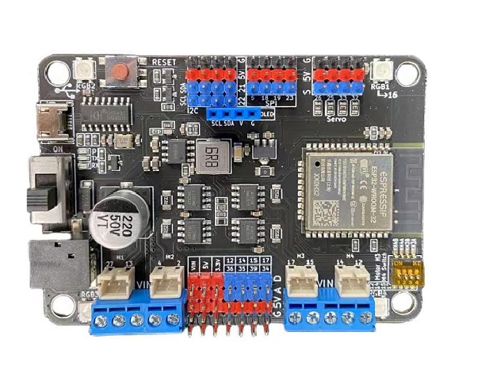
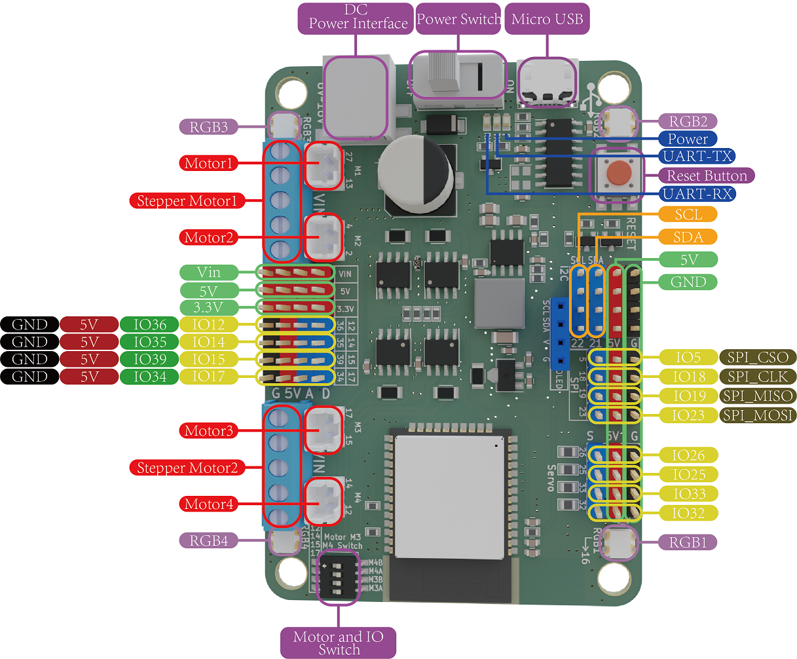
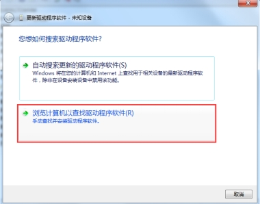
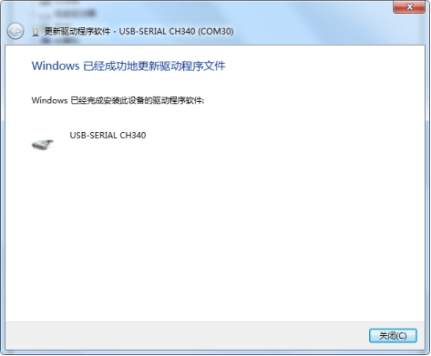

# Maker-ESP32 使用说明书

## [淘宝购买链接](https://item.taobao.com/item.htm?spm=a21dvs.23580594.0.0.3c3a3d0dhaSOlC&ft=t&id=688324885925)

## 产品简介

​		 Maker-ESP32是基于乐鑫科技的 [ESP32-WROOM-32](https://www.espressif.com/sites/default/files/documentation/esp32-wroom-32_datasheet_cn.pdf) 模组基础上开发的一款适用于创客教育的标志性产品，Flash大小4MB，集成 2.4 GHz、Wi-Fi 和蓝牙双模的单芯片方案。采用东芝的电机驱动芯片，电流最大可达3.5A。

## ESP32模组参数

* 448 KB ROM,520 KB SRAM,16 KB RTC SRAM

* QSPI 支持多个 flash/SRAM

* 内置 8 MHz 振荡器

* 支持自校准

* 内置 RC 振荡器，支持自校准

* 支持外置 2 MHz 至 60 MHz 的主晶振（如果使用 Wi-Fi/蓝牙功能，则目前仅支持 40 MHz 晶振）

* 支持外置 32 kHz 晶振，用于 RTC，支持自校准

* 2 个定时器群组，每组包括 2 个 64-bit 通用定时器和 1 个主系统看门狗

* 1 个 RTC 定时器

* RTC 看门狗

* 34 个 GPIO 口 • 12-bit SAR ADC，多达 18 个通道

* 带有专用 DMA 的以太网 MAC 接口，支持 IEEE 1588

* 双线汽车接口（TWAI®，兼容 ISO11898-1） • IR (TX/RX)

## 产品参数

* 4个PH2.0电机端口；4个接线柱电机端口，可以接两个步进电机；电流最大达到3.5A
* 板载4个RGB灯(16引脚)
* 5个I2C插针接口,1个SPI插针接口
* 4个舵机接口（25、26、32、33）
* 8个IO引脚(12、14、15、17、34、35、36、39)
* 输入电压： 6-16V
* 产品尺寸：80mm×57mm×12mm；PCB厚度：1.6mm；净重：35g
* 大圆孔直径：4.6mm，兼容乐高
* 软件支持Mixly、Arduino IDE、Python等

## 引脚说明 

## Maker-ESP32驱动安装

1. 接上主板，右键点击“我的电脑-->属性-->设备管理器-->端口（COM和LTP）”，如果看到下图所示，则说明驱动已安装。

   

   如果没有显示端口或者显示以下状态时，说明驱动没有安装成功。

   

   2. 安装驱动

      2.1、Windows7系统驱动安装步骤

      1）右键点击“我的电脑-->打开设备管理器-->端口（COM和LPT）。 此时你会看到一个“USB串行端口”，如下图"USB2.0-Serial"，右键单击“USB串行端口(USB2.0-Serial)”并选择“更新驱动程序软件”选项。

      ​                 

      2）接下来，选择“浏览计算机以查找驱动程序软件”选项。

      ​                          

      3）最后选择名为“CH341SER_for_64bit_win7”的驱动程序文件，下载[CH340驱动](./esp32/CH340驱动.zip)，请根据自己的电脑系统型号选择相应的驱动版本！

      

      ​              

      4）成功安装之后便会出现下图所示的界面，通知你驱动成功。

      ​                     

      此时，我们再返回“设备管理器”界面，可以看到电脑已成功识别到端口,如下图。接下来打开编译环境，就可开启编程之旅了。

      ​         

      **注意：**在Win10系统中，系统会自动下载相对应的驱动，无需自己安装驱动，但是如果系统没有识别到，就需要按照上述的步骤手动安装驱动。

      如上图所示我们可以看到USB 串口被识别为 COM30，但不同的电脑可能不一样，你的可能是 COM4、COM5 等。如果没找到 USB 串口，则有可能是你安装有误，或者系统不兼容。

      3、Windows8系统驱动安装步骤

      如果你的电脑是Windows8系统：在安装驱动程序之前，您应该保存您正在编辑的这些文件因为在操作过程中会有几次关机。

      1）按下“Windows键”+“R”

      2）输入shutdown.exe / r / o / f / t 00

      3）点击“确定”按钮。

      4）系统将重新启动到“选择一个选项”屏幕

      5）从“选择一个选项”屏幕中选择“疑难解答”

      6）从“疑难解答”屏幕中选择“高级选项”

      7）从“高级选项”中选择“Windows启动设置”屏幕

      8）点击“重新启动”按钮

      9）系统将重新启动到“高级启动选项”屏幕

      10）选择“禁用驱动程序签名强制”

      11）一旦系统启动，您安装驱动程序与Windows7相同

## Maker-ESP32通过Arduino IDE下载程序

请前往 [Arduino官网](https://www.arduino.cc/en/Main/Software)  下载最新IDE

1. 打开Ardunio IDE; 

2. 安装ESP32库；

   1) 点击Arduino IDE菜单栏：【文件】-->【首选项】

    把`https://dl.espressif.com/dl/package_esp32_index.json`添加到【附加开发板管理器网址】 如下图；

   

​       2) 菜单栏点击 【工具】->【开发板】->【开发板管理器】搜索esp32，然后安装，如下图：

#### **注：**

下载第一个工具的时候可能会出现错误的情况，这种情况直接重新点击下载就可以了，下载的比较慢，不要着急。

下载第二个工具的时候可能会出现下载错误，不要慌，再试几次如果不行的话，使用手机（不使用流量也可以）开个热点，电脑连手机的热点就可以下载了。虽然下载的较慢，但是步骤极为简单。

## 通过Ardunio IDE上传程序

和Arduino上传程序一样，先选择主板，如下图

将写好程序点击上传按钮，等待程序上传成功，如下图。

点击串口工具就可以看到串口的打印。如下图

## 联系我们

**技术 + 合作：TEL:  13242991035(WX同号)**