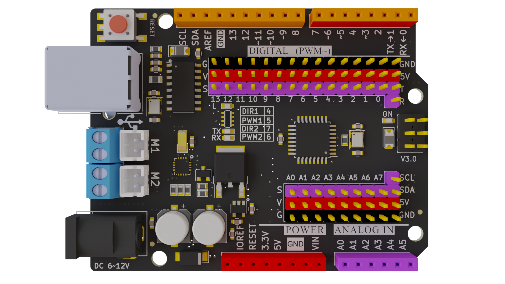
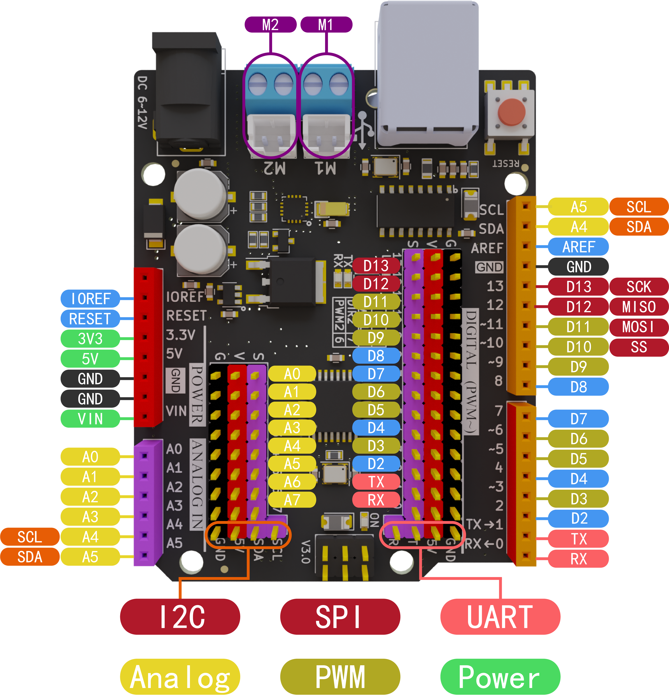
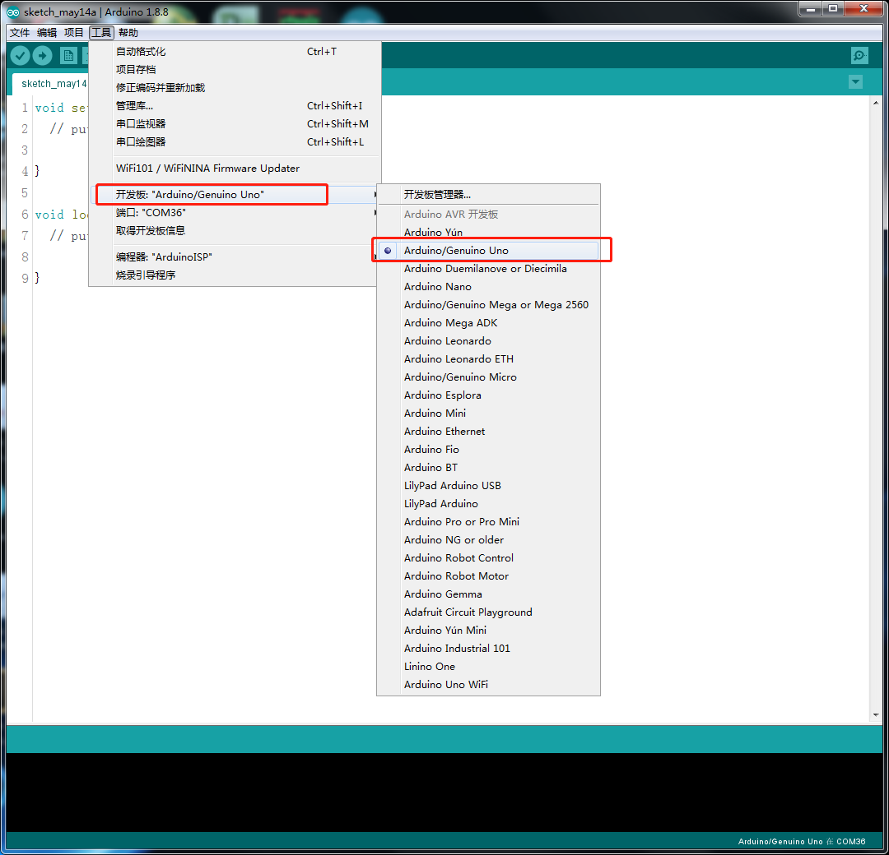
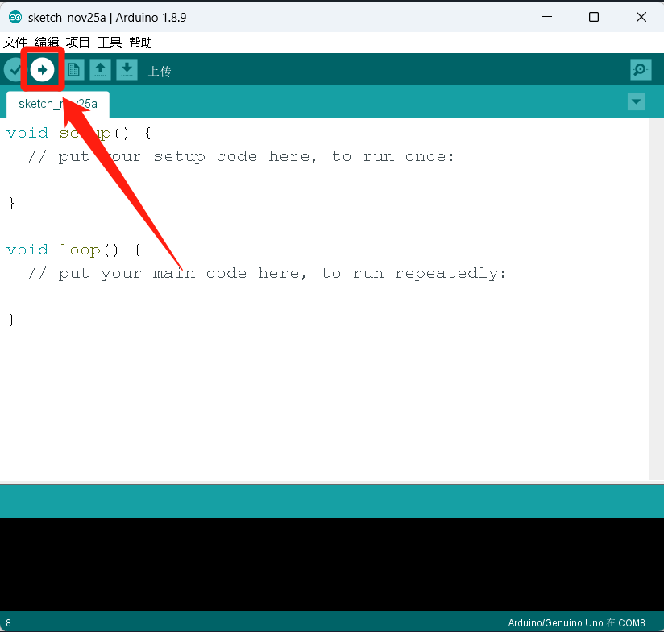

# Maker-ESP32 使用说明书

## [淘宝购买链接](https://item.taobao.com/item.htm?spm=a1z10.5-c-s.w4002-21556097795.26.23ae6b0dJkBCqZ&id=680974076367)

## 产品简介

​	Maker-UNO是基于Arduino UNO R3基础上开发的一款适用于创客教育的标志性产品， 功能和引脚完全兼容传统Arduino Uno主板 ,板子电机驱动芯片。

## 产品参数

* 与Arduino Uno R3引脚和使用方法完全兼容
* 接口:Type-B 接口
* 输入电压：Usb供电,Vin6~12V
* 微处理器：ATmega328AU
* Bootloader：最新Arduino1.8.8
* 引脚：两排2.54mm-14Pin排母，2.54mm-24pin排针接口
* 尺寸： 68.6mm x 53.4mm x 12mm
* 重量： 25g
* 软件支持Mixly、Arduino IDE、Mblock、Mind+
* DC接头：3.5mm
* 2个电机端口；输出电流最大2A
* M4定位孔直径：4.6mm，兼容乐高

## 引脚说明 

#### **[产品原理图](./Maker_UNO/Maker_Uno.pdf)**

## 指示灯说明

- ON标识的红色等为电源指示灯，供电后会常亮
- L 标识的黄色灯为BootLoader识别指示灯，当通过USB连接电脑后，端口识别到板子的时候该LED灯会快速闪烁。
- RX 标识的LED灯为串口接收指示灯，当串口接收到数据，LED灯会闪烁。
- TX 标识的LED灯为串口发送指示灯，当串口发送数据时，LED灯会闪烁。

## Maker_UNO驱动安装

1. 接上主板，右键点击“我的电脑-->属性-->设备管理器-->端口（COM和LTP）”，如果看到下图所示，则说明驱动已安装。

   

   如果没有显示端口或者显示以下状态时，说明驱动没有安装成功。

   

   2. 安装驱动

      2.1、Windows7系统驱动安装步骤

      1）右键点击“我的电脑-->打开设备管理器-->端口（COM和LPT）。 此时你会看到一个“USB串行端口”，如下图"USB2.0-Serial"，右键单击“USB串行端口(USB2.0-Serial)”并选择“更新驱动程序软件”选项。

      ​                 

      2）接下来，选择“浏览计算机以查找驱动程序软件”选项。

      ​                          

      3）最后选择名为“CH341SER_for_64bit_win7”的驱动程序文件，下载[CH340驱动](https://github.com/emakefun/maker-uno/releases/download/v1.0.0/CH340_Driver.zip)，请根据自己的电脑系统型号选择相应的驱动版本！

      

      ​              

      4）成功安装之后便会出现下图所示的界面，通知你驱动成功。

      ​                     

      此时，我们再返回“设备管理器”界面，可以看到电脑已成功识别到端口,如下图。接下来打开编译环境，就可开启编程之旅了。

      ​         

      **注意：**在Win10系统中，系统会自动下载相对应的驱动，无需自己安装驱动，但是如果系统没有识别到，就需要按照上述的步骤手动安装驱动。

      如上图所示我们可以看到USB 串口被识别为 COM30，但不同的电脑可能不一样，你的可能是 COM4、COM5 等。如果没找到 USB 串口，则有可能是你安装有误，或者系统不兼容。

      3、Windows8系统驱动安装步骤

      如果你的电脑是Windows8系统：在安装驱动程序之前，您应该保存您正在编辑的这些文件因为在操作过程中会有几次关机。

      1）按下“Windows键”+“R”

      2）输入shutdown.exe / r / o / f / t 00

      3）点击“确定”按钮。

      4）系统将重新启动到“选择一个选项”屏幕

      5）从“选择一个选项”屏幕中选择“疑难解答”

      6）从“疑难解答”屏幕中选择“高级选项”

      7）从“高级选项”中选择“Windows启动设置”屏幕

      8）点击“重新启动”按钮

      9）系统将重新启动到“高级启动选项”屏幕

      10）选择“禁用驱动程序签名强制”

      11）一旦系统启动，您安装驱动程序与Windows7相同

## 通过Ardunio IDE上传程序

和Arduino上传程序一样，先选择主板，如下图

将写好程序点击上传按钮，等待程序上传成功，如下图。

点击串口工具就可以看到串口的打印。如下图

## 测试程序

[点击下载电机测试程序](https://github.com/emakefun/maker-uno/releases/download/v1.0.0/DC_MotorTest.zip)

## 联系我们

**技术 + 合作：TEL:  13242991035(WX同号)**