# RF-Nano 介绍 

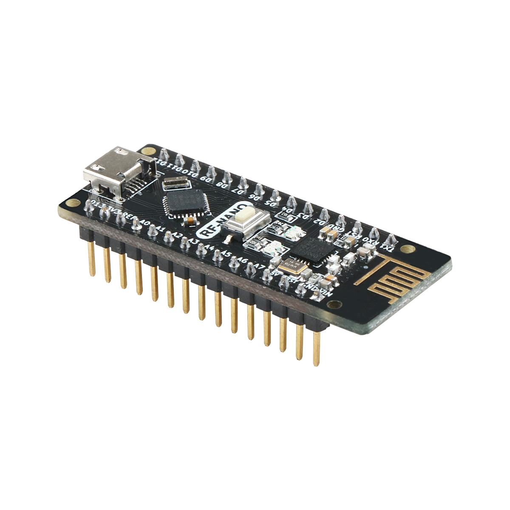

## RF-NANO概述

RF-NANO的板子上集成了NRF24L01+芯片，使得其具有无限收发功能，相当于将一个普通Nano板和一个NRF24L01模块合二为一，使用起来更加方便，尺寸小。RF-NANO与常见的Nano板的引脚完全一样，方便移植。


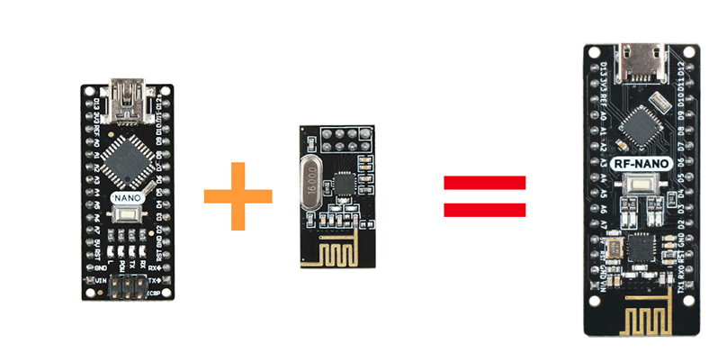

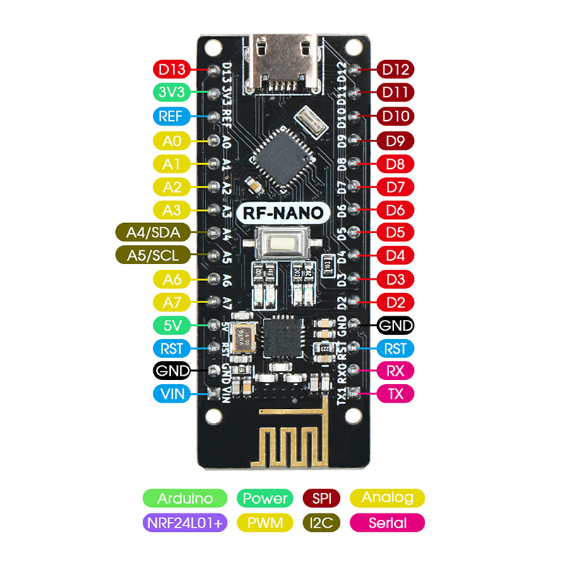

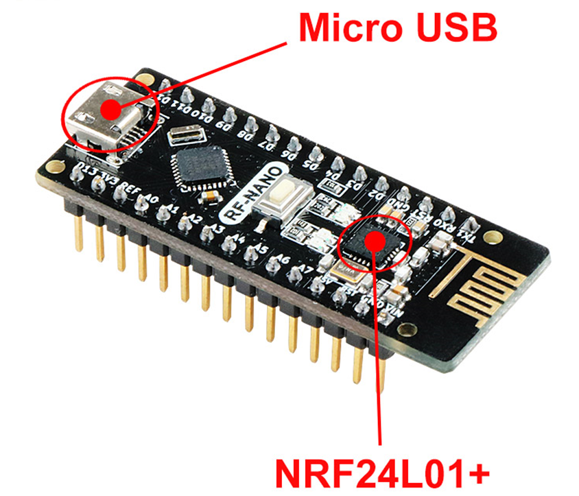


## RF-NANO处理器介绍

Arduino RF-NANO 微处理器是ATmega328(Nano3.0)，带USB-Micro接口，同时具有14路数字输入/输出口（其中6路可作为PWM输出），8路模拟输入，一个16MHz晶体振荡器，一个USB-Micro口，一个ICSP header和一个复位按钮。
* 处理器： ATmega328
* 工作电压： 5V
* 输入电压（推荐）： 7-12V
* 输入电压（范围）： 6-20V
* 数字IO脚： 14 (其中6路作为PWM输出）(D0~D13)
* 模拟输入脚： 6个（A0~A5）
* IO脚直流电流： 40mA
* Flash Memory ：32KB （其中2KB 用于 bootloader）
* SRAM ：2KB
* EEPROM ：1KB （ATmega328）
* USB转串口芯片：CH340 
* 工作时钟： 16 MHZ


#### 电源

Arduino RF-Nano供电方式：Micro - USB接口供电和外部vin接7~12V外部直流电源

#### 存储器

ATmega328包括了片上32KB Flash，其中2KB用于Bootloader。同时还有2KB SRAM和1KB EEPROM。

### 输入输出

* 14路数字输入输出口：工作电压为5V，每一路能输出和接入最大电流为40mA。每一路配置了20-50K欧姆内部上拉电阻（默认不连接)。除此之外，有些引脚有特定的功能。
* 串口信号RX（0号）、TX（1号）: 提供TTL电压水平的串口接收信号，与FT232Rl的相应引脚相连。
* 外部中断（2号和3号）：触发中断引脚，可设成上升沿、下降沿或同时触发。
* 脉冲宽度调制PWM（3、5、6、9、10 、11）：提供6路8位PWM输出。
* SPI（10(SS)，11(MOSI)，12(MISO)，13(SCK)）：SPI通信接口。
* LED（13号）：Arduino专门用于测试LED的保留接口，输出为高时点亮LED，反之输出为低时LED熄灭。
* 6路模拟输入A0到A5：每一路具有10位的分辨率（即输入有1024个不同值），默认输入信号范围为0到5V，可以通过AREF调整输入上限。除此之外，有些引脚有特定功能。
* TWI接口（SDA A4和SCL A5）：支持通信接口（兼容I2C总线）。
* AREF：模拟输入信号的参考电压。
* Reset：信号为低时复位单片机芯片。

### 通信接口

串口：ATmega328内置的UART可以通过数字口0（RX）和1（TX）与外部实现串口通信。

### ATmega328和NRF24L01+的通讯方式

ATmega328和NRF24L01+是SPI通讯，原理图如图所示

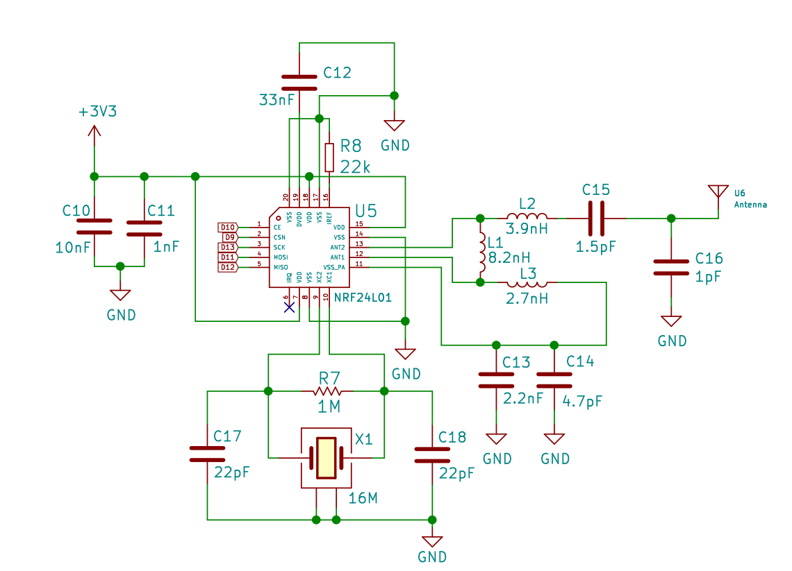

ATmega328和NRF24L01+芯片引脚连接：

| ATmega328芯片 |	NRF24L01+芯片 |
|---- | ----|
| +3.3V | VCC |
|GND | GND |
|D9	 | CSN |
|D10  |	CE |
|D11 |	MOSI |
|D12 |	MISO |
|D13 |	SCK |

注意：ATmega328已经被占用的D9，D10，D11，D12，D13引脚不能再被复用。

### 下载程序

Arduino RF-Nano上的MCU已经预置了bootloader程序，因此可以通过Arduino IDE软件直接下载程序。也可以直接通过RF-Nano上ICSP header直接下载程序到MCU。

###  注意要点

Arduino RF-Nano提供了自动复位设计，可以通过主机复位。这样通过Arduino软件下在程序到RF-Nano中软件可以自动复位，不需要在复位按钮。


## RF-NANO驱动安装

本教程需要软件需要ArduinoIDE平台，下载地址为：<https://www.arduino.cc/en/Main/OldSoftwareReleases#previous>，在浏览器打开该连接后，我们可以看到如下图界面，在该界面中，我们可以看到IDE的不同版本和不同运行环境，大家根据自己的电脑系统进行下载即可，当然在我们配套的光盘中会有下载好的安装包，但只有Windows版本，因为本套教程全都是在Windows系统下运行的。

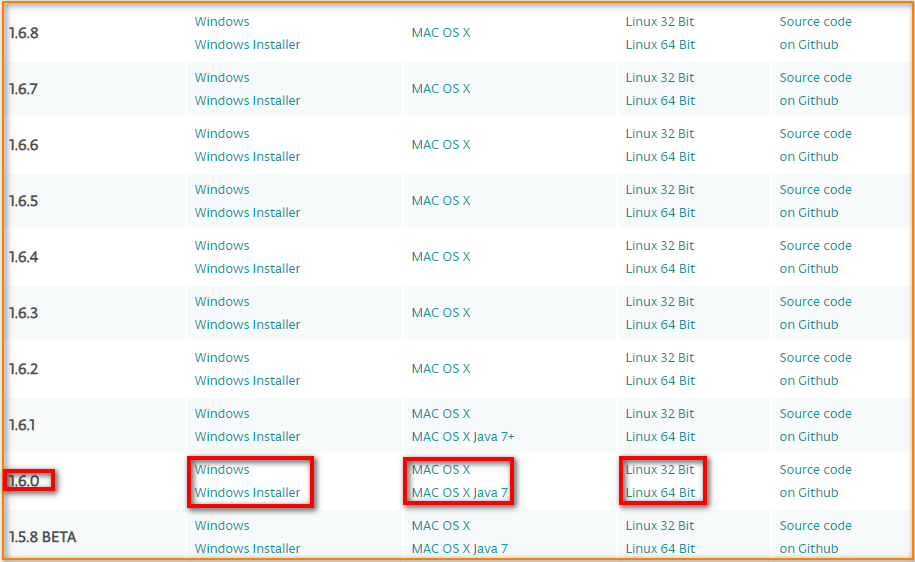

下载结束后，我们会得到压缩包，将压缩包进行解压后，其中“drivers”是驱动软件，在安装“arduino.exe”时会自动安装驱动。因为“arduino.exe”的安装很简单，这里不再讲解，建议在安装过程中退出杀毒软件，否则可能会影响IDE的安装。安装结束后，再次点击“arduino.exe”即可进入IDE程序编写界面。

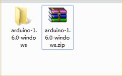

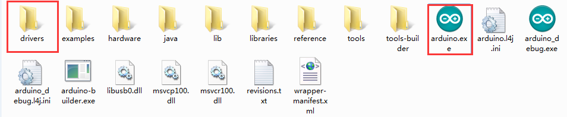


IDE安装结束后，我们接上Arduino主板，右键点击“我的电脑”-“属性”-“设备管理器”查看“端口（COM和LTP）”，如果看到如下图所示的界面。

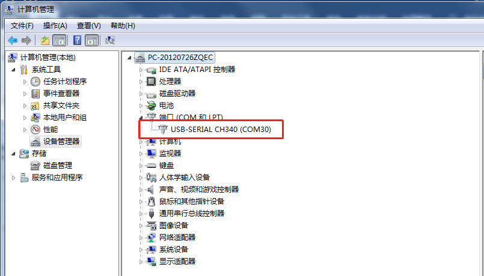


则说明驱动已安装成功，这时我们打开IDE，在工具栏中选择对应的开发板型号和端口就正常使用了。否则电脑没有识别到开发板，需要自己安装驱动程序。

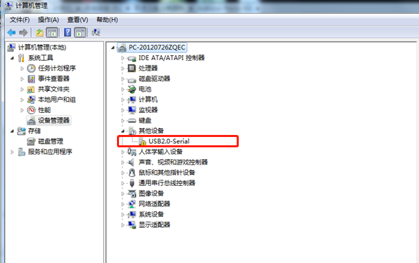

### 安装驱动


####  Windows系统Ble-Nano驱动安装流程

1. 右键点击“我的电脑”-“属性”-“设备管理器”-查看“端口（COM和LT）”，如果看到如下图，此时你会看到一个“USB串行端口”，右键单击“USB串行端口”并选择“更新驱动程序软件”选项。

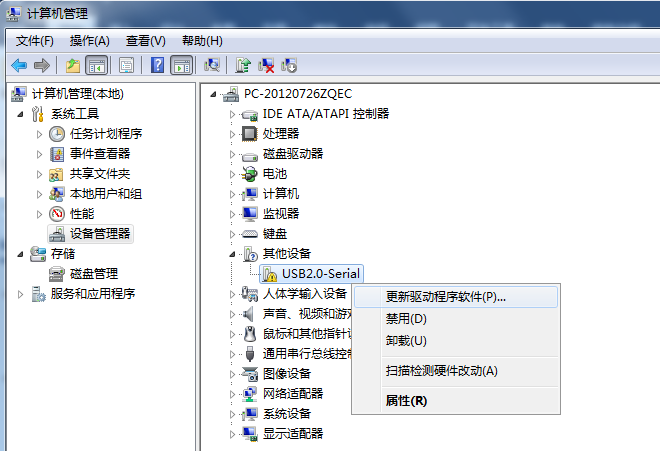


2. 右键单击“USB串行端口”并选择“更新驱动程序软件”选项，选择“浏览计算机以查找驱动程序软件”选项。


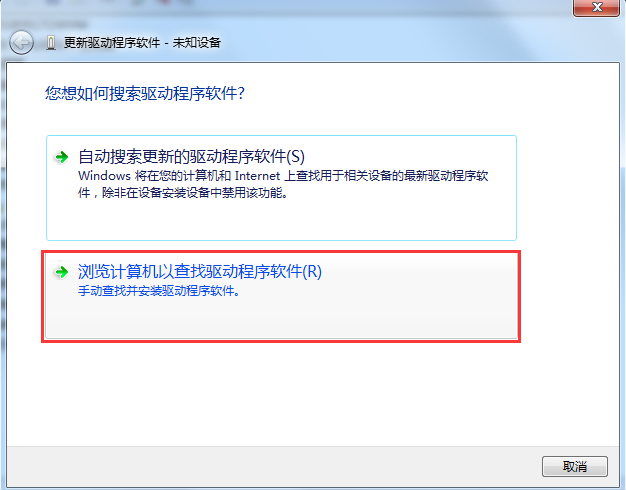


3. 最后选择名为“CH341SER_for_64bit_win7”的驱动程序文件，位于 “Arduino_Nano板驱动程序”文件夹，请根据自己的电脑系统型号选择相应的驱动版本！


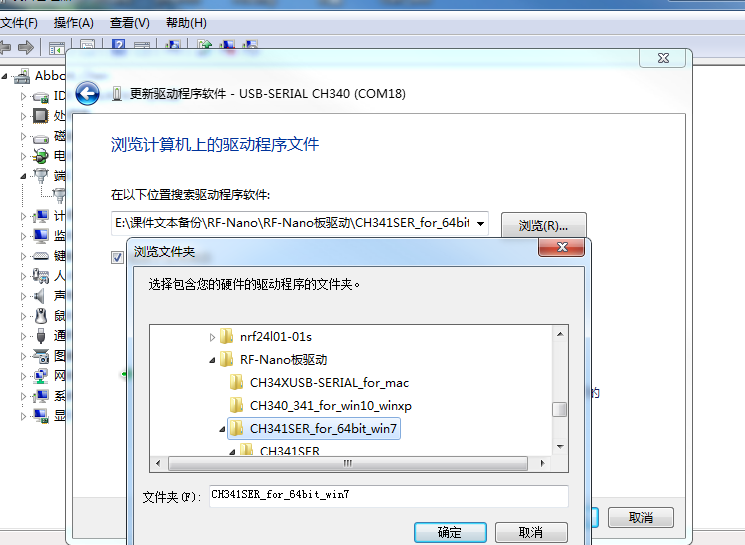


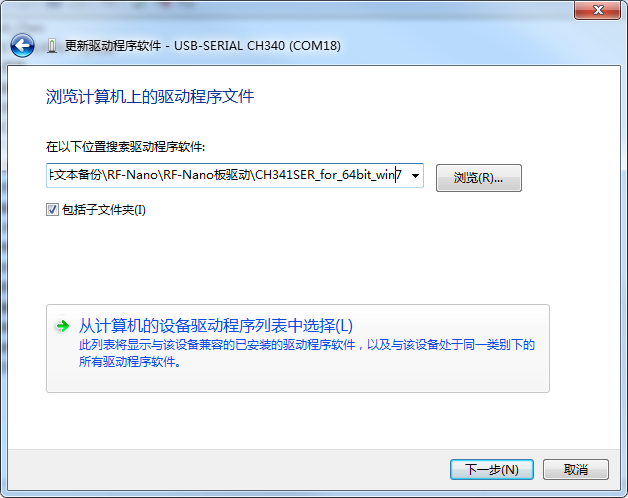


4. 成功安装之后便会出现下图所示的界面，通知你驱动成功。


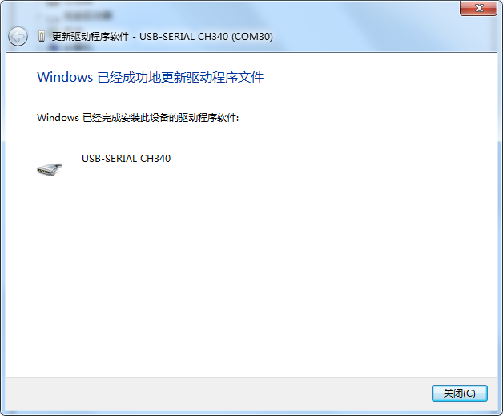


此时，我们已经安装好了驱动，接下来我们安装Arduino IDE，安装好Arduino IDE就可以开始Arduino之旅了.

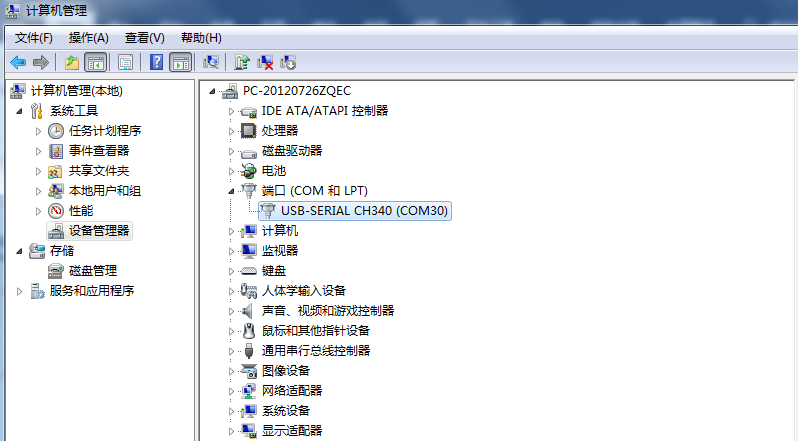


注意 ：在Win10系统中，部分Arduino在接入电脑后（非正版芯片很难被识别），系统会自动下载相对应的驱动，无需自己安装驱动，但是在Win7系统中，就需要按照上述的步骤手动安装驱动。
如上图所示我们可以看到USB 串口被识别为 COM15，但不同的电脑可能不一样，你的可能是 COM4、COM5 等，但是Arduino Nano这个一定是一样的。如果没找到 USB 串口，则有可能是你安装有误，或者系统不兼容

####  Windows8系统驱动安装步骤

如果你的电脑是Windows8系统：在安装驱动程序之前，您应该保存您正在编辑的这些文件因为在操作过程中会有几次关机。
1）按下“Windows键”+“R”
2）输入shutdown.exe / r / o / f / t 00
3）点击“确定”按钮。
4）系统将重新启动到“选择一个选项”屏幕
5）从“选择一个选项”屏幕中选择“疑难解答”
6）从“疑难解答”屏幕中选择“高级选项”
7）从“高级选项”中选择“Windows启动设置”屏幕
8）点击“重新启动”按钮
9）系统将重新启动到“高级启动选项”屏幕
10）选择“禁用驱动程序签名强制”
11）一旦系统启动，您可以安装Arduino驱动程序与Windows7相同

####  WindowsXP系统驱动安装步骤

如果你的电脑是WindowsXP系统:那安装步骤基本和Windows7相同，可参考上面的Windows7安装步骤。


# RF-NANO工作原理

## RF-NANO工作原理介绍

RF-NANO可以发射数据也可以接收数据。

**发射数据时:** 首先将NRF24L01+配置为发射模式：接着把接收节点地址TX_ADDR和有效数据TX_PLD按照时序由SPI口写入NRF24L01+缓存区，TX_PLD必须在CSN为低时连续写入，而TX_ADDR在发射时写入一次即可，然后CE置为高电平并保持至少10μs，延迟130μs后发射数据;若自动应答开启，那么NRF24L01+在发射数据后立即进入接收模式，接收应答信号（自动应答接收地址应该与接收节点地址TX_ADDR一致）。如果收到应答，则认为此次通信成功，TX_DS置高，同时TX_PLD从TX FIFO中清除;若未收到应答，则自动重新发射该数据(自动重发已开启)，若重发次数(ARC)达到上限，MAX_RT置高，TX FIFO中数据保留以便在次重发;MAX_RT或TX_DS置高时，使IRQ变低，产生中断，通知MCU。最后发射成功时,若CE为低则NRF24L01+进入空闲模式1;若发送堆栈中有数据且CE为高，则进入下一次发射;若发送堆栈中无数据且CE为高，则进入空闲模式2。 

**接收数据时:** 首先将NRF24L01+配置为接收模式，接着延迟130μs进入接收状态等待数据的到来。当接收方检测到有效的地址和CRC时，就将数据包存储在RX FIFO中，同时中断标志位RX_DR置高，IRQ变低，产生中断，通知MCU去取数据。若此时自动应答开启，接收方则同时进入发射状态回传应答信号。最后接收成功时，若CE变低，则NRF24L01+进入空闲模式1。

在写寄存器之前一定要进入待机模式或掉电模式。如图2-1-1所示，给出SPI操作及时序图


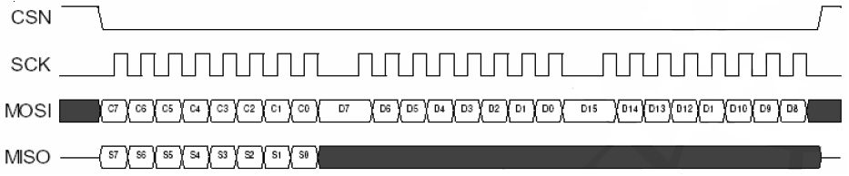


## 配置字

SPI口为同步串行通信接口，最大传输速率为10 Mb/s，传输时先传送低位字节，再传送高位字节。但针对单个字节而言，要先送高位再送低位。与SPI相关的指令共有8个，使用时这些控制指令由NRF24L01+的MOSI输入。相应的状态和数据信息是从MISO输出给MCU。 

nRF24L0l+所有的配置字都由配置寄存器定义，这些配置寄存器可通过SPI口访问。NRF24L01+ 的配置寄存器共有25个，常用的配置寄存器如表2所示。

表2：常用配置寄存器

|地址 | 寄存器名称 | 功能 |
| ---- | ---- | ---- |
|00 |	CONFIG | 设置NRF24L01+工作模式 |
|01 |	EN_AA  |设置接收通道及自动应答 |
|02 |	EN_RXADDR |	使能接收通道地址 |
|03 |	SETUP_AW |	设置地址宽度 |
|04 |	SETUP_RETR | 设置自动重发数据时间和次数 |
|07 |	STATUS | 状态寄存器，用来判定工作状态 |
|0A~0F | RX_ADDR_P0~P5	 | 设置接收通道地址 |
|10	 | TX_ADDR | 设置接收接点地址 |
|11~16 |	RX_PW_P0~P5 | 设置接收通道的有效数据宽度 |

##    RF-NANO的工作模式

NRF24L01+芯片内部有状态机，控制着芯片在不同工作模式之间的转换。NRF24L01+可配置为 Shutdown、 Standby、 Idle-TX、 TX 和 RX 五种工作模式。

**Shutdown 工作模式：**

在 Shutdown 工作模式下，NRF24L01+ 所有收发功能模块关闭，芯片停止工作，消耗电流最小，但所有内部寄存器值和 FIFO 值保持不变，仍可通过 SPI 实现对寄存器的读写。设置 CONFIG 寄存器的 PWR_UP 位的值为 0，芯片立即返回到Shutdown 工作模式。

**Standby 工作模式：**

在 Standby 工作模式，只有晶体振荡器电路工作，保证了芯片在消耗较少电流的同时能够快速启动。设置 CONFIG 寄存器下的 PWR_UP 位的值为 1，芯片待时钟稳定后进入 Standby 模式。芯片的时钟稳定时间一般为 1.5~2ms，与晶振的性能有关。当引脚 CE=1 时，芯片将由 Standby 模式进入到 Idle-TX 或 RX 模式，当 CE=0 时，芯片将由 Idle-TX、 TX 或 RX 模式返回到 Standby 模式。

**Idle-TX 工作模式:**

在 Idle-TX 工作模式下，晶体振荡器电路及时钟电路工作。相比于 Standby模式，芯片消耗更多的电流。当发送端 TX FIFO 寄存器为空，并且引脚 CE=1时，芯片进入到 Idle-TX 模式。在该模式下，如果有新的数据包被送到 TX FIFO中，芯片内部的电路将立即启动，切换到 TX 模式将数据包发送。在 Standby 和 Idle-TX 工作模式下，所有内部寄存器值和 FIFO 值保持不变，仍可通过 SPI 实现对寄存器的读写。

**TX 工作模式:**

当需要发送数据时，需要切换到 TX 工作模式。芯片进入到 TX 工作模式的条件为： TX FIFO 中有数据， CONFIG 寄存器的 PWR_UP 位的值为 1， PRIM_RX位的值为 0，同时要求引脚 CE 上有一个至少持续 10us 的高脉冲。芯片不会直接由 Standby 模式直接切换到 TX 模式，而是先立即切换到 Idle-TX 模式，再由Idle-TX 模式自动切换到 TX 模式。 Idle-TX 模式切换到 TX 模式的时间为120us~130us 之间，但不会超过 130us。单包数据发送完成后，如果 CE=1, 则由TX FIFO 的状态来决定芯片所处的工作模式，当 TX FIFO 还有数据，芯片继续保持在 TX 工作模式，并发送下一包数据；当 TX FIFO 没有数据，芯片返回 Idle-TX模式；如果 CE=0，立即返回 Standby 模式。数据发射完成后，芯片产生数据发射完成中断。

**RX 工作模式:**

当需要接收数据时，需要切换到 RX 工作模式。芯片进入到 RX 工作模式的条件为：设置寄存器 CONFIG 的 PWR_UP 位的值为 1， PRIM_RX 位的值为 1，并且引脚 CE=1。芯片由 Standby 模式切换到 RX 模式的时间为 120~130us。当接收到数据包的地址与芯片的地址相同，并且 CRC 检查正确时，数据会自动存入RX FIFO，并产生数据接收中断。芯片最多可以同时存三个有效数据包，当 FIFO已满，接收到的数据包被自动丢掉。在接收模式下，可以通过 RSSI 寄存器检测接收信号功率。当接收到的信号强度大于-60dBm 时， RSSI 寄存器的 RSSI 位的值将被设置为 1。否则， RSSI=0。RSSI 寄存器的更新方法有两种：当接收到有效的数据包后， RSSI 会自动更新，此外，将芯片从 RX 模式换到 Standby 模式时 RSSI 也会自动更新。 RSSI 的值会随温度的变化而变化，范围在±5dBm 以内。

# 实现RF-NANO之间通讯

## 实现两个RF-NANO点对点通讯

### 连线方式

准备两个RF-NANO或者一个RF-NANO和NRF24L01+模块，以及一个Arduino UNO R3(Arduino Nano V3.0)

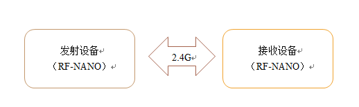

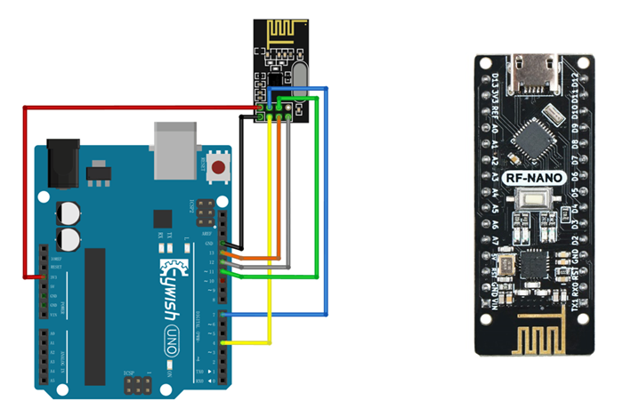


### 程序原理

**发射流程:**
1、首先将NRF24L01+配置为发射模式，
2、接着把接收端的地址TX_ADDR和要发送的数据TX_PLD按照时序由SPI口写入NRF24L01+缓存区。
3、Arduino将CE配置为高电平并保持至少10μs，延迟130μs后发射数据；若自动应答开启，那么NRF24L01+在发射数据后立即进入接收模式，接收应答信号。如果收到应答，则认为此次通信成功。
4、NRF24L01+会自动将TX_DS置高，同时TX_PLD从发送堆栈中清除；若未收到应答，则自动重新发射该数据，若重发次数（ARC_CNT）达到上限，MAX_RT置高，TX_PLD不会被清除；MAX_RT或TX_DS置高时，IRQ变低触发MCU中断。最后发射成功时，若CE为低，则NRF24L01+进入待机模式
5、若发送堆栈中有数据且CE为高，则进入下一次发射；若发送堆栈中无数据且CE为高，则进入发射空闲模式。 

**接收数据流程:**
1、NRF24L01+接收数据时，首先将NRF24L01+配置为接收模式，
2、接着延迟130μs进入接收状态等待数据的到来。当接收方检测到有效的地址和CRC时，就将数据包存储在接收堆栈中，同时中断标志位RX_DR置高，IRQ变低，以便通知MCU去取数据。
3、若此时自动应答开启，接收方则同时进入发射状态回传应答信号。最后接收成功时，若CE变低，则NRF24L01+进入空闲模式1。

###　程序代码

####  发射数据程序代码：

```
#include <SPI.h>
#include "Mirf.h"
#include "nRF24L01.h"
#include "MirfHardwareSpiDriver.h"
Nrf24l Mirf = Nrf24l(10, 9);
byte value;

void setup()
{
  Serial.begin(9600);
  Mirf.spi = &MirfHardwareSpi;
  Mirf.init();
  //Set your own address (sender address) using 5 characters
  Mirf.setRADDR((byte *)"ABCDE");
  Mirf.payload = sizeof(value);
  Mirf.channel = 90;              //Set the channel used
  Mirf.config();
}

void loop()
{
  Mirf.setTADDR((byte *)"FGHIJ");           //Set the receiver address
  value = random(255);                      //0-255 random number
  Mirf.send(&value);                //Send instructions, send random number value
  Serial.print("Wait for sending.....");
  while (Mirf.isSending())//Until you send successfully, exit the loop
  delay(1);        
  Serial.print("Send success:");
  Serial.println(value);
  delay(1000);
}

```
#### 发射设备发送的数据

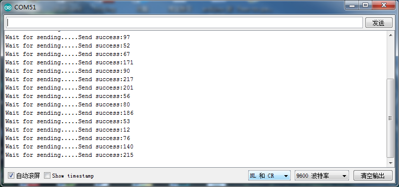


####  接收数据程序代码：

```
//Receiver program
#include <SPI.h>
#include "Mirf.h"
#include "nRF24L01.h"
#include "MirfHardwareSpiDriver.h"
Nrf24l Mirf = Nrf24l(10, 9);
byte value;
void setup()
{
  Serial.begin(9600);
  Mirf.spi = &MirfHardwareSpi;
  Mirf.init();
  Mirf.setRADDR((byte *)"FGHIJ"); //Set your own address (receiver address) using 5 characters
  Mirf.payload = sizeof(value);
  Mirf.channel = 90;             //Set the used channel
  Mirf.config();
  Serial.println("Listening...");  //Start listening to received data
}

void loop()
{
  if (Mirf.dataReady()) { //When the program is received, the received data is output from the serial port
    Mirf.getData(&value);
    Serial.print("Got data: ");
    Serial.println(value);
  }
}
```


#### 接收设备接收的数据


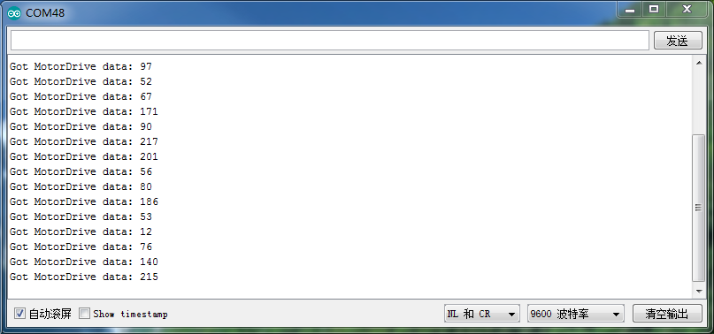


## 实现多个发送对一个接收通讯

###　实验原理框图


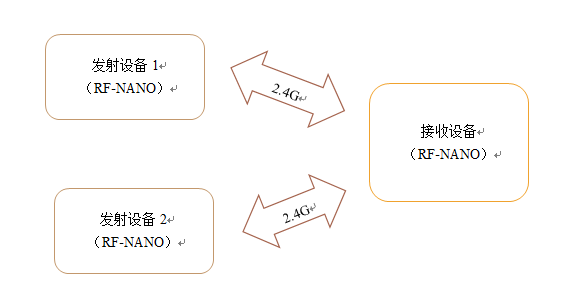


### 程序代码

#### 发射数据程序1代码
```
#include <SPI.h>
#include "Mirf.h"
#include "nRF24L01.h"
#include "MirfHardwareSpiDriver.h"
Nrf24l Mirf = Nrf24l(10, 9);
int value;

void setup()
{
    Serial.begin(9600);
    Mirf.spi = &MirfHardwareSpi;
    Mirf.init();
    //Set your own address (sender address) using 5 characters
    Mirf.setRADDR((byte *)"ABCDE");
    Mirf.payload = sizeof(value);
    Mirf.channel = 10;              //Set the channel used
    Mirf.config();
}

void loop()
{
    Mirf.setTADDR((byte *)"FGHIJ");           //Set the receiver address
    value = 100;
    Mirf.send((byte *)&value);                //Send instructions, send random number value
    Serial.print("Wait for sending.....");
    while (Mirf.isSending()) delay(1);        //Until you send successfully, exit the loop
    Serial.print("Send success:");
    Serial.println(value);
    delay(1000);
}

```
#### 发射设备1发送的数据


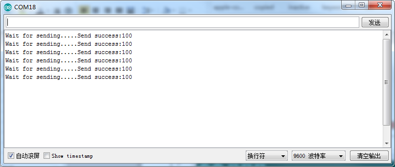


#### 发射数据程序2代码

```
#include <SPI.h>
#include "Mirf.h"
#include "nRF24L01.h"
#include "MirfHardwareSpiDriver.h"
Nrf24l Mirf = Nrf24l(10, 9);
int value;

void setup()
{
  Serial.begin(9600);
  Mirf.spi = &MirfHardwareSpi;
  Mirf.init();
  //Set your own address (sender address) using 5 characters
  Mirf.setRADDR((byte *)"ABCDE");
  Mirf.payload = sizeof(value);
  Mirf.channel = 20;              //Set the channel used
  Mirf.config();
}

void loop()
{
    Mirf.setTADDR((byte *)"FGHIJ");           //Set the receiver address
    value = 200;                      //0-255 random number
    Mirf.send((byte *)&value);                //Send instructions, send random number value
    Serial.print("Wait for sending.....");
    while (Mirf.isSending()) delay(1);        //Until you send successfully, exit the loop
    Serial.print("Send success:");
    Serial.println(value);
    delay(1000);
}

```
####　发射设备2发送的数据


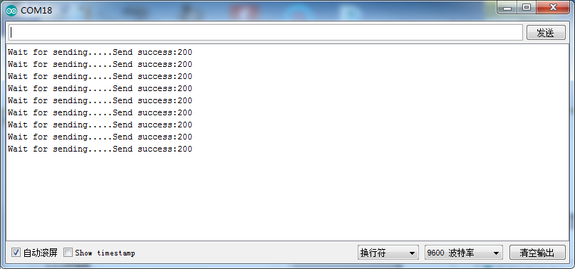


#### 接收数据程序代码

```
//Receiver program
#include <SPI.h>
#include "Mirf.h"
#include "nRF24L01.h"
#include "MirfHardwareSpiDriver.h"

Nrf24l Mirf = Nrf24l(10, 9);

int value;

void setup()
{
  Serial.begin(9600);
  Mirf.spi = &MirfHardwareSpi;
  Mirf.init();
  Mirf.setRADDR((byte *)"FGHIJ"); //Set your own address (receiver address) using 5 characters
  Mirf.payload = sizeof(value);
  Mirf.channel = 10;             //Set the used channel
  Mirf.config();
  Serial.println("Listening...");  //Start listening to received data
}

void loop()
{

    Mirf.ceLow();
    Mirf.configRegister(RF_CH, 10);  //switch channel 10
    Mirf.ceHi();
    if (Mirf.dataReady()) { //When the program is received, the received data is output from the serial port
        Mirf.getData((byte *) &value);
        Serial.print("Got Emitter1 data is: ");
        Serial.println(value);
    }
     delay(1000);

     
    Mirf.ceLow();
    Mirf.configRegister(RF_CH, 20);  //switch channel 20
    Mirf.ceHi();
    if (Mirf.dataReady()) { //When the program is received, the received data is output from the serial port
        Mirf.getData((byte *) &value);
        Serial.print("Got Emitter2 data is: ");
        Serial.println(value);
    }
     delay(1000);

}

```
#### 接收设备接收的数据


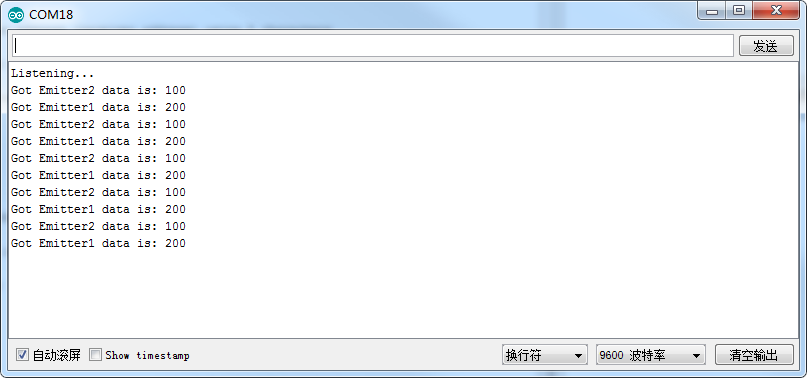


## 实现一个发送对多个接收通讯

### 实验原理框图


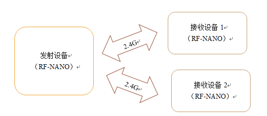


### 程序代码

#### 发射数据程序代码

```
#include <SPI.h>
#include "Mirf.h"
#include "nRF24L01.h"
#include "MirfHardwareSpiDriver.h"
Nrf24l Mirf = Nrf24l(10, 9);
int value1,value2;

void setup()
{
    Serial.begin(9600);
    Mirf.spi = &MirfHardwareSpi;
    Mirf.init();
    //Set your own address (sender address) using 5 characters
    Mirf.setRADDR((byte *)"ABCDE"); 
}

void loop()
{
    Mirf.payload = sizeof(value1);
    Mirf.channel = 10;              //Set the channel used
    Mirf.config();
    if(Mirf.channel == 10)
    {
    Mirf.setTADDR((byte *)"FGHIJ");           //Set the receiver address
    value1 = 100;
    Mirf.send((byte *)&value1);                //Send instructions, send random number value
    Serial.print("Wait for sending.....");
    while (Mirf.isSending()) delay(1);        //Until you send successfully, exit the loop
    Serial.print("value1 Send success:");
    Serial.println(value1);
    delay(500);
    }
    Mirf.payload = sizeof(value2);
    Mirf.channel = 20;              //Set the channel used
    Mirf.config();
    if(Mirf.channel == 20)
    { 
    Mirf.setTADDR((byte *)"KLMNO");           //Set the receiver address
    value2 = 200;
    Mirf.send((byte *)&value2);                //Send instructions, send random number value
    Serial.print("Wait for sending.....");
    while (Mirf.isSending()) delay(1);        //Until you send successfully, exit the loop
    Serial.print("value2 Send success:");
    Serial.println(value2);
    delay(500);
    }
}

```
#### 发射设备发送的数据


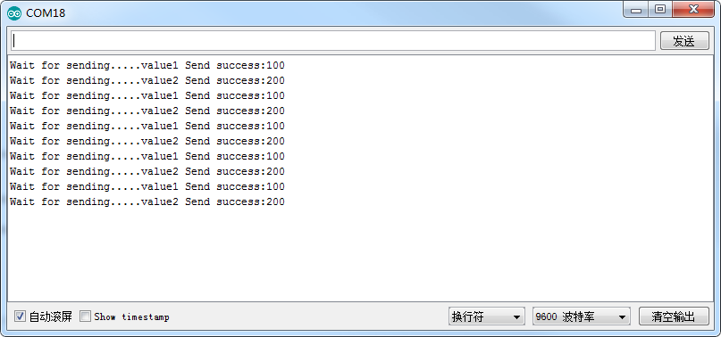


#### 接收设备1代码

```
#include <SPI.h>
#include "Mirf.h"
#include "nRF24L01.h"
#include "MirfHardwareSpiDriver.h"

Nrf24l Mirf = Nrf24l(10, 9);

int value;

void setup()
{
  Serial.begin(9600);
  Mirf.spi = &MirfHardwareSpi;
  Mirf.init();
  Mirf.setRADDR((byte *)"FGHIJ"); //Set your own address (receiver address) using 5 characters
  Mirf.payload = sizeof(value);
  Mirf.channel = 10;             //Set the used channel
  Mirf.config();
  Serial.println("Listening...");  //Start listening to received data
}

void loop()
{

    Mirf.ceLow();
    Mirf.configRegister(RF_CH, 10);  //switch channel 10
    Mirf.ceHi();
    if (Mirf.dataReady()) { //When the program is received, the received data is output from the serial port
        Mirf.getData((byte *) &value);
        Serial.print("Receive1 got data is: ");
        Serial.println(value);
    }
     delay(800);
      
}

```
#### 接收设备1接收的数据


#### 接收设备2程序代码

```
#include <SPI.h>
#include "Mirf.h"
#include "nRF24L01.h"
#include "MirfHardwareSpiDriver.h"

Nrf24l Mirf = Nrf24l(10, 9);

int value;

void setup()
{
  Serial.begin(9600);
  Mirf.spi = &MirfHardwareSpi;
  Mirf.init();
  Mirf.setRADDR((byte *)"KLMNO"); //Set your own address (receiver address) using 5 characters
  Mirf.payload = sizeof(value);
  Mirf.channel = 20;             //Set the used channel
  Mirf.config();
  Serial.println("Listening...");  //Start listening to received data
}

void loop()
{    
    Mirf.ceLow();
    Mirf.configRegister(RF_CH, 20);  //switch channel 20
    Mirf.ceHi();
    if (Mirf.dataReady()) { //When the program is received, the received data is output from the serial port
        Mirf.getData((byte *) &value);
        Serial.print("Receive2 got data is: ");
        Serial.println(value);
    }
     delay(1000);

}

```

#### 接收设备2接收的数据


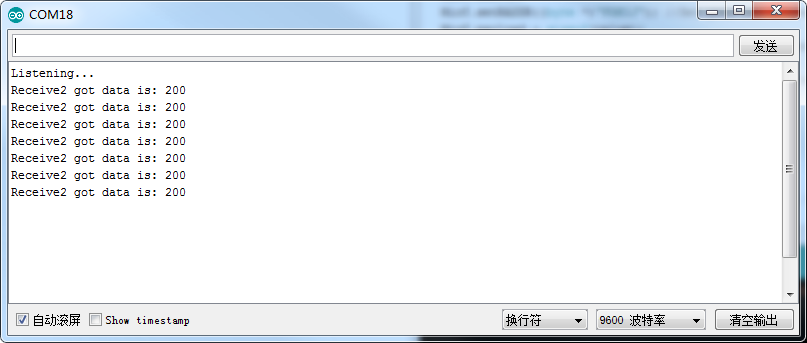


# 设置RF-NANO发射功率和数据发送速率

## 设置RF-NANO发射功率

RF-NANO发射功率共有4个等级，分别是：-18dBm, -12dBm, -6dBm, 0dBm;发射功率越大，传输距离越远；发射功率可以在软件中设置，打开 RF-NANO实验例程程序,在`Mirf.cpp`中有设置发射功率的函数：`SetOutputRF_PWR(uint8_t val)`，可设置不同的发射功率，注意需要在关断模式下设置寄存器值，所以在`config()`这个函数中调用。

```
void Nrf24l::SetOutputRF_PWR(uint8_t val) //Set tx power : 0=-18dBm,1=-12dBm,2=-6dBm,3=0dBm,
{
   configRegister(RF_SETUP,  (val<< RF_PWR) );
 }
void Nrf24l::config()
// Sets the important registers in the MiRF module and powers the module
// in receiving mode
// NB: channel and payload must be set now.
{
  configRegister(RF_CH, channel);      // Set RF channel
  configRegister(RX_PW_P0, payload);   // Set length of incoming payload
  configRegister(RX_PW_P1, payload);
  SetSpeedDataRates(0);               //Select between the high speed data rates:250Kbps
  powerUpRx();                        // Start receiver
  flushRx();
}

```
## 设置RF-NANO数据传输速率

RF-NANO数据传输速率共有3个等级，分别是：1Mbps, 2Mbps, 250Kbps ; 数据传输速率可以在软件中设置，打开 RF-NANO实验例程程序,在`Mirf.cpp`中有设置数据传输速率的函数：`SetSpeedDataRates(uint8_t val)`，可设置不同的发射功率。注意需要在关断模式下设置寄存器值，所以在`config()`这个函数中调用。

```
void Nrf24l::SetSpeedDataRates(uint8_t val) //Select between the high speed data rates:0=1Mbps, 1=2Mbps, 2=250Kbps
{
   if(val>1)
   {
    configRegister(RF_SETUP,  (1 << RF_DR_LOW) );
    }
 else
  {
   configRegister(RF_SETUP,  (val << RF_DR_HIGH) );
  }
}


```

