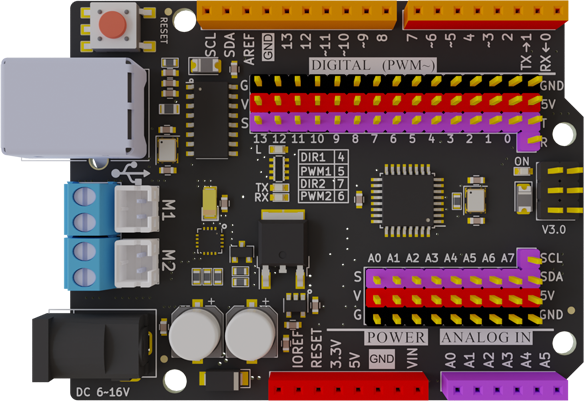
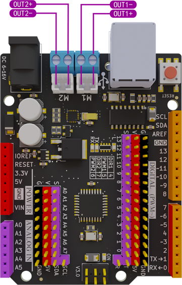

# Maker-Uno 使用说明书
[English](README.md) 中文版

- [产品简介](#产品简介) 
- [产品参数](#产品参数) 
- [引脚说明](#引脚说明) 
- [电机功能说明](#电机功能说明) 
- [指示灯说明](#指示灯说明) 
- [CH340G驱动安装](#CH340G驱动安装) 
- [FAQ](#FAQ) 
- [联系我们](#联系我们)
## [购买链接](https://item.taobao.com/item.htm?spm=a1z10.5-c-s.w4002-21556097795.26.23ae6b0dJkBCqZ&id=680974076367)



## 产品简介

​	Maker-Uno是基于Arduino Uno R3基础上开发的一款适用于创客的标志性产品， 功能和引脚完全兼容传统Arduino Uno主板 ,板载2路电机驱动芯片最大驱动电流2A，所有IO口用排针引出，串口芯片为CH340G。

## 产品参数
|功能|Arduino Uno|Maker-Uno|
| :-: | :-: | :-: |
| 微控制器 | ATmega328P | ATmega328P |
| 串口芯片 | Atmega16u2 | CH340G |
| 输入电压 | 7-12 V | 7-16V |
| 工作电压 (输出电流) | 5V(500mA) | 5V(1000mA) |
| 3.3V最大输出电流 | 150mA | 500mA |
| 主频 | 外部晶振 16M | 外部晶振 16M |
| 输入电压 | 7-12 V | 7-16V |
| Flash | 32K(引导占0.5k) | 32K(引导占0.5k) |
| SRAM | 2K | 2K |
| ERROM | 1K | 1K |
| 电机驱动芯片 | 无 | TC78H660FTG |
| IO接口 | 排母 | 排针+排母 |
| 尺寸/重量 | 68.6 x 53.4 mm / 25g | 68.6 x 53.4 mm / 25g |

## 引脚说明 


#### **[产品原理图](./picture/Maker_Uno.pdf)**

## 电机功能说明

​		电机驱动芯片为TC78H660FTG，最大驱动电流为2A。只需要2路PWM和2路普通io就可以驱动2路电机，减少PWM口占用，不能驱动大功率电机，只能驱动常规的TT电机与积木电机。



DIR1：控制 M1电机方向		DIR2：控制M2电机方向		PWM1：控制M1电机转		PWM2：控制M2电机转速
|DIR1(D4)|PWM1(D5)|DIR2(D7)|PWM2(D6)| OUT1+ | OUT1- | OUT2+ | OUT2- | Mode |
| :-: | :-: | :-: | :-: | :-: | :-: | :-: | :-: | :----: |
| H | H | — | — | H | L | — | — | `M1正转` |
| L | H | — | — | L | H | — | — | `M1反转` |
| — | — | H | H | — | — | H | L | `M2正转` |
| — | — | L | H | — | — | L | H | `M2反转` |
| — | L | — | L | L | L | L | L | `M1,M2停止` |

**注：** L :低电平 		H：高电平		—：无		


**Arduino 电机测试案例**

```
#define DIR1 4  // define direction 4 port
#define PWM1 5  // define pwm1 5 port
#define DIR2 7  // define direction 7 port
#define PWM2 6  // define pwm2 6 port

void setup() {
  Serial.begin(9600);
  pinMode(DIR1, OUTPUT);
  pinMode(PWM1, OUTPUT);
  pinMode(DIR2, OUTPUT);
  pinMode(PWM2, OUTPUT);
}

void loop() {
  Serial.println("M1,M2 Forward");
  digitalWrite(DIR1, HIGH);
  analogWrite(PWM1, 255);
  digitalWrite(DIR2, HIGH);
  analogWrite(PWM2, 255);
  delay(1000);
  // reversal speed 255
  Serial.println("M1,M2 Reversal");
  digitalWrite(DIR1, LOW);
  analogWrite(PWM1, 255);
  digitalWrite(DIR2, LOW);
  analogWrite(PWM2, 255);
  delay(1000);
  // Stop speed 255
  Serial.println("M1,M2 Stop");
  analogWrite(PWM1, 0);
  analogWrite(PWM2, 0);
  delay(1000); 
}
```

[点击下载电机测试程序](./example/DC_Motor/DC_Motor.ino)

## 指示灯说明

- ON标识的红色等为电源指示灯，供电后会常亮
- L 标识的黄色灯为BootLoader识别指示灯，当通过USB连接电脑后，端口识别到板子的时候该LED灯会快速闪烁。
- RX 标识的LED灯为串口接收指示灯，当串口接收到数据，LED灯会闪烁。
- TX 标识的LED灯为串口发送指示灯，当串口发送数据时，LED灯会闪烁。

## CH340G驱动安装
[CH340G驱动下载链接](https://www.wch.cn/downloads/CH341SER_ZIP.html)

安装方法请自行百度

## FAQ:

1. 板子能驱动那些电机？

 答：支持驱动TT塑料电机与积木电机，支持12V 2A内的电机，不支持大功率电机。

2. 为什么电机不动？

答：请先检查是否接上外接了6~16V以内的DC头电源，如果没有接外接电源请接上外接电源。若外接电源接上了，请检查程序是否上传成功。

3. 如何确认bootloader是否掉了？

答：按下复位键后，L指示灯连续闪烁3三次表示bootloader没有掉，如果按下复位键L指示灯没有闪烁那就表明bootloader掉了，需要重新烧录bootloader。

  4.如何确定板子损坏

a、先确定板子上的ON灯是否亮起，如果供电正确，ON不亮代表，主板有地方短路，可能芯片或者电源烧了

b、检查bootloard是否正常，如不正常请重新上传或者返厂维修。

## 联系我们

**技术 + 合作：WX号:  EmakefunService**