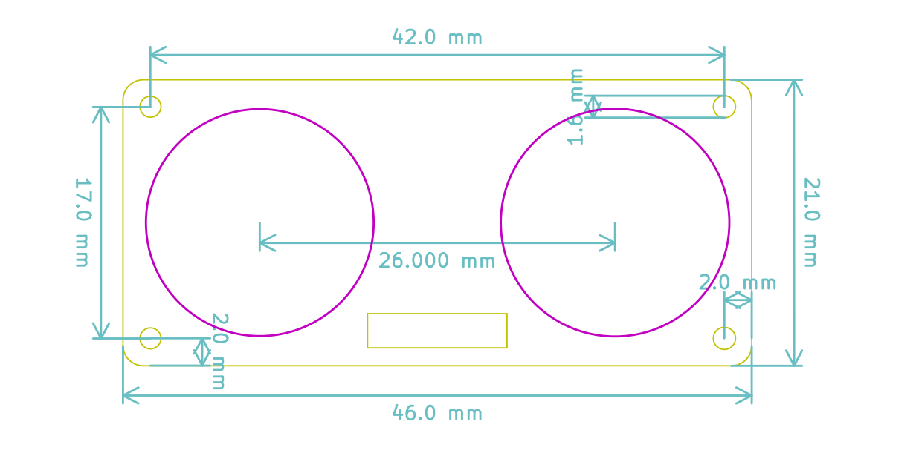
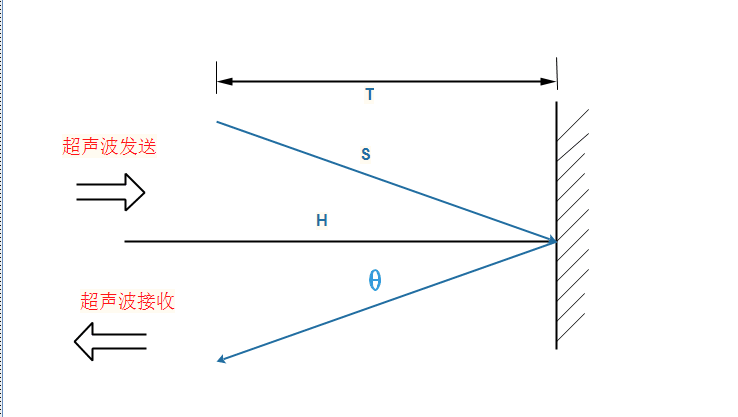
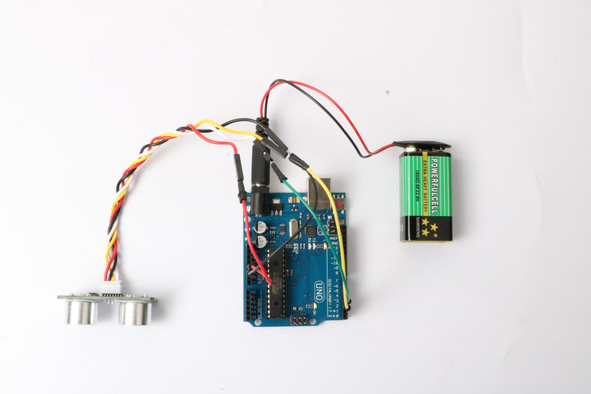
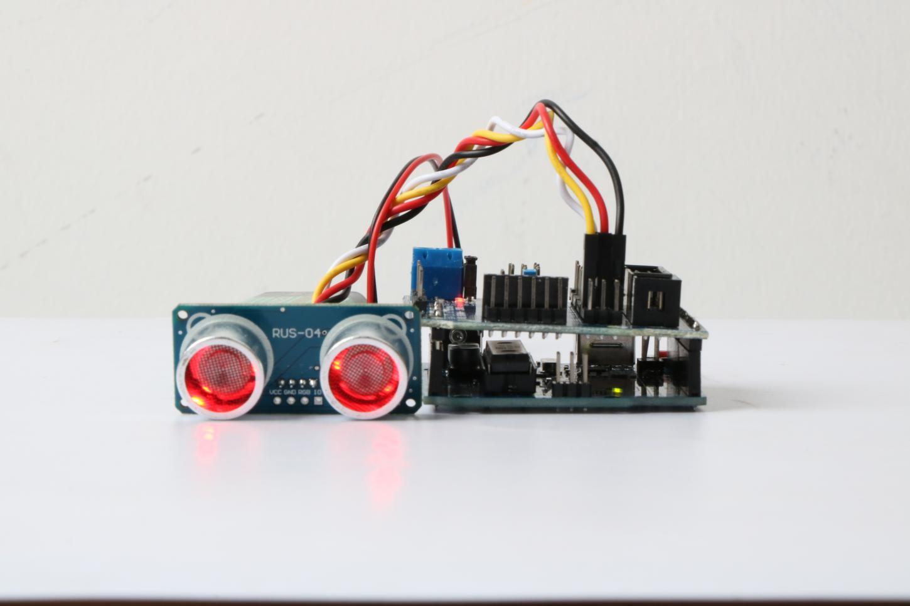

#  概述


## 产品简介

 RUS-04是由 深圳市易创空间科技有限公司 (www.emakefun.com )研发的一款将RGB灯珠和超声波测距模块集成在一起的全新模块。功能尺寸大小完全兼容HC-SR04模块，操作用由原来需要两个GPIO口操作，到现在只需要一个GPIO即可操作超声波收发，并且在超声波探头测距的同时，左右探头可以发出7彩炫彩灯光。

[淘宝链接](https://item.taobao.com/item.htm?spm=a1z10.5-c.w4002-21556097795.29.69e579bbYtXxTj&id=614088271768)


## RUS-04模块参数

- 工作电压：3.5V~5.5V。特别说明，绝对不允许超过5.5V
- 功耗电流：不开灯珠15mA，开灯珠65m
- 谐振频率：40K
- 探测距离范围：2cm～4米,
- 误差：0.1cm+
- 输入触发信号：只需要一个IO口发送10usTTL脉冲触发
- 工作温度范围：-40℃~100℃
- 感应角度：小于15度
- 外形尺寸：46mm*21mm*20mm（H）固定孔尺寸 4*Φ1.8mm
- 接口：支持PH2.0mm-4pin和2.54mm排针两种接线方式




# 模块原理介绍

## RUS-04原理图介绍
RUS04超声波模块采用一款内部集成超声波发送电路，超声波接收电路，数字信号处理等电路工业级集成电路。单芯片即可完成超声波测距，测试结果通过脉宽的方式进行输出，通信电平为TTL电平。

芯片配合使用40KHZ开放式超声波探头，只需要1个22M欧姆的下拉电阻和8M晶振即可实现高性能测距功能。


## RUS-04模块工作原理

现阶段最常用的HC-SR04超声波是4Pin(VCC, Trig, Echo, GND)，工作时需要Trig发送触发信号，发送超声波信号，回波检测引脚Echo接收超声波返回信号。RUS-04模块我们经过优化，只需要3pin(VCC, GND, IO)即可完成测距，IO先设置成输出模式触发超声波发送信号，然后再将IO设置成输入模式，等待回波信号。

不管上面是哪种方式触发，超声波测距的方法都是回声探测法，即超声波发射器向某一方向发射超声波，在发射时刻的同时计时器开始计时，超声波在空气中传播，途中碰到障碍物面阻挡就立即反射回来，超声波接收器收到反射回的超声波就立即停止计时，工作时序图如图所示。超声波在空气中的传播速度为340m/s，根据计时器记录的时间t，就可以计算出发射点距障碍物面的距离s，即：s=340t/2。

工作过程
1、IO口设置成输出模式，给至少10us的高电平信号。
2、RUS-04模块超声波自动发送8个40khz的方波。
3、IO口设置成输入模式，等待有信号返回，当检测到一个高电平，高电平持续的时间就是超声波从发射到返回的时间，测试距离=(高电平时间X声速(340M/S))/2。


我们来分析一下这个时序图，先由触发信号启动超声波测距模块，也就是说，主机要先发送至少10us的高电平，触发超声波模块,模块内部发出信号是传感器自动回应的，我们不用去管它。输出回响信号是我们需要关注的。信号输出的高电平就是超声波发出到重新返回接收所用的时间。用定时器，可以把这段时间记录下来，算出距离，别忘了结果要除于2，因为总时间是发送和接收的时间总和。

由于超声波也是一种声波，其声速V与温度有关。在使用时，如果传播介质温度变化不大，则可近似认为超声波速度在传播的过程中是基本不变的。如果对测距精度要求很高，则应通过温度补偿的方法对测量结果加以数值校正。声速确定后，只要测得超声波往返的时间，即可求得距离。这就是超声波测距的基本原理。




# RGB灯珠介绍

##  RGB LED灯介绍
RUS-04为了使用方便采用了直接集成了LED驱动控制芯片的RGB灯珠，控制芯片内部包含了智能数字接口，数据锁存信号，整形放大驱动电路，还包含有高精度的内部振荡器和15V高压可编程定电流输出驱动器。

RUS-04收发探头分别各集成了3个RGB灯珠。只需一条信号线来控制各个RGB灯发光
Arduino需要控制探头的发光，需要专门的RGB库支持。

# 模块测试实验

## RUS-04模块与Arduino扩展板连接示意图

| RGB 超声波 |	Arduino UNO |
|---- | ----|
| VCC（电源） | VCC |
|GND | GND |
|IO（超声波信号引脚）	 | 3|
|RGB  |	2 |


## 实验一: RUS-04测距程序

打开文件RGB超声波避障模块测试程序中的Ultrasonic.ino文件

```
const int SignalPin = 3;
unsigned long Time_Echo_us = 0;

void setup() {
    Serial.begin(9600);
    Serial.println("Ultrasonic sensor:");
}

void loop() {
    float distance;
    pinMode(SignalPin, OUTPUT);
    digitalWrite(SignalPin, LOW);
    delayMicroseconds(2);
    digitalWrite(SignalPin, HIGH);
    delayMicroseconds(10);
    digitalWrite(SignalPin, LOW);
    pinMode(SignalPin, INPUT);
    Time_Echo_us = pulseIn(SignalPin, HIGH);
if ((Time_Echo_us < 60000) && (Time_Echo_us > 1)) 
{
        distance = Time_Echo_us / 58.00;
        Serial.print("distance is :");
        Serial.print(distance);
        Serial.print("cm");
        Serial.println();  
    }
    delay(1000);
}

```
## 实验一结果: RUS-04模块测试结果


## 实验二：RGB灯光测试

RGB实验我们需要需要引入RgbUltrasonic库
初始化RUS04，第一个参数是超声波读取引脚，第二个是RGB信号脚
`RgbUltrasonic(byte signal_pin, byte rgb_pin);`
获取超声波测距
`uint16_t GetUltrasonicDistance(void);`
设置RGB灯颜色 第一个参数是

```
E_RGB_ALL = 0,
E_RGB_RIGHT = 1,
E_RGB_LEFT = 2
```
第二个参数是24位RGB数值
`void SetRgbColor(E_RGB_INDEX index, long Color);`
这个函数显示RGB特效，总共有呼吸灯，旋转流星，闪烁三种灯效
```
E_EFFECT_BREATHING = 0,
E_EFFECT_ROTATE = 1,
E_EFFECT_FLASH = 2
void SetRgbEffect(E_RGB_INDEX index, long Color, uint8_t effect);
```
下面我们测试所有灯效

## 实验二：RGB灯光测试现象




加了5.0sensor扩展板的实物图




#  Mblock测试程序

## 实验一： RUS-04测距程序


## 实验二：RGB灯光测试


# Mixly测试程序

## 实验一： RUS-04测距程序


##　实验二：RGB灯光测试

