## EmakefunAPP说明

**EmakefunApp是深圳市易创空间科技有限公司出品的一款基于蓝牙和WIFI无线连接操控小车产品的一个手机软件，用户可以通过APP，使用蓝牙遥控，WIFI遥控，红外遥控，PS2遥控，语音遥控等多种方式遥控小车。它同时支持了android和IOS两种操作系统。支持中文，繁体中文，英文三种语言切换。并且支持智能编程，用户可以对小车自行编程，配合APP对应模式完成各种有趣玩法** 。

### 一：连接和断开方式说明

1.蓝牙直连，我们过滤掉了我们不属于我们公司产品的蓝牙设备。

2.Wifi连接。为了方便用户调式。我们把wifi连接修改为自定义IP地址和端口号，默认情况下的IP地址是192.168.4.1。端口号为9000

3.手动端开方式。有的用户在使用APP过程中想要断开蓝牙连接。请直接点击右上角的蓝牙状态显示标签。连接正常时它是显示蓝色的。断开后显示红色。如果断开后想要继续进行连接点击红色状态下的按钮会进入一个蓝牙列表，显示搜索到的蓝牙，点击连接即可。

### 二：功能说明

#### 1.极品飞车模式

该模式下最主要的功能是进行小车操控。用户可以使用操纵杆进行一个0-360°。也可以通过固定的上下左右按钮操控小车前进，后退，左转，右转。这两种操控模式通过左边的模式切换按钮进行切换。底部有一个重力模式的开关。重力模式是通过手机的重力感应操控小车，这时候界面上其余的操控方式全都会失效。值得一提的是。有些小车会自带蜂鸣器所以该界面会多一个喇叭的按钮。如果该小车没有蜂鸣器则不会有这个按钮。然后Hummer-bot需要特别注意。因为他相较于其他小车多了两种功能。一种是机械臂模式。一种是灭火功能。这两种功能的使用前提都是车子上装了该模块。灭火功能点击右上角的轮子按钮即可。机械臂模式的切换也在右边。

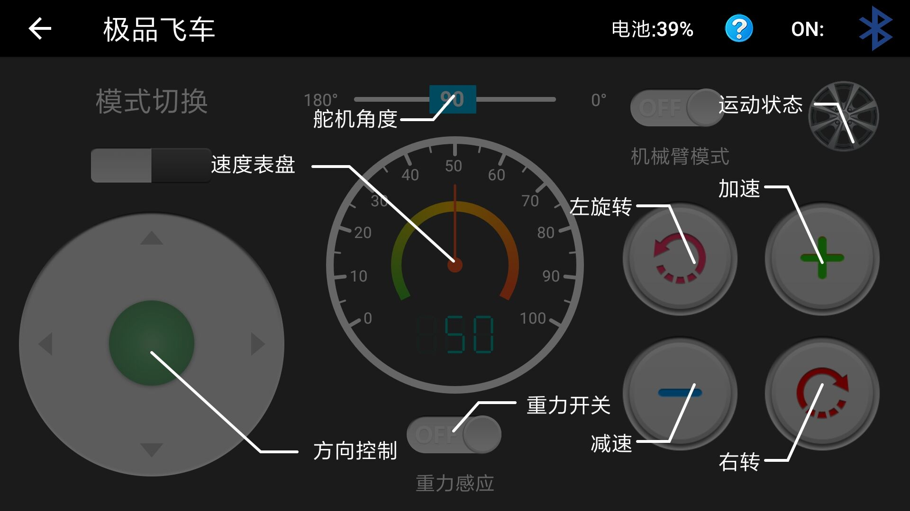

#### 2.你画我跑模式

该模式下用户可自定义小车打的行进路线。右边可设置行进速度

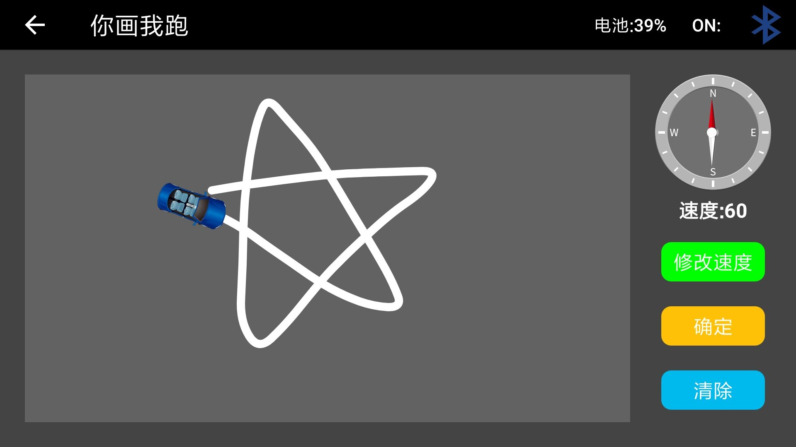

#### 3.红外遥控模式

进入该模式后请直接用红外遥控器对着小车进行操控。如果没有反应可能是速度没加上来。请按下加速键在进行操控。

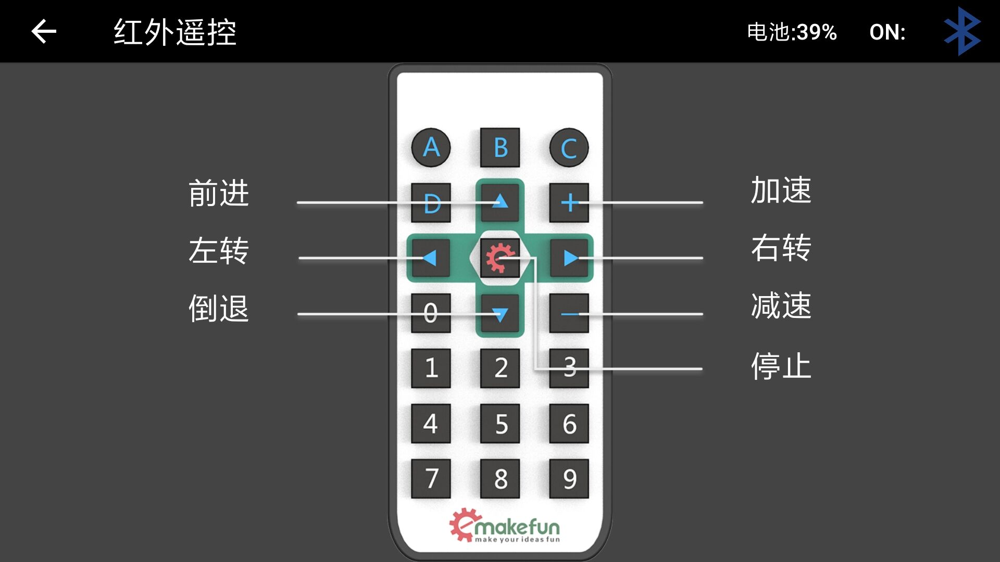

#### 4.PS2模式

进入该模式后请用PS2手柄按下START对PS2信号接收器进行连接。没连接上的时候PS2手柄信号灯为闪烁状态。连接正常时为常亮状态。连接之后使用PS2对小车进行操控即可。

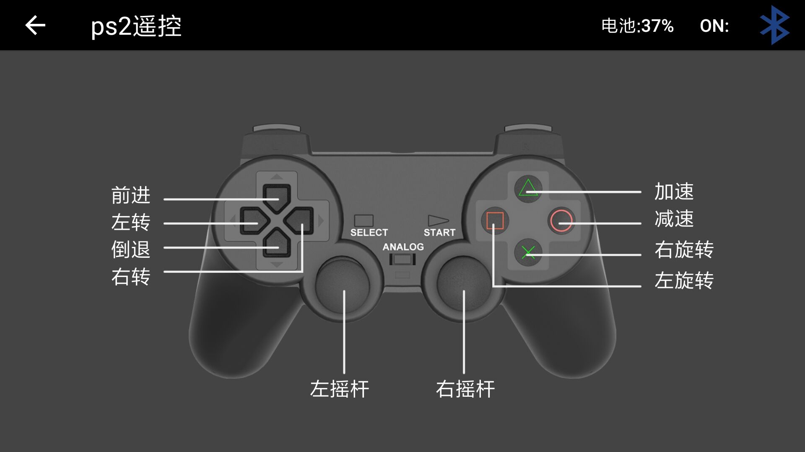

#### 5.避障模式

进入该模式后。不需要任何操作。小车会自己避开障碍物向前行进。同时底部有个跟我走模式的切换开关。把跟我走模式放在避障模式下是因为跟我走模式也是通过避障模块来判断是否有智障物进行移动的。避障模式和跟我走模式是相互切换的，并不共存。

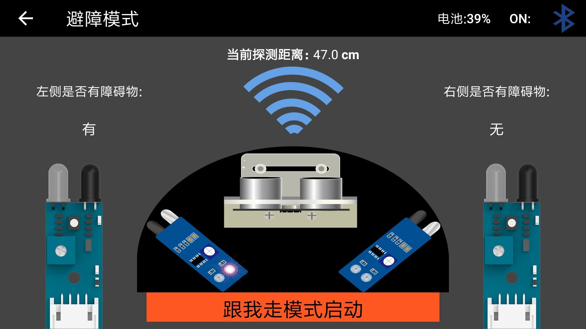

#### 6：红外寻迹模式

进入该模式后。车子底部的寻迹模块会判断是否有黑线。没有返回0.有则返回1。小车会跟着黑线走。

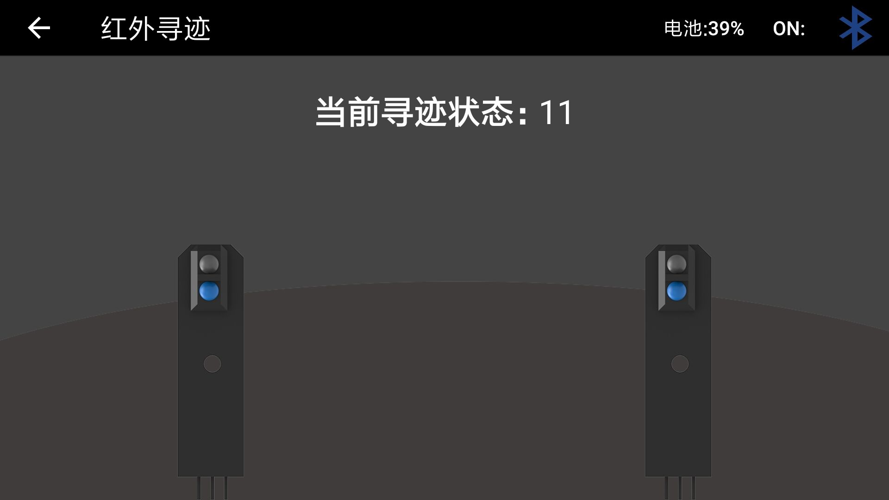

#### 7：RGB模式

该模式主要是操控车灯闪烁的灯光，可自定义RGB值，也可通过调色板选择自己喜欢的颜色。

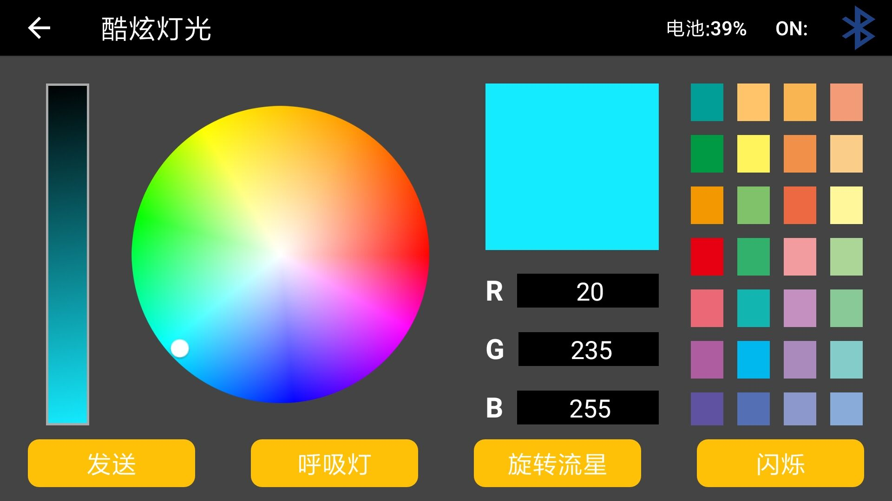

#### 8：语音模式

该模式主要是通过识别语音来控制小车。比如前进.后退.停止等。会通过判断App内的语言下选择识别中文还是英文。需要注意的是该模式下的发音需要一定的标准才能准确识别。具体的操控命令如下。

前进："前，", "前进，", "往前，", "向前，", "往前走，"，"go", "forward", "advance", "go forward", "forge ahead", "go ahead"。

后退："后，", "后退，", "往后，", "向后，", "往后退，"，"retreat", "draw back", "fall back", "back away", "back off", "go back"。

左转："左，", "左转，", "往左，", "向左，", "向左转，"，"turn left", "left"。

右转："右，", "右转，", "往右，", "向右，", "向右转，"，"turn right", "right"。

停止："停，", "停止，"，"stop", "halt", "cease", "suspend", "call off", "give over"。

加速："加速，"，"speeded up", "speed up", "Faster"。

减速："减速，"，"speeded down", "slow down", "speed down"。

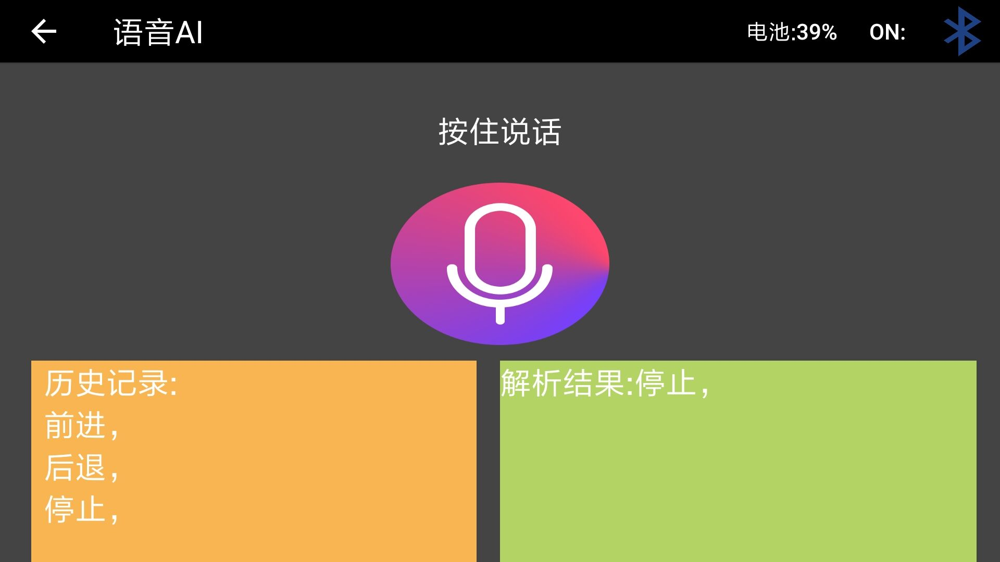

#### 9：寻光模式

该模式下光敏传感器将返回左右的光敏值。小车通过光敏值来向光源移动

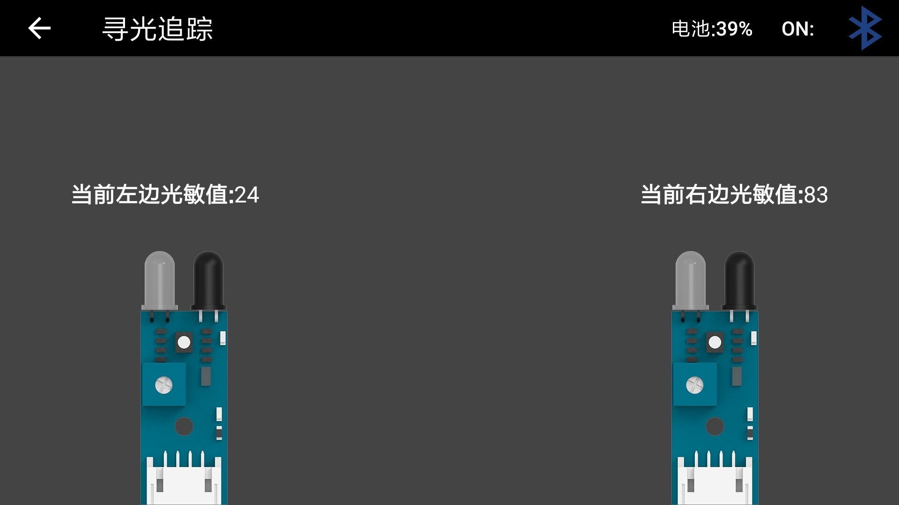

#### 10：表情模式

该模式只有带有LED模块的小车可以使用。你可以在8*24的LED显示屏来显示自定义文字，表情。也可以通过不断发送表情或者文字来形成动画。并且让动画循环显示。当然，APP内也自带了一些表情，数字和动画。值得注意的是在播放动画时可以设置次数。默认是无限循环播放该动画。输入1的话会把该动画进行滚动播放。当你退出表情界面时正在播放的动画会被全部清空，但是表情不会，表情会一直存在。

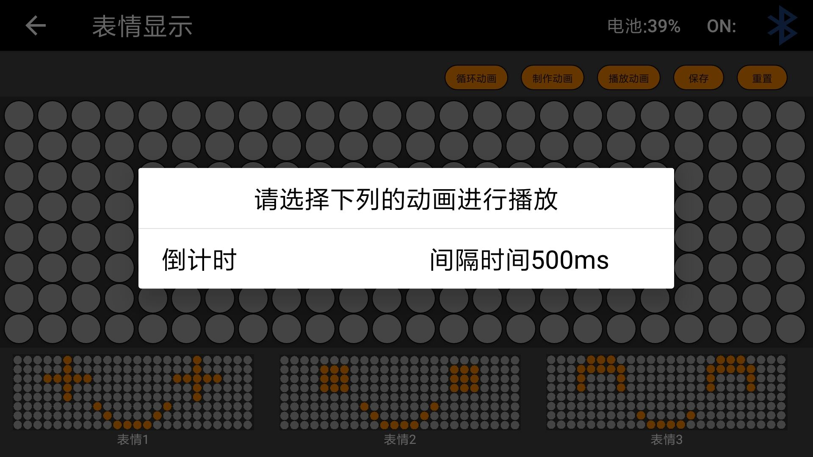

#### 11：钢琴模式

该模式只有带有蜂鸣器的小车才会有。主要功能是模仿的钢琴的音效让蜂鸣器发出声音。以及20种不同的音效。同时也可以播放手机内自带的一些让蜂鸣器不断发出声音形成的“音乐”。

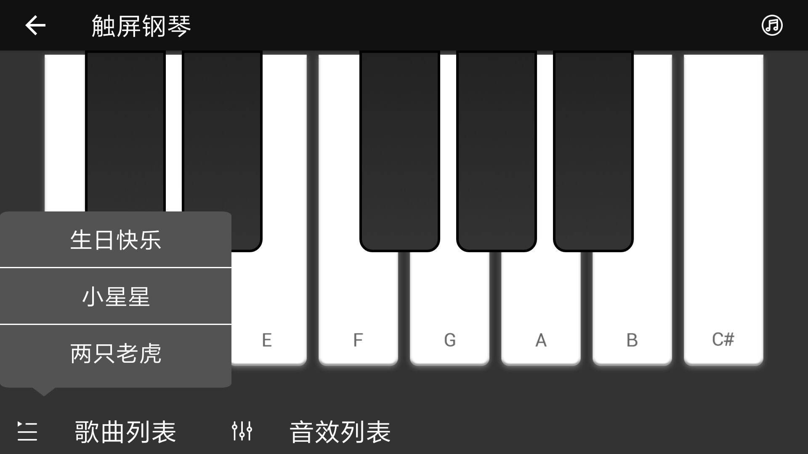

#### 12：Blockly创作模式

该模式使用了各种开源硬件的图形化编程方法，通过图形块的搭建为电子硬件编写程序，展现创意，是一款可以让青少年学习编程，快速入门编程。 

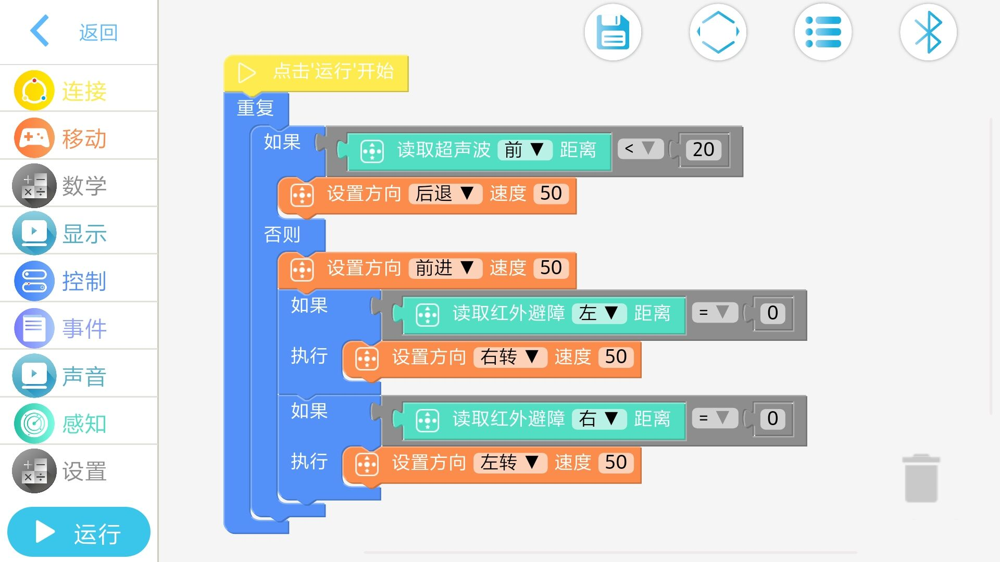