# 蓝牙手柄V2.0

## 一、实物图

## 二、介绍

此款手柄是使用经典蓝牙与ESP32芯片系列进行直连控制，用户在开发板受控端的代码中输入手柄背部的蓝牙配对码连接使用，不会与其他手柄或者开发板串扰。使用方法简单方便，相对于上一个版本手柄，省去了读取ESP32蓝牙MAC地址再配置到手柄的这一繁琐的过程。

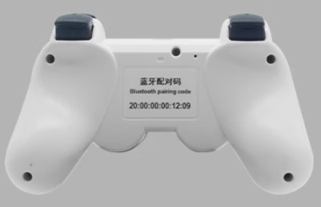

## 三、规格参数

- 电池容量：400mA

- 充电：5V0.5A、5V1A、5V2A

- 震动反馈：无

- 蓝牙连接距离：约10M

- 蓝牙标准：仅支持传统经典蓝牙，不支持低功耗蓝牙 (Bluetooth LE)

- 支持的芯片系列：

| 芯片系列 | 是否支持 |
| --- | --- |
| ESP32系列 | 是 |
| ESP32-P系列 | 否 |
| ESP32-S系列 | 否 |
| ESP32-C系列 | 否 |
| ESP32-H系列 | 否 |
| ESP8266系列 | 否 |

**请前往乐鑫官网（[https://www.espressif.com.cn/zh-hans/products/socs]）确认你的开发板或者模组对应的芯片系列，此款手柄不能用于ESP32芯片系列以外的芯片。**

  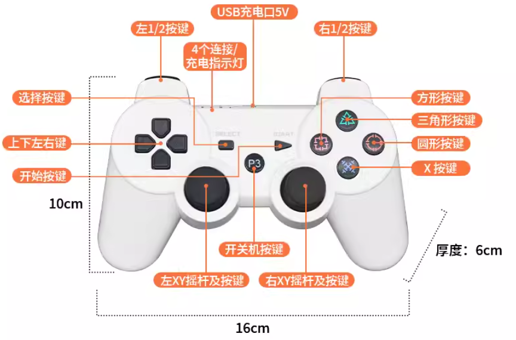

## 四、使用步骤

- 第一次使用前请插在电脑的USB端口或者5V输出的电源适配器上充会儿电，约5分钟即可，避免在使用过程中因亏电而出现莫名其妙的现象。

### 4.1 Arduino IDE

#### 4.1.1 安装库

先下载安装库`PS3 Controller Host`，这是Arduino官方库，使用Arduino IDE搜索并安装 PS3 Controller Host，该库的相关介绍可以参考官网：<https://www.arduino.cc/reference/en/libraries/ps3-controller-host/>

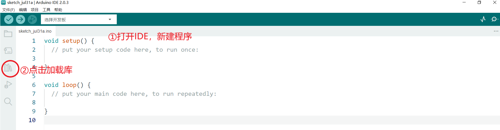

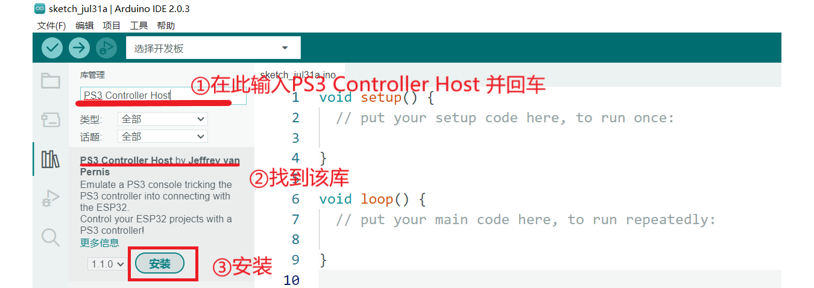

#### 4.1.2 输入蓝牙配对码并运行示例代码

将ESP32主板与电脑连接，主板型号选择ESP32-WROOM-DA Module，如下图：

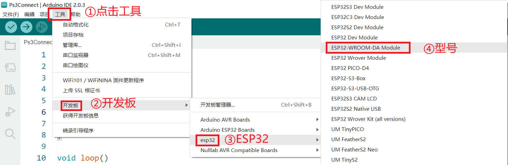

Arduino IDE打开`PS3 Controller Host`的**连接**，示例代码：**Arduino IDE -> 文件 -> 示例 -> PS3 Controller Host -> Ps3Connect**

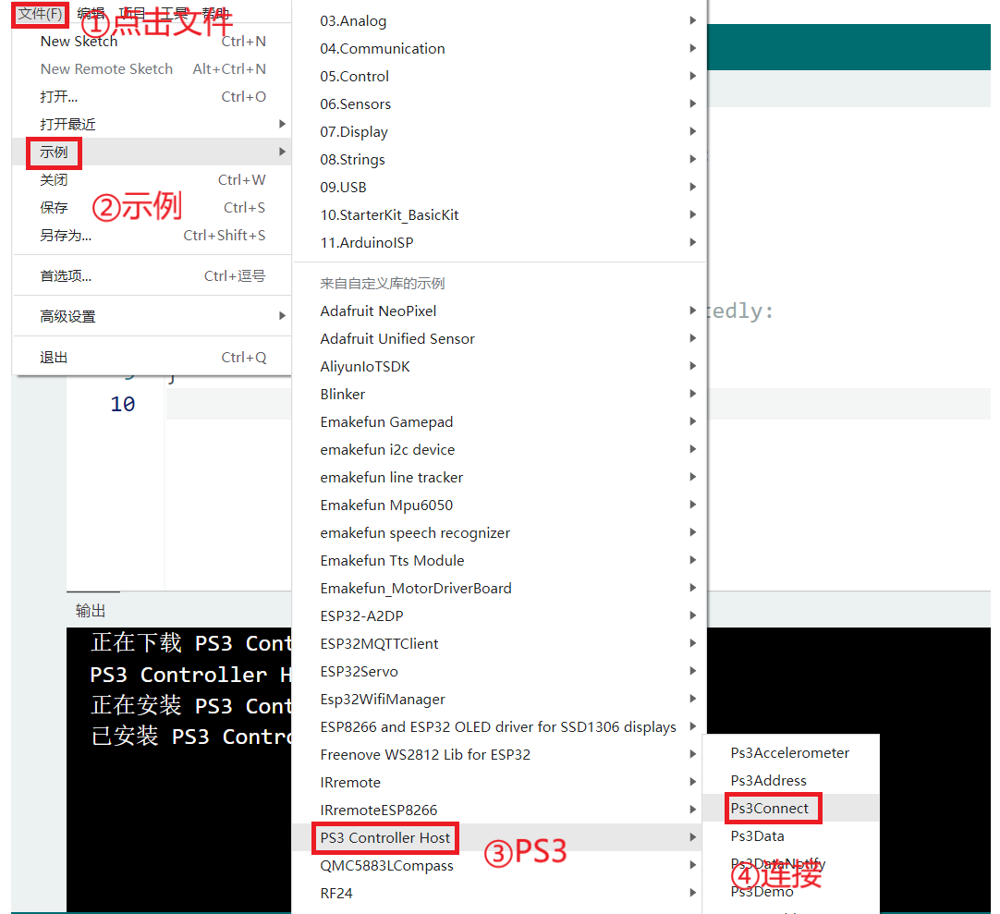

将手柄背部的`蓝牙配对码`输入到代码中运行，例如手柄蓝牙配对码为`02:00:01:23:45:67`

在示例代码中，找到`setup`函数中的代码`Ps3.begin("01:02:03:04:05:06");`，将其修改为`Ps3.begin("02:00:01:23:45:67");`，注意！每个手柄的配对码都不同！！！

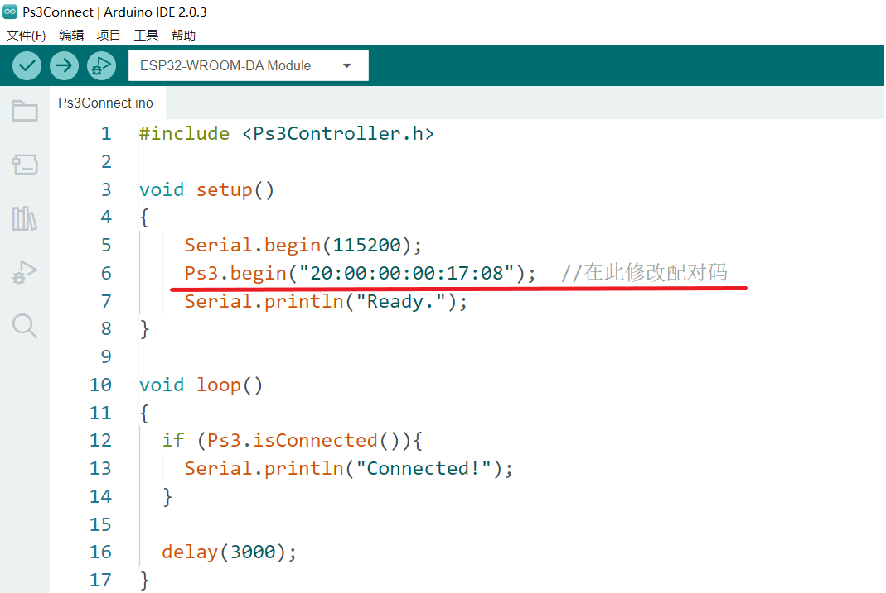

保存后编译烧录到ESP32，烧录完成按下板子复位键进行复位，运行成功后串口（示例代码中设置的串口波特率为115200）会有如下打印：

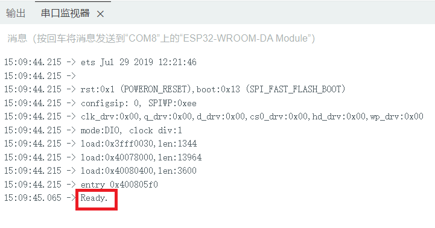

#### 4.1.3 配对连接

1. 将PS3手柄与电脑或者电源适配器断开连接，不要插任何数据线或者充电线！

2. 将ESP32主板下载好程序并保持与电脑连接，打开IDE的串口监视器，保持波特率为115200

3. 长按手柄一下中间的`单圆键`，手柄的**4个指示灯**会同时**快闪**，这时手柄会自动查询连接ESP32，如果是第一次连接可能要再按一下ESP32的复位键，或多次，不同的主板可能反应速度不一样

4. 连接到ESP32后，ESP32串口会循环打印Connected，这样就代表连接成功，如下所示：

   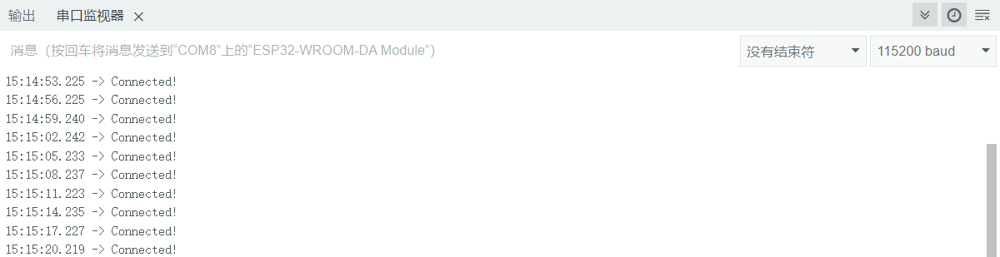

5. 连接成功后4个指示灯会一直闪烁，断线后约10秒会自动关机

#### 4.1.4 按键测试

手柄按键摇杆等测试，请自行运行和学习`PS3 Controller Host`的测试代码

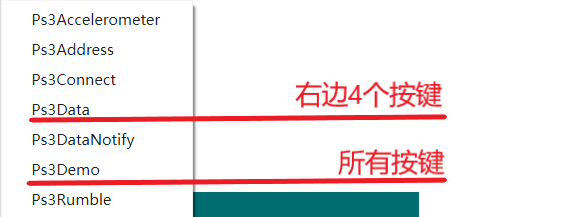

- 测试手柄右边4个按键的测试代码：**Arduino IDE -> 文件 -> 示例 -> PS3 Controller Host -> Ps3Data**

- 测试手柄所有按键的测试代码：**Arduino IDE -> 文件 -> 示例 -> PS3 Controller Host -> Ps3Demo**

- **注意**，运行这些测试代码，都需要将手柄背部的`蓝牙配对码`输入到`setup`函数中`Ps3.begin("xx:xx:xx:xx:xx:xx")`函数中，如`Ps3.begin("02:00:01:23:45:67");`

### 4.2 Mixly

#### 4.2.1 安装库

打开mixly，选择Arduino ESP32 为主板模式，将ESP32主板与电脑连接。

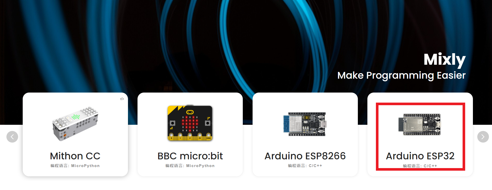

点击软件左上角设置——管理库，添加Emakefun传感器库。

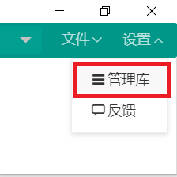

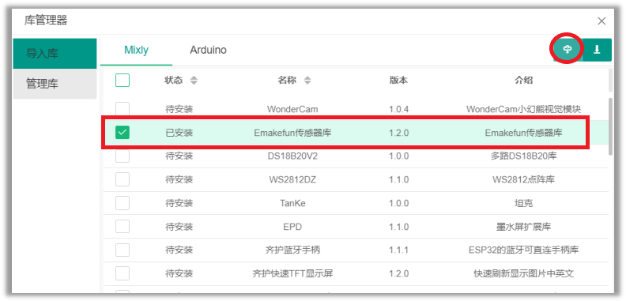

安装后，在EmakefunSensors—通信模块 类别中可找到PS3相关编程指令。

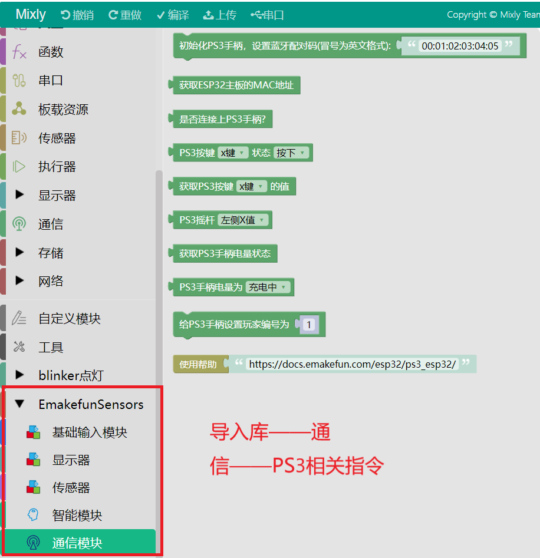

#### 4.2.2 输入蓝牙配对码并运行示例代码

点击此处链接查看[mixly示例程序下载](./ps3按键测试.zip)

参照示例编写程序或使用示例程序，注意输入手柄背面的蓝牙配对码，每个手柄在出厂时已设置不同的配对码。

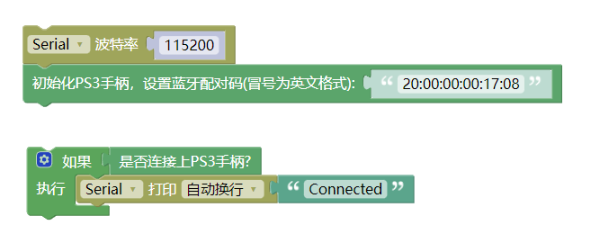

#### 4.2.3 配对连接

1. 将PS3手柄与电脑或者电源适配器断开连接，不要插任何数据线或者充电线！
2. 将ESP32主板下载好程序并保持与电脑连接，打开串口监视器，保持波特率为115200
3. 长按手柄一下中间的`单圆键`，手柄的**4个指示灯**会同时**快闪**，这时手柄会自动查询连接ESP32，如果是第一次连接可能要再按一下ESP32的复位键，或多次，不同的主板可能反应速度不一样
4. 连接到ESP32后，ESP32串口会循环打印Connected，这样就代表连接成功，如下所示：

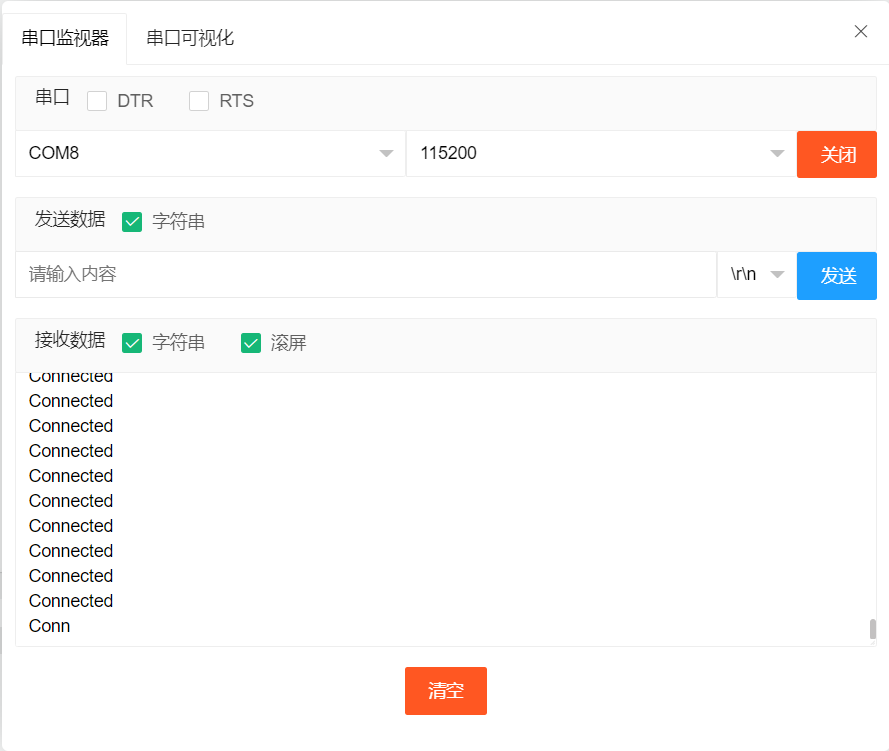

#### 4.2.4 按键测试

点击点击此处链接查看[mixly示例程序下载](./ps3按键测试.zip)

经测试，所有按键在按下时反馈数字1，未按下为0；

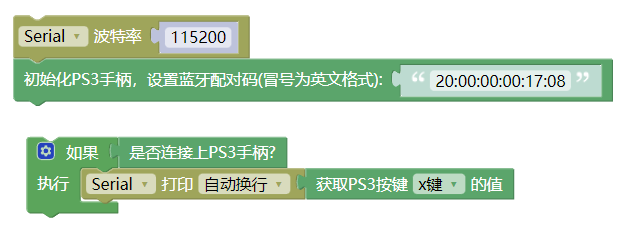

左右摇杆值为-128-127之间，中间值为0;

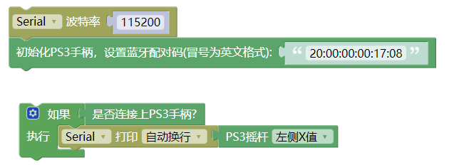

### 4.3 Mind+

#### 4.3.1 安装库

点击点击此处链接查看[Mind+示例程序和库文件下载](./mind+库和示例程序.zip)

打开Mind+，选择FireBeetle ESP32-E 为主板模式，将ESP32主板与电脑连接。

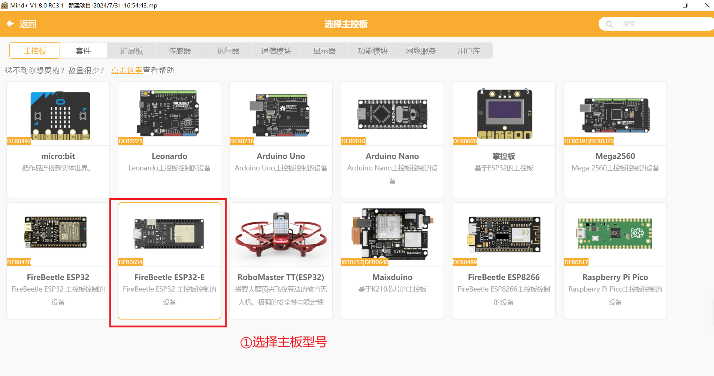

右上角点击“用户库”，然后点击导入用户库。

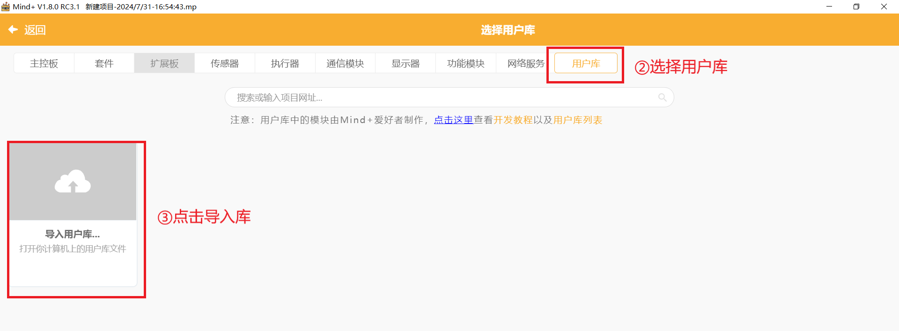

找到下载的库文件，打开。

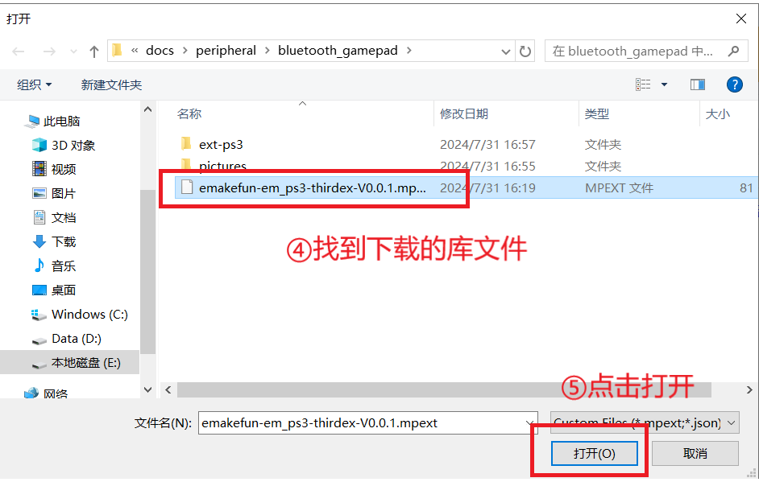

打开成功后出现如下界面。

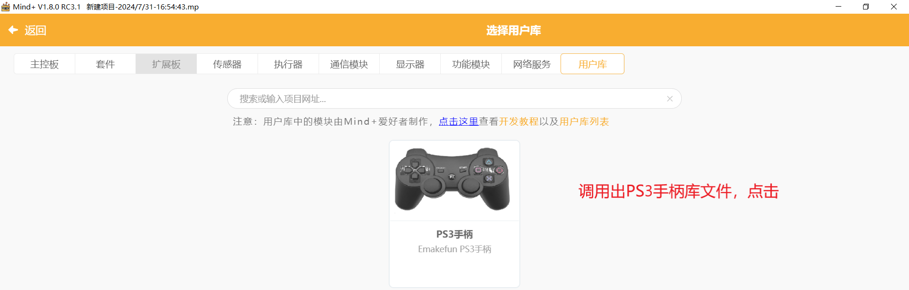

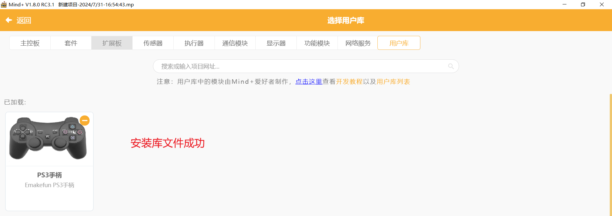

库文件安装成功后，返回编程主界面，在“用户库”中可找到PS3相关编程指令。

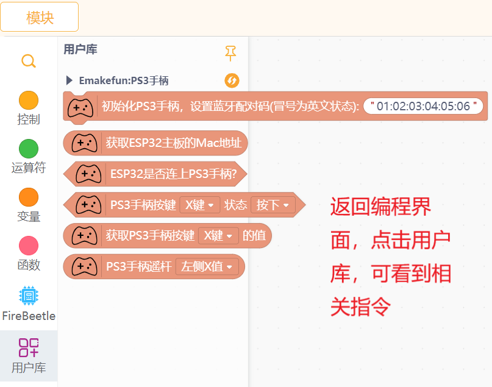

#### 4.3.2 输入蓝牙配对码并运行示例代码

参照示例编写程序或使用示例程序，注意输入手柄背面的蓝牙配对码，每个手柄在出厂时已设置不同的配对码。

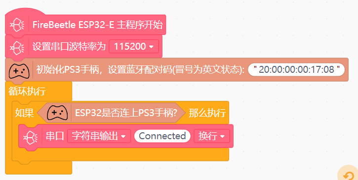

#### 4.3.3 配对连接

1. 将PS3手柄与电脑或者电源适配器断开连接，不要插任何数据线或者充电线！

2. 将ESP32主板下载好程序并保持与电脑连接，打开串口监视器，保持波特率为115200

3. 长按手柄一下中间的`单圆键`，手柄的**4个指示灯**会同时**快闪**，这时手柄会自动查询连接ESP32，如果是第一次连接可能要再按一下ESP32的复位键，或多次，不同的主板可能反应速度不一样

4. 连接到ESP32后，ESP32串口会循环打印Connected，这样就代表连接成功，如下所示：

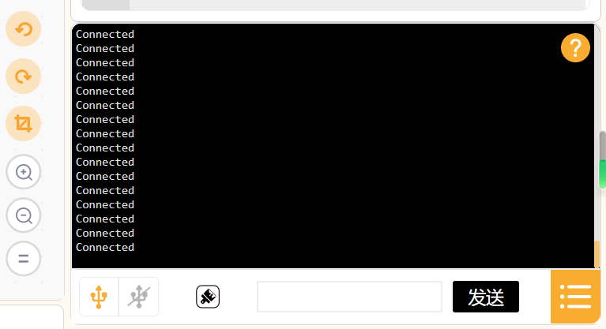

#### 4.3.4 按键测试

经测试，所有按键在按下时反馈数字1，未按下为0；

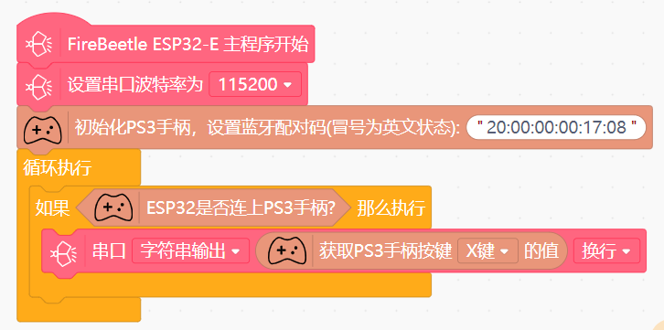

左右摇杆值为-128-127之间，中间值为0;

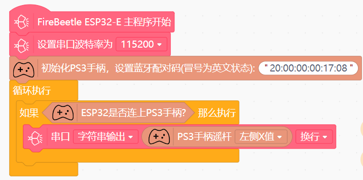

## 充电说明

- 手柄充电请使用电脑的USB端口充电或者标准的5V0.5A、5V1A或5V2A电源适配器，**不支持任何快充充电器**

- 充电指示：1-4号灯或者1和4号灯慢闪

- 满电指示：1-4号灯全部常亮或者全部熄灭、1和4号灯常亮

## 注意事项

- 这款手柄只支持与**ESP32**芯片系列连接，无法支持与其他设备连接，如电脑手机等。该手柄**非**市面普通PS游戏手柄，**请勿作他用**。

## FAQ

如果要使用手柄的按键或摇杆进行操控，例如控制小车等，可将接收到的值进行判断，然后进行操作，例如：

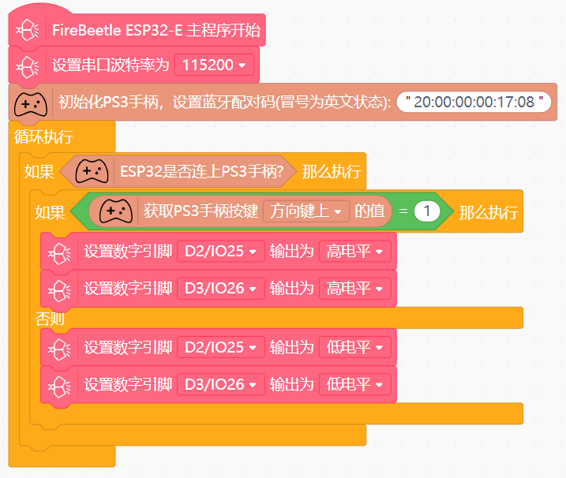
