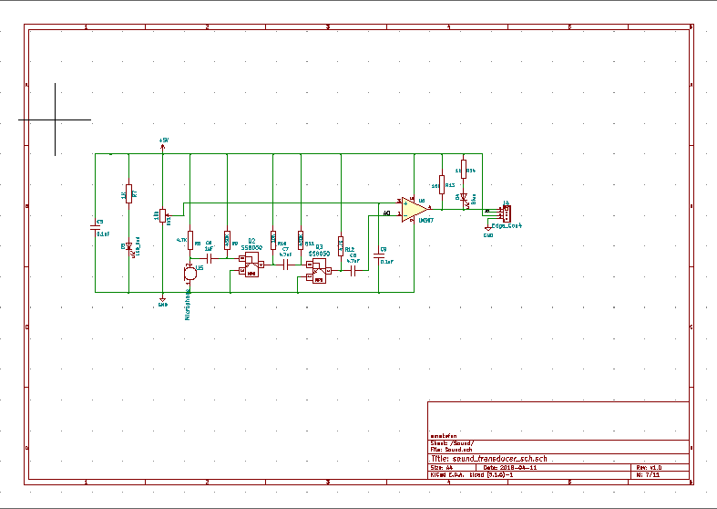

## 振动马达模块


## 概述

振动马达模块，内含一个转子马达，通过马达转动带动转子产生离心引起振动。

许多产品均需要使用振动马达，如智能手机，手表等。

## 原理图



## 模块参数

* 1.供电电压:5V
* 2.连接方式:3PIN防反接杜邦线
* 3.模块尺寸:4*2.1cm
* 4.安装方式:M4螺钉兼容乐高插孔固定

| 引脚名称 | 描述       |
| -------- | ---------- |
| V        | 5V电源引脚 |
| G        | GND 地线   |
| S        | 信号引脚   |


## 机械尺寸


## 示例程序

```c
#define INB 6  //定义振动电机B端口
#define INA 5  //定义振动电机A端口

void setup()
{
    pinMode(INB, OUTPUT);  //设置振动电机B端口为输出模式
    pinMode(INA, OUTPUT);  //设置振动电机A端口为输出模式 
}

void loop()
{         
    analogWrite(INA, 255);  //设置振动电机A端口为高电平
	analogWrite(INB, 0); //设置振动电机B端口为低电平
	delay(2000);               //2s之后电机反转
    analogWrite(INA, 0);  //设置振动电机A端口为低电平
    analogWrite(INB, 255); //设置振动电机B端口为高电平
	delay(2000);                //振动电机反转2s然后正转
}
```

