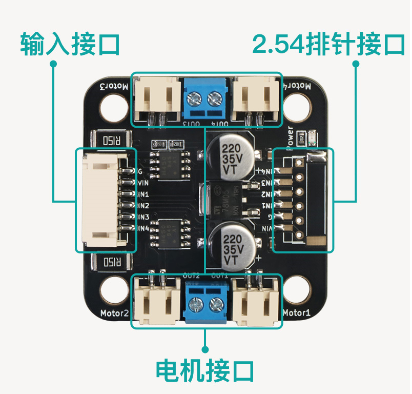

# 双路电机驱动模块

这个示例程序为使用双路电机驱动模块控制四路直流电机实现正转与反转，两个信号引脚控制两个电机，电机的正转与反转与两路PWM的高低电平有关，两者的电平一高一低就可以控制电机的转动方向。

## 注意事项

- 需要额外供电驱动四路直流电机

## 模块图



## 原理图

TODO

## 模块参数

- 供电电压：5-35V
- 最大电流:3A
- 连接方式：PH2.0 6PIN防反接线
- 安装方式：M4螺钉兼容乐高插孔固定
- 功能：四路PWM驱动

| VIN    | 电源引脚|
| :----- | :-------: |
| G      | GND地线|
| IN1   | 电机控制信号引脚1|
| IN2   | 电机控制信号引脚2|
| IN3   | 电机控制信号引脚3|
| IN4   | 电机控制信号引脚4|

## 完整测试程序

```cpp
#define INA 5   //定义电机A.B端口
#define INB 6   //
#define INC 9   //定义电机C.D端口
#define IND 10  //

void setup() {
  pinMode(INB, OUTPUT);  //设置电机端口为输出模式
  pinMode(INA, OUTPUT);  //
  pinMode(INC, OUTPUT);  //
  pinMode(IND, OUTPUT);  //
}

void loop() {
  analogWrite(INA, 255);  //设置A端口为高电平
  analogWrite(INB, 0);    //设置B端口为低电平
  analogWrite(INC, 255);  //设置C端口为高电平
  analogWrite(IND, 0);    //设置D端口为低电平
  delay(2000);            // 2s之后电机反转
  analogWrite(INA, 0);    //设置A端口为低电平
  analogWrite(INB, 255);  //设置B端口为高电平
  analogWrite(INC, 0);    //设置C端口为低电平
  analogWrite(IND, 255);  //设置D端口为高电平
  delay(2000);            //电机反转2s然后正转
}
```

