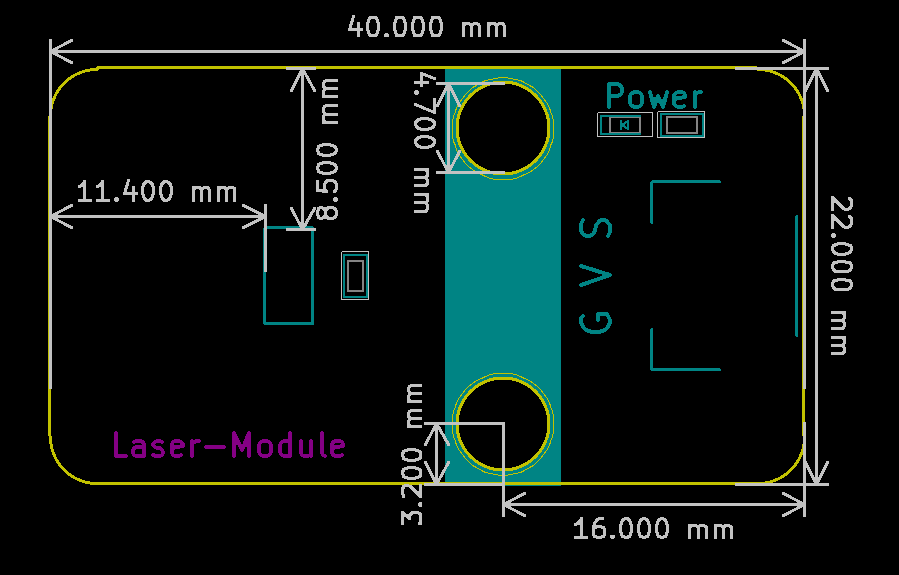

# 红外发射模块规格书

## 模块图

## 概述

​        红外发射模块在我们的日常生活中发挥着重要的作用。现在被广泛应用于许多家用电器中，如空调、电视、DVD等，它是基于无线遥感的，也是一种遥控。红外发射管是直接将电能转化为近红外光的器件，属于二极管类。它的结构和原理与一般的发光二极管相似，只是半导体材料有所不同， 当MCU给红外发射模块控制信号后，红外发射二极管发出调制信号 。

## 原理图

## 模块参数

* 1.供电电压:5V
* 2.连接方式:3PIN防反接杜邦线
* 3.模块尺寸:4*2.1cm
* 4.安装方式:M4螺钉兼容乐高插孔固定

| 引脚名称 | 描述       |
| -------- | ---------- |
| V        | 5V电源引脚 |
| G        | GND 地线   |
| S        | 信号引脚   |

## 详细原理图

 [红外发射.pdf](Infrared emission Module/红外发射.pdf) 

## 机械尺寸

