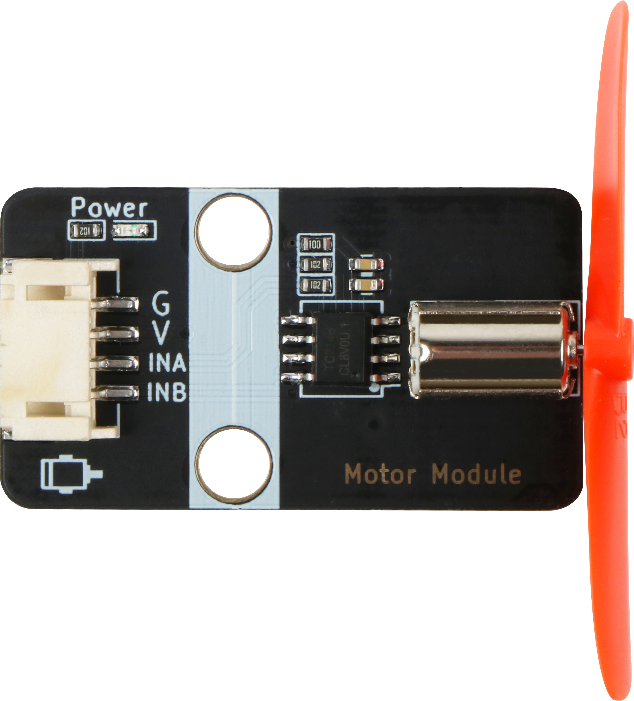

# 直流电机规格书

## 模块图



## 概述

​        直流电动机是将直流电能转换为机械能的电动机。因其良好的调速性能而在电力拖动中得到广泛应用。直流电动机按励磁方式分为永磁、他励和自励3类，其中自励又分为并励、串励和复励3种。 当直流电源通过电刷向电枢绕组供电时，电枢表面的N极下导体可以流过相同方向的电流，根据左手定则导体将受到逆时针方向的力矩作用；电枢表面S极下部分导体也流过相同方向的电流，同样根据左手定则导体也将受到逆时针方向的力矩作用。这样，整个电枢绕组即转子将按逆时针旋转，输入的直流电能就转换成转子轴上输出的机械能。由定子和转子组成，定子：基座，主磁极，换向极，电刷装置等；转子（电枢）：电枢铁心，电枢绕组，换向器，转轴和风扇等。

## 原理图


## 模块参数

* 1.供电电压:5V
* 2.连接方式:4PIN防反接杜邦线
* 3.模块尺寸:4*2.1cm
* 4.安装方式:M4螺钉兼容乐高插孔固定

| 引脚名称 | 描述              |
| -------- | ----------------- |
| V        | 5V电源引脚        |
| G        | GND 地线          |
| INA      | 电机控制信号引脚A |
| INB      | 电机控制信号引脚B |

## 详细原理图

  [motor.pdf](motor module/motor.pdf) 

## 机械尺寸


## 示例程序

```c
#define INB 6  //定义电机B端口
#define INA 5  //定义电机A端口

void setup()
{
    pinMode(INB, OUTPUT);  //设置电机B端口为输出模式
    pinMode(INA, OUTPUT);  //设置电机A端口为输出模式 
}

void loop()
{         
    analogWrite(INA, 255);  //设置电机A端口为高电平
	analogWrite(INB, 0); //设置电机B端口为低电平
	delay(2000);               //2s之后电机反转
    analogWrite(INA, 0);  //设置电机A端口为低电平
    analogWrite(INB, 255); //设置电机B端口为高电平
	delay(2000);                //电机反转2s然后正转
}
```

## microbit示例程序

<a href="https://makecode.microbit.org/_MEu01mFPmEby" target="_blank">动手试一试</a>