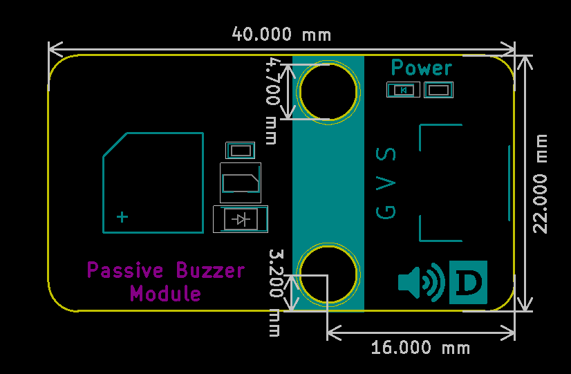

# 无源蜂鸣器规格书

## 模块图

## 概述

​        有些电器在电气状态下经常会发出嗡嗡声，这实际上来自蜂鸣器，学校里铃声只是一个更大的蜂鸣器。 蜂鸣器有两种，一种是主动蜂鸣器，另一种是被动蜂鸣器。 “主动”和“被动”并不是指是否需要提供电源，而是指有或没有内部振荡器的蜂鸣器。有源蜂鸣器只要给它通电，就会发出嗡嗡声，但频率是固定的。 主要用于一些报警装置上，如烟雾报警器。

## 原理图

## 模块参数

1.供电电压:5V
2.连接方式:3PIN防反接杜邦线
3.模块尺寸:4*2.1cm
4.安装方式:M4螺钉兼容乐高插孔固定

| 引脚名称 | 描述       |
| -------- | ---------- |
| V        | 5V电源引脚 |
| G        | GND 地线   |
| S        | 信号引脚   |

## 详细原理图

 [无源.pdf](无源蜂鸣器模块图片/无源.pdf) 

## 机械尺寸

