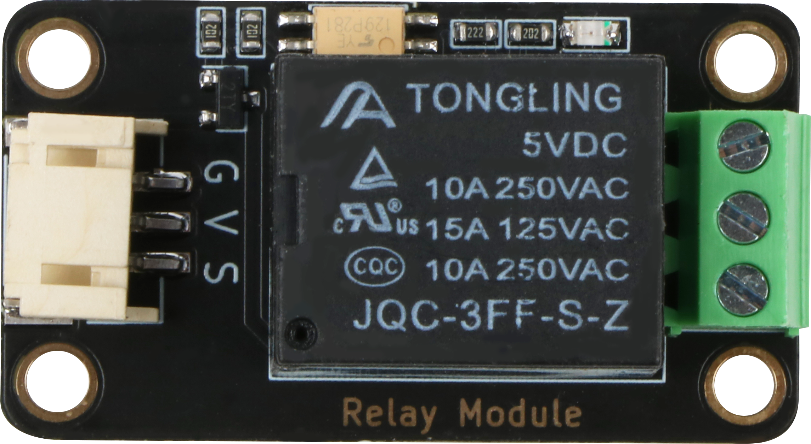
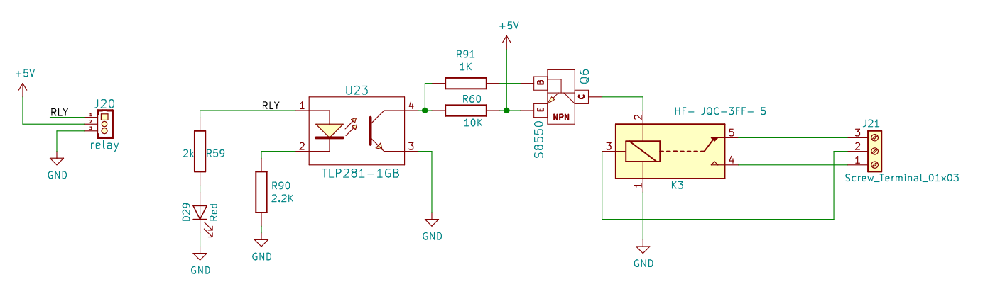

# 继电器规格书

## 模块图



## 概述

​         继电器是一种电控制器件。它具有控制系统（又称输入回路）和被控制系统（又称输出回路）之间的互动关系。通常应用于自动化的控制电路中，它实际上是用小电流去控制大电流运作的一种“自动开关” 。故在电路中起着自动调节、安全保护、转换电路等作用。特别适合于单片机控制强电装置。

实际应用中，通常继电器可以通过低电压控制高电压的一个器件。当左侧信号输入高电平时，继电器闭合，右侧2，3号端口连通；当左侧输入低电平时，继电器断开，右侧1，2号端口连通。

输入回路的高电平触发继电器闭合，从而实现控制输出回路的高电压连接。

## 原理图



## 模块参数

* 1.供电电压:5V
* 2.连接方式:3PIN防反接杜邦线
* 3.模块尺寸:4*2.1cm
* 4.安装方式:M4螺钉兼容乐高插孔固定

| 引脚名称 | 描述       |
| -------- | ---------- |
| V        | 5V电源引脚 |
| G        | GND 地线   |
| S        | 信号引脚   |

## 详细原理图

 [relay.pdf](relay module/relay.pdf) 

## 机械尺寸


## 示例程序

```c
#define relay_pin A3  //设置继电器端口为A3
void setup(){
    pinMode(relay_pin, OUTPUT);  //设置继电器端口为输出模式
}
void loop(){
digitalWrite(relay_pin, HIGH); //设置继电器端口为高电平
delay(1000);
digitalWrite(relay_pin, LOW);
delay(1000);
}
```

## microbit示例程序

<a href="https://makecode.microbit.org/_49YhAp1C2f4d" target="_blank">动手试一试</a>