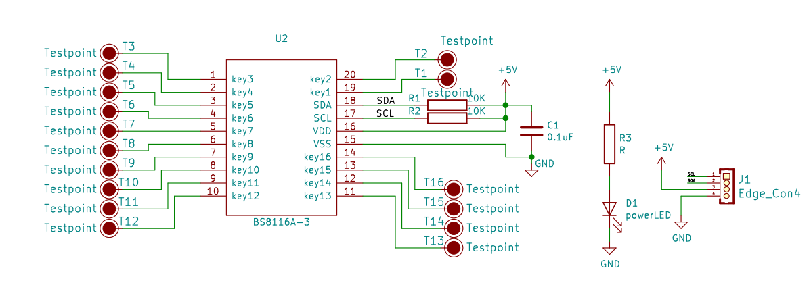

# 触摸键盘模块规格书

## 概述

触摸键盘模块是通过 TTP229芯片驱动，共16个触摸键， TTP229芯片是一款使用电容感应式原理设计的触摸芯片。此芯片内建稳压电路供触摸传感器使用，稳定的触摸效果可以应用在各种不同应用上,人体触摸面板可以通过非导电性绝缘材料连接，主要应用是以取代机械开关或按钮,此芯片可以独立支持8个触摸键或16个触摸键. 模块使用IIC通讯。

## 原理图

## 模块参数

| 引脚名称 | 描述       |
| -------- | ---------- |
| V        | 5V电源引脚 |
| G        | GND 地线   |
| SCL      | 时钟引脚   |
| SDO      | 数据引脚   |

1.供电电压:5V
2.两线串行接口
2.连接方式:4PIN防反接杜邦线
3.模块尺寸:7.0*5.5cm
4.安装方式:M4螺钉兼容乐高插孔固定

## 详细原理图

 [矩阵.pdf](4×4矩阵键盘模块图片/矩阵.pdf) 

## 模块尺寸

