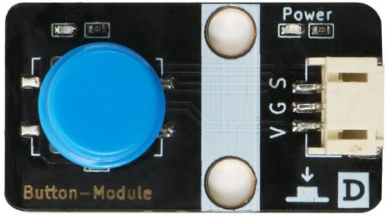

# 按键模块

## 按键模块图

##  概述

​        按键开关主要是指轻触式按键开关，也称之为轻触开关。按键开关是一种电子开关，属于电子元器件类，最早出现在日本[称之为：敏感型开关]，使用时以满足操作力的条件向开关操作方向施压开关功能闭合接通，当撤销压力时开关即断开，其内部结构是靠金属弹片受力变化来实现通断的。

## 原理图

## 详细原理图

 [按键.pdf](button\按键.pdf) 

## 模块参数

* V:5V电源
* G:GND
* S:信号引脚

## 机械尺寸

