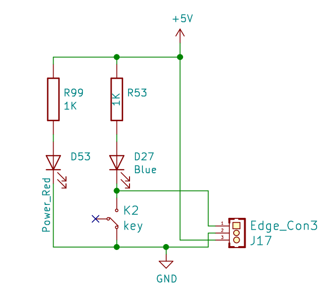
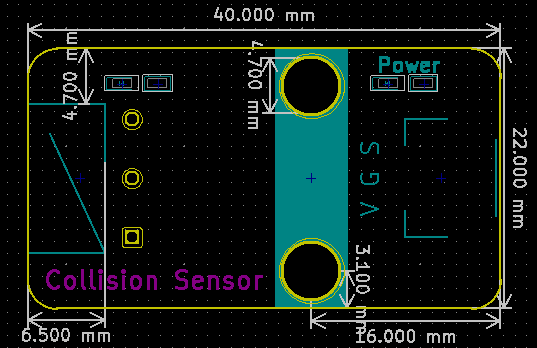

# 触碰开关

## 模块图

## 概述

​        触摸传感器模块是一个基于触摸检测IC（TTP223B）的电容式点动型触摸开关模块。可以将模块安装在非金属材料如塑料、玻璃的表面，另外将薄薄的纸片（非金属）覆盖在模块的表面，只要触摸的位置正确，即可做成隐藏在墙壁、桌面等地方的按键

## 原理图

## 模块参数

* V:工作电压5V
* G：GND
* S:信号引脚

## 详细原理图

 [触碰开关.pdf](触碰开关传感器模块图片/触碰开关.pdf) 

## 机械尺寸

