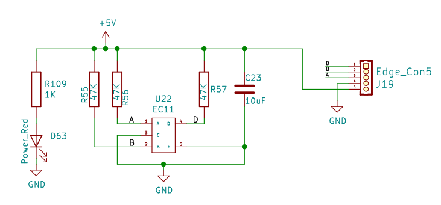
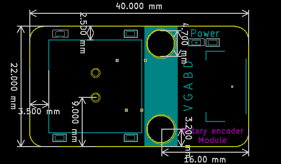

# 旋转编码器

## 旋转编码器模块


##  概述

​       编码器是一种将旋转位移转换为一连串数字脉冲信号的旋转式传感器，旋转编码器可通过旋转可以计数正方向和反方向转动过程中输出脉冲的次数，旋转计数不像电位计，这种转动计数是没有限制的。配合旋转编码器上的按键，可以实现某些特定功能。读数系统通常采用差分方式，即将两个波形一样但相位差为180°的不同信号进行比较，以便提高输出信号的质量和稳定性。编码器广泛用于汽车音量、空调调节等应用场景。

## 原理图



## 模块参数

* V:电源5V
* G：GND
* A:获取A端口的模拟值
* B:获取B端口的模拟值
* D:获取D端口的模拟值

## 详细原理图

 [旋转编码器.pdf](旋转编码器模块图片/旋转编码器.pdf) 

## 机械尺寸




## 示例程序

```c
#define ENCODER_A_PIN 3
#define ENCODER_B_PIN 5
#define SWITCH_PIN    6
long position, oldposition;

void setup(){
  //setup our pins 
  pinMode(ENCODER_A_PIN, INPUT);
  pinMode(ENCODER_B_PIN, INPUT);
  pinMode(SWITCH_PIN, INPUT);

  attachInterrupt(1, read_quadrature, CHANGE);
  Serial.begin(9600);
}

void loop(){
   if (digitalRead(SWITCH_PIN) == LOW){
     delay(10);
     if (digitalRead(SWITCH_PIN) == LOW){
       Serial.println("Switch Pressed");
     }
   }
   Serial.print("Position: ");
   Serial.println(position, DEC);
   //delay(1000);
}

void read_quadrature(){  
  // found a low-to-high on channel A 
  if (digitalRead(ENCODER_A_PIN) == LOW){   
    // check channel B to see which way 
    if (digitalRead(ENCODER_B_PIN) == LOW)
      position++;
  }
  // found a high-to-low on channel A 
  else {
    // check channel B to see which way 
    if (digitalRead(ENCODER_B_PIN) == LOW)
      position--;
  }
  oldposition = position;
}
```

