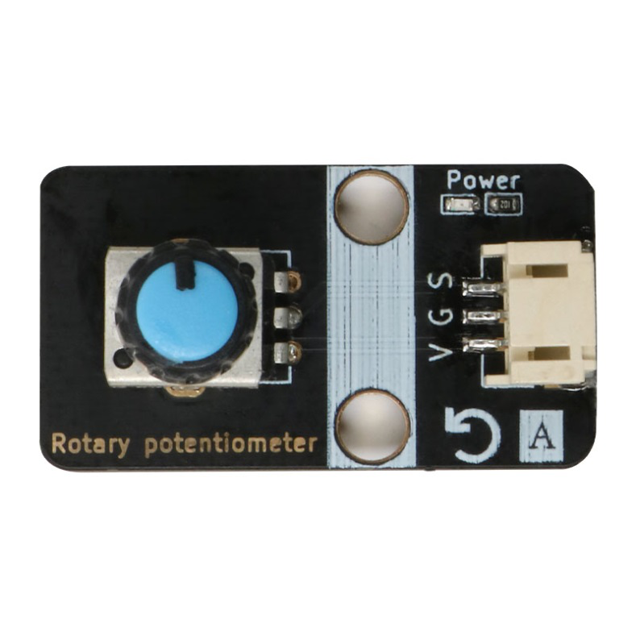
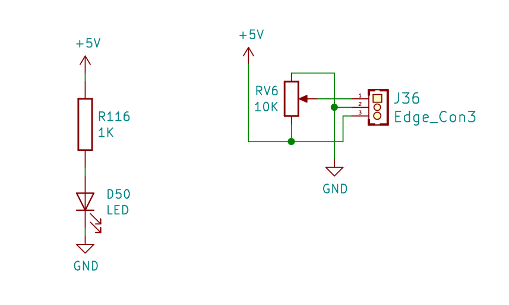
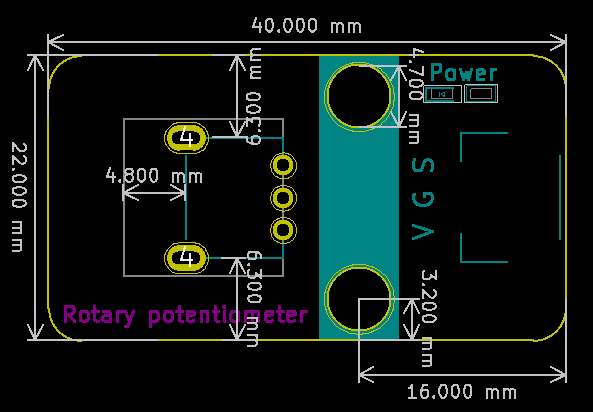

# 旋转电位器

## 旋转电位器模块图

## 概述

电位器实际上就是可变电阻器，由于它在电路中的作用是获得与输入电压(外加电压)成一定关系得输出电压，因此称之为电位器。通常被制造成不管使用多久均能维持原有的特性，若当位置传感器使用，电位计可以是直线或旋转式位置传感器。电位计输出一个电压值，其正比于沿着可变电阻器之滑动器的位置。因为温度变化、磨耗及滑动器与可变电阻器之间的污垢均会造成电阻变化，影响电位计的精度。

## 原理图

## 模块参数

* V:电源5V
* G：GND
* S:信号引脚

## 详细原理图

  [旋转电位器.pdf](旋转电位器模块图片/旋转电位器.pdf) 

## 机械尺寸

