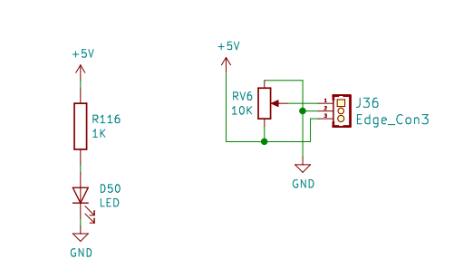
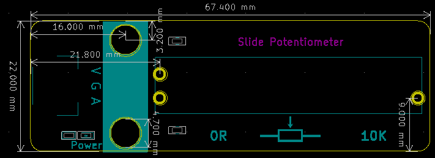

# 滑动变阻器

## 滑动变阻器模块图


## 概述

​        滑动变阻器是电路中的一个重要元件，它可以通过移动滑片的位置来改变自身的电阻，从而起到控制电路的作用。在电路分析中，滑动变阻器既可以作为一个定值电阻，也可以作为一个变值电阻。

## 原理图



## 模块参数

* 1.供电电压:5V
  2.连接方式:3PIN防反接杜邦线
  3.模块尺寸:6.7*2.1cm
  4.安装方式:M4螺钉兼容乐高插孔固定

## 详细原理图

 [滑动变阻器.pdf](滑动电阻器模块图片/滑动变阻器.pdf) 

## 机械尺寸



## 示例程序

``` 
float i=0,j=0,data;  //define data    i  j
int analogPin = A3;//GPIO A3 pin
void setup()
{
  pinMode(analogPin, INPUT);//init slideResistance pin output
  Serial.begin(9600);//  set serial
}

void loop() {
    data=analogRead(analogPin); //  read slideResistance pin vaule
    i=data/1023;//A/D
    j=(1-i)*10000;  //  get Resistance value  ;10000 is max 
    Serial.print("Resistance value is: ");
    Serial.print(j);//print Resistance value
    Serial.println("Ω");
    delay(200);
}
```

