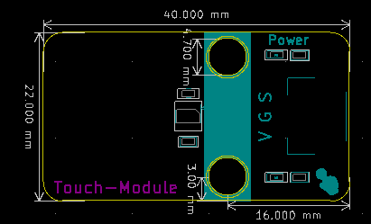

# 触摸模块

## 模块图

## 概述

​        触摸传感器模块是一个基于触摸检测IC（TTP223B）的电容式点动型触摸开关模块。可以将模块安装在非金属材料如塑料、玻璃的表面，另外将薄薄的纸片（非金属）覆盖在模块的表面，只要触摸的位置正确，即可做成隐藏在墙壁、桌面等地方的按键。

## 原理图

## 模块参数

* 1.供电电压:5V
  2.连接方式:3PIN防反接杜邦线
  3.模块尺寸:4*2.1cm
  4.安装方式:M4螺钉兼容乐高插孔固定

## 详细原理图

  [触摸模块.pdf](触摸传感器模块图片/触摸模块.pdf) 

## 机械尺寸

