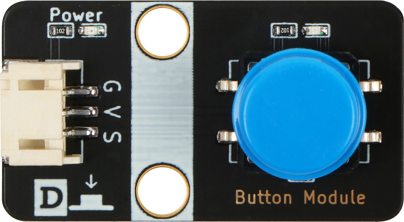
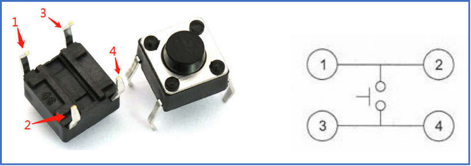
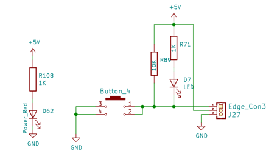
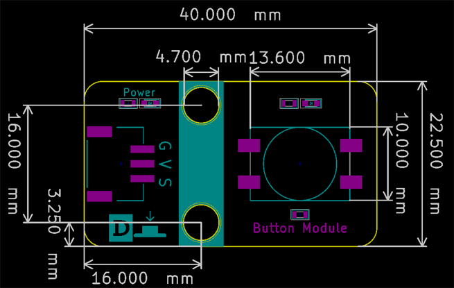

# 按键模块

## 按键模块实物图



## 按键物理机械图



##  概述

​        按键也称之为轻触开关，使用时以满足操作力的条件向开关操作方向施压，开关闭合接通；当撤销压力时开关即断开，其内部结构是靠金属弹片受力变化来实现通断的。如图，正常情况下，按键的 1和2、3和4 脚是相连的；当我们按下按键时，四个脚相互接通；松开按键时，恢复正常状态。
​        我们的模块正常连接上后，模块的红色power灯亮起，当按键按下时，模块输出低电平，并且信号蓝色灯亮起，松开后蓝色灯熄灭，输出高电平。

## 原理图



## 详细原理图和规格书

 [查看原理图](button_module/button_module_schematic.pdf) 

 [查看数据手册](button_module/button_datasheet.pdf) 

## 模块参数

* G:GND
* V:5V/3.3V电源
* S:信号输出引脚，按下时输出低电平，板子蓝色信号灯亮起

## 模块装配图



## Arduino示例程序

```c
int led_out = 13 ;//定义LED引脚
int keypad_pin = A3; //定义按键引脚
int value;
void setup()
{
  pinMode(led_out,OUTPUT); //初始化LED连接的引脚为输出引脚
  pinMode(keypad_pin,INPUT); //初始化按键连接的引脚为输入
}
void loop()
{
  value = digitalRead(keypad_pin); //读取按键输入引脚的值
  if (value == HIGH) 
  {
      digitalWrite(led_out,LOW); //如果读取值为高即按键没有按下去，LED亮
  }
  else
  {
      digitalWrite(led_out,HIGH); //如果读取值为低即按键按下去了，LED灭
  }
}
```
## microbit示例程序
请直接参考microbit图形化编程[makecode库链接](https://github.com/emakefun/pxt-sensorbit)里面的基础输入模块的按键模块介绍

