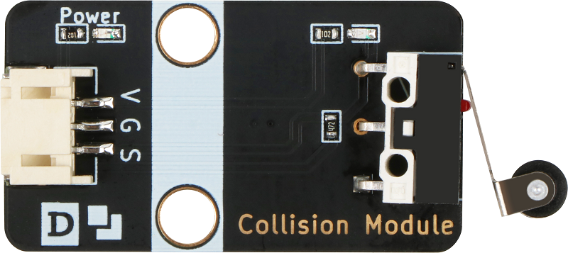
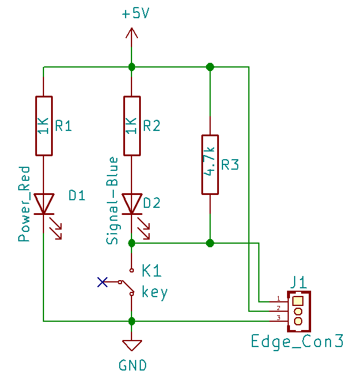
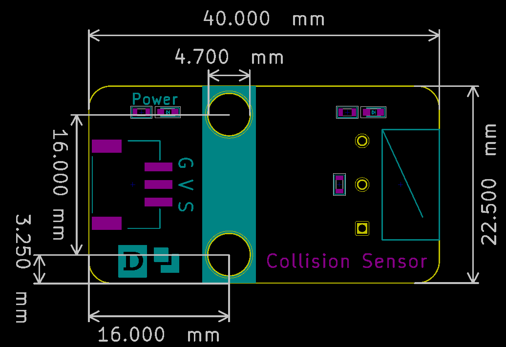

# 碰撞开关

## 实物图



## 概述

​	碰撞开关模块实质为一个微型快动开关，即广为人知的微型开关，是一种由很小的物理力启动的电子开关。它能够直接连在单片机上。它将负载电阻同LED指示灯整合在一起。这使得对他进行测试更为简单。当有物理压力触发开关闭合时，板上的LED指示灯会亮起。碰撞开关的原理比较简单，如下原理图，当被外力触发闭合时，开关闭合，模块输出低电平；当撤销外力时，开关被打开，模块输出高电平。

## 原理图



## 模块参数

| 引脚名称 |                            描述                            |
| :------: | :--------------------------------------------------------: |
|    G     |                            GND                             |
|    V     |                           5V电源                           |
|    S     | 信号输出引脚，开关触发被按下时输出低电平，松开时输出高电平 |

- 供电电压：5V

- 连接方式：3PIN防反接杜邦线

- 模块尺寸：40x22.5mm

- 安装方式：M4螺钉兼容乐高插孔固定

## 详细原理图和数据手册

[查看原理图](collision_module/collision_sensor_schematic.pdf) 

[查看数据手册](collision_module/JL007-010_datasheet.pdf)

## 机械尺寸图




## Arduino示例程序

[下载示例程序](collision_module/collision_module.zip)

```c
int led_out = 13;//定义Arduino LED引脚
int keypad_pin = A3; //定义碰触开关引脚
int value;
void setup()
{
  pinMode(led_out,OUTPUT); //初始化LED连接的引脚为输出引脚
  pinMode(keypad_pin,INPUT); //初始化碰触开关连接的引脚为输入引脚
}
void loop()
{
  value = digitalRead(keypad_pin); //读取碰触开关输入引脚的值
  if (value == LOW) 
  {
      digitalWrite(led_out,HIGH); //如果读取值为低，即碰触开关被按下去，LED亮
  }
  else
  {
      digitalWrite(led_out,LOW); //如果读取值为低即碰触开关没有被按下，LED灭
  }
}
```

## microbit示例程序

请直接参考microbit图形化编程[makecode库链接](https://github.com/emakefun/pxt-sensorbit)里面的基础输入模块的碰撞开关。