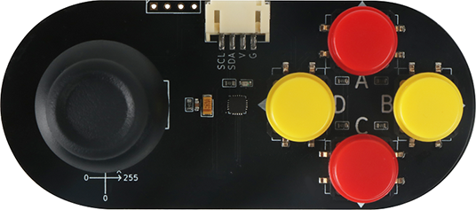
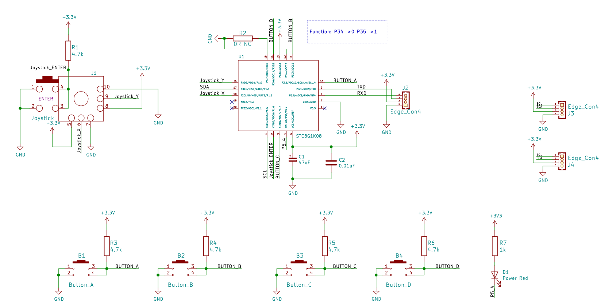
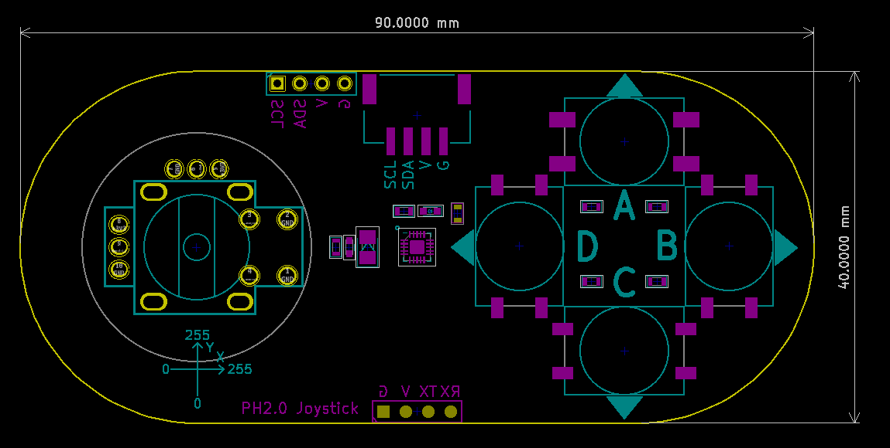
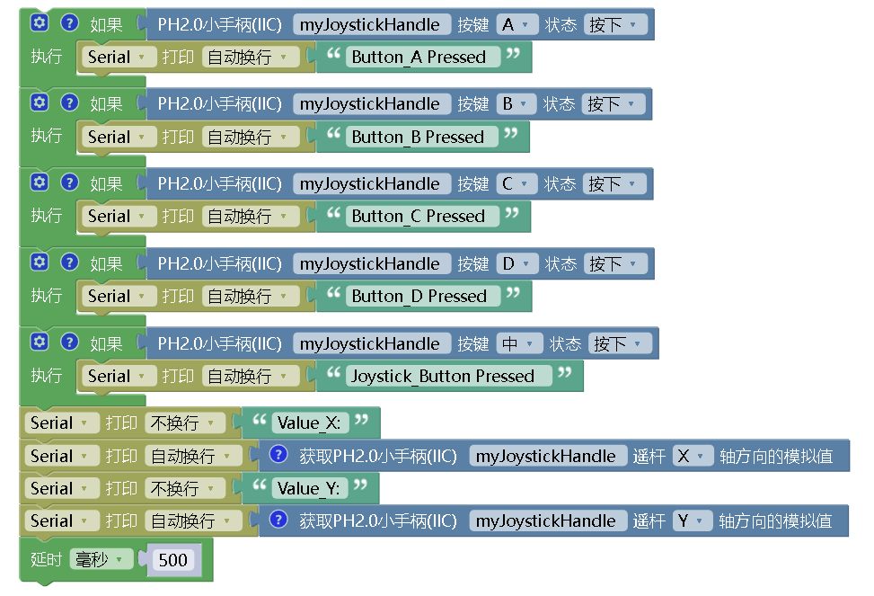

# PH2.0小手柄

## 实物图



## 概述

​		PH2.0小手柄包含两个电位器（X轴和Y轴）操纵/杆和五个按键（A、B、C、D、摇杆按键Z）。操纵杆根据两个触点控制运动，其中一个触点向左和向右，另一个向上和向下。操纵杆通过AD传感器读取不同的电压值，从而识别特定的位置。X轴和Y轴的模拟值都是从0到255，分别表示从左到右的位置和从上到下的位置。当没有操作时，X和Y轴方向的模拟值都为128。A、B、C、D和摇杆按键Z五个按键都有5种状态（按下、释放、单击、双击、长按）。通过I2C连接Arduino主板发送数据。

## 原理图

[原理图下载](joystick_handle/joystick_handle_schematic.pdf)



## 模块参数


| 引脚名称 |      描述       |
| :------: | :-------------: |
|    G     |     GND地线     |
|    V     |   5V电源引脚    |
|   SCL    | I2C通信时钟引脚 |
|   SDA    | I2C通信数据引脚 |

- 供电电压：+3.3-5V
- 通信方式：IIC，地址0x5A
- 连接方式：PH2.0 4PIN防反接线
- 外形尺寸：90*40mm
- 安装方式：M4螺钉兼容乐高插孔固定

## 机械尺寸图



### Arduino示例程序

[下载示例程序](joystick_handle/joystick_handle.zip)


```c
#include "JoystickHandle.h"

JoystickHandle myJoystickHandle(JOYSTICK_I2C_ADDR);

void setup(){
  Serial.begin(9600);
}

void loop(){
  if (myJoystickHandle.Get_Button_Status(BUTOON_UP)==PRESS_DOWN) {  // 判断按键A是否按下
    Serial.println("Button_A Pressed");
  }
  if (myJoystickHandle.Get_Button_Status(BUTOON_RIGHT)==PRESS_DOWN) {  // 判断按键B是否按下
    Serial.println("Button_B Pressed");
  }
  if (myJoystickHandle.Get_Button_Status(BUTOON_DOWN)==PRESS_DOWN) {  // 判断按键C是否按下
    Serial.println("Button_C Pressed");
  }
  if (myJoystickHandle.Get_Button_Status(BUTOON_LEFT)==PRESS_DOWN) {  // 判断按键D是否按下
    Serial.println("Button_D Pressed");
  }
  if (myJoystickHandle.Get_Button_Status(JOYSTICK_BUTTON)==PRESS_DOWN) {  // 判断遥感按键是否按下
    Serial.println("Joystick_Button Pressed");
  }
  Serial.print("Value_X:");
  Serial.println(myJoystickHandle.AnalogRead_X()); // 读取摇杆X轴的模拟值打印出来
  Serial.print("Value_Y:");
  Serial.println(myJoystickHandle.AnalogRead_Y());// 读取摇杆Y轴的模拟值打印出来
  delay(500);
}
```
## Mixly示例程序

[下载示例程序](joystick_handle/joystick_handle_Mixly_demo.zip)



## microbit示例程序

请直接参考microbit图形化编程[makecode库链接](https://github.com/emakefun/pxt-sensorbit)里面的基础输入模块的PH2.0小手柄。