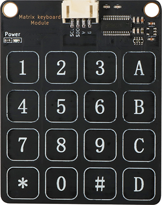
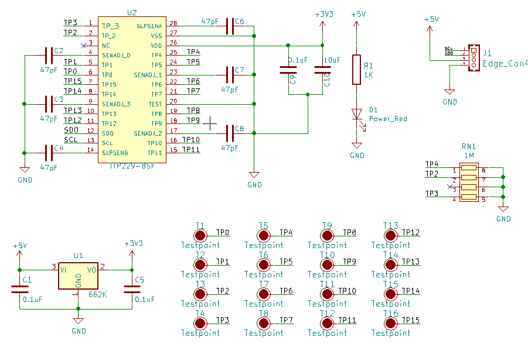
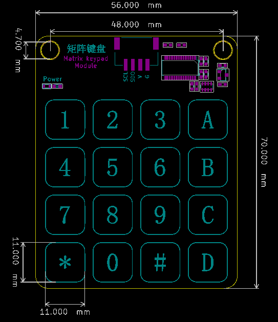
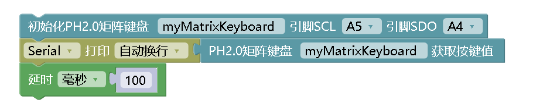

# 触摸矩阵键盘

## 实物图



## 概述

​		触摸键盘模块是通过 TTP229芯片驱动，共16个触摸键， TTP229芯片是一款使用电容感应式原理设计的触摸芯片。此芯片内建稳压电路供触摸传感器使用，稳定的触摸效果可以应用在各种不同应用上,人体触摸面板可以通过非导电性绝缘材料连接，主要应用是以取代机械开关或按钮,此芯片可以独立支持8个触摸键或16个触摸键. 模块使用IIC通讯。

## 原理图

[原理图下载](matrix_keyboard_module/matrix_keyboard_module_schematic.pdf) 



## 模块参数

| 引脚名称 |    描述    |
| :------: | :--------: |
|    G     |  GND 地线  |
|    V     | 5V电源引脚 |
|   SCL    |  时钟引脚  |
|   SDO    |  数据引脚  |

- 供电电压:5V

- 两线串行接口

- 连接方式：PH2.0 4PIN防反接线

- 模块尺寸:56*70mm

- 安装方式:M4螺钉兼容乐高插孔固定


## 机械尺寸图



## Arduino示例程序

[下载示例程序](matrix_keyboard_module/matrix_keyboard_module.zip)

```c
#include"TTP229.h"
int SCLPin = A5, SDOPin = A4;   //定义 SCL时钟 、SDO数据 端口
unsigned int h = 0, oldh = 0;
TTP229 mTTP229;
char str[128];
void setup()
{
  Serial.begin(9600);   //设置串口波特率为9600
  mTTP229.initTTP229(SCLPin, SDOPin);
}

void loop()
{
  uint16_t keycode = mTTP229.GetKeyCode();
  if (keycode != 0xFFFF) {      //判断按键是否按下
    String key_name = mTTP229.GetKeyMap();
    sprintf(str, "Get ir code: 0x%x key name: %s \n", keycode, (char *)key_name.c_str()); 
    //将按键的值转为字符串
    Serial.println(str);    //打印按键对应的字符
  }
  delay(100);
}
```
## Mixly示例程序

[下载示例程序](matrix_keyboard_module/matrix_keyboard_Mixly_demo.zip)



## microbit示例程序

请直接参考microbit图形化编程[makecode库链接](https://github.com/emakefun/pxt-sensorbit)里面基础输入模块的触摸矩阵键盘。

