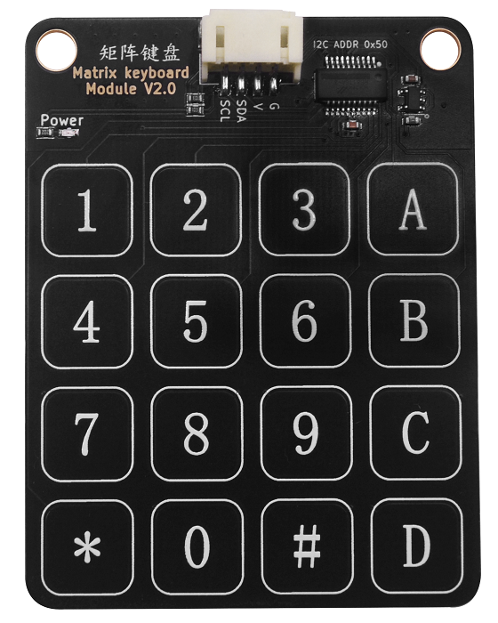

# 矩阵键盘模块V2.0

## 概述

触摸键盘模块是通过BS8116A-3芯片驱动，共16个触摸键.BS8116A-3芯片是一款使用电容感应式原理设计的触摸芯片,可用来检测外部触摸按键上人手的触摸动作。该系列的芯片具有较高的集成度，仅需极少的外部组件便可实现触摸按键的检测。BS81x 系列提供了串行及并行输出功能，可方便与外部 MCU 之间的通讯，实现设备安装及触摸引脚监测目的。 模块使用IIC通讯。

## 模块图

## 原理图

# TODO

## 模块参数

- 供电电压:5V
- 两线串行接口
- 连接方式：PH2.0 4PIN防反接线
- 模块尺寸:56*70mm
- 安装方式:M4螺钉兼容乐高插孔固定

| G      | GND地线|
| :----- | :-------: |
| V    | VCC|
| SCL   | 时钟引脚|
| SDA   | 数据引脚|

## 模块尺寸

# TODO

## Arduino应用场景

### Arduino 示例程序

[下载Arduino库](https://github.com/emakefun-arduino-library/emakefun_matrix_keyboard/archive/refs/tags/latest.zip),包含Arduino库文件和示例代码

### Arduino 库使用文档

[说明文档](https://github.com/emakefun-arduino-library/emakefun_matrix_keyboard)

### Arduino 库示例程序

[示例程序](https://emakefun-arduino-library.github.io/emakefun_matrix_keyboard/get_touched_key_8ino-example.html)
