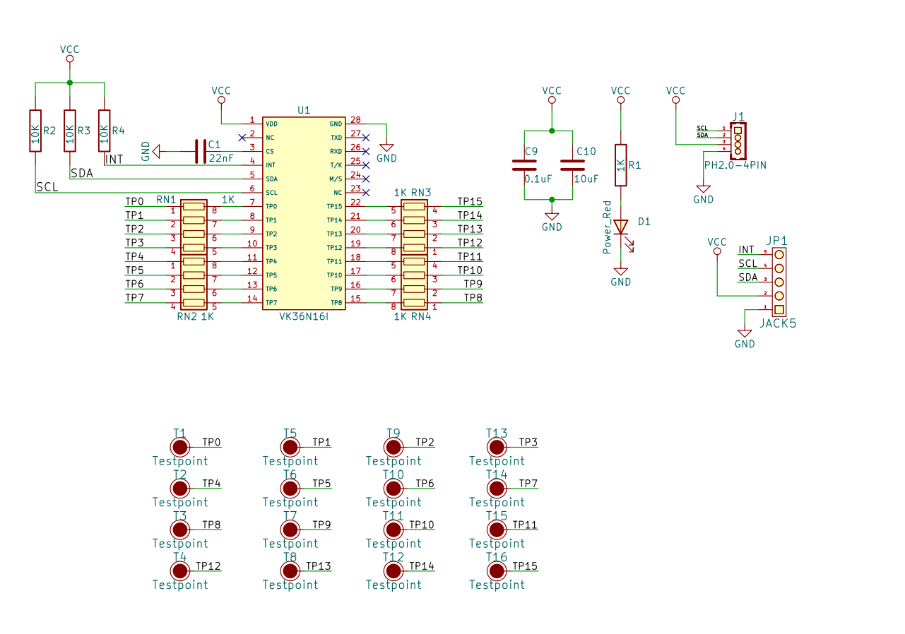
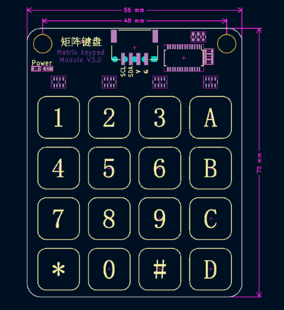
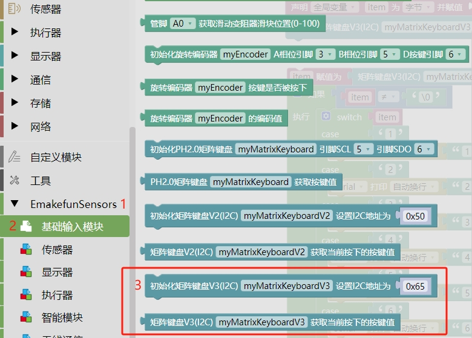
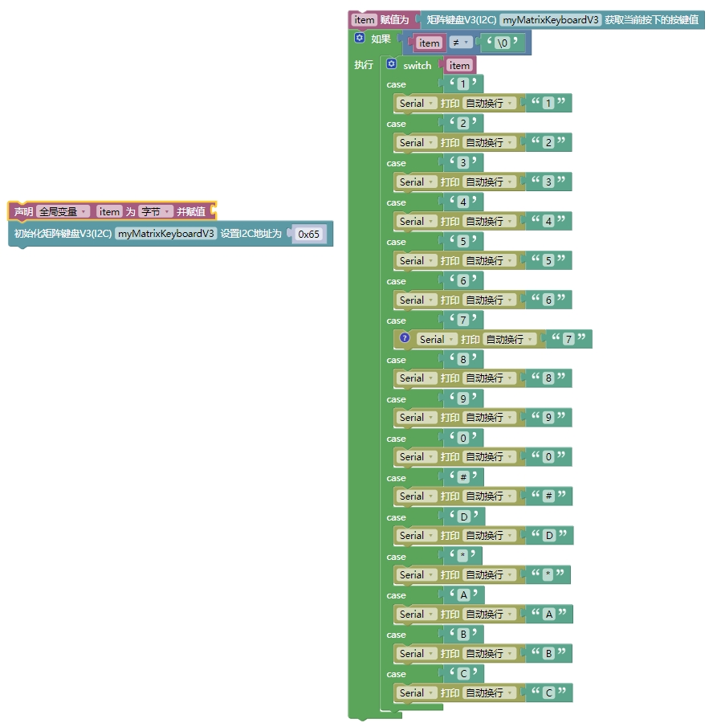

# 矩阵键盘模块V3.0

## 概述

触摸键盘模块是通过 [VK36N16I](16键触摸键盘_VK36N16I规格书_V12.pdf) 芯片驱动，共16个触摸键。VK36N16I芯片是一款使用电容感应式原理设计的触摸芯片,可用来检测外部触摸按键上人手的触摸动作。该系列的芯片具有较高的集成度，仅需极少的外部组件便可实现触摸按键的检测。模块使用IIC通讯，可方便与外部 MCU 之间的通讯，实现设备安装及触摸引脚监测目的。 

## 原理图



## 模块参数

- 供电电压:3.3V ~ 5V
- 两线串行接口
- 连接方式：PH2.0 4PIN防反接线
- 模块尺寸:56*70mm
- 安装方式:M4螺钉兼容乐高插孔固定
- I2C地址为：0x65 (十进制为101)

| G      | GND地线|
| :----- | :---: |
| V    | 3~5.5V |
| SCL   | 时钟引脚|
| SDA   | 数据引脚|

## 模块尺寸



## 软件

### Arduino（C/C++）

| 支持开发板系列 |
| --- |
| Arduino UNO R3 |
| Arduino Nano |
| Arduino Mega 2560 |
| ESP32 |

#### 库文件

[点击此处下载Arduino库](https://github.com/emakefun-arduino-library/emakefun_matrix_keyboard_v3/archive/refs/tags/latest.zip)

包含了Arduino库文件和示例代码

#### API说明文档

[点击此处查看API说明文档](https://emakefun-arduino-library.github.io/emakefun_matrix_keyboard_v3/class_matrix_keyboard.html)

#### Arduino示例程序

[点击此处查看示例程序](https://emakefun-arduino-library.github.io/emakefun_matrix_keyboard_v3/get_touched_key_8ino-example.html)

#### Mixly示例程序

 用Mixly2.0通过云端导入PH2.0 Sensors库，导入成功后，点击EmakefunSensors库，选择基础输入模块，找到

矩阵键盘V3.0块，如下图：



矩阵键盘Mixly案例



通过连接线连接矩阵键盘的I2C接口，将程序下载到Arduino主板，触摸键盘Arduino串口打印相对应的键盘值。

[点击下载mixly案例](./mixly_example.zip)

### Micropython

| 支持开发板系列 |
| --- |
| ESP32 |
| ESP32S3 |

#### Micropython库文件

| 库文件名 | 链接 |
| --- | --- |
| i2c_device.py | [https://github.com/emakefun-org/micropython_library/blob/main/i2c_device.py](https://github.com/emakefun-org/micropython_library/blob/main/i2c_device.py) |
| matrix_keyboard_v3.py | [https://github.com/emakefun-org/micropython_library/blob/main/matrix_keyboard_v3.py](https://github.com/emakefun-org/micropython_library/blob/main/matrix_keyboard_v3.py) |

请将以上的库文件上传到板子上

#### Micropython示例程序

示例1：[获取按键值: https://github.com/emakefun-org/micropython_examples/blob/main/matrix_keyboard_v3/main.py](https://github.com/emakefun-org/micropython_examples/blob/main/matrix_keyboard_v3/main.py)

### MakeCode

| 支持开发板系列 |
| --- |
| Microbit |

#### MakeCode扩展包

扩展包地址:

```text
https://github.com/emakefun-makecode-extensions/emakefun_matrix_keyboard_v3
```

#### MakeCode示例程序

[点击此处查看示例程序](https://makecode.microbit.org/_E4Rdk21MdCzL)

示例程序说明：将矩阵键盘和板子I2C接口进行连接，示例程序成功编译运行后，按下键盘上的按键，microbit点阵屏上会显示按键按下的值，如按下"1"，点阵屏会显示"1"，再按下"A"会显示"A"。

**请注意，由于该示例程序中有使用点阵屏显示块，然而Microbit的点阵屏显示块会有500毫秒的阻塞，所以在显示过程中按下新的按键不会马上显示新的值，会有不太灵敏的效果，但是这并不是由矩阵键盘硬件或者软件引起的**

如果将点阵屏显示换成串口输出显示，效果会好很多，[点击查看按键串口显示程序](https://makecode.microbit.org/_54m4wjYdUX6e)
