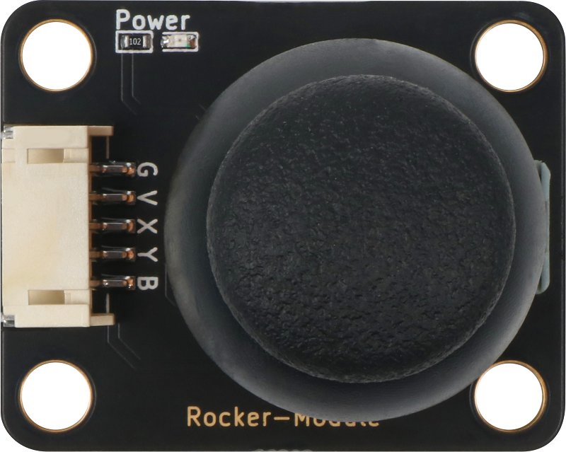
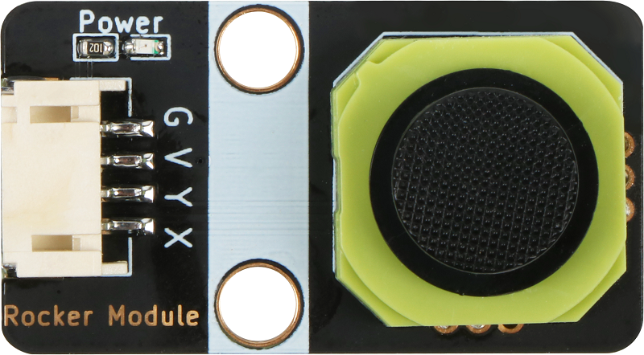
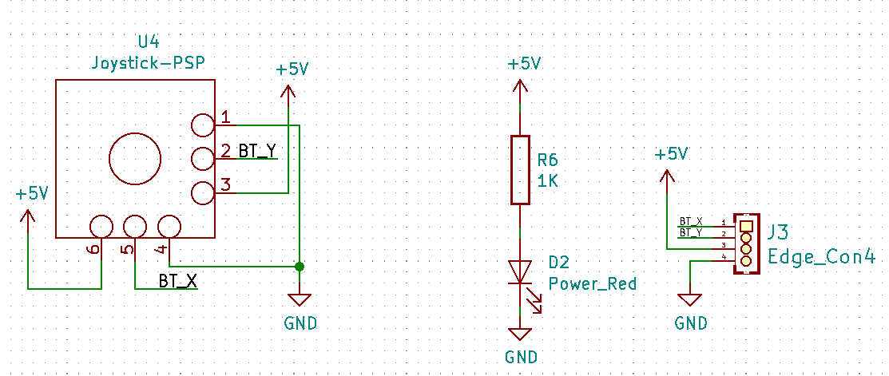
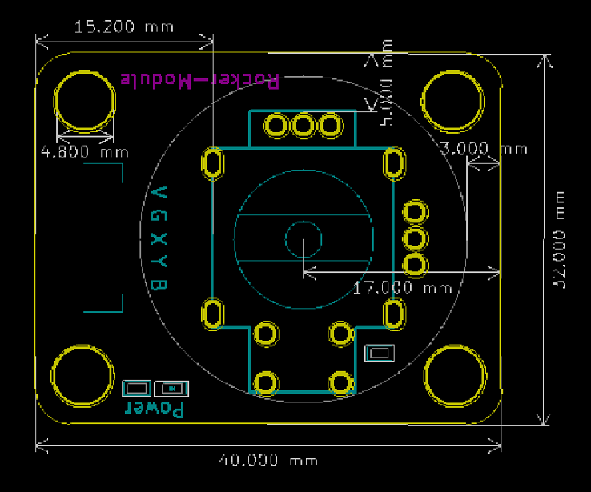
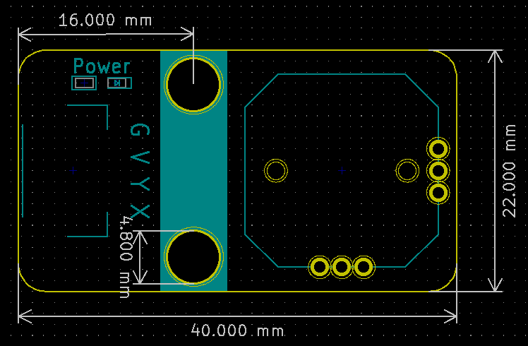

# 摇杆模块

## 实物图

### A款



### B款



## 概述

​       PS2摇杆结构非常简单，它包含一个触摸按钮（Z轴）和两个电位器（X轴和Y轴）。 操纵杆根据两个触点控制运动，其中一个触点向左和向右，另一个向上和向下。 操纵杆移动决定了触点的位置，就像地球的纬度和经度一样，不同的位置对应不同的电压，然后控制器可以通过AD传感器读取不同的电压值，从而识别特定的远程位置。模拟信号从上方操纵杆的X和Y轴引脚输入.B的值从0到1023表示从左到右的位置，或者从上到下的位置，如果没有按下按钮，则两个值都是512，这是中间值。

## 原理图

### A款


### B款



## 详细原理图和数据手册

[查看A款原理图](rocker_module/rocker_module_schematic_a.pdf) 

[查看B款原理图](rocker_module/rocker_module_schematic_b.pdf) 

[查看A款数据手册]() 

[查看B款数据手册]() 

## 模块参数

| 引脚名称 |               描述               |
| :------: | :------------------------------: |
|    G     |               GND                |
|    V     |              5V电源              |
|    X     |       获取摇杆上下动的数据       |
|    Y     |       获取摇杆左右动的数据       |
|    B     | 通过高低电平，判断按键是否被按下 |

- 供电电压：5V

- 连接方式：PH2.0 4PIN/5PIN防反接线

- 模块尺寸：40x22.5mm/40x32mm

- 安装方式：M4螺钉兼容乐高插孔固定

## 机械尺寸图

### A款



### B款



## Arduino示例程序

[下载示例程序](rocker_module/rocker_module.zip)

```c
#define JOYSTICK_X    A4  //define X pin
#define JOYSTICK_Y    A5  //define Y pin
#define JOYSTICK_B    2//define button pin

int value_x,value_y,value_b;  //define three variables
void setup()
{
    pinMode(JOYSTICK_X, INPUT);  //init X pin
    pinMode(JOYSTICK_Y, INPUT);  //init Y pin
    pinMode(JOYSTICK_B, INPUT_PULLUP);  //init button pin
    Serial.begin(9600);  //set serial
}

void loop() 
{
    value_x=analogRead(JOYSTICK_X);  //get X pin analog value
    value_y=analogRead(JOYSTICK_Y);  //get X pin analog value
    value_b=digitalRead(JOYSTICK_B); //get button pin value 
    if(value_x<=25)    //
    {
        Serial.println("right");//print right

    }
    else if(value_x>=990)  //
    {
         Serial.println("left");    //print left
    }
    if(value_y<=50)  //
    {
        Serial.println("up");//print up
    }
    else if(value_y>=990) //
    {
        Serial.println("down");//print down
    }
    if(value_b>= 25 )  //
    {
        Serial.println("enter");//print enter
    }
    delay(100);
}
```

## microbit示例程序

请直接参考microbit图形化编程[makecode库链接](https://github.com/emakefun/pxt-sensorbit)里面的基础输入模块的摇杆模块。