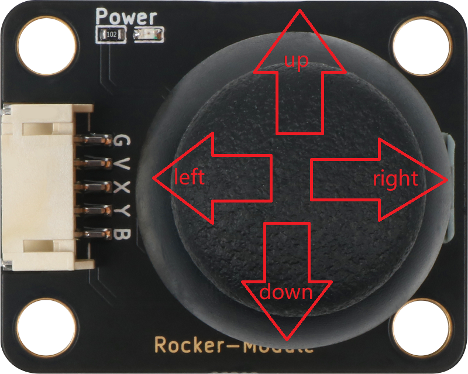

# 摇杆模块

## 实物图

### A款


### B款


## 概述

​       PS2摇杆包含一个触摸按钮（B款没有）和两个电位器（X轴和Y轴）。 操纵杆根据两个触点控制运动，其中一个触点向左和向右，另一个向上和向下。 操纵杆移动决定了触点的位置，就像地球的纬度和经度一样，不同的位置对应不同的电压，然后控制器可以通过AD传感器读取不同的电压值，从而识别特定的远程位置。当没有操作时，X 和 Y 轴方向输出的模拟值为中间值，即最大值的一半。

## 原理图

### A款


### B款


## 详细原理图和数据手册

[查看A款原理图](rocker_module/rocker_module_schematic_a.pdf) 

[查看B款原理图](rocker_module/rocker_module_schematic_b.pdf) 

[查看A款数据手册](rocker_module/rocker_datasheet_a.pdf) 

[查看B款数据手册](rocker_module/rocker_datasheet_b.pdf) 

## 模块参数

| 引脚名称 |               描述               |
| :------: | :------------------------------: |
|    G     |               GND                |
|    V     |              5V电源              |
|    X     |       获取摇杆上下动的数据       |
|    Y     |       获取摇杆左右动的数据       |
|    B     | 通过高低电平，判断按键是否被按下 |

- 供电电压：5V

- 连接方式：PH2.0 4PIN/5PIN防反接线

- 模块尺寸：40x22.5mm/40x32mm

- 安装方式：M4螺钉兼容乐高插孔固定

## 机械尺寸图

### A款


### B款


## Arduino示例程序

### A款



[下载示例程序A](rocker_module/rocker_module_a.zip)

```c
#define JOYSTICK_X    A5  //定义X输入引脚
#define JOYSTICK_Y    A4  //定义Y输入引脚
#define JOYSTICK_B    2   //定义按键输入引脚

int value_x,value_y,value_b;  //定义记录模拟输入的变量
void setup()
{
    pinMode(JOYSTICK_X, INPUT);  //初始化X引脚
    pinMode(JOYSTICK_Y, INPUT);  //初始化Y引脚
    pinMode(JOYSTICK_B, INPUT_PULLUP);  //初始化按键引脚
    Serial.begin(9600);  //设置波特率
}

void loop() 
{
    value_x=analogRead(JOYSTICK_X);  //读取X模拟值
    value_y=analogRead(JOYSTICK_Y);  //读取Y模拟值
    value_b=digitalRead(JOYSTICK_B); //读取按键输入 
    if(value_x<=25)
    {
        Serial.println("right"); //print right

    }
    else if(value_x>=990)
    {
         Serial.println("left"); //打印left
    }
    if(value_y<=50)  //
    {
        Serial.println("down"); //打印up
    }
    else if(value_y>=990) //
    {
        Serial.println("up"); //打印down
    }
    if(value_b == LOW)  //
    {
        Serial.println("enter");//打印enter
    }
    delay(100);
}
```

### B款


[下载示例程序B](rocker_module/rocker_module_b.zip)

```c
#define JOYSTICK_X    A4  //定义X输入引脚
#define JOYSTICK_Y    A5  //定义Y输入引脚

int value_x,value_y;  //定义记录模拟输入的变量
void setup()
{
    pinMode(JOYSTICK_X, INPUT);  //初始化X引脚
    pinMode(JOYSTICK_Y, INPUT);  //初始化Y引脚
    Serial.begin(9600);  //设置波特率
}

void loop() 
{
    value_x=analogRead(JOYSTICK_X);  //读取X模拟值
    value_y=analogRead(JOYSTICK_Y);  //读取Y模拟值
    if(value_x<=25)
    {
        Serial.println("right"); //print right

    }
    else if(value_x>=990)
    {
         Serial.println("left"); //打印left
    }
    if(value_y<=50)  //
    {
        Serial.println("up"); //打印up
    }
    else if(value_y>=990) //
    {
        Serial.println("down"); //打印down
    }
    delay(100);
}
```

## microbit示例程序

请直接参考microbit图形化编程[makecode库链接](https://github.com/emakefun/pxt-sensorbit)里面的基础输入模块的摇杆模块。