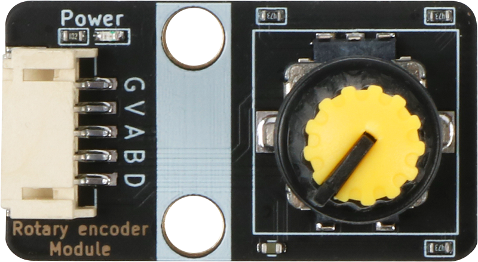
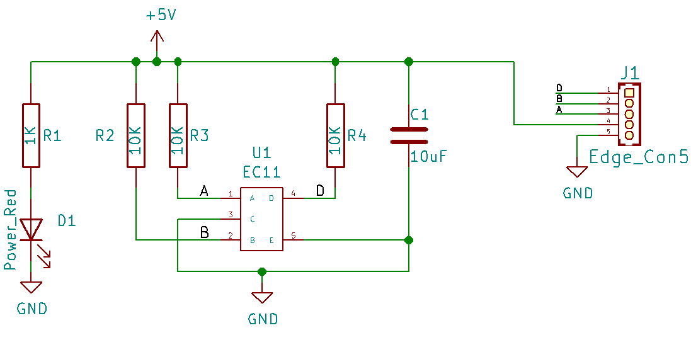
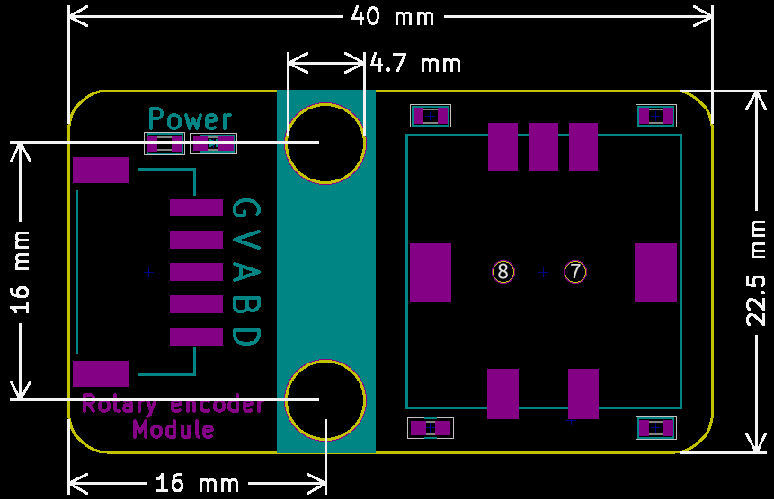

# 旋转编码器

## 实物图



##  概述

​       编码器是一种将旋转位移转换为一连串数字脉冲信号的旋转式传感器，旋转编码器可通过旋转可以计数正方向和反方向转动过程中输出脉冲的次数，旋转计数不像电位计，这种转动计数是没有限制的。配合旋转编码器上的按键，可以实现某些特定功能。读数系统通常采用差分方式，即将两个波形一样但相位差为180°的不同信号进行比较，以便提高输出信号的质量和稳定性。编码器广泛用于汽车音量、空调调节等应用场景。

## 原理图



## 模块参数

| 引脚名称 |              描述              |
| :------: | :----------------------------: |
|    G     |              GND               |
|    V     |             5V电源             |
|    A     |   A端口输出引脚，对应A相输出   |
|    B     |   B端口输出引脚，对应B相输出   |
|    D     | D端口输出引脚,对应带的按键输出 |

- 供电电压：5V

- 连接方式：5PIN防反接杜邦线

- 模块尺寸：40x22.5mm

- 安装方式：M4螺钉兼容乐高插孔固定；

## 详细原理图和数据手册

 [查看原理图](rotary_encoder_module/rotary_encoder_module_schematic.pdf)

[查看数据手册](rotary_encoder_module/ec11.pdf)

## 机械尺寸图




## Arduino示例程序

[下载示例程序](rotary_encoder_module/rotary_encoder_module.zip)

```c
#define encoder_A 3 //A端口输入引脚3
#define encoder_B 5 //A端口输入引脚5
#define switch_pin 6 //D端口输入引脚5
int counter =0; //count变量记录计数值
int aState; //A相输出当前状态
int aLastState; //A相输出前一个状态 
void setup() 
{
  pinMode (encoder_A,INPUT); //设置A端口输入引脚为输入模式
  pinMode (encoder_B,INPUT); //设置B端口输入引脚为输入模式
  pinMode (switch_pin,INPUT);//设置D端口输入引脚为输入模式  
  Serial.begin (9600); //设置串口波特率9600
  aLastState = digitalRead(encoder_A); //读取A端口状态
}
void loop() 
{
  if (digitalRead(switch_pin) == LOW)
  {
    delay(10);
    if (digitalRead(switch_pin) == LOW)
    {
  		Serial.println("Switch Pressed"); //如果按键被按下，串口打印Switch Pressed 
    }
  }    
 aState = digitalRead(encoder_A); //读取A端口状态
 if (aState != aLastState) //如果状态改变了
 {     
   if (digitalRead(encoder_B) != aState) //读取B端口状态，如果与A相反
   {
     counter ++; //顺时针转动了一个位置
   } 
   else 
   {
     counter --; //顺时针转动了一个位置
    }
   Serial.print("Position: ");
   Serial.println(counter); //打印当前位置
  }
 aLastState = aState; //更新A端口当前状态
}
```

## microbit示例程序

请直接参考microbit图形化编程[makecode库链接](https://github.com/emakefun/pxt-sensorbit)里面的基础输入模块的旋转编码器。