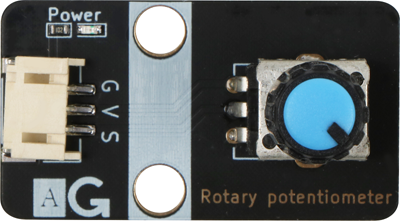
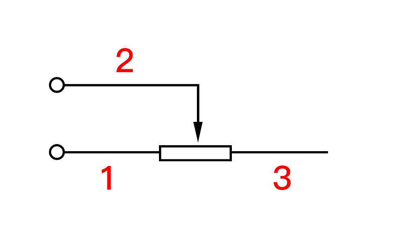
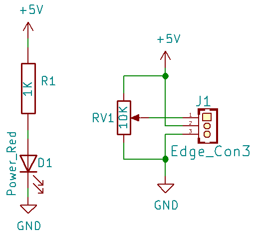
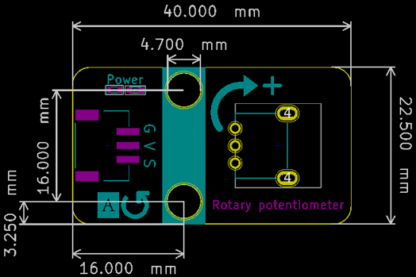

# 旋转电位器

## 实物图



## 原理示意图



## 概述

​		旋转电位计实际上就是可变电阻器，由于它在电路中的作用是获得与输入电压(外加电压)成一定 关系得输出电压，因此称之为电位计。如下原理图所示，电位器（或微调电阻等等）常规引脚（仅 举例说有 3 个引脚的电位器），两头的电阻值是固定的，中间引脚对任何一端引脚的电阻值是可变 的。通常被制造成不管使用多久均能维持原有的特性，若当位置传感器使用，电位计可以是直线或 旋转式位置传感器。电位计输出一个电压值，其正比于沿着可变电阻器之滑动器的位置。因为温度 变化、磨耗及滑动器与可变电阻器之间的污垢均会造成电阻变化，影响电位计的精度。

## 原理图



## 模块参数

| 引脚名称 |                   描述                   |
| :------: | :--------------------------------------: |
|    G     |                   GND                    |
|    V     |                  5V电源                  |
|    S     | 信号输出引脚，输出电位器中间引脚的电压值 |

- 供电电压：5V

- 连接方式：3PIN防反接杜邦线

- 模块尺寸：40x22.5mm

- 安装方式：M4螺钉兼容乐高插孔固定


## 详细原理图

[查看原理图](rotary_potentiometer/rotary_potentiometer_schematic.pdf)

[查看数据手册](rotary_potentiometer/potentiometer.pdf)

## 机械尺寸图



## Arduino示例程序

[下载示例程序](rotary_potentiometer/rotary_potentiometer.zip)

```c
float Voltage = 0,data; //定义电压和模拟值变量
int analogPin = A3; //定义电位器接口接收电压模拟值
void setup()
{
 pinMode(analogPin, INPUT); //电压输出接口
 Serial.begin(9600); //设置串口波特率
}
void loop() {
 data = analogRead(analogPin); //获取电压模拟值
 Voltage = (data/1023)*5; //模拟值和数字值转换 * 电压 得到当前电压
 Serial.print("Voltage is: ");
 Serial.print(Voltage); //打印获取到的电压
 Serial.println("V");
 delay(200);
}
```

## microbit示例程序

请直接参考microbit图形化编程[makecode库链接](https://github.com/emakefun/pxt-sensorbit)里面的基础输入模块的旋转电位器。

