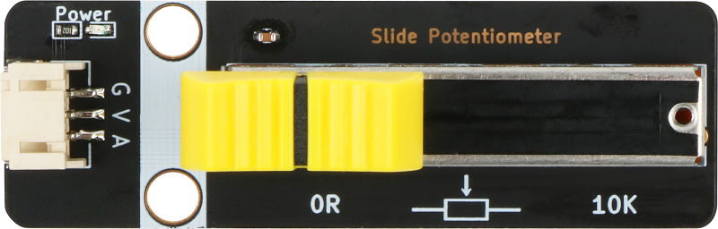
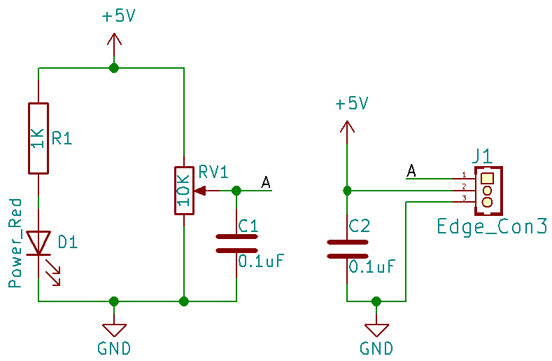
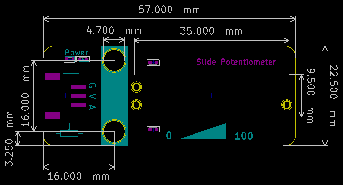

# 滑动变阻器

## 实物图



## 概述

​		滑动变阻器是电路中的一个重要元件，它可以通过移动滑片的位置来改变自身的电阻，从而起到控制电路的作用。在电路分析中，滑动变阻器既可以作为一个定值电阻，也可以作为一个变值电阻。

## 原理图

[下载原理图](slide_potentiometer/slide_potentiometer_schematic.pdf)



## 模块参数
| 引脚名称 |     描述     |
| :------: | :----------: |
|    G     |     GND      |
|    V     |    5V电源    |
|    A     | 信号输出引脚 |

- 供电电压：5V

- 连接方式：PH2.0 3PIN防反接线

- 模块尺寸：57*22.5cm

- 安装方式：M4螺钉兼容乐高插孔固定

## 机械尺寸图



## Arduino示例程序

[下载示例程序](slide_potentiometer/slide_potentiometer.zip)

``` c
float Voltage = 0, data; //定义刚获取的模拟值 data 模数转化后的数值 i 实际的电阻大小 j
int Position = 0;
int analogPin = A3; //定义滑动变阻器接口
void setup()
{
  pinMode(analogPin, INPUT); //设置端口输入
  Serial.begin(9600); // 设置串口波特率
}
void loop() {
  data = analogRead(analogPin); // 获取端口的模拟值
  Voltage = (data / 1023) * 5; //模拟值和数字值转换 * 电压 得到当前电压
  Position = (data / 1023) * 100; //模拟值和数字值转换 * 100 得到滑杆位置
  Serial.print("Voltage is:");
  Serial.println(Voltage); // 打印获取到的电压值
  Serial.print("V");
  Serial.print("Slider position(0~100): ");
  Serial.println(Position); //打印获取到的滑杆位置
  delay(200);
}
```

## Mixly示例程序

[下载示例程序](slide_potentiometer/slide_potentiometer_Mixly_demo.zip)


## microbit示例程序

请直接参考microbit图形化编程[makecode库链接](https://github.com/emakefun/pxt-sensorbit)里面的基础输入模块的滑动变阻器。