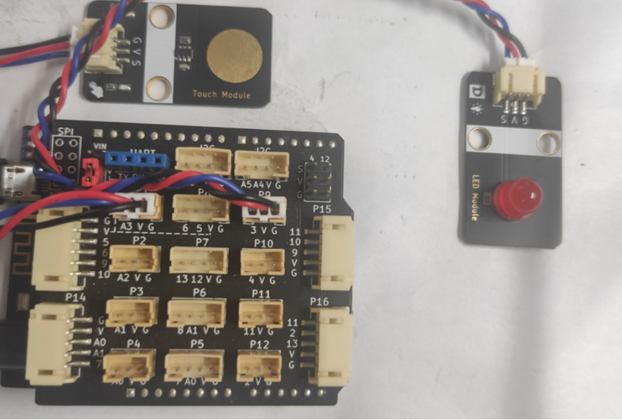
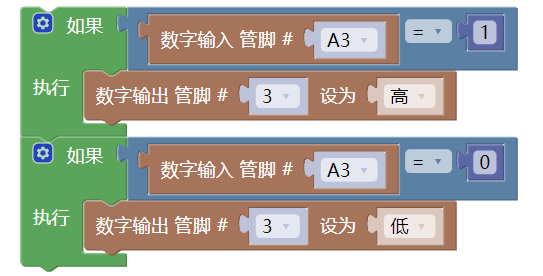
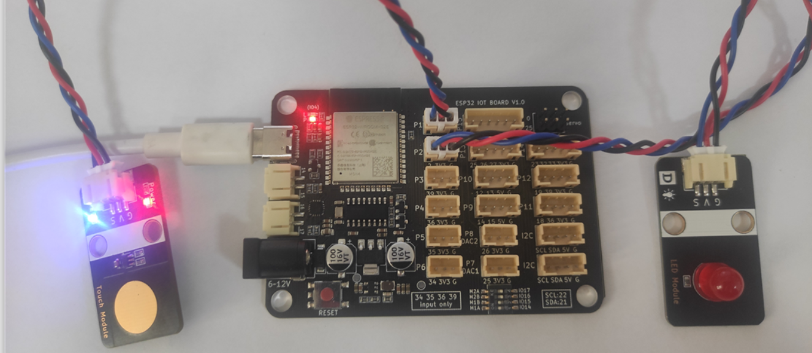

# 触摸模块

## 1. 实物图


## 2. 概述

​        触摸传感器模块是一个基于触摸检测IC（TTP223B）的电容式点动型触摸开关模块，当模块的金属触片被触摸，相当于按键被按下。我们可以将模块安装在非金属材料如塑料、玻璃的表面，另外将薄薄的纸片（非金属）覆盖在模块的表面，只要触摸的位置正确，即可做成隐藏在墙壁、桌面等地方的按键。我们的模块当被触摸时，蓝色灯亮，输出高电平，否则蓝色灯熄灭，输出低电平。


## 3. 原理图
[下载原理图](touch_module/touch_module_schematic.pdf) 


## 4. 模块参数

| 引脚名称 |                          描述                          |
| :------: | :----------------------------------------------------: |
|    G     |                          GND                           |
|    V     |                          VCC                           |
|    S     | 信号输出引脚，当被触摸时，输出低电平，松开时输出高电平 |

- 供电电压：3V3/5V
- 连接方式：PH2.0 3PIN防反接线

- 模块尺寸：40x22.5mm

- 安装方式：M4螺钉兼容乐高插孔固定

## 5. 机械尺寸图


## 6. 示例

### 6.1 Arduino UNO使用教程

#### 6.1.1 接线

触摸模块接P1(A3口），LED模块接P9（3口）；

**接线端口可自行更改，只需注意编程时调节端口，本教程全按照示例接口进行。**



#### 6.1.2 Arduino示例程序

[下载示例程序](touch_module/touch_module.zip)

```c
int touch_pin = A3; //定义触摸按键引脚
int led_out = 3; //定义Arduino LED引脚
int value = 0 ;
void setup()
{
  pinMode(touch_pin, INPUT); //初始化触摸按键连接的引脚为输入
  pinMode(led_out, OUTPUT); //初始化LED连接的引脚为输出引脚
}
void loop()
{
  value = digitalRead(touch_pin); //读取触摸按键输入引脚的值
   if (value == LOW)
   {
    digitalWrite(led_out,HIGH); //如果读取值为低即被触摸到了，LED亮
    }
   else
   {
      digitalWrite(led_out,LOW); //如果读取值为高即没有触摸按键，LED灭
    }
}
```
#### 6.1.3 Mixly示例程序



[下载示例程序](touch_module/touch_Mixly_demo.zip)

### 6.2 microbit示例程序

<a href="https://makecode.microbit.org/_5bXfq63TiM3m" target="_blank">动手试一试</a>

### 6.3 ESP32-MicroPython示例程序

按钮模块通过3Pin线接在主板P1（5号）口；

LED模块通过3Pin线接在主板P2（2号）口；

**接线端口可自行更改，只需注意编程时调节端口，本教程全按照示例接口进行。**



[示例程序下载](touch_module/MicroPython 示例程序.zip)

```
from machine import Pin
button = Pin(5, Pin.IN)  #按键端口
led = Pin(2, Pin.OUT)  #LED端口
while True:
    if button.value() == 0:
        led.value(1)  
    else:
        led.value(0)
```

## 7. 实验结果

器件连接好线之后，将上述程序烧录到主板之后，给主板通电，按下触摸将使得LED点亮，松开则灯灭。通过触摸的按下与松开，触发触摸的信号口输出高低电平,通过判断信号口的高低电平状态，控制LED灯的亮与灭的状态。我们的触摸模块按下时，输出低电平，否则输出高电平，达到目的。