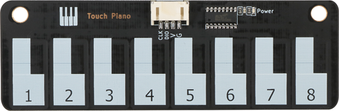
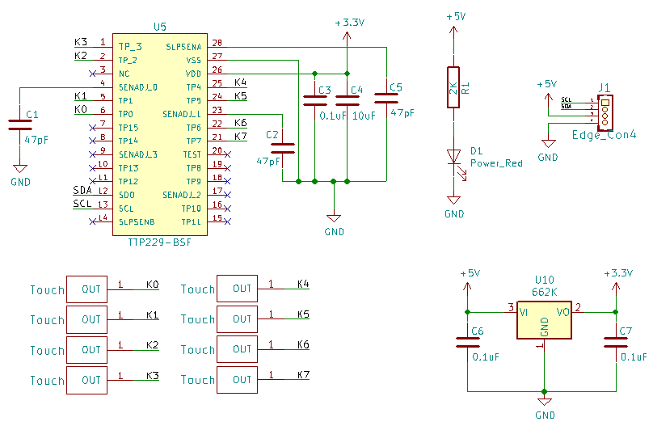
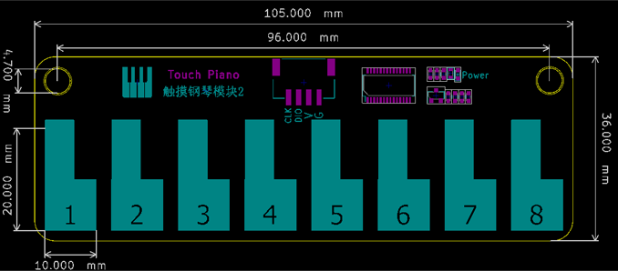
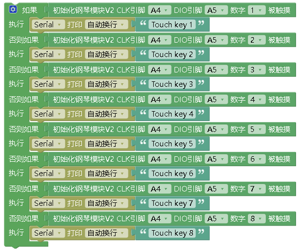

# 触摸钢琴

## 实物图




## 概述

​        触摸钢琴模块原理是通过分布在芯片端口的电容因为手指的接触，使电容发生了改变，经芯片处理后能将微小的电容变化转化成电压信号的变化，再通过软件AD采集端口电压，根据电压的变化实现触摸的识别。实际上MCU去获取的只是具体的键值，而要真正的模拟钢琴的声音，需要MCU在做进一步的处理，例如驱动蜂鸣器以不同的频率响。

当钢琴的按键被触碰时，按照钢琴按键键值对应表输出对应的十六进制值：

| 按键值 | 十六进制值 |
| :----: | :--------: |
|   1    |    0x01    |
|   2    |    0x02    |
|   3    |    0x04    |
|   4    |    0x08    |
|   5    |    0x10    |
|   6    |    0x20    |
|   7    |    0x40    |
|   8    |    0x80    |

## 原理图

[下载原理图](touch_piano/touch_piano_schematic.pdf) 



## 模块参数

| 引脚名称 |       描述       |
| :------: | :--------------: |
|    G     |       GND        |
|    V     |      5V电源      |
|   CLK    |     时钟信号     |
|   DIO    | 数据输入输出引脚 |

- 供电电压：5V

- 连接方式：PH2.0 4PIN防反接线

- 模块尺寸：109x36mm

- 安装方式：M4螺钉兼容乐高插孔固定

## 机械尺寸图



## Arduino示例程序

[下载示例程序](touch_piano/touch_piano.zip)

```c

#include <EM_Piano.h>

Piano mPiano_A4A5;

void setup(){
  mPiano_A4A5.initPiano(A4, A5);  //初始化触摸钢琴模块
  Serial.begin(9600);
}

void loop(){
  if (mPiano_A4A5.PressBsButton(EM_PIANO_KEYCODE_1)) {  // 判断钢琴模块按键1是被触摸，如果被触摸则打印Touch key 1
    Serial.println("Touch key 1");
  } else if (mPiano_A4A5.PressBsButton(EM_PIANO_KEYCODE_2)) {  // 判断钢琴模块按键2是被触摸，如果被触摸则打印Touch key 2
    Serial.println("Touch key 2");
  } else if (mPiano_A4A5.PressBsButton(EM_PIANO_KEYCODE_3)) {  // 判断钢琴模块按键3是被触摸，如果被触摸则打印Touch key 3
    Serial.println("Touch key 3");
  } else if (mPiano_A4A5.PressBsButton(EM_PIANO_KEYCODE_4)) {  // 判断钢琴模块按键4是被触摸，如果被触摸则打印Touch key 4
    Serial.println("Touch key 4");
  } else if (mPiano_A4A5.PressBsButton(EM_PIANO_KEYCODE_5)) {  // 判断钢琴模块按键5是被触摸，如果被触摸则打印Touch key 5
    Serial.println("Touch key 5");
  } else if (mPiano_A4A5.PressBsButton(EM_PIANO_KEYCODE_6)) {  // 判断钢琴模块按键6是被触摸，如果被触摸则打印Touch key 6
    Serial.println("Touch key 6");
  } else if (mPiano_A4A5.PressBsButton(EM_PIANO_KEYCODE_7)) {  // 判断钢琴模块按键7是被触摸，如果被触摸则打印Touch key 7
    Serial.println("Touch key 7");
  } else if (mPiano_A4A5.PressBsButton(EM_PIANO_KEYCODE_8)) {  // 判断钢琴模块按键8是被触摸，如果被触摸则打印Touch key 8
    Serial.println("Touch key 8");
  }

}
```

## Mixly示例程序

[下载示例程序](touch_piano/touch_piano_Mixly_demo.zip)



## microbit示例程序

请直接参考microbit图形化编程[makecode库链接](https://github.com/emakefun/pxt-sensorbit)里面的基础输入部分触摸钢琴。