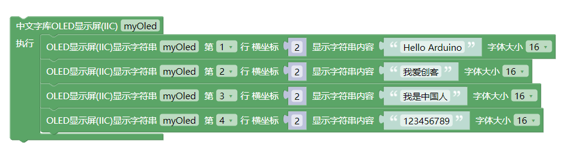

#  带中文字库OLED模块

## 概述
SSD1306是一款用于有机/聚合物发光二极管点阵图形显示系统的带控制器的单片CMOS OLED/PLED驱动器。它由128个段和64个公共区组成。这种集成电路是为普通阴极型OLED面板设计的。作为一款常用的显示器，深受电子爱好者的青睐，但使用 时总少不了一些辅助软件去显示自己想要显示的信息，且有时会因为数据太多太占内存，本产品集成了一块GT20L16S1Y字库芯片和一款MCU，从根本上解决了这两方面的问题，使用更加方便。

## 硬件参数

- 工作电压：5V
- 接口支持最大速率：400k
- 通信方式：IIC (SSD1306 地址0x3C，MCU地址0x51)
- 接口类型：PH2.0-4Pin (G V SDA SCL)

## 模块特点：

- 内置低功率 32 位 MCU：可以兼作应用处理器
- 内置字库：GT20L16S1Y字库芯片
- 显示器类型：SSD1306

## 引脚定义：

| 引脚名称 | 描述       |
| -------- | ---------- |
| SCL       | IIC时钟引脚 |
| SDA       | IIC数据引脚 |
| V        | 5V电源引脚 |
| G        | GND 地线   |


## 模块尺寸

## 接线示例

##  arduino 应用场景
显示中文、英文、数字、标点字符
```
#include "em_oled.h"

EM_OLED u8g2(U8G2_R0, U8X8_PIN_NONE);

void setup() {
  Serial.begin(115200);
  u8g2.begin();
}

void loop() {
  u8g2.firstPage();
  do
  {    
    u8g2.ShowFont(0, 0, "EMAKEFUN易创空间www.emakefun.com");
  }while(u8g2.nextPage());
}
```
### arduino函数介绍
```
显示字体
输入参数：
（x,y）起始坐标，显示字符的左上角坐标 
*str：要显示的UTF8字符数据可直接写汉字和字符
uint8_t ShowFont(uint8_t x, uint8_t y, uint8_t *str);
```
### arduino示例程序
[下载最新库程序](GT20L16S1Y_OLED/GT20L16S1Y_OLED.zip)

### MagicBlock图形化编程块

### Mixly图形化块



[点击下载Mixly示例程序](./GT20L16S1Y_OLED/oled_mixly.zip)

### microbit makecode块

[点击查看Microbit示例程序](https://makecode.microbit.org/_1xP2br2C10zX)